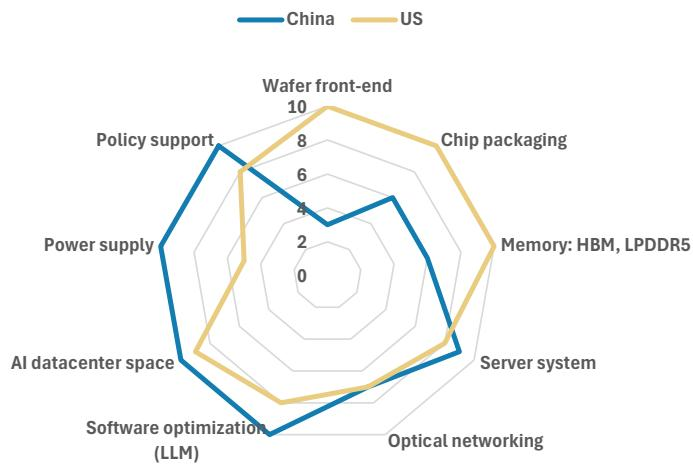
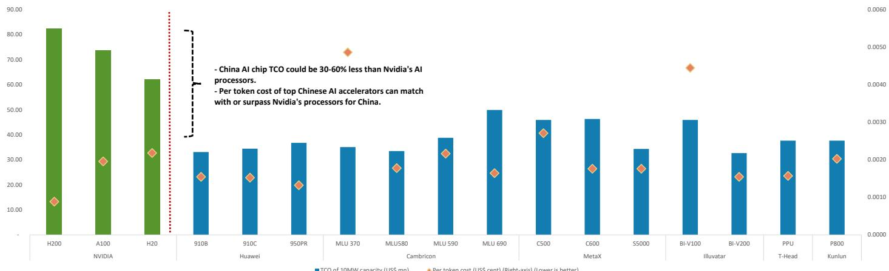
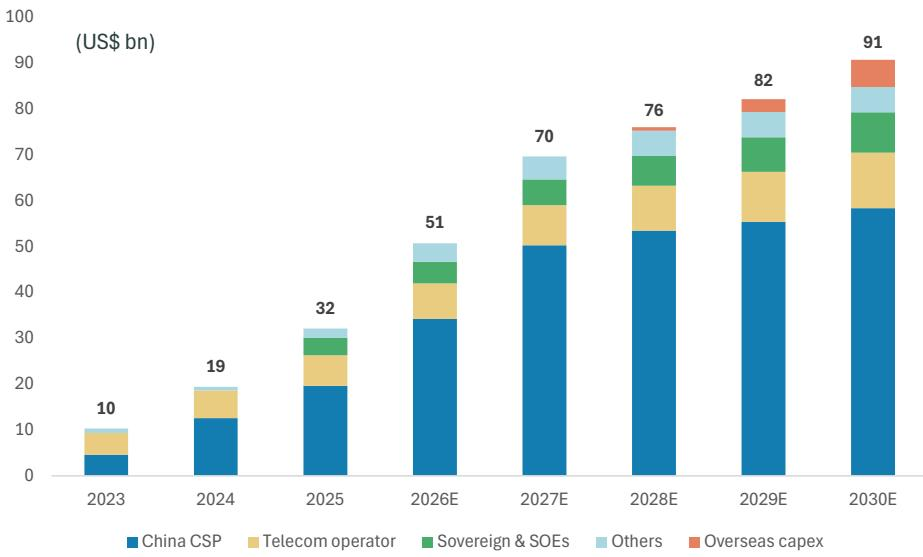
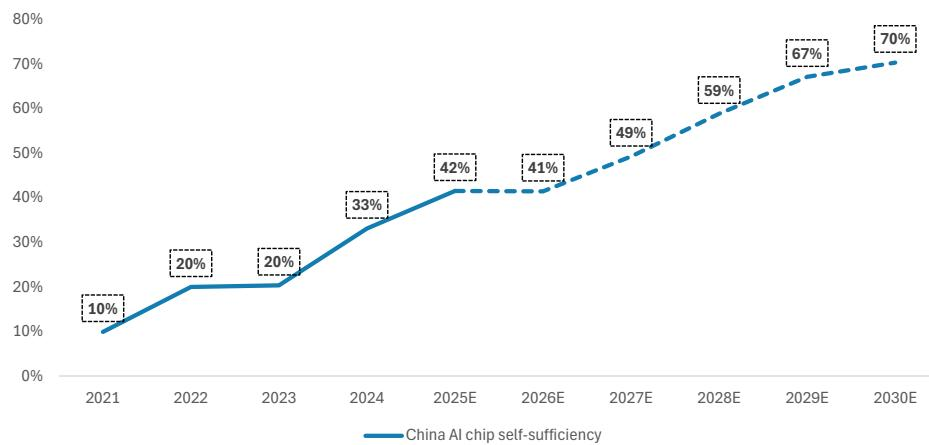
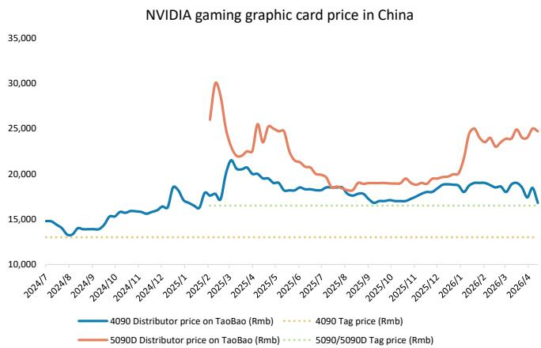
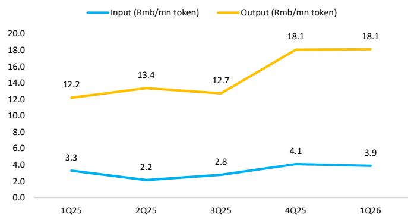
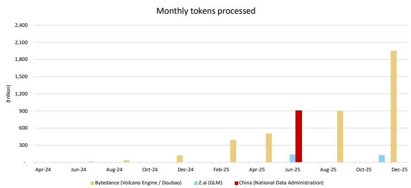
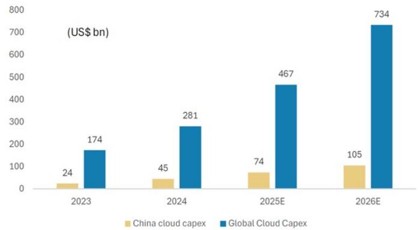

# 寒武纪科技 | 亚太市场

# 2026年第二季度前瞻：交付节奏调整影响近期表现；维持增持评级

<table><tr><td colspan="3">主要变化</td></tr><tr><td>寒武纪科技 (688256.SS)</td><td>原值</td><td>现值</td></tr><tr><td>目标价</td><td>人民币1,528.00元</td><td>人民币1,408.00元</td></tr></table>

我们下调了盈利预测，并将目标价调整至人民币1,408元，主要由于MLU580/590的交付进度略低于此前预期。我们维持增持评级，基于国内AI加速器市场的结构性增长前景。

**2026年第二季度前瞻：交付节奏小幅调整，盈利预测相应下调。** 我们预计寒武纪2026年第二季度收入为人民币38亿元（环比增长31%），每股收益为人民币2.09元。我们将此前收入预测下调2%，供应链调研显示MLU580/590交付进度略慢于预期。我们认为这一差异主要源于产能爬坡、存储供应以及系统级交付节奏等因素，而非下游需求变化。不过，订单转化为收入的节奏放缓表明供应链执行仍是近期需要关注的方面。

## 股权激励计划更多体现为留任导向，而非盈利信号

寒武纪计划向945名员工授予500万股限制性股票，授予价格为每股人民币750元，覆盖85%的员工。收入目标从2026年的人民币108亿至135亿元，逐步提升至2028年的人民币476亿至595亿元；调整后净利润目标为2027年人民币92亿元、2028年人民币138亿元。由于这些目标明显低于市场预期，我们不将其视为管理层指引。相反，广泛的覆盖范围和折价授予价格表明，该计划主要是一项员工留任机制。

## 我们持续看好国内AI加速器市场的长期机遇

我们近期将2030年国内AI芯片市场规模预测上调至910亿美元，对应2025至2030年23%的年复合增长率。2026年世界人工智能大会也显示出竞争焦点正从单一芯片向系统级扩展转移，多数厂商展示了超过128卡的SuperPod解决方案。Prefill/decode分离架构正成为重要的推理架构方向，在扩大市场空间的同时，也对系统性能和软件成熟度提出了更高要求。

**维持增持评级；目标价调整至人民币1,408元。** 我们将2026/27/28年每股收益预测分别下调6%/5%/8%，以反映交付节奏变化和供应链的不确定性。随着同行在2026年下半年推出新产品，竞争可能加剧，这将考验寒武纪的相对表现和性价比定位。尽管如此，考虑到公司在国内AI计算生态系统中的战略位置以及本地加速器需求的结构性增长前景，我们维持增持评级。

<table><tr><td colspan="2">Charlie Chan</td></tr><tr><td colspan="2">股票研究分析师</td></tr><tr><td>Charlie.Chan@morganstanley.com</td><td>+886 2 2730-1725</td></tr></table>

<table><tr><td colspan="2">Henry Zhao</td></tr><tr><td colspan="2">研究助理</td></tr><tr><td>Henry.Zhao@morganstanley.com</td><td>+852 2239-7731</td></tr></table>

<table><tr><td colspan="2">Daniel Yen, CFA</td></tr><tr><td colspan="2">股票研究分析师</td></tr><tr><td>Daniel.Yen@morganstanley.com</td><td>+886 2 2730-2863</td></tr></table>

<table><tr><td colspan="2">Daisy Dai, CFA</td></tr><tr><td colspan="2">股票研究分析师</td></tr><tr><td>Daisy.Dai@morganstanley.com</td><td>+852 2848-7310</td></tr></table>

<table><tr><td colspan="2">台湾MS有限公司+</td></tr><tr><td colspan="2">Tiffany Yeh</td></tr><tr><td colspan="2">股票研究分析师</td></tr><tr><td>Tiffany.Yeh@morganstanley.com</td><td>+886 2 7712-3032</td></tr><tr><td colspan="2">Lucas Wang</td></tr><tr><td colspan="2">研究助理</td></tr><tr><td>Lucas.Wang@morganstanley.com</td><td>+886 2 2730-2875</td></tr></table>

亚洲暑期研究项目 2026

## 寒武纪科技 (688256.SS, 688256 CG)

大中华区科技半导体 | 中国

<table><tr><td>股票评级</td><td>增持</td></tr><tr><td>行业展望</td><td>具有吸引力</td></tr><tr><td>目标价</td><td>人民币1,408.00元</td></tr><tr><td>目标价上行/下行空间 (%)</td><td>23</td></tr><tr><td>股价，收盘价 (2026年7月29日)</td><td>人民币1,146.90元</td></tr><tr><td>52周区间</td><td>人民币1,620.00-449.66元</td></tr><tr><td>摊薄后股本，当前 (百万股)</td><td>628</td></tr><tr><td>市值，当前 (百万元)</td><td>人民币720,589.2</td></tr><tr><td>企业价值，当前 (百万元)</td><td>人民币714,711.0</td></tr><tr><td>日均成交额 (百万元)</td><td>人民币13,346</td></tr></table>

<table><tr><td>财年截止日</td><td>12/25</td><td>12/26e</td><td>12/27e</td><td>12/28e</td></tr><tr><td>每股收益 (人民币)**</td><td>4.9</td><td>11.6</td><td>18.4</td><td>24.5</td></tr><tr><td>原每股收益 (人民币)**</td><td>-</td><td>12.4</td><td>19.5</td><td>26.6</td></tr><tr><td>每股收益 (人民币)§</td><td>-</td><td>10.5</td><td>16.9</td><td>27.0</td></tr></table>

净收入（人民币百万元） 6,497.2 21,313.9 40,056.2 51,480.1

MS与报告所覆盖的公司有业务往来并寻求开展业务。因此，读者应注意，公司可能存在影响MS客观性的利益冲突。读者应将MS视为其决策的单一参考因素之一。

## 分析师认证及其他重要披露信息，请参阅本报告末尾的披露章节。

+= 非美国关联公司聘用的分析师未在FINRA注册，可能不是该会员机构的关联人员，可能不受FINRA关于与研究对象公司沟通、公开露面以及持有研究分析师账户中交易证券等限制的约束。

<table><tr><td>EBITDA（人民币百万元）</td><td>2,211.2</td><td>7,351.1</td><td>13,619.5</td><td>18,105.7</td></tr><tr><td>ModelWare净利润（人民币百万元）</td><td>2,059.2</td><td>6,859.4</td><td>11,641.7</td><td>15,447.5</td></tr><tr><td>市盈率</td><td>186.8</td><td>96.9</td><td>62.2</td><td>46.9</td></tr><tr><td>市净率</td><td>32.5</td><td>36.5</td><td>25.5</td><td>17.5</td></tr><tr><td>RNOA (%)</td><td>57.8</td><td>92.4</td><td>100.3</td><td>123.6</td></tr><tr><td>ROE (%)</td><td>37.9</td><td>57.9</td><td>64.0</td><td>54.5</td></tr><tr><td>EV/EBITDA</td><td>171.3</td><td>96.9</td><td>51.6</td><td>38.3</td></tr><tr><td>股息率 (%)</td><td>0.0</td><td>0.1</td><td>0.2</td><td>0.3</td></tr><tr><td>自由现金流回报表现 (%)*</td><td>0.8</td><td>0.4</td><td>1.5</td><td>1.7</td></tr><tr><td>杠杆率（期末）(%)</td><td>(49.6)</td><td>(44.0)</td><td>(61.2)</td><td>(66.6)</td></tr></table>

除非另有说明，所有指标均基于MS ModelWare框架  
§ = 一致预期数据由Refinitiv Estimates提供  
\*\* = 基于一致预期方法  
e = MS预测

AlphaSignals 业绩前瞻

<table><tr><td>核心指标</td><td>核心指标预期差</td><td>对一致预期每股收益的潜在影响*</td></tr><tr><td colspan="3">寒武纪科技 688256.SS</td></tr><tr><td>收入环比增长</td><td>↓ 可能存在下行预期差</td><td>↓ 小幅下调</td></tr><tr><td colspan="3">*对一致预期每股收益的潜在影响为未来12个月来源：公司数据，MS</td></tr></table>

# 中国 – AI加速器：在AI基础设施投入持续增长的背景下，国产化进程稳步推进

中国AI计算产业具备全球竞争力，得益于强大的系统设计和基础设施能力

更广泛地看，我们认为中国AI芯片的竞争已不再仅仅是芯片规格的比拼。虽然在芯片层面，国产硅基产品与国际领先水平仍存在代际差距，但通过多芯片设计、先进封装、机架级系统架构、光互连以及软硬件协同优化，实际差距正在缩小。这正是我们认为系统级竞争力比以往更为重要的原因。在一个日益以推理和利用率为主导的市场中，能够以可接受的软件迁移成本提供最具吸引力的实际部署经济性的供应商，更有可能获得客户预算，即使不具备最先进的制程技术。

从研究角度来看，这引出一个简单结论：该板块不应被视为单一的政策主题进行估值。相反，研究者应基于供应商实现出货规模、生态可信度和定价纪律的能力进行区分，同时关注那些可能难以将技术潜力转化为持续收入和利润的公司。因此，我们通过"经济性×执行力"的二维框架来评估该群体，将总拥有成本、Token成本、每秒处理能力和单位性能价格比与代工资源、软件生态成熟度、云服务商关系以及路线图可信度等定性因素相结合。我们认为，随着行业整合推进，这一框架仍是区分长期潜在赢家与可能难以将技术能力转化为可持续收入和利润增长的公司的最有效方式。

通过我们近期的渠道调研，一个越来越清晰的趋势是：经济性而非意识形态正在驱动采用决策。在我们的中国峰会上，主要大语言模型开发商表示，只要Token成本具有竞争力，他们愿意部署本地GPU。这与我们的核心发现一致——国产加速器在总拥有成本上已显著优于在中国市场可获得的国际竞品，且领先的国产芯片在推理负载中能够实现具有竞争力的单位Token成本。换言之，采购决策越来越多地由部署经济性驱动，而非相对的峰值硅性能。这一点很重要，因为中国的AI需求正变得更加推理密集、更加持续化、更加利用率驱动，结构性上有利于那些针对成本效率、软件适配和可用性进行优化的解决方案，而非单纯追求基准测试领先。

图表1：中美AI产业相对优势

来源：MS

图表2：国产芯片在总拥有成本上具有优势，单位Token成本与NVIDIA面向中国市场的处理器相当（AI大语言模型推理）

来源：公司数据，MS预测

## 中国AI芯片市场规模

中国AI芯片需求集中在少数大型采购群体中，其资本开支决策最终决定了可寻址市场的规模。

- 第一类群体包括国内云服务商——包括字节跳动、阿里巴巴和腾讯——它们采购AI芯片既用于自有模型的训练和推理，也用于为外部云客户部署AI基础设施。

- 第二类群体包括电信运营商、国有企业和地方政府——即所谓的"主权AI"采购方——其需求由国家级AI基础设施建设、数据主权和公共部门应用驱动。

- AI初创企业（如DeepSeek、MiniMax）和汽车OEM厂商（如小鹏、小米）也采购AI芯片，但目前其采购量仍小于前两类群体。

我们预测中国AI芯片市场规模到2030年将达到910亿美元，较此前预测的670亿美元上调36%，对应2025-2030年23%的年复合增长率。上调主要受以下因素驱动：

- 我们新增了一个类别（国内云服务商在海外使用国产GPU的AI数据中心）。短期内，国内云服务商可能更多依赖GPU租赁来满足强劲的计算需求，而中长期来看，我们认为国产AI GPU有望在海外部署中获得采用。

因此，我们在2027年之前对该类别不做贡献假设，但预计2028/29/30年国产GPU将分别占海外AI基础设施资本开支的3%/10%/20%。

- 据报道，字节跳动计划在2026年和2027年大幅增加资本开支，以强化其在国内AI市场的地位并拓展国际业务——有报道指出，如果经济和商业条件有利，2027年资本开支可能达到1,000亿美元；我们在模型中保守假设为800亿美元（约合人民币5,420亿元）。

- 我们将金山云纳入研究范围。其资本开支已显著增加至人民币30亿元，2026年全年资本投入预计将超过人民币150-200亿元，以满足快速增长的AI和云需求。

- 我们将主权及国企相关市场规模假设从70亿美元上调至90亿美元。近期媒体报道（彭博社，6月9日）显示，中国正考虑未来五年投入至多人民币2万亿元用于全国范围内的数据中心建设。虽然我们尚未看到详细的政策指引，但我们认为国企和地方政府可能会逐步增加AI基础设施投入。

我们预计中国AI芯片自给率将从2025年的42%提升至2030年的70%。我们预计先进制程产能扩张和芯片性能持续提升将推动国产AI芯片收入增长。

图表3：我们预计中国AI芯片市场规模到2030年将增长至910亿美元

来源：公司数据，MS (E) 预测

图表4：我们预计中国AI芯片自给率到2030年将达到70%

来源：公司数据，MS (e) 预测

图表5：Nvidia 5090在中国市场价格持续上行

来源：淘宝，MS

图表6：中国主流AI大语言模型平均Token价格

来源：公司数据，MS

图表7：字节跳动（火山引擎/豆包）Token量激增表明AI需求旺盛

来源：公司数据，MS。字节跳动数据为基于日数据的月度运行率。

图表8：国内云服务商资本开支将成为中国AI GPU需求的关键驱动因素

来源：公司数据，MS (E) 预测

## 盈利预测调整及季度财务数据

我们下调2026、2027和2028年收入预测2%/5%/8%：这主要反映了MLU580/590交付进度慢于预期，供应链调研显示产能爬坡、元器件供应和系统级交付的成熟度低于我们此前的假设。虽然国产AI加速器的潜在需求依然稳健，但我们预计客户订单转化为确认收入的节奏将有所放缓，尤其是在2026年下半年至2027年。在盈利能力方面，我们维持2026-28年51%、50%和49%的毛利率假设不变。因此，我们将2026、2027和2028年每股收益预测分别下调6%、5%和8%。

图表9：寒武纪：盈利预测调整

<table><tr><td>百万美元</td><td>新'26</td><td>原'26E</td><td>差异</td><td>新'27</td><td>原'27E</td><td>差异</td><td>新'28</td><td>原'28E</td><td>差异</td></tr><tr><td>净销售额</td><td>21,314</td><td>22,869</td><td>-7%</td><td>40,056</td><td>42,274</td><td>-5%</td><td>51,480</td><td>55,971</td><td>-8%</td></tr><tr><td>毛利润</td><td>10,858</td><td>11,637</td><td>-7%</td><td>19,908</td><td>21,011</td><td>-5%</td><td>25,344</td><td>27,558</td><td>-8%</td></tr><tr><td>营业利润</td><td>7,351</td><td>7,868</td><td>-7%</td><td>13,619</td><td>14,374</td><td>-5%</td><td>18,106</td><td>19,682</td><td>-8%</td></tr><tr><td>税前利润</td><td>7,258</td><td>7,776</td><td>-7%</td><td>13,696</td><td>14,451</td><td>-5%</td><td>18,173</td><td>19,750</td><td>-8%</td></tr><tr><td>净利润</td><td>6,859</td><td>7,332</td><td>-6%</td><td>11,642</td><td>12,283</td><td>-5%</td><td>15,448</td><td>16,788</td><td>-8%</td></tr><tr><td>一致预期每股收益</td><td>11.64</td><td>12.39</td><td>-6%</td><td>18.44</td><td>19.45</td><td>-5%</td><td>24.46</td><td>26.59</td><td>-8%</td></tr><tr><td colspan="10">利润率</td></tr><tr><td>毛利率</td><td>50.9%</td><td>50.9%</td><td></td><td>49.7%</td><td>49.7%</td><td></td><td>49.2%</td><td>49.2%</td><td></td></tr><tr><td>营业利润率</td><td>34.5%</td><td>34.4%</td><td></td><td>34.0%</td><td>34.0%</td><td></td><td>35.2%</td><td>35.2%</td><td></td></tr><tr><td>税前利润率</td><td>34.1%</td><td>34.0%</td><td></td><td>34.2%</td><td>34.2%</td><td></td><td>35.3%</td><td>35.3%</td><td></td></tr><tr><td>净利润率</td><td>32.2%</td><td>32.1%</td><td></td><td>29.1%</td><td>29.1%</td><td></td><td>30.0%</td><td>30.0%</td><td></td></tr><tr><td>运营费用占比</td><td>16.5%</td><td>16.5%</td><td></td><td>15.7%</td><td>15.7%</td><td></td><td>14.1%</td><td>14.1%</td><td></td></tr></table>

来源：MS (e) 预测

图表10：寒武纪：季度财务数据

<table><tr><td>(人民币百万元)</td><td>1Q25</td><td>2Q25</td><td>3Q25</td><td>4Q25</td><td>1Q26</td><td>2Q26E</td><td>3Q26E</td><td>4Q26E</td><td>2025</td><td>2026E</td><td>2027E</td><td>2028E</td></tr><tr><td>总收入</td><td>1,111.4</td><td>1,769.2</td><td>1,726.8</td><td>1,889.8</td><td>2,884.7</td><td>3,777.4</td><td>5,678.2</td><td>8,973.6</td><td>6,497.2</td><td>21,313.9</td><td>40,056.2</td><td>51,480.1</td></tr><tr><td>环比变化</td><td>12.4%</td><td>59.2%</td><td>-2.4%</td><td>9.4%</td><td>52.6%</td><td>30.9%</td><td>50.3%</td><td>58.0%</td><td>0.0%</td><td>0.0%</td><td>0.0%</td><td>0.0%</td></tr><tr><td>同比变化</td><td>4229.6%</td><td>4424.9%</td><td>1332.5%</td><td>91.0%</td><td>159.6%</td><td>113.5%</td><td>228.8%</td><td>374.8%</td><td>453.2%</td><td>228.0%</td><td>87.9%</td><td>28.5%</td></tr><tr><td>销售成本</td><td>489.1</td><td>780.5</td><td>790.2</td><td>854.0</td><td>1,317.4</td><td>1,813.1</td><td>2,839.0</td><td>4,486.7</td><td>2,913.9</td><td>10,456.3</td><td>20,147.9</td><td>26,136.0</td></tr><tr><td>占收入比例</td><td>44%</td><td>44%</td><td>46%</td><td>45%</td><td>46%</td><td>48%</td><td>50%</td><td>50%</td><td>45%</td><td>49%</td><td>50%</td><td>51%</td></tr><tr><td>毛利润</td><td>622.3</td><td>988.7</td><td>936.6</td><td>1,035.7</td><td>1,567.3</td><td>1,964.3</td><td>2,839.2</td><td>4,486.9</td><td>3,583.3</td><td>10,857.6</td><td>19,908.3</td><td>25,344.1</td></tr><tr><td>毛利率</td><td>1.0%</td><td>55.9%</td><td>54.2%</td><td>54.8%</td><td>54.3%</td><td>52.0%</td><td>50.0%</td><td>50.0%</td><td>55.2%</td><td>50.9%</td><td>49.7%</td><td>49.2%</td></tr><tr><td>增量利润率</td><td>47.9%</td><td>55.7%</td><td>NM</td><td>60.8%</td><td>53.4%</td><td>44.5%</td><td>46.0%</td><td>50.0%</td><td>54.8%</td><td>49.1%</td><td>48.3%</td><td>47.6%</td></tr><tr><td>总运营费用</td><td>330.0</td><td>338.0</td><td>355.2</td><td>593.7</td><td>372.6</td><td>672.4</td><td>953.9</td><td>1,507.6</td><td>1,616.9</td><td>3,506.5</td><td>6,288.8</td><td>7,238.4</td></tr><tr><td>占收入比例</td><td>29.7%</td><td>19.1%</td><td>20.6%</td><td>31.4%</td><td>12.9%</td><td>17.8%</td><td>16.8%</td><td>16.8%</td><td>24.9%</td><td>16.5%</td><td>15.7%</td><td>14.1%</td></tr><tr><td>研发</td><td>272.6</td><td>269.3</td><td>300.9</td><td>508.0</td><td>324.0</td><td>604.4</td><td>851.7</td><td>1,346.0</td><td>1,350.8</td><td>3,126.2</td><td>5,607.9</td><td>6,414.7</td></tr><tr><td>占收入比例</td><td>24.5%</td><td>15.2%</td><td>17.4%</td><td>26.9%</td><td>11.2%</td><td>16.0%</td><td>15.0%</td><td>15.0%</td><td>20.8%</td><td>14.7%</td><td>14.0%</td><td>12.5%</td></tr><tr><td>一般及行政费用</td><td>43.1</td><td>54.9</td><td>39.8</td><td>60.4</td><td>35.9</td><td>49.1</td><td>73.8</td><td>116.7</td><td>198.1</td><td>275.5</td><td>480.7</td><td>566.3</td></tr><tr><td>占收入比例</td><td>3.9%</td><td>3.1%</td><td>2.3%</td><td>3.2%</td><td>1.2%</td><td>1.3%</td><td>1.3%</td><td>1.3%</td><td>3.0%</td><td>1.3%</td><td>1.2%</td><td>1.1%</td></tr><tr><td>销售费用</td><td>14.4</td><td>13.7</td><td>14.6</td><td>25.4</td><td>12.6</td><td>18.9</td><td>28.4</td><td>44.9</td><td>68.0</td><td>104.8</td><td>200.3</td><td>257.4</td></tr><tr><td>占收入比例</td><td>1.3%</td><td>0.8%</td><td>0.8%</td><td>1.3%</td><td>0.4%</td><td>0.5%</td><td>0.5%</td><td>0.5%</td><td>1.0%</td><td>0.5%</td><td>0.5%</td><td>0.5%</td></tr><tr><td>营业利润</td><td>292.2</td><td>650.8</td><td>581.3</td><td>442.1</td><td>1,194.6</td><td>1,291.9</td><td>1,885.2</td><td>2,979.3</td><td>1,966.4</td><td>7,351.1</td><td>13,619.5</td><td>18,105.7</td></tr><tr><td>营业利润率</td><td>26.3%</td><td>36.8%</td><td>33.7%</td><td>23.4%</td><td>41.4%</td><td>34.2%</td><td>33.2%</td><td>33.2%</td><td>30.3%</td><td>34.5%</td><td>34.0%</td><td>35.2%</td></tr><tr><td>非营业收支总额</td><td>63.1</td><td>31.6</td><td>(15.2)</td><td>13.5</td><td>(180.4)</td><td>30.5</td><td>20.7</td><td>36.4</td><td>93.0</td><td>(92.7)</td><td>76.2</td><td>67.4</td></tr><tr><td>税前利润</td><td>355.4</td><td>682.4</td><td>566.1</td><td>455.5</td><td>1,014.2</td><td>1,322.5</td><td>1,906.0</td><td>3,015.7</td><td>2,059.4</td><td>7,258.4</td><td>13,695.7</td><td>18,173.2</td></tr><tr><td>占收入比例</td><td>32.0%</td><td>38.6%</td><td>32.8%</td><td>24.1%</td><td>35.2%</td><td>35.0%</td><td>33.6%</td><td>33.6%</td><td>31.7%</td><td>34.1%</td><td>34.2%</td><td>35.3%</td></tr><tr><td>税费</td><td>0.1</td><td>(0.0)</td><td>(0.3)</td><td>1.1</td><td>1.1</td><td>1.3</td><td>95.3</td><td>301.6</td><td>0.9</td><td>399.3</td><td>2,054.4</td><td>2,726.0</td></tr><tr><td>实际税率</td><td>0.0%</td><td>0.0%</td><td>0.0%</td><td>0.2%</td><td>0.1%</td><td>0.1%</td><td>5.0%</td><td>10.0%</td><td>0.0%</td><td>5.5%</td><td>15.0%</td><td>15.0%</td></tr><tr><td>归属母公司净利润</td><td>355.5</td><td>682.6</td><td>566.6</td><td>454.6</td><td>1,013.2</td><td>1,321.2</td><td>1,810.8</td><td>2,714.2</td><td>2,059.2</td><td>6,859.4</td><td>11,641.7</td><td>15,447.5</td></tr><tr><td>占收入比例</td><td>32.0%</td><td>38.6%</td><td>32.8%</td><td>24.1%</td><td>35.1%</td><td>35.0%</td><td>31.9%</td><td>30.2%</td><td>31.7%</td><td>32.2%</td><td>29.1%</td><td>30.0%</td></tr><tr><td>一致预期每股收益（人民币）</td><td>0.8</td><td>1.6</td><td>1.3</td><td>1.1</td><td>2.4</td><td>2.1</td><td>2.9</td><td>4.3</td><td>4.9</td><td>11.6</td><td>18.4</td><td>24.5</td></tr></table>

来源：公司数据，MS (e) 预测

## 目标价从人民币1,528元下调至人民币1,408元

我们继续使用剩余收益模型推导目标价（我们的基准情景价值）。目标价的下调反映了我们对2026-28年每股收益预测的调整。

所有其他关键估值假设保持不变：
