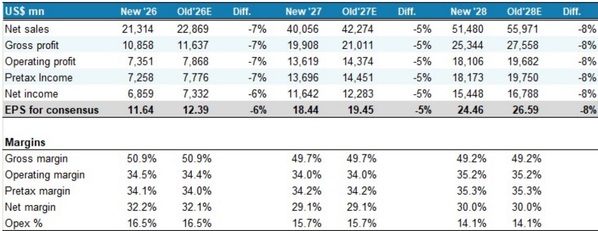
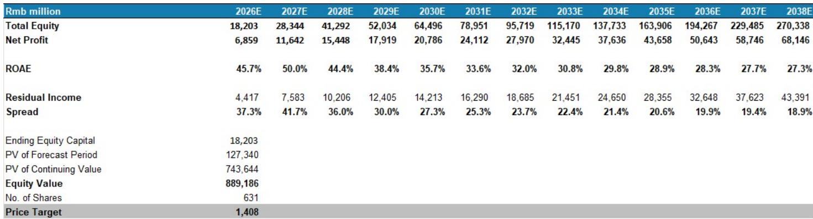
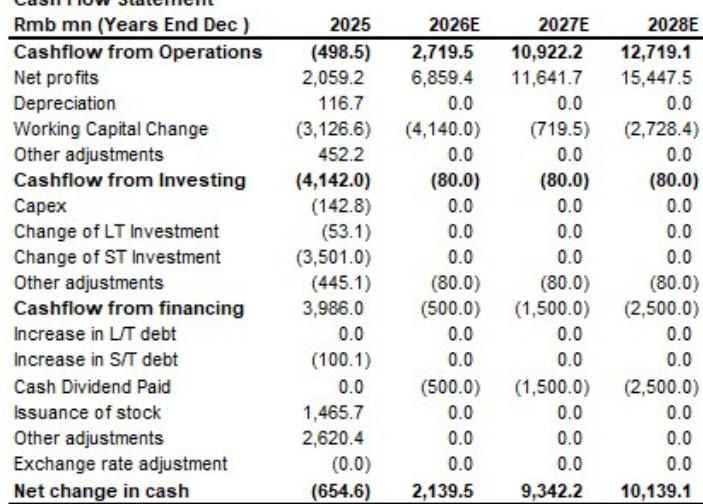

# 交付节奏成为新焦点：寒武纪的估值逻辑从需求转向执行

国内AI加速器市场正在进入一个新阶段，制约因素已不再是客户意愿，而是实际交付能力。作为国内最具代表性的上市AI芯片设计公司，寒武纪预计2026年第二季度营收为38亿元人民币，环比增长31%，但这一数字较此前预期下调了2%。原因并非国内加速器需求减弱，而是产能爬坡慢于预期、存储供应偏紧、系统级交付时间有所延后。某国际投行维持其评级，这一细微差别反映了该股的核心矛盾：结构性机会依然存在，但近期收入确认的路径比市场此前定价的更具不确定性。

时机至关重要。中国AI芯片市场总规模预测刚被上调36%，至2030年达910亿美元，意味着2025年起年复合增长率为23%。AI芯片自给率预计将从2025年的42%攀升至2030年的70%。据报道，主要云服务商正计划大幅增加资本开支，其中一家头部企业在有利条件下2027年的资本开支可能达到1000亿美元。需求侧从未如此强劲。然而，寒武纪的交付延后表明，瓶颈已从订单簿转向工厂车间，从设计中标转向生产良率，从营销叙事转向供应链执行。

对观察者而言，这创造了一个更具挑战性的分析环境。仅仅识别出正确的国内AI芯片赢家就足够的时代已经结束。新问题是：一家公司能否将设计优势转化为规模化、按时、且利润率可接受的系统交付。寒武纪2026年二季度的预告表明，答案目前是“没有预期的那么快”。该股52周价格区间为449.66元至1620.00元，反映了这种情绪波动——在国内替代叙事的热忱与运营现实的落差之间摇摆。

## 寒武纪二季度预期下调是供应链故事，而非需求信号——这一区分对理解股价走势至关重要

2026年二季度营收下调2%，全年2026年预期同样下调2%，源于供应链核查显示MLU580/590交付慢于预期。报告将缺口归因于产能爬坡问题、存储供应和系统级交付时间，而非潜在需求减弱。这是一个有意义的区分。中国对国产AI加速器的需求依然强劲，由自主可控买家、云服务商以及不断增长的AI初创企业和汽车OEM群体驱动。问题出在供给侧：将芯片制造、封装、测试并集成到客户可部署的服务器系统中。

季度轨迹说明了这一挑战。2026年一季度营收28.8亿元，环比增长52.6%之后，预期的二季度37.8亿元仅代表30.9%的环比增长。加速预计将在三季度以50.3%的环比增速和四季度58.0%的增速恢复，但这些预测假设交付约束在下半年有所缓解。报告中的表述——“产能爬坡、组件供应和系统级交付的成熟度仍低于我们此前的假设”——表明该公司仍在学习如何从设计扩展到量产，这一转变在全球半导体公司中历来具有挑战性。

每股收益修正也说明了同样的问题。2026年全年每股收益预期下调6%至11.64元，2027年下调5%至18.44元，2028年下调8%至24.46元。值得注意的是，2028年的下调幅度大于2027年，表明供应链挑战预计不会迅速解决。毛利率假设保持不变，2026-28年分别为51%、50%和49%，表明问题在于收入确认时间而非定价能力或成本结构。这是一家在出货时能够获得有吸引力利润率的公司，但问题在于它能出货多少、何时出货。

## 股权激励计划是留人机制，不是盈利预测——将其误读为指引将是策略性错误

寒武纪计划以每股750元向945名员工授予500万股限制性股票，覆盖85%的员工，其收入目标引起了关注：2026年108-135亿元，到2028年升至476-595亿元。2027年调整后净利润目标92亿元和2028年138亿元乍看之下颇为进取。但报告明确指出：这些目标“明显低于市场预期”，不应被解读为管理层指引。

该计划的结构揭示了其真实目的。85%的广泛覆盖率，加上750元的折让授予价（近期收盘价为1146.90元），指向的是员工留任而非盈利信号。在AI芯片设计人才需求旺盛的竞争性人才市场中，以大幅折价锁定关键人员的限制性股票是一种防御性举措。收入目标设定在足以作为留任门槛的可达成水平，而非足以作为盈利指引的进取水平。

将这些目标视为管理层对盈利潜力的真实评估将是一个类别错误。这些目标是为达成而设计的，而非为挑战而设。真正的信号是覆盖率：当一家公司向85%的员工授予股权时，它传递的是对人才流失的担忧，而非对未来盈利能力的信心。这一区分对估值很重要，因为它表明公司的竞争护城河取决于在艰难产能爬坡期间留住工程人才的能力，而管理层愿意通过稀释股东权益来实现这一目标。

## 中国AI加速器市场因地缘因素被重新上调，但竞争格局正从芯片规格转向系统经济学

报告将2030年中国AI芯片市场总规模预测上调36%至910亿美元，驱动因素包括：新增了国内云服务商使用国产GPU的海外AI数据中心类别；据报道字节跳动计划在2026年和2027年大幅增加资本开支；金山云被纳入，2026年全年资本投资预计超过150-200亿元；以及将自主可控和国企相关市场总规模假设从70亿美元上调至90亿美元。如果中国推进据报道正在考虑的五年内高达2万亿元的数据中心投资，自主可控部分可能进一步增长。

但市场的增长伴随着竞争格局的根本性转变。报告指出，中国AI GPU竞赛“不再仅仅是芯片规格的较量”。虽然国产芯片在芯片层面仍落后美国约两代，但通过多芯片设计、先进封装、机架级系统架构、光网络和软硬件协同优化，有效差距正在缩小。在2026年世界人工智能大会上，大多数厂商展示了超过128卡的SuperPod解决方案，预填充/解码分离正在成为重要的推理架构。

竞争影响深远。系统级竞争力比原始芯片规格更重要，因为采购决策越来越由部署经济性驱动。国产加速器已比在中国市场可获得的英伟达产品提供显著更低的总拥有成本，领先的国产芯片在推理工作负载中可实现广泛的每token成本平价。主要大语言模型开发者在报告的中国峰会上表示，只要token成本具有竞争力，他们愿意部署国产GPU。驱动采用的是经济性，而非意识形态。

这种向系统级竞争的转变提高了寒武纪的门槛。公司现在不仅要在芯片性能上竞争，还要在整体栈上竞争：服务器系统、网络、软件成熟度和总拥有成本。MLU580/590的交付延后表明，系统级集成正是公司面临挑战的领域。随着同行在2026年下半年推出新产品，寒武纪的相对表现和性价比定位将面临更严峻的考验。

## 评估中国AI加速器厂商的决策框架已从技术潜力转向“经济性×执行”的二维矩阵

对于观察这一市场的读者，报告提供了一个清晰的分析框架：通过经济性和执行两个维度来评估厂商。经济性维度结合了总拥有成本、token成本、每秒token数和每美元性能。执行维度包含定性因素，如代工渠道、软件生态成熟度、云服务商关系和路线图可信度。

这一框架意味着该行业不应被视为单一的政策主题来估值。厂商将根据其实现出货规模、生态可信度和定价纪律的能力而出现显著分化。报告明确警告，一些公司“可能难以将技术潜力转化为可持续的收入和利润”。行业正在整合，赢家将是那些能将技术能力转化为可持续收入和利润增长的公司。

具体到寒武纪，该框架得出了一个细致的评估。在经济性维度上，公司似乎具有竞争力：报告指出，在AI大语言模型推理中，国产芯片相比英伟达面向中国市场的处理器具有更低的总拥有成本和可比的每token成本。在执行维度上，情况则更为复杂。交付延后引发了对产能爬坡成熟度和系统级整合的质疑。股权激励计划表明管理层正专注于在困难时期留住人才。公司在中国国产AI计算生态系统中的战略地位稳固，但执行仍是关键变量。

该框架还突显了需求模式的结构性转变。中国的AI需求正变得更加推理密集、更加经常性、更加利用率驱动。这有利于那些针对成本效率、软件适配和可用性而非基准测试领先性进行优化的解决方案。推理工作负载对交付延迟的容忍度较低，因为它们与实时客户部署相关，而非批量训练运行。无法按时交付系统的公司将在推理工作负载上输给能够按时交付的竞争对手，无论理论芯片性能如何。

## 寒武纪的估值现在取决于一条狭窄路径：维持报告观点，同时接受近期波动将由交付里程碑而非需求头条驱动

尽管下调了预期，报告仍维持对寒武纪的报告观点。中国国内AI加速器市场完好无损，寒武纪在该生态系统中占据战略地位。这是核心看多观点。

但通往该目标的路径比表面看起来更窄。2026年每股收益预期11.64元意味着约97倍的远期市盈率，2027年预期18.44元意味着约62倍。这些是高要求倍数，要求交付延后得到解决且下半年加速得以实现。报告自身数据显示，2026年三季度和四季度营收增长必须分别达到50.3%和58.0%的环比增速才能实现全年目标。任何进一步的供应链中断都将使这些目标面临风险。

竞争日历增加了另一层不确定性。同行将在2026年下半年推出新产品，这将考验寒武纪的相对表现和性价比定位。如果竞争对手按时交付而寒武纪继续延后，即使在增长的市场中，公司也可能失去心智份额和订单份额。报告将“路线图可信度”作为执行因素之一颇为恰当：在一个客户做出多年部署决策的市场中，今天错过交付日期的供应商，其未来路线图可能会被打折。

更广泛的市场背景是双向的。市场总规模上调至910亿美元确实具有支撑性，自给率从42%到70%的轨迹提供了多年的顺风。但这些都是行业层面的趋势，将使多家厂商受益。寒武纪能否在这一增长中占据不成比例的份额，取决于尚未在规模上得到验证的执行改进。报告在下调预期的同时维持报告观点，反映了一种判断：战略地位重于近期运营挑战——但这将需要在未来几个季度通过实际交付表现来验证。

该股的估值现在是对运营改善的押注，而不仅仅是对市场增长的押注。市场已经消化了国内替代叙事；尚未消化的是完美执行路径。52周区间449.66元至1620.00元显示了估值区间有多宽，以及该股对交付、竞争和政策消息的敏感度有多高。对于观察者而言，报告的框架表明，下一个催化剂不是另一次市场总规模上调或政策公告，而是寒武纪能否以客户期望的速度将订单簿转化为已交付系统的证据。这就是新的战场，而在这里，供应链执行而非叙事将决定结果。

*仅供参考。部分内容可能基于源材料由AI辅助生成、翻译、总结或编辑，可能包含遗漏或错误。请独立核实。本文不构成投资、法律、税务、会计或其他专业建议。*

仅供参考。部分内容可能基于源材料由AI辅助生成、翻译、总结或编辑，可能包含遗漏或错误。请独立核实。本文不构成投资、法律、税务、会计或其他专业建议。

