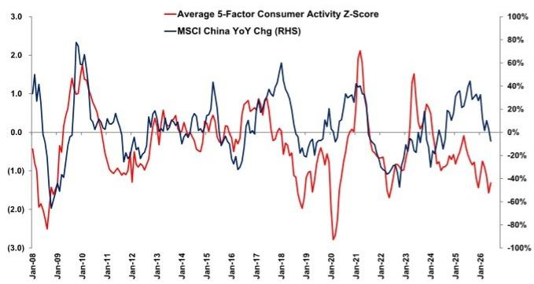

# 消费复苏：结构问题而非动能问题

6月五因子消费活跃指数边际改善——即便综合指数仍处于负值区间，这一小幅回升所揭示的信息比表面数字更为复杂。商品零售与餐饮收入走强，而航空客运走弱，两者之间的分化指向一个正在轮动而非全面复苏的消费基础。对于跟踪MSCI中国公司盈利轨迹的研究者而言，这一区别至关重要：市场等待的不是需求拐点，而是支出结构能否支撑企业利润率的证据。目前这一证据尚不完整。

截至2026年6月底的数据显示，住户贷款与乘用车销售保持平稳，而两类“消费降级”类别——商品零售与餐饮——有所改善。航空出行作为最具可选性、对信心最敏感的组成部分则出现走弱。这是一个正在消费但并未庆祝的消费者画像：愿意交易，不愿远行。五因子Z-score将这些信号汇总为单一活跃度指标，仅录得边际改善。复苏是真实的，但深度有限，而恰恰是深度不足的部分，正是高利润率、高乘数效应支出所在。

对市场参与者而言，战略问题不在于消费是否会反弹——基数效应本身就能保证未来几个季度同比有所改善——而在于这种反弹是否具备支撑重新定价的结构性深度。当前证据显示尚不具备。一个升级餐饮与日用消费却推迟航空出行的消费者，是在管理预算，而非表达信心。这一行为差异对各行业能否掌握定价权、哪些行业将继续受制于利润率，具有直接影响。

## 航空出行走弱揭示信心天花板，零售强势无法掩盖

以三个月移动平均衡量的航空客运量在6月走弱，而其他消费分项有所改善。这并非统计假象。航空出行是五因子框架中最具可选性的项目：它需要可支配收入、闲暇时间，以及为非必需品消费的心理自由。其走弱表明消费者升级意愿仍受限，即便降级消费趋于稳定。

剔除汽车后的商品零售与餐饮收入均有所改善，但这些类别捕捉的是接近必需品的支出。一个购买更多日用品、更频繁外出就餐的家庭是在恢复常态，而非扩展抱负。这一区别对行业选择至关重要。面向城市内日常必需品与体验式消费的公司可能看到销量回升；而面向长途出行、酒店及高端可选服务的公司，利润率正常化的路径可能更为缓慢。

这种分化还对就业市场产生二阶影响。航空出行需求不仅与休闲相关，也与商务出行和专业服务活动相关。客运走弱可能反映企业收紧出行预算——这是白领就业的领先指标，进而影响城市消费动能。零售数据捕捉的是已经获得收入的家庭；航空数据捕捉的是雇主为下一季度管道支出的意愿。后者更具前瞻性，而它正在走弱。

## 住户贷款与汽车销售平稳，但稳定不等于刺激

6月住户贷款增长与乘用车零售保持稳定，为综合指数提供了底部支撑。这种稳定本身确实重要：任何一项崩塌都会将Z-score拖得更低。但稳定也是一个低门槛。住户贷款以稳定速度增长表明消费者愿意为耐用消费品承担债务，但缺乏加速迹象则说明信贷需求并未被刻意刺激。

汽车市场值得特别关注。三个月移动平均的乘用车销量保持稳定，但销量结构同样重要。如果稳定是由降价和促销活动驱动，而非新车型周期或真实需求扩张，那么收入稳定掩盖的是利润率压缩。面对销量平稳、价格下行的汽车制造商，与那些量增且具备定价权的公司，研究逻辑截然不同。五因子指数无法区分这两种情形，这正是读者不应将总量数据视为绿灯的原因。

住户贷款数据也有类似警示。贷款增长既可以反映自愿信贷需求，也可能反映为平滑消费而进行的被动借贷。在消费环境偏弱的情况下，后者不能排除。指数中贷款分项保持稳定而航空出行走弱，与家庭利用信贷维持日常支出而非为抱负性消费融资的行为一致。这是防御性行为，而非进攻性行为。

## 基数效应将制造表面复苏，底层数据将与之矛盾

展望未来，尽管基数效应改善，消费仍可能保持偏弱。这是本报告中最重要的一句话，值得展开说明。随着比较基期越过上年较弱月份，即便活动水平持平，同比增速也会机械性改善。那些不调整基数效应、仅依赖表面增长数据的研究者，会得出消费正在复苏的结论，而实际上只是与更容易的基数比较而已。

风险有两层。第一，市场可能因复苏的表象而上涨，随后在财报显示收入增长未能转化为利润率扩张时回调。第二，政策制定者可能将改善的数据视为无需额外刺激的证据，从而关闭真正能改变轨迹的需求侧干预窗口。报告认为进一步大规模消费刺激似乎不太可能，应在此背景下理解：数据表面不会迫使政策出手。

对于企业战略制定者而言，基数效应动态支持在设定内部预算时保持谨慎。一家公司将未来几个季度的表面增长外推至产能扩张或招聘计划，可能是在为一个统计意义上的而非真实的复苏做建设。审慎的做法是以持平至温和的潜在活动为基准，将任何上行视为或有情形而非基准情形。航空出行数据是金丝雀：在该分项明确转向之前，复苏叙事仍是一个数学产物。

## 区分周期性企稳与结构性反弹的决策框架

五因子框架若使用得当，不是择时工具，而是识别哪些消费板块正在修复、哪些仍受损的诊断工具。研究者和企业规划者应将其转化为三层决策框架。

第一层是必需消费，由商品零售和餐饮捕捉。此处的改善是广泛复苏的必要条件但非充分条件。这一层的公司应以成本纪律和市场份额而非收入增长来评估，因为需求复苏将是真实但浅层的。研究问题是一家公司能否在低增长环境中实现盈利增长，而非能否乘上周期性浪潮。

第二层是可选耐用品，由乘用车销售和住户贷款捕捉。此处的稳定令人鼓舞，但需要结构性分析。研究者应将销量与价格分开：价格下行中的稳定市场是利润率警示，而非销量信号。决策规则是偏好具备定价权或新车型周期、能与总量脱钩的公司。

第三层是抱负性支出，由航空客运捕捉。这是摆动因素，也是最具信息量的领先指标。在该分项向上拐头之前，整体消费复苏应被视为防御性企稳而非进攻性扩张。决策规则是在航空数据确认消费者信心转变之前，控制对高客单价体验式服务和高端可选品类的敞口。

应用这一框架指向杠铃式布局：保持对必需消费和具备定价能力的优质耐用品的敞口，同时在领先指标转向之前，为抱负性板块保留弹药。6月的边际改善不足以支持沿风险曲线下移。

## 统计复苏与体验复苏之间的落差将考验市场耐心

数字所显示与消费者所感受之间的分化，是当前格局的核心张力。五因子指数在未来几个季度很可能继续同比改善，纯粹是基数效应的函数。但指数内部结构——航空出行滞后——将继续揭示消费者对体验和抱负性支出的意愿尚未回归。市场交易边际，而边际正在改善。但市场也交易估值扩张，而估值需要信心，不仅仅是算术。

对MSCI中国而言，这意味着指数层面的复苏将由国内必需消费和出口竞争力相关板块引领，而可选消费板块仍是一个“证明给我看”的故事。盈利修正周期将是仲裁者。如果抱负性板块的公司尽管宏观数据表面改善仍给出保守指引，市场最终将为结构问题定价。如果它们基于基数效应驱动的数据给出激进指引，当航空出行分项未能确认时，将面临信誉落差。

未来两个季度将区分那些读懂复苏结构的参与者与那些只读总量的参与者。五因子框架若正确解读，是前者的工具。6月的边际改善是真实的，但它是在受限预算内的轮动，而非预算的扩张。在航空出行数据转向之前，战略姿态应是对复苏交易选择性参与，而非全面押注。

*仅供参考。部分内容可能基于原始材料由AI辅助生成、翻译、摘要或编辑，可能存在遗漏或错误。请独立核实。本文不构成任何专业建议。*
