# 2Q26 自动化市场观察 – 增长动能持续增强

OEM 市场增长动能明显增强，项目型市场在二季度保持平稳。核心产品在 AI 及相关下游需求带动下（如电池、物流、电子、机器人等），销售增速有所提升，本土头部厂商份额继续扩大。

## 二季度分产品表现

二季度主要工厂自动化产品均呈现持续增长态势：低压变频器、伺服、小型 PLC、中大 PLC 和工业机器人销售额同比分别增长 7%、25%、15%、14% 和 17%，较一季度 4%、17%、14%、11% 和 14% 的同比增速有所提升。行业研究机构上调了 2026 年自动化市场整体销售增长预期（同比 +5%，此前为 +2%），其中伺服（同比 +21%，此前为 +17%）、PLC（同比 +11%，此前为 +9%）、工业机器人（同比 +14%，此前为 +12%）等产品预期均有上修。这意味着下半年整体市场同比增速有望达到 +5%，高于上半年的 +4%。（详见附录 2）

## 下游需求结构

从下游来看，复苏范围有所扩大：电池、电子、半导体、机器人等行业增长加快；物流、机床、纺织保持稳健增长态势；流程工业（如化工、冶金）和电梯需求相对平稳；光伏年初至今同比转为小幅正增长。

## 本土品牌表现

本土品牌份额持续提升：低压变频器、伺服、小型 PLC、中大 PLC 和工业机器人的本土品牌市场份额在二季度分别达到 42%、59%、39%、17% 和 61%，同比分别提升 1、4、4、1 和 5 个百分点。埃斯顿二季度在国内工业机器人出货量排名第一，市场份额为 9.9%。

## 行业周期观察

我们预计自动化行业将受益于更广泛的资本开支周期，2026 年项目型市场有望实现约 5% 的同比增长，主要驱动因素包括：1）技术驱动需求——AI 及物理 AI 应用，如智能机器人、PCB 设备、液冷、电子等；2）能源安全需求增长；3）设备更新需求逐步释放，技术迭代可能带来加速；4）设备企业出口竞争力持续提升。我们关注订单动能较强的宏发股份（600885.SS）以及制造资本开支复苏、激光结构渗透、新产品和下游拓展中的柏楚电子（688188.SS）。

---

**研究团队**

盛中  
股票研究分析师  
Sheng.Zhong@morganstanley.com +852 2239-7821

Chelsea Wang  
股票研究分析师  
Jinlin.Wang@morganstanley.com +852 2239-1118

Carlos Chai  
研究助理  
Carlos.Chai@morganstanley.com +852 3963-3180

Asia Summer School 2026

亚太行业观点：中性

## 附录 1：MIR 预测 – 按 OEM/项目市场划分

<table><tr><td></td><td>2Q25</td><td>2Q26</td><td>同比</td><td>1H25</td><td>1H26</td><td>同比</td><td>2026e</td><td>同比</td></tr><tr><td>自动化市场</td><td>87,588</td><td>92,603</td><td>6%</td><td>177,213</td><td>184,638</td><td>4%</td><td>359,276</td><td>5%</td></tr><tr><td>——OEM 市场</td><td>32,381</td><td>37,852</td><td>17%</td><td>64,726</td><td>72,579</td><td>12%</td><td>135,158</td><td>9%</td></tr><tr><td>——项目市场</td><td>55,207</td><td>54,751</td><td>-1%</td><td>112,487</td><td>112,059</td><td>0%</td><td>224,118</td><td>2%</td></tr></table>

资料来源：MIR 数据/预测，MS

MS 与报告中涉及的公司存在或寻求业务往来。因此，读者应知悉公司可能存在影响报告客观性的利益冲突。读者应将 MS 仅视为决策参考因素之一。

## 分析师认证及其他重要披露

请参阅本报告末尾的披露部分，了解分析师认证及其他重要披露信息。

+= 非美国关联机构雇用的分析师未在 FINRA 注册，可能不是会员机构的关联人员，可能不受 FINRA 关于与标的公司沟通、公开露面及持有研究分析师账户中证券交易相关限制的约束。

## 关键图表

附录 2：工业企业利润逐步回升印证了我们关于 2026 年自动化资本开支处于上行周期的判断  
  
资料来源：国家统计局、MIR、MS 预测

附录 3：2Q26 自动化市场按下游行业划分及主要本土厂商份额

<table><tr><td>百万元</td><td>2Q25</td><td>2Q26</td><td>同比</td><td>1H25</td><td>1H26</td><td>同比</td><td>主要厂商 2Q26 份额</td><td>同比</td><td>2026E</td><td>同比</td></tr><tr><td rowspan="3">低压变频器</td><td rowspan="3">7,244</td><td rowspan="3">7,715</td><td rowspan="3">7%</td><td rowspan="3">14,614</td><td rowspan="3">15,380</td><td rowspan="3">5%</td><td>ABB 17.2%</td><td>↑+1.0ppt</td><td rowspan="3">29,506</td><td rowspan="3">3%</td></tr><tr><td>西门子 12.9%</td><td>↓-0.2ppt</td></tr><tr><td>英威腾 5.4%</td><td>↓-0.2ppt</td></tr><tr><td rowspan="6">伺服</td><td rowspan="6">5,782</td><td rowspan="6">7,204</td><td rowspan="6">25%</td><td rowspan="6">11,262</td><td rowspan="6">13,604</td><td rowspan="6">21%</td><td>西门子 10.7%</td><td>↓-0.6ppt</td><td rowspan="6">26,976</td><td rowspan="6">21%</td></tr><tr><td>松下 7.5%</td><td>↓-0.3ppt</td></tr><tr><td>安川 5.8%</td><td>↓-1.5ppt</td></tr><tr><td>雷赛 5.4%</td><td>↑+1.2ppt</td></tr><tr><td>台达 5.2%</td><td>↓-0.7ppt</td></tr><tr><td>无锡信捷 4.6%</td><td>↑+0.7ppt</td></tr><tr><td rowspan="2">小型 PLC</td><td rowspan="2">1,512</td><td rowspan="2">1,732</td><td rowspan="2">15%</td><td rowspan="2">2,955</td><td rowspan="2">3,383</td><td rowspan="2">14%</td><td>西门子 29.6%</td><td>↓-1.1ppt</td><td rowspan="2">6,849</td><td rowspan="2">12%</td></tr><tr><td>无锡信捷 11.7%</td><td>↑+0.2ppt</td></tr><tr><td rowspan="2">中大 PLC</td><td rowspan="2">2,600</td><td rowspan="2">2,961</td><td rowspan="2">14%</td><td rowspan="2">5,286</td><td rowspan="2">5,938</td><td rowspan="2">12%</td><td>西门子 51.3%</td><td>↓-1.2ppt</td><td rowspan="2">10,874</td><td rowspan="2">8%</td></tr><tr><td>欧姆龙 9.7%</td><td>↑+1.8ppt</td></tr><tr><td rowspan="6">工业机器人（台）</td><td rowspan="6">86,090</td><td rowspan="6">100,806</td><td rowspan="6">17%</td><td rowspan="6">162,871</td><td rowspan="6">188,612</td><td rowspan="6">16%</td><td>埃斯顿 9.9%</td><td>↓-0.3ppt</td><td rowspan="6">382,122</td><td rowspan="6">14%</td></tr><tr><td>KUKA 9.8%</td><td>↑+0.6ppt</td></tr><tr><td>发那科 8.0%</td><td>↓-1.0ppt</td></tr><tr><td>ABB 4.1%</td><td>↓-1.3ppt</td></tr><tr><td>爱普生 5.6%</td><td>↓-0.7ppt</td></tr><tr><td>埃夫特 6.3%</td><td>↑+0.9ppt</td></tr><tr><td>——&lt;20kg 六轴</td><td>27,025</td><td>31,167</td><td>15%</td><td>51,215</td><td>58,537</td><td>14%</td><td>-</td><td>-</td><td>113,557</td><td>12%</td></tr><tr><td>——&gt;20kg 六轴</td><td>24,725</td><td>27,470</td><td>11%</td><td>49,832</td><td>53,352</td><td>7%</td><td>-</td><td>-</td><td>113,171</td><td>7%</td></tr><tr><td>——SCARA</td><td>21,495</td><td>24,205</td><td>13%</td><td>39,615</td><td>46,565</td><td>18%</td><td>-</td><td>-</td><td>92,437</td><td>15%</td></tr><tr><td>——协作机器人</td><td>11,250</td><td>16,320</td><td>45%</td><td>19,185</td><td>26,970</td><td>41%</td><td>-</td><td>-</td><td>56,168</td><td>40%</td></tr></table>

资料来源：MIR 数据，MS。E = MIR 预测。

附录 4：日本机床对华订单持续积累动能  
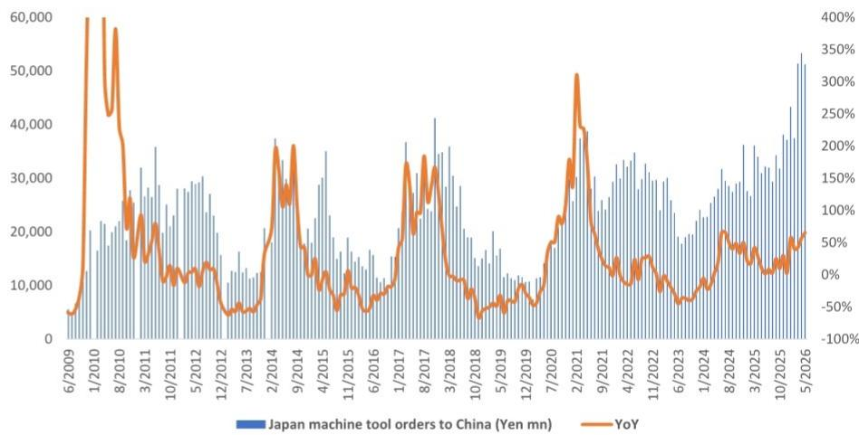  
资料来源：JMTBA、MS

附录 5：2025 年自动化市场同比下降 1%；MIR 预计 2026 年全年改善至同比增长 5%  
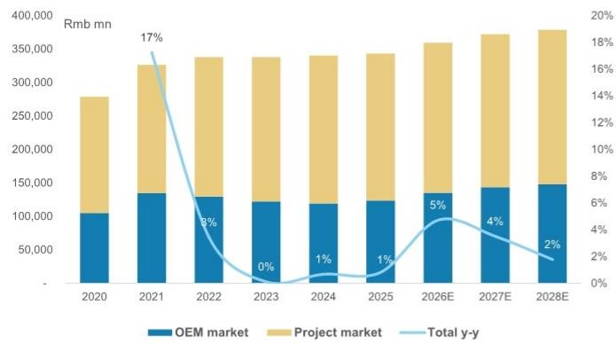  
资料来源：MIR、MS。e = MIR 预测

附录 6：国内自动化市场 2Q26 同比增长 6%，主要由 OEM 市场驱动  
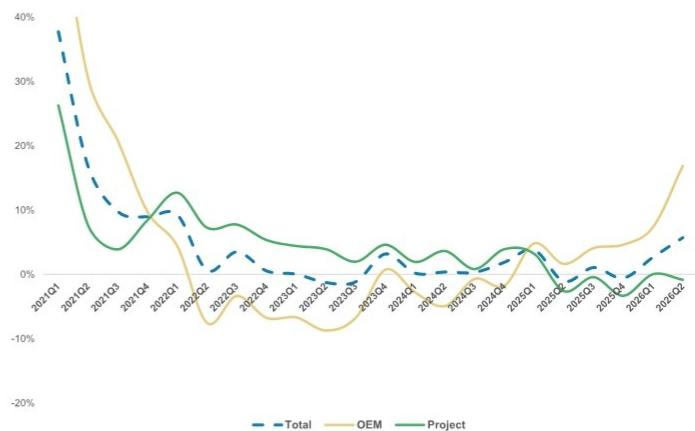  
资料来源：MIR、MS

附录 7：国内自动化 OEM 市场按下游行业划分，2Q26  
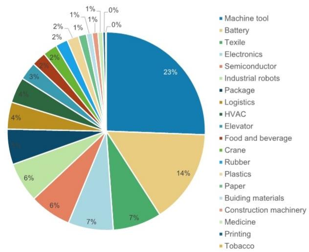  
资料来源：MIR、MS

附录 8：国内自动化项目市场按下游行业划分，2Q26  
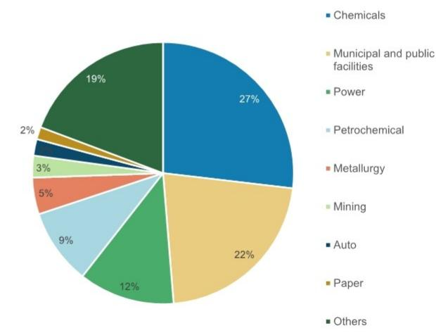  
资料来源：MIR、MS

附录 9：国内低压变频器市场：2Q26 本土化率达 42%，同比提升 1 个百分点  
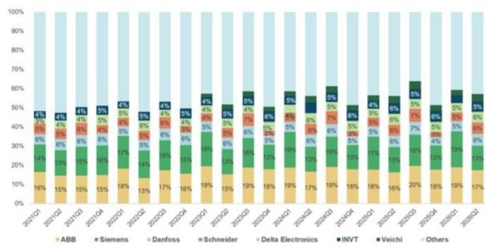  
资料来源：MIR、MS

附录 10：国内 2Q26 低压变频器市场同比增长 7%，其中物流和暖通空调表现较好  
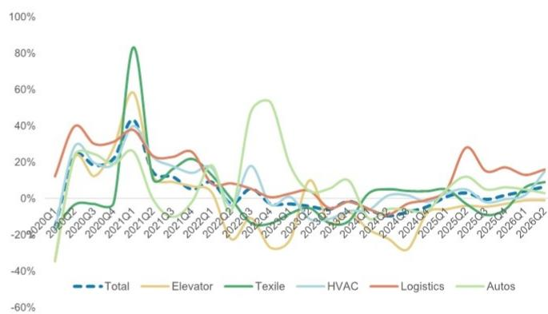  
资料来源：MIR、MS

附录 11：国内伺服市场：2Q26 本土化率达 59%，同比提升 4 个百分点  
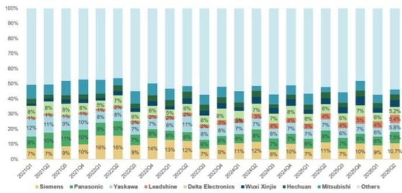  
资料来源：MIR、MS

附录 12：国内 2Q26 伺服市场同比增长 25%，受电池、电子和半导体支撑  
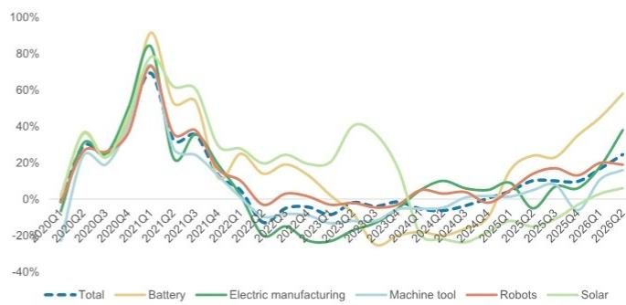  
资料来源：MIR、MS

附录 13：国内小型 PLC 市场：2Q26 本土化率达 39%，同比提升 4 个百分点  
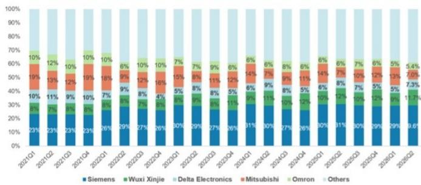  
资料来源：MIR、MS

附录 14：国内小型 PLC 市场 2Q26 同比增长 15%，受物流、电子、电池、半导体支撑  
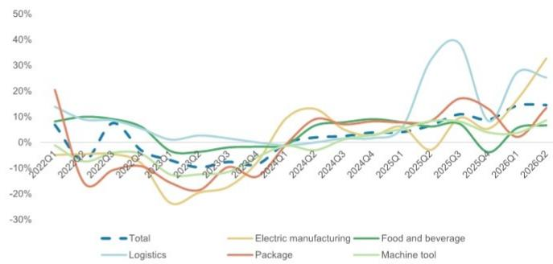  
资料来源：MIR、MS

附录 15：国内中大 PLC 市场：2Q26 本土品牌份额仍相对较低，为 17%，同比提升 1 个百分点  
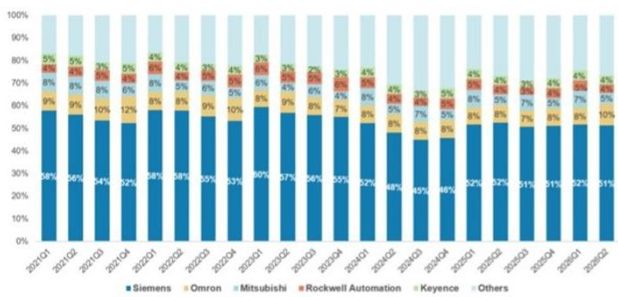  
资料来源：MIR、MS

附录 16：国内中大 PLC 市场 2Q26 同比增长 14%，受电池和电子支撑  
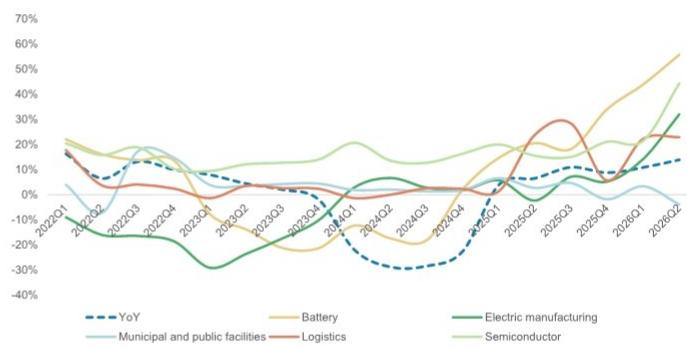  
资料来源：MIR、MS

附录 17：国内工业机器人出货量 2025 年同比增长 14%；MIR 预计 2026 年同比增长 14%  
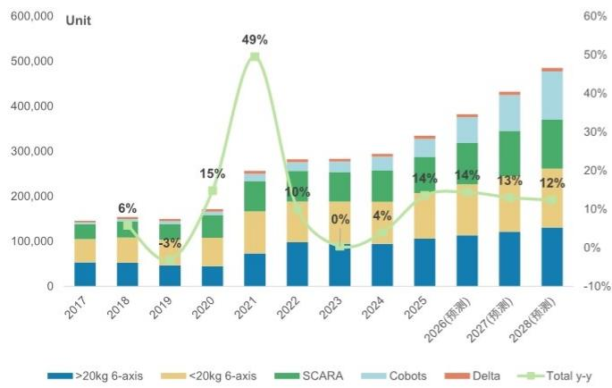

附录 18：2Q26 工业机器人出货量同比增长 17%；协作机器人表现突出，同比增长 45%  
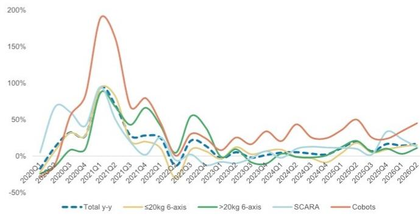  
资料来源：MIR、MS  
资料来源：MIR、MS。e=MIR 预测

附录 19：2Q26 机器人出货量增长主要受电池、电子、汽车电子支撑  
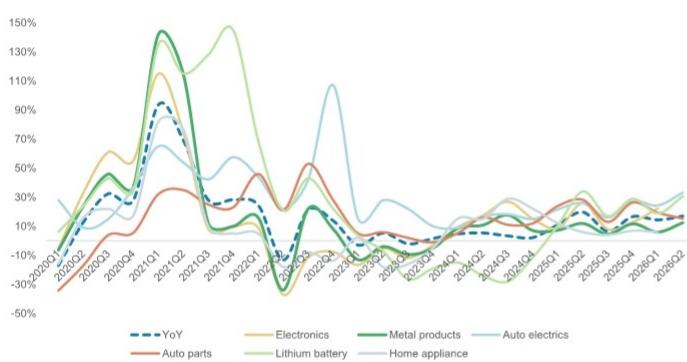  
资料来源：MIR、MS

附录 20：国内工业机器人市场份额动态——2Q26 本土化率进一步超过 60%  
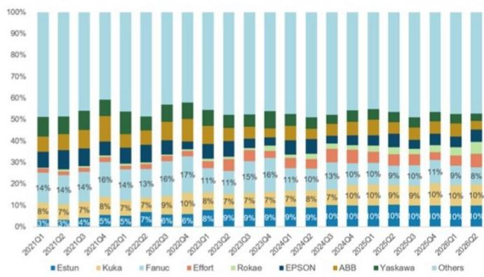  
资料来源：MIR、MS

## 估值方法与风险

## 宏发股份（600885.SS）

基准情形，采用市盈率法。我们对 2027 年预测每股收益适用 25 倍 FY2 市盈率，与历史平均 +1 标准差基本一致，反映我们对宏发全球业务布局、多元化下游敞口以及快速产品迭代带来的份额持续提升的积极看法。

## 上行风险

■ AIDC、ESS 及新电气产品增长快于预期

■ 大宗商品价格下降快于预期

■ 800V 产品采用快于预期

## 下行风险

■ 价格竞争加剧及原材料成本上升，影响宏发利润率

■ 国内房地产市场变化导致家电消费波动

■ 全球电动汽车需求变化

## 上海柏楚电子（688188.SS）

基准情形，采用市盈率法。目标倍数为 2027 年预测市盈率 30 倍，与汇川技术基本一致，考虑到柏楚在激光切割运动控制系统中的领先地位，但仍低于柏楚 5 年历史平均 FY2 市盈率 36 倍，原因是我们预计 2026-27 年收入增速将有所放缓。

## 上行风险

■ 高功率 MCS 市场份额提升好于预期

■ 焊接 MCS 市场拓展快于预期

## 下行风险

■ 中低功率设备需求收窄

■ 中低功率市场竞争加剧带来利润率压力

■ 产品结构不利变化

## 披露部分

本报告中的信息和观点由 MS Asia Limited（对其内容负责）及/或 MS Asia (Singapore) Pte.（注册号 199206298Z）及/或 MS Asia (Singapore) Securities Pte Ltd（注册号 200008434H，受新加坡金融管理局监管，对其内容承担法律责任，如有任何与本报告相关事宜请联系）及/或 MS Taiwan Limited 及/或 MS & Co International plc 首尔分行及/或 MS Australia Limited（ABN 67 003 734 576，持有澳大利亚金融服务牌照 233742，对其内容负责）及/或 MS Wealth Management Australia Pty Ltd（ABN 19 009 145 555，持有澳大利亚金融服务牌照 240813，对其内容负责）及/或 MS India Company Private Limited（公司识别号 U22990MH1998PTC115305，受印度证券交易委员会（SEBI）监管，持有研究分析师牌照（SEBI 注册号 INH000001105）、证券经纪商牌照（SEBI 证券经纪商注册号 INZ000244438）、商人银行牌照（SEBI 注册号 INM000011203），并在国家证券存管有限公司持有存管参与者资格（SEBI 注册号 IN-DP-NSDL-567-2021），注册办公地址为 Altimus, Level 39 & 40, Pandurang Budhkar Marg, Worli, Mumbai 400018, India；电话 +91-22-61181000；合规官：Tejarshi Hardas 先生，电话 +91-22-61181000 或电邮 tejarshi.hardas@morganstanley.com；投诉官：Tejarshi Hardas 先生，电话 +91-22-61181000 或电邮 msic-compliance@morganstanley.com，对其内容负责，如有任何相关事宜请联系）及其关联机构（合称"MS"）编制或发布。MS India Company Private Limited (MSICPL) 可能在提供研究服务时使用 AI 工具。本报告中的所有建议均由具备相应资格的研究分析师做出。

有关本报告涉及公司的重要披露、股价图表和评级历史，请访问 MS 披露网站 www.morganstanley.com/eqr/disclosures/webapp/generalresearch，或联系您的投资代表或 MS，地址：1585 Broadway, (Attention: Research Management), New York, NY, 10036 USA。

有关本研究报告中引用的任何建议、评级或目标价所涉及的估值方法和风险，请联系客户支持团队：美国/加拿大 +1 800 303-2495；香港 +852 2848-5999；拉丁美洲 +1 718 754-5444（美国）；伦敦 +44 (0)20-7425-8169；新加坡 +65 6834-6860；悉尼 +61 (0)2-9770-1505；东京 +81 (0)3-6836-9000。您也可以联系您的投资代表或 MS，地址：1585 Broadway, (Attention: Research Management), New York, NY 10036 USA。

## 分析师认证

以下分析师特此证明，他们对本报告中讨论的公司及其证券的观点准确反映了他们的个人看法，且他们未因表达具体建议或观点而收到或将收到直接或间接报酬：Carlos Chai; Andy Huang; Chelsea Wang; Sheng Zhong。

## 全球研究冲突管理政策

MS 已按照我们的冲突管理政策发布，该政策可在 www.morganstanley.com/institutional/research/conflictpolicies 查阅。政策葡萄牙语版本可在 www.morganstanley.com.br 查阅。

## 关于标的公司的重要监管披露

截至 2026 年 6 月 30 日，MS 实益持有以下 MS 覆盖公司 1% 或以上的普通股权益证券类别：北京极智嘉科技股份有限公司、中国中铁、埃斯顿自动化股份有限公司、大族激光、奕瑞科技股份有限公司、绿的谐波、深圳英维克科技股份有限公司、深圳市汇川技术股份有限公司、深圳新益昌科技股份有限公司、苏州迈为科技股份有限公司、潍柴动力、无锡奥特维科技股份有限公司、无锡先导智能、浙江鼎力机械股份有限公司、浙江杭可科技、浙江双环传动机械股份有限公司。

在过去 12 个月内，MS 管理或共同管理了中联重科的证券公开发行（或 144A 发行）。

在过去 12 个月内，MS 因投资银行服务从深圳市汇川技术股份有限公司、中联重科获得报酬。

在未来 3 个月内，MS 预计将获得或打算寻求以下公司的投资银行服务报酬：北京极智嘉科技股份有限公司、中国建筑、三一重工股份有限公司、深圳市汇川技术股份有限公司、无锡先导智能、浙江杭可科技、中联重科。

在过去 12 个月内，MS 因投资银行服务以外的产品和服务从中国建筑、中国中车股份有限公司、海天国际控股有限公司、中国重汽（香港）有限公司获得报酬。

在过去 12 个月内，MS 已向或正在向以下公司提供投资银行服务，或与以下公司存在投资银行客户关系：北京极智嘉科技股份有限公司、中国建筑、三一重工股份有限公司、深圳市汇川技术股份有限公司、无锡先导智能、浙江杭可科技、中联重科。

在过去 12 个月内，MS 已向或正在向以下公司提供非投资银行、证券相关服务，及/或过去已签订服务协议或与以下公司存在客户关系：北京极智嘉科技股份有限公司、中国建筑、中国中车股份有限公司、海天国际控股有限公司、中国重汽（香港）有限公司。

MS 的一名员工、董事或顾问是北京极智嘉科技股份有限公司的董事。该人员不是研究分析师，也不是研究分析师家庭成员。主要负责编制 MS 的股票研究分析师或策略师的报酬基于多种因素，包括研究质量、读者客户反馈、选股表现、竞争因素、公司收入和整体投资银行收入。股票研究分析师或策略师的报酬不与 MS 进行的投资银行或资本市场交易、或特定交易台的盈利能力或收入挂钩。

MS 及其关联机构与 MS 覆盖的公司/工具开展业务，包括做市、提供流动性、基金管理、商业银行、信贷扩展、投资服务和投资银行。MS 以本金方式向客户销售和购买 MS 覆盖公司的证券/工具。MS 可能持有本报告讨论的公司或工具的债务头寸。MS 作为本金交易或可能交易作为债务研究报告主题的债务证券（或相关衍生品）。

上述某些披露也是为了遵守非美国司法管辖区的适用法规。

## 股票评级

MS 使用相对评级体系，包括增持、中性、未评级或减持（定义见下文）。MS 不对我们覆盖的股票分配买入、持有或报告评级。增持、中性、未评级和减持不等同于买入、持有和卖出。读者应仔细阅读 MS 中使用的所有评级定义。此外，由于 MS 包含有关分析师观点的更完整信息，读者应仔细阅读完整的 MS，而不应仅从评级推断内容。在任何情况下，评级（或研究）都不应被用作或依赖为研究交流。读者买卖股票的决定应取决于个人情况（如读者现有持仓）和其他考虑因素。

## 全球股票评级分布

（截至 2026 年 6 月 30 日）

下文所述的股票评级适用于 MS 的基本面股票研究，不适用于公司制作的信债研究。

仅为披露目的（根据 FINRA 要求），我们在增持、中性、未评级和减持评级旁边包含买入、持有和卖出的类别标题。MS 不对我们覆盖的股票分配买入、持有或报告评级。增持、中性、未评级和减持不等同于买入、持有和卖出，但代表建议的相对权重（定义见下文）。为满足监管要求，我们将增持（我们最积极的股票评级）对应为买入建议；将中性
