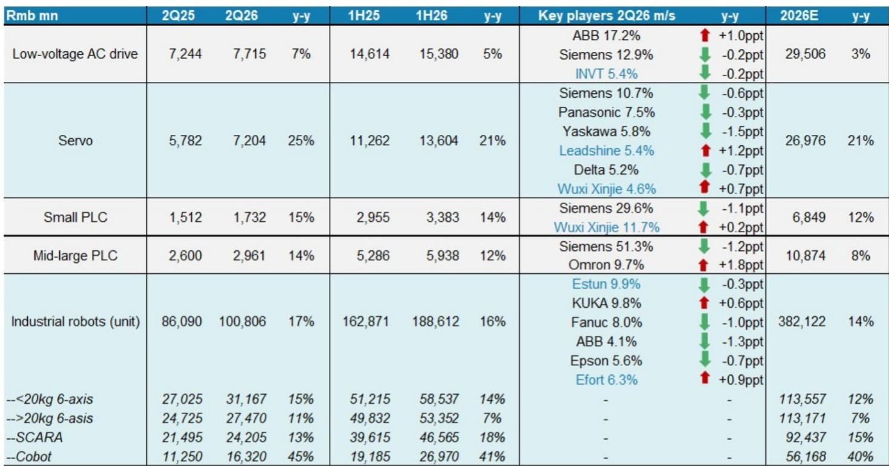
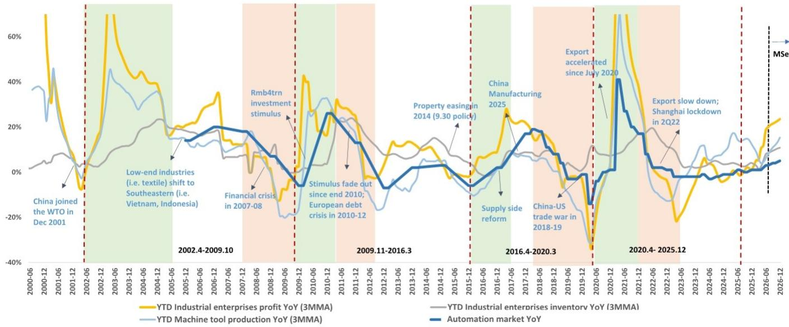
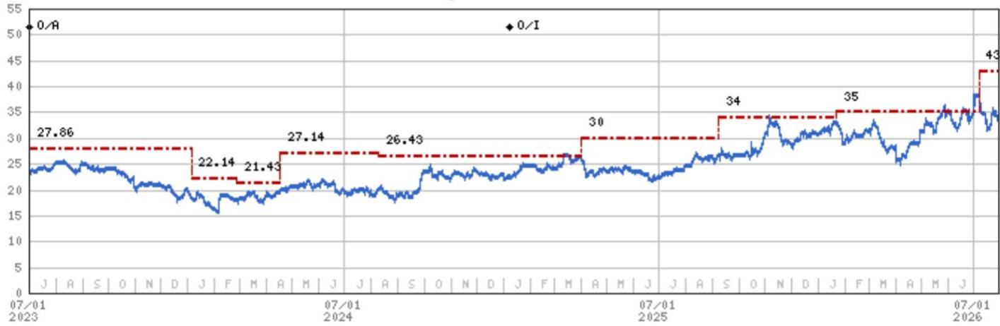

# 中国自动化市场进入广泛上行周期，赢家不再只是外资巨头

根据MIR及某全球投资银行报告的数据，2026年第二季度中国自动化市场同比增长6%，较上半年4%的增速明显加快。然而，这一整体数字背后隐藏着更具深远意义的结构性变化：服务于机械设备制造商的OEM市场在2026年二季度同比增长17%，而服务于流程工业及大型设施的项目市场则收缩1%。这一分化并非季度性波动，而是表明当前复苏由技术密集型、出口竞争力强及与AI相关的制造细分领域驱动，而非传统的重工业资本开支周期。

本轮加速在核心工厂自动化产品中具有广泛基础。低压交流变频器销售在2026年二季度同比增长7%，高于一季度的4%；伺服销售增长25%，高于一季度的17%；小型PLC销售增长15%，中大PLC销售增长14%，工业机器人出货量增长17%，各品类均较上季度有所加速。报告分析师已将2026年全年市场增长预期从2%上调至5%，其中对伺服（现预计增长21%，此前为17%）和工业机器人（14%，此前为12%）的上调幅度尤为显著。2026年下半年预计将实现5%的增长，在上半年4%的基础上继续走高。

更值得关注的是谁在获取这一增长。中国本土品牌正以加速态势在几乎所有产品类别中扩大市场份额。2026年二季度，本土品牌在低压变频器市场占据42%的份额，伺服市场59%，小型PLC市场39%，中大PLC市场17%，工业机器人市场61%。同比份额增幅分别为1、4、4、1和5个百分点。在工业机器人领域，埃斯顿以9.9%的市场份额成为国内出货量最大的供应商，超越库卡（9.8%）和发那科（8.0%）。这一趋势具有一致性：西门子、安川、松下和ABB等外资龙头在其最重要的增长市场中份额持续回落，而本土领先企业则在巩固自身地位。

## OEM与项目市场的分化揭示了新的增长逻辑：技术密集型制造优于流程工业

OEM市场增长17%与项目市场下降1%之间的对比，是本报告中最关键的数据点。2026年二季度OEM市场规模达379亿元，项目市场规模为548亿元。项目市场在相对规模上仍更大，但其停滞状态值得关注。化工、冶金、电梯等流程工业仍显疲软，报告指出太阳能行业年初至今才刚刚转为小幅正增长。项目市场的疲弱反映了重工业资本开支的整体谨慎，可能与产能过剩担忧、能源转型不确定性以及传统基建驱动需求节奏缓慢有关。

相比之下，OEM市场的强劲增长反映了根本不同的需求特征。报告指出电池、电子、半导体和机器人是加速最快的下游领域，物流、机床和纺织也保持良好势头。这些恰恰是技术迭代最快、出口竞争力最关键、AI驱动应用不断涌现的行业。与AI的关联并非偶然。报告明确将“AI及物理AI应用，如智能机器人、PCB设备、液冷、电子”列为预期自动化上行周期的主要驱动力之一。2026年二季度协作机器人（cobot）同比增长45%，而工业机器人整体增长17%，充分印证了这一点。协作机器人是与新型、柔性及AI赋能的制造应用关联最紧密的细分品类。

其战略含义在于，自动化市场已不再是单一周期，而是两个并行运行的不同周期。传统的项目驱动周期——与钢铁、化工和大型基础设施相关——仍处于蛰伏状态。新的OEM驱动周期——与电子、电池、机器人和AI基础设施相关——正在加速。服务于后者的企业将继续受益于这一趋势，而依赖前者的企业则将面临持续挑战。这不是暂时性分化，而是中国制造业向更高价值、技术密集型生产的结构性转型。

## 伺服与机器人市场以20%以上速度增长，AI基础设施与电子需求催生新一轮资本开支周期

伺服市场在2026年二季度同比增长25%，较一季度的17%有所加速，是本报告中表现最突出的产品层面数据。伺服是电子制造、半导体设备、电池生产和机器人所必需的高精度运动控制部件。其2026年全年增长预期从17%上调至21%，表明这一需求并非单季度脉冲，而是持续多季度的趋势。报告将此归因于电池、电子和半导体需求，这些均与AI供应链及更广泛的数字经济相关联。

工业机器人市场呈现类似态势。2026年二季度出货量同比增长17%至100,806台，全年预期上调至14%增长。其中，SCARA机器人增长13%，20kg以上负载六轴机器人增长11%，协作机器人增长45%。协作机器人品类尤为值得关注，因为它代表了人机协作的前沿，与物流、电子装配和小批量制造中的新兴应用关联最为紧密。报告预计2026年全年协作机器人增长40%，表明该品类正从小众走向主流。

这些市场的加速得到了相邻行业的佐证。报告指出，日本机床对华订单持续增长，表明中国制造商正在投资需要精密机械的生产能力。工业企业利润的逐步恢复——报告认为这印证了2026年自动化资本开支将处于上行周期的判断——为持续投资提供了财务基础。利润恢复时制造商会投资；投资时他们会采购自动化设备；而采购自动化设备时，他们越来越多地选择本土供应商。

## 本土份额提升并非周期性现象，而是产品力趋同、服务贴近与供应链安全共同驱动的结构性转变

本报告中的市场份额数据应被视为竞争格局永久性重塑的证据，而非暂时性波动。本土品牌目前在伺服市场占据59%的份额（同比提升4个百分点），工业机器人市场61%（同比提升5个百分点）。小型PLC市场本土份额达39%，提升4个百分点。即使在中小型PLC这一因技术复杂度高且西门子以51.3%份额占据稳固地位而最具挑战性的细分市场，本土份额也升至17%，提升1个百分点。

驱动这一转变的机制是多重的且相互强化。首先，在大多数中端应用中，产品质量已与外资竞争对手持平，使得价格差异（本土品牌通常低10-20%）成为决定性因素。其次，本土供应商提供更优的本地服务、更快的响应速度和更大的定制灵活性，这在制造商日益追求产品差异化的背景下愈发重要。第三，供应链安全已成为中国制造商的战略优先事项，尤其在出口管制和地缘政治紧张的背景下。报告数据中埃斯顿跃升至工业机器人第一（9.9%市场份额对库卡的9.8%）正是这一转变的例证。埃斯顿的成功不仅仅是价格问题，更反映了其为国内电子和电池制造商提供所需精度和可靠性的能力。

对外资供应商而言，这些影响值得深思。西门子在小型PLC市场的份额同比下降1.1个百分点至29.6%，在中大PLC市场的份额下降1.2个百分点至51.3%。安川在伺服市场的份额下降1.5个百分点至5.8%，松下下降0.3个百分点至7.5%。在工业机器人领域，发那科份额下降1.0个百分点至8.0%，ABB下降1.3个百分点至4.1%。这些下降在任何一个单季度都不算剧烈，但累积趋势清晰可见。外资供应商正被推向其技术领先地位仍无可撼动的高端细分市场，而大众化细分市场则日益属于本土领先企业。

## 自动化上行周期的决策框架：优先关注技术驱动的OEM细分、本土份额提升者及出口竞争力强的终端市场

对于研究者和企业战略制定者而言，本报告数据支持一个包含三个核心筛选条件的清晰决策框架。第一个筛选条件是终端市场敞口。资金应配置于收入与OEM市场相关的企业，特别是电子、半导体、电池、机器人和物流自动化领域。这些细分市场以15-25%的速度增长，其动能受到AI基础设施投资、能源转型和出口竞争力的支撑。相反，应尽量减少对化工、冶金、电梯等流程工业的敞口，因为这些细分仍显疲软且尚无即将复苏的迹象。

第二个筛选条件是供应商属性和市场份额轨迹。在其他条件相同的情况下，中国本土供应商在大多数产品类别中正以每年1-5个百分点的速度获取份额。这不是边缘性趋势，而是复利性趋势。一家在伺服市场拥有59%份额且每年提升4个百分点的本土供应商，将在三年内达到70%。相比之下，外资供应商即使在增长的市场中也在失去份额，这意味着其收入增长将落后于市场增长。报告对宏发和柏楚的偏好——两者均为各自细分领域的本土领先者——反映了这一逻辑。宏发受益于强劲的订单动能和AIDC 800V架构机遇，柏楚则定位于制造业资本开支复苏、结构性激光渗透和新产品拓展。

第三个筛选条件是技术敞口，特别是AI和物理AI主题。报告指出智能机器人、PCB设备、液冷和电子是自动化上行周期的关键驱动力。为这些应用提供部件、系统或软件的企业，无论宏观环境如何，都可能看到持续的需求增长。协作机器人45%的增长和伺服25%的增长并非孤立现象，它们是制造业日益自动化、智能化和互联化的领先指标。

该框架还隐含了时间维度。报告对全年预期的上调表明分析师预计这一加速将持续至2026年乃至2027年。2026年下半年预计实现5%的市场增长，高于上半年的4%，表明上行周期仍在积蓄力量。对决策者而言，这意味着布局窗口仍然开放但并非无限。最具吸引力的机会在于同时具备OEM敞口、本土份额提升和AI相关技术敞口，且拥有足够资产负债表实力以应对短期波动的企业。

## 二阶影响：出口竞争力、技术迭代与全球自动化供应链的重塑

中国自动化上行周期的影响远超国内市场。报告指出，设备企业出口竞争力的提升是预期增长的四大主要驱动力之一。中国自动化供应商不仅在国内市场胜出，也在越来越多地参与国际竞争。国内规模、成本优势和不断提升的技术水平相结合，使中国供应商有能力在东南亚、欧洲和美洲挑战既有参与者。在工业机器人领域尤为如此——中国供应商目前占据国内市场61%的份额，并开始向外出口。

报告所引述的快速技术迭代作为替代需求驱动因素，是一把双刃剑。一方面，它为能够跟上AI、互联和精密控制最新发展的供应商创造了机遇。另一方面，它提高了既有参与者的门槛，并带来加速淘汰的风险。报告提到“替代需求开始显现，并可能因快速技术迭代而加速”，表明这一升级周期不仅是更换磨损设备，更是以AI赋能、互联且更高效的系统替换过时技术。

全球自动化供应链的重塑或许是最重要的二阶影响。随着中国供应商获得规模和技术成熟度，它们将越来越多地设定全球市场的价格、性能和服务标准。外资供应商将被迫做出回应——要么差异化进入高端细分，要么与中国企业建立合作，要么完全退出大众化市场。本报告数据表明，后两种选择正变得比第一种更有可能。本土供应商在伺服和机器人领域每年4个百分点的份额增长不可能无限持续，但这一趋势将持续到竞争格局发生决定性转变为止。

对更广泛的经济而言，自动化上行周期是一个积极信号。它表明中国制造业正在投资于提升生产率的技术，这对于在劳动力成本上升和人口红利消退的背景下保持竞争力至关重要。报告将工业企业利润恢复与自动化资本开支联系起来，表明存在一个良性循环：利润支撑投资，投资提升生产率，生产率驱动利润。2026年自动化市场5%的预期增长虽然相对数值温和，但较2025年1%的下降已构成显著加速，表明制造业正进入新一轮投资驱动增长阶段。

AI、机器人和精密自动化的融合正在创造一种新的工业范式，硬件、软件和服务之间的边界日益模糊。中国供应商在引领这一转型方面处于有利位置，不仅因为其国内市场规模，更因为其快速创新的意愿和与全球最大制造生态系统的近距离。报告关于协作机器人增长、伺服加速和本土份额提升的数据均指向同一方向：工厂自动化的未来正在中国构建，且越来越多地由中国企业构建。

*仅供参考。部分内容可能基于原始材料由AI辅助生成、翻译、总结或编辑，可能存在遗漏或错误。请独立核实。本文不构成投资、法律、税务、会计或其他专业建议。*
