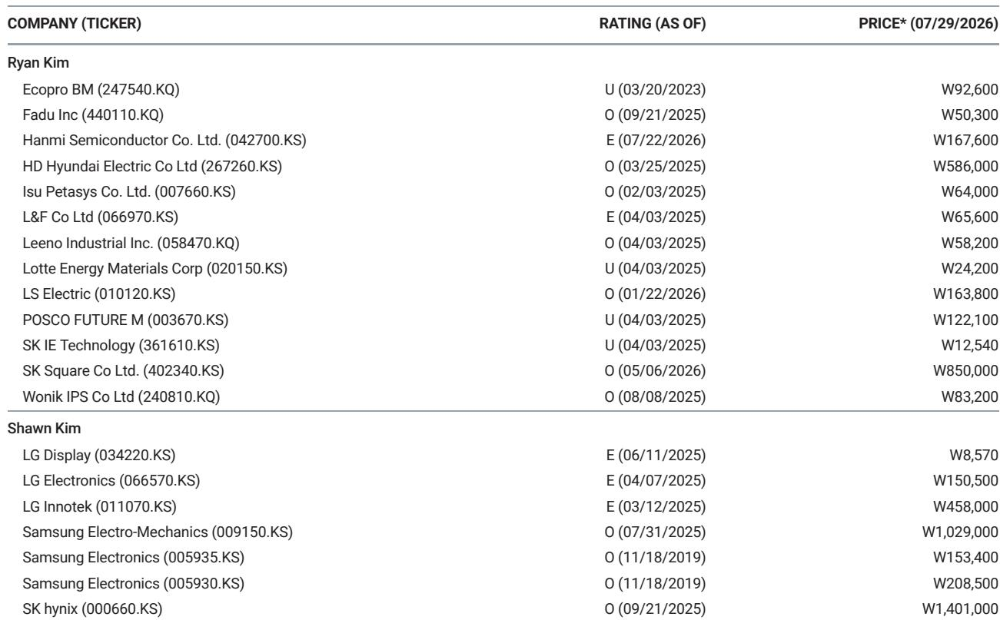
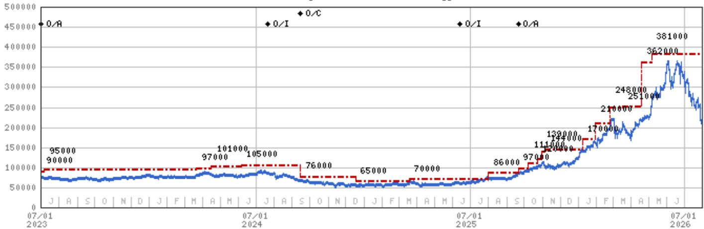
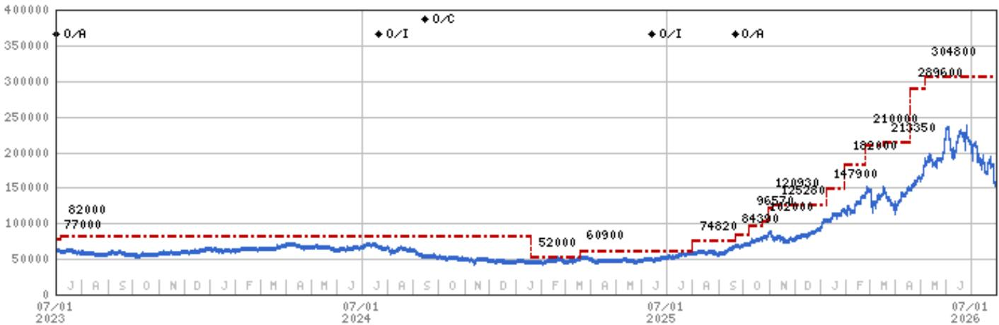

# 三星存储业务：长期协议框架下的价值重估

三星电子公布的第二季度营收达到172万亿韩元，同比增长130%，其中半导体销售增长357%，存储收入增长471%。这一增长的规模本身不如其代表的意义重要：公司已将周期性的商品业务转变为具有约束性长期协议、客户预付款和HBM4技术领先优势的合约型增长业务。当前市值约为2026年预期盈利的3.9倍，市场仍将三星视为过去的存储公司——其盈利峰值终将回归均值。这一框架已经过时。

战略转变在需求结构中清晰可见。管理层确认客户已进行大规模预付款，并持续请求追加长期协议，到2027年长期分配可能达到总存储产能的60%至70%。存储供应不再是通过价格出清的现货市场商品，而正在成为预先承诺的基础设施投入，类似于超大规模客户签订电力和定制芯片合同。当60%至70%的产能锁定在多年协议中时，剩余现货敞口拥有超额的定价权，因为边际卖方已从市场中消失。

本报告探讨三星叙事为何发生实质性变化、估值为何仍存在偏差，以及读者应如何应对这一落差。核心论点是，市场将三星视为波动性存储商品股、以3至5倍盈利的周期峰值倍数交易后随即回落的思维模式，已不再符合其业务的合约现实。这一影响超越三星本身：如果存储供应受到长期协议的结构性约束，整个半导体周期的波动性可能低于历史模式所显示的水平。

## 长期协议框架将存储从商品转变为预先承诺的基础设施投入

三星第二季度业绩中最具深远意义的发展并非营收数字本身，而是其背后的合约架构。管理层确认客户已进行大规模预付款，并持续请求追加长期协议。到2027年长期分配可能达到总存储产能的60%至70%，公司实际上已按协商价格预售了大部分未来产出，客户以现金预付以确保供应。

这在三个方面改变了存储的经济特性。首先，它消除了历史上压垮存储价格的库存周期。在现货市场中，当需求转弱时库存积压、价格下跌、制造商削减资本开支，形成了数十年来定义该行业的繁荣-萧条模式。当60%至70%的产能处于合约之下时，现货市场成为边际供应稀缺的剩余市场。即使AI需求放缓，合约量仍然承诺不变，剩余产能的现货价格应保持高位，因为最大买家已锁定其需求。

其次，预付款改变了资产负债表结构。客户在交付前支付现金意味着三星实际上利用客户资金为其产能扩张提供资金，减少了对债务或股权融资的需求。这是市场尚未充分认识的资本效率结构性改善。2026年自由现金流回报表现6.1%、2027年升至13.7%、2028年达20.9%，反映的不仅是强劲盈利，还有客户预付款从根本上改善的营运资本状况。

第三，长期协议框架创造了此前不存在的进入壁垒。新的存储进入者无法简单地建厂并在价格上竞争，因为最大客户已将其未来多年的需求承诺给三星及其竞争对手。需求的合约锁定比任何单一技术优势都更具持久性的竞争护城河，因为它阻止了新进入者规模化所需的需求侧验证。

二阶影响是存储变得更像公用事业或基础设施业务，而非周期性商品。盈利流更具可预测性，现金流更加可见，资本需求部分由客户提供资金。这应获得更高的估值倍数，而非市场当前给出的3.9倍盈利。

## HBM4先发地位确认技术领导力回归，路线图延伸优势

三星的HBM4领导地位是技术层面的证明，表明长期协议框架不仅是商业安排，更是真实产品优势的体现。HBM出货量预计在2026年第三季度增长两倍，HBM4预计明年贡献HBM总销售额的约60%，HBM4E样品已交付主要客户。公司不仅参与AI存储热潮，更在设定节奏。

HBM4E样品先于竞争对手交付的重要性不容低估。HBM4E是HBM4的下一代产品，在竞争对手之前将样品交到客户手中意味着三星正在定义客户将围绕其设计的性能基准。这是典型的先发优势：一旦客户围绕三星的HBM4E规格设计其加速器架构，转换成本将变得极高，客户将在后续世代中锁定三星。

技术领导地位也验证了管理层提到的代工业务成果。代工领域的先进节点成果并非独立于HBM领导地位，而是互补关系。信任三星HBM4E的客户更可能信任三星代工其他先进芯片，反之亦然。技术光环效应创造了市场尚未充分定价的交叉销售动力。

HBM路线图还延伸了优势的持续时间。HBM4明年贡献HBM销售额的60%并非单一季度现象，而是多年轨迹。HBM4E样品已在出货意味着下一代产品按计划推进，公司已证明能够连续执行产品世代而不出现延误。这是三星在先前周期中缺乏的执行信誉——当时它在HBM3上迟到并输给了SK海力士。

市场对三星技术领导力的怀疑一直是股价的持续折价因素。每个季度展示的HBM4和HBM4E进展都在削弱这一折价，累积效应应带来向市场给予技术领导者而非商品落后者倍数的重新定价。

## 资本开支纪律与客户资助扩张创造现金生成和资本回报的良性循环

三星2026年资本开支指引为60至70万亿韩元（基于总资本开支110万亿韩元减去研发），其揭示的公司资本配置理念值得关注。大部分投向DRAM和代工，这正是长期协议框架提供最大需求确定性的领域。公司并非在建设投机性产能，而是在建设已售出的产能。

资本效率改善在财务预测中清晰可见。净资产回报率预计2026年达到85.5%，据报告约为过去峰值水平的五倍。尽管拥有这一净资产回报率，市净率仅为2.1倍，意味着市场正在应用假设净资产回报率将崩溃的商品周期折价。但长期协议框架和HBM路线图表明，高净资产回报率的持续性优于以往周期。

自由现金流回报表现轨迹更具说服力。从2025年的2.5%，回报表现预计升至2026年的6.1%、2027年的13.7%和2028年的20.9%。20%的自由现金流回报表现意味着公司每年产生的现金相当于其市值的五分之一，这一水平应吸引收益导向型和价值型读者，但股价仍以折价交易，因为市场将盈利视为周期峰值。

2026年2.1%的股息率升至2028年的2.3%，并非主要吸引力，但它传递了市场尚未充分认可的资本回报承诺。自由现金流增速快于股息增速，派息率可持续，公司有余地在不压力资产负债表的情况下增加资本回报或启动回购。

良性循环清晰明了：客户预付款为资本开支提供资金，资本开支建设产能，产能产生盈利，盈利产生支持资本回报的自由现金流，资本回报吸引更多读者，读者降低资本成本，资本成本使未来资本开支更便宜。市场的商品周期折价通过假设盈利将崩溃来打破这一循环，但合约框架使这种崩溃越来越不可能。

## 估值折价反映的是上一周期的思维模式，而非当前业务结构

市场对三星的处理是估值框架滞后于商业模式变化的典型案例。以2026年预期盈利的3.9倍和账面价值的2.1倍交易，股价被定价为将回归历史均值的周期峰值。但历史均值是在不同的业务结构中形成的——那时存储是现货商品，技术领导地位是间歇性的。

折价不合理的证据不仅在于盈利数字，还在于这些盈利的构成。471%的存储收入增长并非价格飙升，而是合约化、预付、多年的量和价增长。85.5%的净资产回报率并非周期峰值，而是资本效率结构性改善的结果。2028年20.9%的自由现金流回报表现并非周期底部，而是已预售产能业务的稳态产出。

与过去周期峰值的比较具有启发性。此前周期峰值的市净率约为2.0倍。但本次周期峰值的盈利能力在净资产回报率基础上高出五倍，意味着市场对结构性更盈利的业务应用了相同的倍数。不对称性令人瞩目：市场愿意为85%净资产回报率的业务支付与17%净资产回报率业务相同的账面倍数。

52周区间374,500至67,500韩元揭示了市场的矛盾心态。股价已证明可以交易在370,000韩元以上，当前208,500韩元的价格较高点下跌44%，尽管业务自那时以来显著改善。市场已回吐周期高点的涨幅，而基本面却在改善，创造了长期协议框架和HBM领导地位应填补的估值缺口。

盈利修正同样值得关注。每股盈利轨迹从2025年的6,562韩元到2026年的53,985韩元、2027年的74,381韩元和2028年的74,499韩元，表明市场已接受盈利将结构性走高。问题在于为何估值倍数未扩展以反映这些盈利的更高质量和持续性。答案在于思维模式：市场将2028年74,499韩元的盈利视为2029年将下降的周期峰值，尽管长期协议框架表明这些盈利是合约化且经常性的。

## 读者评估存储周期与三星定位的决策框架

三星的情况为评估任何从商品向合约收入结构性转变的公司提供了模板。第一步是识别合约架构。公司多少产能已在长期协议下预售？收入中承诺部分与现货部分的比例如何？答案决定了盈利是周期性的还是结构性的。

第二步是通过客户锁定视角评估技术领导地位。HBM4E样品交付主要客户不仅是技术里程碑，更是创造转换成本的客户获取事件。要问的问题是公司的技术优势是否转化为锁定客户多代产品的设计胜利。如果是，技术领导地位的价值高于市场所赋予的。

第三步是评估资本效率改善。客户预付款为资本开支提供资金是资产负债表的结构性变化，而非一次性事件。问题是营运资本改善是否可持续，以及是否支持对盈利流给予更高倍数。

第四步是将当前估值与结构性盈利能力而非历史周期峰值进行比较。市场使用2.0倍账面倍数——这在商品周期峰值时是合适的——被错误应用于85%净资产回报率的业务。适当的倍数应反映净资产回报率的持续性，而非周期的历史峰值。

第五步是监测将表明论点变化的领先指标。对三星而言，这些指标是长期协议下产能的百分比、HBM4E量产出货的时点以及客户预付款的趋势。其中任何一项的下降都表明合约框架正在弱化，盈利能力将回归历史模式。

该框架适用于三星之外。任何能够展示从现货向合约收入转变、创造客户锁定的技术领导地位以及客户资助资本开支的公司，都应基于其结构性盈利能力而非历史周期模式进行评估。市场更新思维模式的速度缓慢，错价为及早识别结构性变化的读者创造了机会。

存储周期并未被消除，但已被削弱。长期协议框架并未消除需求破坏的风险，但将风险从存储制造商转移至客户——客户已为可能因AI需求不及预期而未被充分利用的产能预付了款项。然而风险并非对称：客户已预付，意味着三星已因承担风险而获得补偿，且客户有动力利用产能，因为它已为此付款。

最后的考虑因素是论点面临的风险。报告确定的关键下行风险包括产品和存储周期竞争（包括苹果和中国新智能手机竞争）以及盈利增长集中于半导体。这些风险是真实的，但它们是业务的风险，而非估值的风险。以3.9倍盈利交易，市场已定价了显著的负面结果，而合约框架表明正面结果比市场隐含概率更有可能。

该股并非简单的周期交易；它是市场过时思维模式与业务结构现实之间的套利。市场已将三星定价为长期协议框架和HBM领导地位使其越来越不可能出现的下行周期。机会在于在市场之前识别结构性转变。

*仅供参考。部分内容可能基于源材料由AI辅助生成、翻译、总结或编辑，可能包含遗漏或错误。请独立核实。本文不构成投资、法律、税务、会计或其他专业建议。*

仅供参考。部分内容可能基于源材料由AI辅助生成、翻译、总结或编辑，可能包含遗漏或错误。请独立核实。本文不构成投资、法律、税务、会计或其他专业建议。

