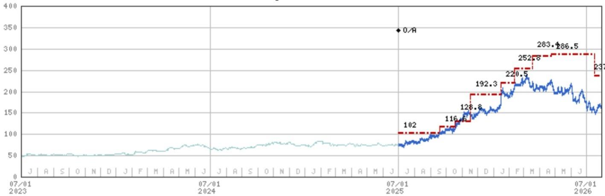

# MS：中国电力与可再生能源上海路演反馈

7月29日，MS发布上海路演反馈纪要，覆盖中国电力与可再生能源板块。报告最值得注意的判断是：受AI与出口逻辑驱动的电力设备公司报价自2026年初高点普遍回落超过50%，但资金并未离场，而是在不同子板块之间重新分配关注度。电网设备出口商思源电气与华明电力装备成为共识度最高的两个标的，而光纤、燃气轮机等前期热门方向则遭遇更多质疑。

这份纪要不是一份传统的深度报告，而是分析师与机构读者交流后的观察记录。它反映的是资金在板块大幅回调之后，正在用什么样的框架重新筛选标的。对于跟踪中国电力设备板块的读者，这份纪要的价值在于提供了当前市场分歧的具体位置。

## 1. 电网设备出口商获得最多共识，思源电气与华明估值回到20倍附近

报告显示，思源电气是本次路演中共识度最高的多头标的。2026年上半年新增订单保持稳健增长，产品结构持续改善。读者普遍预期，从三季度开始，受益于汇率不确定性减轻和产品组合优化，增长将重新加速。华明电力装备则吸引了另一批读者——部分此前偏空的读者原本预期二季度盈利零增长甚至负增长，但当前低于20倍2027年预期市盈率加上约4%的股息率，让不少资金认为估值已经具备吸引力。

> **KC评论：** 两家公司都处于约20倍2027年预期市盈率的估值区间，但市场对它们的预期差方向不同。思源电气是增长重新加速的共识，华明则是盈利预期已经足够低、估值具备保护。读者需要区分自己是在关注增长弹性还是在关注估值修复。

## 2. 光纤与燃气轮机遭遇更多质疑，AI基础设施链条情绪转弱

报告明确提到，读者对光纤的担忧最多，主要集中在新产能投放和竞争加剧。中天科技虽然报价大跌后已回到10倍2027年预期市盈率，低于其2026年重估前的水平，但读者对现有厂商及新进入者（如汉斯激光、合盛硅业）可能带来的产能不确定性仍持谨慎态度。燃气轮机则因为相对较高的估值，本次路演中兴趣明显偏低。

英流股份的情况值得单独说明。报告认为其报价回调主要由估值调整驱动，而非盈利下修。公司近期宣布的GEV产能扩张计划至2030年，可能对长期需求增长构成正面催化。但在约30倍2027年预期市盈率和AI基础设施板块情绪转弱的背景下，读者暂时不愿急于底部观察。

## 3. 防御性资产与低估值标的获得关注，水电与风电呈现不同逻辑

在AI链条之外，防御性资产重新进入视野。长江电力被视为AI主题之外的最佳防御标的之一，股息率超过3%，同时可能受益于厄尔尼诺现象——气候事件可能带来更强的来水，从而提升2027年发电量。龙源电力则处于低估值区间，当前市净率不足0.6倍，而历史低点约在0.4倍附近，报告认为其节奏变化空间有限。

大金重工的情况略有不同。其H股自IPO以来下跌超过40%，主要受二季度运营仍在调整以及欧盟海上风电订单进展缓慢导致的2026/27年盈利节奏变化预期影响。读者在等待中期业绩后的更好入场点，关注焦点集中在四季度可能的新订单以及估值水平。

> **KC评论：** 这份纪要最值得留意的不是单个公司的判断，而是资金在不同子板块之间切换的节奏。AI链条回调后，资金并没有整体撤离电力设备板块，而是转向估值更低的出口商、防御性的水电和低市净率的风电运营商。这种轮动本身说明，板块的整体叙事尚未被破坏，但市场对估值的容忍度明显下降。

## 4. 阳光电源仍在等待催化，市场需要更多可见性

阳光电源是本次路演中读者仍在等待更多可见性的标的。报告列出三个关键等待点：地缘政治不确定性、盈利增长拐点、新产品发布是否令人满意。当前估值看起来并不昂贵，但市场在等待催化剂出现。

这份纪要从侧面反映出当前中国电力设备板块的定价状态：经过一轮显著回调后，市场对高估值标的的容忍度下降，对盈利可见性和催化节点的要求提高。资金并非整体撤离，而是在寻找估值与基本面匹配度更高的位置重新入场。对于关注该板块的读者，思源电气与华明代表的出口链、长江电力代表的防御性资产、龙源电力代表的低估值风电，构成了当前市场分歧最小的三个观察坐标。

For informational purposes only. Portions may be generated,translated,summarized,or edited with AI assistance based on source materials and may contain omissions or errors. Please verify independently. This is not investment,legal,tax,accounting,or other professional advice.

For informational purposes only. Portions may be generated,translated,summarized,or edited with AI assistance based on source materials and may contain omissions or errors. Please verify independently. This is not investment,legal,tax,accounting,or other professional advice.

