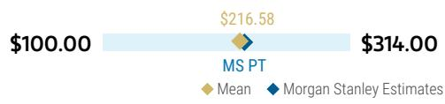
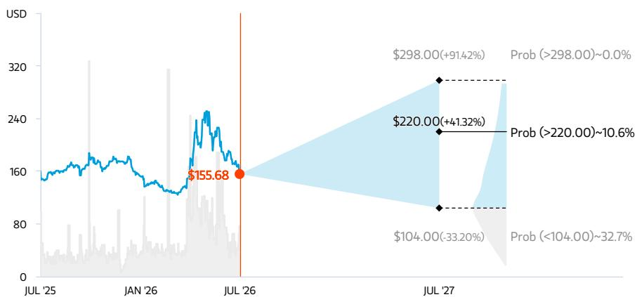
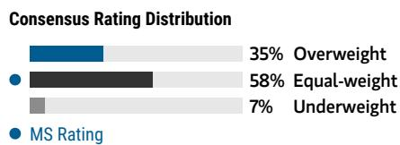
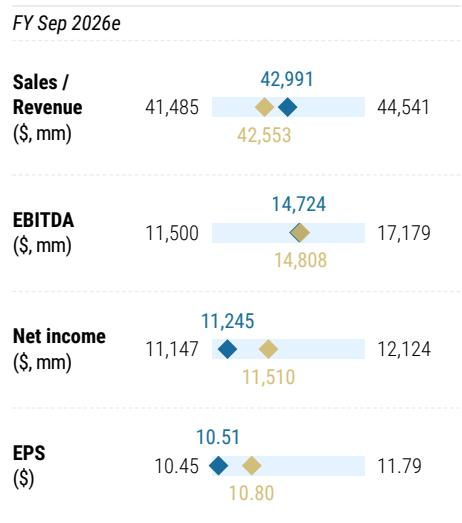
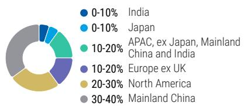

Qualcomm Inc. | North America

# 苹果业务调整加速公司多元化进程

<table><tr><td colspan="3">关键变化</td></tr><tr><td>Qualcomm Inc. (QCOM.O)</td><td>调整前</td><td>调整后</td></tr><tr><td>目标报价</td><td>$231.00</td><td>$220.00</td></tr><tr><td colspan="3">AlphaSignals 业绩反应</td></tr><tr><td>维持不变</td><td>— 符合预期</td><td>↓ 小幅下调</td></tr><tr><td>对核心观点的影响</td><td>财务表现与市场一致预期对比</td><td>未来12个月一致预期每股收益方向</td></tr></table>

来源：公司数据，MS

Qualcomm的多元化进程快于预期，随着苹果业务的调整，这一趋势正在加速。但转型并非一帆风顺：短期内利润率有所摊薄，执行层面仍存在不确定性。我们维持中性评级，认为当前风险与回报相对均衡。

## 核心要点

苹果业务：iPhone 18的份额低于此前预期的20%，加速了调制解调器业务的收缩，但QTL授权收入似乎仍然稳固。

毛利率：AI业务增长快于预期，但早期定制芯片的利润率较低，在商用产品规模化之前，对毛利形成一定影响。

汽车业务：年化收入从60亿美元提升至约70亿美元，进一步巩固了汽车业务作为Qualcomm近期较强多元化引擎的地位。

AI业务：2027财年50亿美元的目标具有里程碑意义，但执行和产品组合仍是关键，Qualcomm正在向更高价值的商用产品迈进。

■ 维持中性评级，目标报价调整至$220。

第三财季业绩整体符合预期，收入处于指引区间上沿。由于投入成本上升及高端手机芯片组合变化，毛利率仍是近期的主要关注点。九月季度的收入指引同样基本符合预期，但盈利略低于市场一致预期，主要受成本和产品组合因素影响；定价措施有望带来改善，但效果需要几个季度才能显现。

从苹果业务向AI业务的转型并非完全无缝衔接——但拥有一个规模庞大的AI市场作为多元化方向，无疑是有帮助的。Qualcomm在iPhone 18中的份额低于最初预期的20%——我们认为这是因为苹果不再采用毫米波版本——这带来了一定的增量影响。初期AI收入高于预期，但初始毛利率较低，因此整体毛利的下降幅度大于收入。

我们认为这一过程可能会有一些波折。初期的AI项目可能包含较少的Qualcomm设计元素，因此利润率较低，而商用产品要到明年才会开始放量。但AI市场的机会足够大，使得多元化逻辑比几个月前预期的更为坚实。

智能手机：安卓市场已见底，苹果业务影响更大，三星保持常态。上半年安卓相关的疲软被认为已基本过去，但存储短缺仍是一个挑战。Qualcomm更侧重的高端市场表现相对较好，压力主要集中在低端。与此同时，三星（由Shawn Kim覆盖）手机市场的份额已稳定在约70%的长期常态水平，而非2025年的较高水平。

关于苹果业务（由Erik Woodring覆盖），此前指引为Qualcomm将失去iPhone 18中80%的份额，我们认为这是基于毫米波版本继续由Qualcomm供应的假设，但经双方协商，这一数字有所降低。Qualcomm在iPhone 17中仍有业务，将持续到明年，届时苹果相关收入将降至最低，基本符合预期。积极的一面是，苹果授权收入看起来仍然稳固，正如管理层所言，2027年4月续约时，Qualcomm可能会面临一些挑战。

AI业务增长较快，但毛利率有所承压。AI业务在十二月季度将增长至约6亿美元，但利润率因此承压。我们认为初期AI产品可能属于较低利润率、较低价值的产品，明年将过渡到由Qualcomm完全开发的高利润率产品。这反映在明年的毛利率指引中。

汽车业务目标上调。汽车业务继续是Qualcomm的成功案例，公司已成为最大的汽车半导体供应商。公司表示汽车业务年化收入将达到70亿美元，高于此前60亿美元的目标。目前，汽车业务是Qualcomm最佳的多元化方向，尽管长期来看可能被AI机会超越。

季度详情：本季度收入为99.5亿美元（环比下降6.2%，同比下降4.0%），略高于市场预期的96.9亿美元和我们预估的96.7亿美元。分部门看，QCT收入为85亿美元（环比下降约6.3%，同比下降5.4%），QTL为13亿美元。非GAAP毛利率约为54.0%，低于市场预期的55.6%和我们预估的56.0%。每股收益为2.21美元，与市场预期的2.23美元和我们预估的2.18美元基本一致。

预估调整：对于2026日历年，我们现预计收入/毛利率/每股收益为410亿美元/53.7%/$9.19，此前为403亿美元/55.1%/$9.28。对于2027日历年，我们预计收入/毛利率/每股收益为473亿美元/52.0%/$10.88，此前为492亿美元/53.8%/$11.45。

对公司的看法：我们继续保持谨慎；虽然管理团队执行良好，但我们不会将AI渗透视为理所当然。分析师日上对明年AI业务的50亿美元预测超出了我们的预期，因此我们在分析师日后将评级从中性偏空上调至中性——50亿美元的多元化收入具有里程碑意义。但在AI领域建立高利润率的防御性地位需要时间，且考虑到AI处理器领域的领先公司估值倍数较低，我们认为其他领域有更好的风险回报。

话虽如此，对于有耐心的读者来说，这里可能存在不少期权价值，且公司过去在强劲执行和向其他市场多元化方面的历史确实增强了我们的信心。但我们维持中性评级。关于目标报价，我们下调了2027日历年MW每股收益（含股权激励）至$7.85。应用相同的28倍倍数，目标报价从$231下调至$220。

## 风险回报 – Qualcomm Inc. (QCOM.O)

关键边缘AI推动者，但智能手机和数据中心领域存在广泛的可能性

## 目标报价 $220.00

我们采用28倍（QCOM历史区间的中点）MW市盈率，基于2027日历年每股收益$7.85（含股权激励），我们认为新的数据中心收入正在抵消存储约束带来的智能手机周期影响。这大约是非GAAP每股收益$10.88的20倍。

## 一致预期目标报价分布

来源：Refinitiv，MS

## 风险回报图及期权隐含概率（12个月）

  
关键：— 历史表现 ● 当前报价 ◆ 目标报价

来源：Refinitiv，MS，MS机构股票部门。我们牛市、基准和熊市情景的概率是根据截至2026年7月29日期权市场的隐含波动率数据估算的。所有数字均为报价在三个月或一年时间内达到情景价格以上的近似风险中性概率。查看期权概率方法论说明

## 中性评级核心观点

\- 手机出货量可能受到存储短缺的影响，从低端开始，并随着时间推移变得更加普遍
- 汽车业务多元化表现强劲，新的数据中心项目近期看起来有前景，但长期仍需验证
- 数据中心AI机会显然巨大，即使取得一定成功也能对像Qualcomm这样的大公司产生影响，但达到临界规模也非常困难。我们正在密切关注相关进展。

  
来源：Refinitiv，MS

## 牛市情景

$298.00

## 34倍 2026日历年基准MW每股收益 $8.76

高端市场的敞口使QCOM免受大部分存储逆风影响。汽车、物联网和数据中心业务快速扩张，实现智能手机市场之外的多元化。

## 基准情景

$220.00

## 28倍 2027日历年MW每股收益 $7.85

虽然我们预计存储约束将带来智能手机周期的温和表现，但新的数据中心收入正在抵消不利因素。我们以其历史区间的中点进行估值。

## 熊市情景

## $104.00

## 20倍 2026日历年熊市MW每股收益 $5.21

存储约束比预期更严重，智能手机市场即使高端也承压。多元化故事未能展开。

## 风险回报 – Qualcomm Inc. (QCOM.O)

## 关键盈利输入

<table><tr><td>驱动因素</td><td>2025年9月</td><td>2026年9月e</td><td>2027年9月e</td><td>2028年9月e</td></tr><tr><td>GAAP收入（百万美元）</td><td>44,283</td><td>42,991</td><td>44,539</td><td>52,345</td></tr><tr><td>非GAAP毛利率（%）</td><td>55.9</td><td>54.2</td><td>52.2</td><td>52.7</td></tr><tr><td>非GAAP每股收益（美元）</td><td>12.05</td><td>10.51</td><td>10.10</td><td>12.38</td></tr><tr><td>库存（百万美元）</td><td>6,526</td><td>6,535</td><td>8,178</td><td>8,411</td></tr><tr><td>库存天数</td><td>122.3</td><td>121.2</td><td>140.3</td><td>124.0</td></tr></table>

MS预估 vs. 一致预期

## 投资驱动因素

\- 智能手机市场增长及Qualcomm在芯片组中的份额

• 超越手机的多元化收入（汽车与物联网）

## 全球收入分布

  
来源：MS预估 查看区域层级说明

## MS ALPHA模型

<table><tr><td>4/5最佳</td><td>24个月周期</td><td>3/5最高</td><td>3个月周期</td></tr></table>

来源：Refinitiv，FactSet，MS；1为最高偏好五分位，5为最低偏好五分位

## 目标报价/评级风险

## 上行风险

• 存储约束缓解速度快于预期

• 安卓市场更具韧性

• 苹果业务调整进程较慢

• 非手机业务扩张速度快于预期

## 下行风险

\- 智能手机存储逆风超预期

• 苹果自研芯片时间表提前

• 竞争对手份额提升

• 多元化故事未能展开

## 持仓情况

<table><tr><td>机构读者，主动占比</td><td>39.6%</td><td></td><td></td><td></td></tr><tr><td>对冲基金行业多空比</td><td>2.1倍</td><td></td><td></td><td></td></tr><tr><td>对冲基金行业净敞口</td><td>29.5%</td><td></td><td></td><td></td></tr></table>

◆ 均值 ◆ MS预估

Refinitiv；MSPB内容。包含与MSPB持有的部分对冲基金敞口。信息可能与更广泛的市场趋势不一致或无法反映。多空比 = 多头敞口 / 空头敞口。行业占净敞口百分比 = （特定行业：多头敞口 - 空头敞口）/（所有行业：多头敞口 - 空头敞口）。

来源：Refinitiv，MS

财务摘要

图表1：利润表摘要  
QCOM：截至2026年6月的季度概况

<table><tr><td colspan="9">利润表</td><td></td></tr><tr><td>季度业绩：</td><td colspan="3">实际</td><td>上季度</td><td>环比</td><td>去年同期</td><td>同比</td><td>一致预期</td><td>MSe</td></tr><tr><td>收入</td><td colspan="3">$9,947.0</td><td>$10,599.0</td><td>-6.2%</td><td>$10,365.0</td><td>-4.0%</td><td>$9,694.9</td><td>$9,671.2</td></tr><tr><td>毛利率</td><td colspan="3">54.0%</td><td>54.7%</td><td>-69个基点</td><td>56.2%</td><td>-221个基点</td><td>55.6%</td><td>56.0%</td></tr><tr><td>每股收益</td><td colspan="3">$2.21</td><td>$2.65</td><td>($0.44)</td><td>$2.77</td><td>($0.56)</td><td>$2.23</td><td>$2.18</td></tr><tr><td>下季度展望：</td><td>低</td><td>高</td><td>中点</td><td rowspan="3"></td><td></td><td></td><td></td><td></td><td></td></tr><tr><td>收入</td><td>$9,700.0</td><td>$10,500.0</td><td>$10,100.0</td><td>1.5%</td><td>$11,270.0</td><td>-10.4%</td><td>$10,068.7</td><td>$9,522.8</td></tr><tr><td>每股收益</td><td>$2.05</td><td>$2.25</td><td>$2.15</td><td>($0.06)</td><td>$3.02</td><td>($0.87)</td><td>$2.38</td><td>$2.10</td></tr></table>

来源：MS预估，FactSet，公司数据

图表2：利润表差异

<table><tr><td colspan="5">MW财务数据（不含一次性项目），百万美元，每股数据除外</td></tr><tr><td></td><td>报告F3Q26</td><td>MS预估F3Q26</td><td>差异：实际 vs. 预估</td><td>每股差异</td></tr><tr><td>收入</td><td>9,947.0</td><td>9,671.2</td><td>275.8</td><td>0.26</td></tr><tr><td>销售成本</td><td>4,604.0</td><td>4,275.2</td><td>328.8</td><td>(0.31)</td></tr><tr><td>毛利</td><td>5,343.0</td><td>5,396.0</td><td>(53.0)</td><td>(0.05)</td></tr><tr><td>毛利率%</td><td>53.7%</td><td>55.8%</td><td>-2.1%</td><td></td></tr><tr><td>研发</td><td>2,511.0</td><td>2,638.2</td><td>(127.2)</td><td>0.12</td></tr><tr><td>销售及管理费用</td><td>886.0</td><td>787.1</td><td>98.9</td><td>(0.09)</td></tr><tr><td>其他运营支出</td><td>0.0</td><td>0.0</td><td>0.0</td><td>不适用</td></tr><tr><td>总运营支出</td><td>3,397.0</td><td>3,425.3</td><td>(28.3)</td><td>0.03</td></tr><tr><td>运营利润</td><td>1,946.0</td><td>1,970.7</td><td>(24.7)</td><td>(0.02)</td></tr><tr><td>运营利润率%</td><td>19.6%</td><td>20.4%</td><td>-0.8%</td><td></td></tr><tr><td>税费</td><td>337.0</td><td>331.5</td><td>5.5</td><td>不适用</td></tr><tr><td>净利润</td><td>2,297.0</td><td>1,569.2</td><td>727.8</td><td>0.69</td></tr><tr><td>每股收益</td><td>$2.15</td><td>$1.48</td><td>$0.67</td><td>0.67</td></tr></table>

来源：公司数据，MS预估

图表5：QCOM：预计现金流量表

图表4：QCOM：预计资产负债表

## 预计财务报表

图表3：QCOM：预计利润表

来源：公司数据，MS预估  
来源：公司数据，MS预估  
来源：公司数据，MS预估

## 风险回报参考链接

1. 查看期权概率方法论说明 -

Options\_Probabilities\_Exhibit\_Link.pdf

2. 查看风险回报主题说明 - RR\_Themes\_Exhibit\_Link.pdf

3. 查看区域层级说明 - GEG\_Exhibit\_Link.pdf

4. 查看主题/敞口方法论说明 -

ESG\_Sustainable\_Solutions\_External\_Link.pdf

5. 查看HERS方法论说明 - ESG\_HERS\_External\_Link.pdf

## 披露部分

MS中的信息和观点由MS & Co. LLC和/或MS C.T.V.M. S.A.和/或MS Mexico, Casa de Bolsa, S.A. de C.V.和/或MS Canada Limited编制。本披露部分中使用的"MS"包括MS & Co. LLC、MS C.T.V.M. S.A.、MS Mexico, Casa de Bolsa, S.A. de C.V.、MS Canada Limited及其关联公司。

有关本报告涉及公司的重要披露、报价图表和股票评级历史，请访问MS披露网站 www.morganstanley.com/eqr/disclosures/webapp/generalresearch，或联系您的投资代表或MS，地址：1585 Broadway, (Attention: Research Management), New York, NY, 10036 USA。

有关本研究报告引用的任何建议、评级或目标报价相关的估值方法和风险，请联系客户支持团队：美国/加拿大 +1 800 303-2495；香港 +852 2848-5999；拉丁美洲 +1 718 754-5444（美国）；伦敦 +44 (0)20-7425-8169；新加坡 +65 6834-6860；悉尼 +61 (0)2-9770-1505；东京 +81 (0)3-6836-9000。或者您可以联系您的投资代表或MS，地址：1585 Broadway, (Attention: Research Management), New York, NY 10036 USA。

## 分析师认证

以下分析师特此证明，他们对本报告讨论的公司及其证券的观点准确反映了他们的个人观点，并且他们未收到也不会收到直接或间接的补偿以换取表达本报告中的具体建议或观点：Shane Brett；Joseph Moore；Mason Wayne。

## 全球研究冲突管理政策

MS已按照我们的冲突管理政策发布，该政策可在 www.morganstanley.com/institutional/research/conflictpolicies 获取。该政策的葡萄牙语版本可在 www.morganstanley.com.br 找到。

## 关于标的公司的重要监管披露

截至2026年6月30日，MS实益拥有MS覆盖的以下公司普通股1%或以上：Advanced Micro Devices, Aeva Technologies Inc, Allegro Microsystems Inc, Ambarella Inc, Analog Devices Inc., Arm Holdings plc, Astera Labs Inc, Broadcom Inc., Cadence Design Systems Inc, Cerebras Systems, Intel Corporation, IonQ Inc, Marvell Technology Group Ltd, Microchip Technology Inc., Micron Technology Inc., NVIDIA Corp., NXP Semiconductor NV, ON Semiconductor Corp., Qorvo Inc, Qualcomm Inc., SanDisk Corporation., Semtech Corp., Silicon Laboratories Inc., Skyworks Solutions Inc, Synopsys Inc., Texas Instruments, Wolfspeed, INC.

在过去12个月内，MS管理或共同管理了Aeva Technologies Inc, Broadcom Inc., Cerebras Systems, GlobalFoundries Inc, Intel Corporation, NVIDIA Corp., NXP Semiconductor NV, ON Semiconductor Corp., Quantinuum, Semtech Corp.的公开发行（或144A发行）。

在过去12个月内，MS已从Advanced Micro Devices, Aeva Technologies Inc, Allegro Microsystems Inc, Amkor Technology Inc, Analog Devices Inc., Broadcom Inc., Cerebras Systems, Intel Corporation, IonQ Inc, Micron Technology Inc., NVIDIA Corp., NXP Semiconductor NV, ON Semiconductor Corp., Quantinuum, Semtech Corp., Texas Instruments获得投资银行服务报酬。

在未来3个月内，MS预计将寻求从Advanced Micro Devices, Aeva Technologies Inc, Allegro Microsystems Inc, Ambarella Inc, Amkor Technology Inc, Analog Devices Inc., Arm Holdings plc, Astera Labs Inc, Broadcom Inc., Cadence Design Systems Inc, Cerebras Systems, GlobalFoundries Inc, Intel Corporation, IonQ Inc, Marvell Technology Group Ltd, Microchip Technology Inc., Micron Technology Inc., Navitas Semiconductor Corp, NVIDIA Corp., NXP Semiconductor NV, ON Semiconductor Corp., Qualcomm Inc., Quantinuum, SanDisk Corporation., Semtech Corp., Silicon Laboratories Inc., Skyworks Solutions Inc, Synopsys Inc., Texas Instruments, Wolfspeed, INC.获得投资银行服务报酬。在过去12个月内，MS已从Advanced Micro Devices, Allegro Microsystems Inc, Ambarella Inc, Amkor Technology Inc, Analog Devices Inc., Broadcom Inc., Cadence Design Systems Inc, Cerebras Systems, GlobalFoundries Inc, Intel Corporation, Marvell Technology Group Ltd, Microchip Technology Inc., Micron Technology Inc., NVIDIA Corp., NXP Semiconductor NV, ON Semiconductor Corp., Qorvo Inc, Qualcomm Inc., Semtech Corp., Silicon Laboratories Inc., Synopsys Inc., Texas Instruments获得投资银行服务以外的产品和服务报酬。

在过去12个月内，MS已提供或正在向以下公司提供投资银行服务，或与以下公司存在投资银行客户关系：Advanced Micro Devices, Aeva Technologies Inc, Allegro Microsystems Inc, Ambarella Inc, Amkor Technology Inc, Analog Devices Inc., Arm Holdings plc, Astera Labs Inc, Broadcom Inc., Cadence Design Systems Inc, Cerebras Systems, GlobalFoundries Inc, Intel Corporation, IonQ Inc, Marvell Technology Group Ltd, Microchip Technology Inc., Micron Technology Inc., Navitas Semiconductor Corp, NVIDIA Corp., NXP Semiconductor NV, ON Semiconductor Corp., Qualcomm Inc., Quantinuum, SanDisk Corporation., Semtech Corp., Silicon Laboratories Inc., Skyworks Solutions Inc, Synopsys Inc., Texas Instruments, Wolfspeed, INC.

在过去12个月内，MS已提供或正在提供非投资银行、证券相关服务，和/或过去已签订服务协议或与以下公司存在客户关系：Advanced Micro Devices, Allegro Microsystems Inc, Ambarella Inc, Amkor Technology Inc, Analog Devices Inc., Broadcom Inc., Cadence Design Systems Inc, Cerebras Systems, GlobalFoundries Inc, Intel Corporation, IonQ Inc, Marvell Technology Group Ltd, Microchip Technology Inc., Micron Technology Inc., NVIDIA Corp., NXP Semiconductor NV, ON Semiconductor Corp., Qorvo Inc, Qualcomm Inc., SanDisk Corporation., Semtech Corp., Silicon Laboratories Inc., Synopsys Inc., Texas Instruments, Wolfspeed, INC.

MS & Co. LLC为Aeva Technologies Inc, Ambarella Inc的证券提供做市服务。

主要负责编制MS的股票研究分析师或策略师的薪酬基于多种因素，包括研究质量、读者客户反馈、选股能力、竞争因素、公司收入和整体投资银行收入。股票研究分析师或策略师的薪酬不与MS进行的投资银行或资本市场交易或特定交易台的盈利能力或收入挂钩。

MS及其关联公司与MS覆盖的公司/工具开展业务，包括做市、提供流动性、基金管理、商业银行、信贷扩展、投资服务和投资银行。MS以本金方式向客户销售和购买MS覆盖公司的证券/工具。MS可能持有本报告讨论的公司债务或工具的头寸。MS交易或可能以本金方式交易债务研究报告主题的债务证券（或相关衍生品）。
上述某些披露也是为了遵守非美国司法管辖区的适用法规。

## 股票评级

MS使用相对评级体系，包括增持、中性、未评级或减持（见下方定义）。MS不对我们覆盖的股票分配买入、持有或报告评级。增持、中性、未评级和减持不等同于买入、持有和卖出。读者应仔细阅读MS中使用的所有评级定义。此外，由于MS包含关于分析师观点的更完整信息，读者应仔细阅读完整的MS，而不应仅从评级推断内容。在任何情况下，评级（或研究）都不应被用作或依赖为研究交流。读者买卖股票的决定应取决于个人情况（如读者现有持仓）和其他考虑因素。

## 全球股票评级分布

（截至2026年6月30日）

以下描述的股票评级适用于MS的基础股票研究，不适用于公司制作的信债研究。

仅为披露目的（根据FINRA要求），我们在增持、中性、未评级和减持评级旁边包含了买入、持有和卖出的类别标题。MS不对我们覆盖的股票分配买入、持有或报告评级。增持、中性、未评级和减持不等同于买入、持有和卖出，但代表建议的相对权重（见下方定义）。为满足监管要求，我们将增持（我们最正面的股票评级）对应为买入建议；将中性
