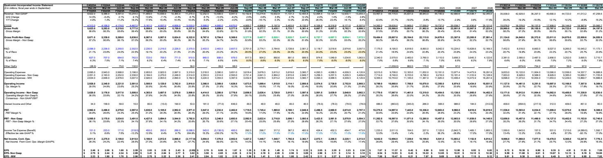
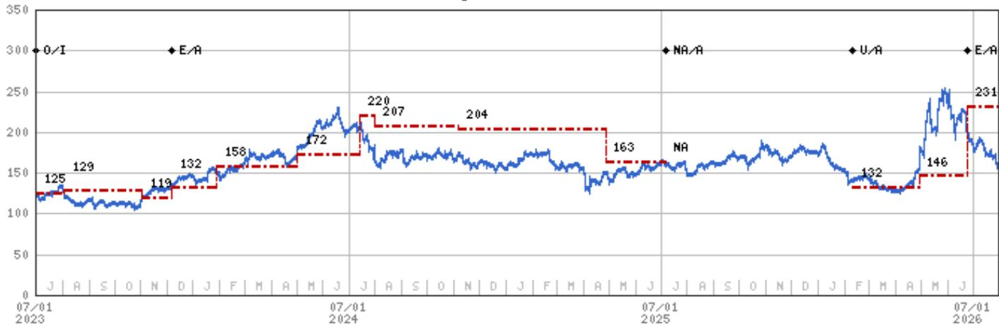
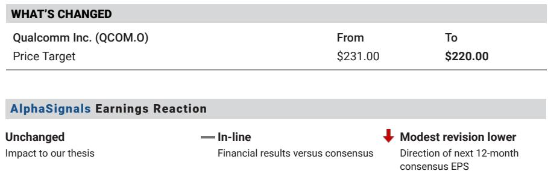

# 高通的多元化转型是真实的，但转型成本已体现在利润率中

高通第三财季的业绩呈现出一个矛盾：营收超出预期，达到99.5亿美元，而市场一致预期为96.9亿美元；但非GAAP毛利率却降至54.0%，低于市场预期的55.6%和分析师自己估计的56.0%。市场正在见证公司执行其历史上最重要的战略转型——加速摆脱对单一客户的依赖，转向人工智能领域——但这一转型的财务表现比表面叙事所呈现的更为复杂。

核心问题很直接。高通的多元化进展快于预期，但转型并非一帆风顺。初期AI收入比预期来得更早，但其毛利率低于它们所替代的传统手机业务。同时，与苹果相关的调制解调器业务收缩也在加速，iPhone 18中的份额预计将低于公司最初设定的20%。结果是，公司在战略层面赢得认可，却在利润率层面面临挑战，至少在短期内如此。

现在是将叙事与数据分开审视的时刻。2027财年50亿美元AI收入目标确实具有改变公司定位的意义，足以重新定义高通作为一家企业的性质。但通往这一目标的路径需要穿越毛利率承压、执行风险上升以及智能手机周期受内存短缺影响的复杂阶段。风险与回报相对平衡，这也是维持中性评级的原因。有耐心的观察者可能会看到回报，但未来几个季度将检验多元化故事能否在财务数据的检验中站得住脚。

## 苹果业务退出速度快于预期，利润率结构正在承担成本

苹果合作关系十多年来一直是高通调制解调器业务的核心特征，其逐步退出始终是这一转型过程中的核心挑战。最新数据显示退出正在加速。高通在iPhone 18中的份额预计将低于最初预测的20%，这一调整源于苹果决定不再采用毫米波版本，这从设备中移除了高通剩余内容的重要部分。

这里的细节值得关注。最初的指引假设高通在iPhone 18上大约保留20%的份额，毫米波版本经双方协商继续由高通供应。现在这一数字有所下降。苹果的推进速度快于预期，高通来自苹果的QCT收入明年将变得非常有限，大体符合预期但时间线有所提前。iPhone 17的内容将持续到明年，提供一个过渡，但结构性下降趋势比三个月前更加清晰。

一个积极的抵消因素是QTL授权收入流似乎保持稳定。管理层一直表示授权业务将在调制解调器转型中存活下来，2027年4月的续约临近，目前没有出现可能预示重大挑战的披露。这不是一个无关紧要的问题。授权业务是高通模式中利润率最高的部分，它的保留为公司的盈利能力提供了一个基础支撑，即使芯片业务正在进行转型。问题在于增长集中在芯片业务，而利润率压力也集中在那里。

## AI收入增长快于预期，但早期成果是利润率最低的部分

AI业务的推进是高通故事中最重要的进展，数据确实令人印象深刻。AI收入预计在12月季度达到约6亿美元，这一速度表明2027财年50亿美元的目标是可以实现的。分析师日预测超出了大多数人的预期，也是评级上调的催化剂。逻辑是合理的：50亿美元的多元化收入足以改变公司的盈利轨迹，即使对于高通这样规模的公司也是如此。

复杂之处在于，初期的AI成果并非最高价值的产品。第一波AI收入来自利润率较低、差异化程度较低的产品，预计高通全面开发的商用芯片将在明年推出。这种顺序在毛利率指引中可见。公司预计2027财年毛利率约为52%，低于此前估计的53.8%，分析师自己的模型现在显示营收为473亿美元，毛利率为52.0%，而此前为492亿美元和53.8%。

战略含义令人不安但很重要。高通正在以较低利润率的产品进入AI市场以建立立足点，这些早期成果的毛利润贡献低于收入数字所暗示的水平。公司本质上是在用利润率换取市场地位，如果商用产品明年成功推出，这是一个合理的策略，但也创造了一个脆弱性窗口。如果高利润率产品出现延迟，公司的盈利能力将低于收入轨迹所暗示的水平。

毛利率压力不仅仅是AI现象。9月季度的指引在营收方面大体符合预期，但每股收益略低于共识，成本和产品组合压力持续影响QCT利润率。高通最集中的高端手机层级表现相对强劲，但低端市场表现较弱，内存短缺造成的投入成本压力无法完全通过定价来抵消。管理层表示定价措施将有所帮助，但效果需要几个季度才能反映在财务数据中。

## 汽车业务已成为稳定的多元化引擎，但不是AI大奖

在AI热潮和苹果业务退出的关注中，汽车业务已悄然成为高通最可靠的多元化故事。公司现在预计汽车业务年化收入将达到70亿美元，高于此前60亿美元的目标。高通已成为最大的汽车半导体供应商，这一地位在十年前是不可想象的，也验证了公司利用其调制解调器和计算知识产权进入相邻市场的能力。

汽车业务是近期最好的多元化引擎，因为它是真实的、可衡量的、且持续增长的。退出率目标增加10亿美元不是预测，而是对当前轨迹的陈述。这种证据支持了更广泛的多元化论点，因为它表明高通在专注于某个市场时可以在智能手机之外获胜。汽车业务的成功也为AI推进提供了模板，展示了公司可以进入新市场、快速扩展并建立可防御的地位。

长期问题是汽车业务是否会被AI机会所超越。70亿美元的年化收入是有意义的，但2027财年50亿美元的AI目标更大且增长更快。AI市场是一个万亿美元级别的机会，即使获得适度的份额对高通来说也将是变革性的。汽车业务是概念验证，但AI才是大奖。挑战在于这两个业务的利润率特征不同，而AI的利润率目前正面临压力。

## 智能手机基本盘趋于稳定，但内存短缺带来新的风险层

智能手机业务仍然是高通模式的基础，最新数据点显示出喜忧参半的局面。中国安卓市场上半年的疲软已基本过去，高端层级表现相对强劲。疲软主要集中在低端市场，高通在该领域的敞口较小。三星合作关系已稳定在约70%的份额，这是长期运行水平，而2025年的数字更高。

新的风险是内存短缺。分析师的论点明确指出，手机出货量可能受到严重内存短缺的压力，从低端开始，随着年份推进变得更加普遍。这是一个供给侧约束，高通无法通过定价来摆脱，因为它不是需求或竞争动态的函数。内存短缺影响整个手机生态系统，即使在高通最集中的高端层级也会对出货量造成压力。

内存问题值得与苹果退出和AI动态分开来看，因为它是不同类型的风险。苹果转型是结构性的、可预测的；AI推进是战略性的、可能具有变革性；内存短缺是周期性的、外生的。这是一种可以在不改变长期论点的情况下压缩盈利的风险，这就是为什么分析师的基本假设是智能手机周期较为平淡。乐观假设高端市场敞口保护高通免受大部分内存逆风影响，而悲观假设短缺比预期更严重，甚至影响高端市场。

## 处于转型与转型成本之间的决策框架

对于试图理解高通当前状况的观察者来说，分析挑战在于区分战略转型与财务转型成本。两者同时发生，市场正在正确地为它们之间的张力定价。以下框架旨在帮助按公司自身条件评估，而不是通过AI叙事或苹果衰退的单一视角。

第一个变量是AI利润率改善的速度。初期AI收入利润率较低，但明年推出的商用产品应带来更高利润率。关键问题是利润率轨迹是否与收入轨迹同步改善，还是AI市场的竞争动态迫使高通在更长时间内接受较低利润率。分析师的模型显示毛利率从2026财年的54.2%下降到2027财年的52.0%，然后在2028财年恢复到52.7%。恢复是真实的但幅度有限，取决于商用产品按计划执行。

第二个变量是内存短缺的严重程度。分析师的基本假设是智能手机周期较为平淡，但悲观假设短缺比预期更严重，甚至影响高端市场。乐观假设高端市场敞口保护高通免受大部分逆风影响。内存短缺是外生的，但其对高通盈利的影响将取决于高端市场能保护多少。这是一个无法精确建模的风险，只能设定范围。

第三个变量是QTL授权收入流的保持。2027年4月的续约是下一个主要催化剂，没有负面披露是一个积极信号。如果授权收入流保持完整，它为盈利提供了一个独立于芯片业务的基础支撑。如果受到挑战，公司的盈利能力将下降。当前估值约为7.85倍企业价值/EBITDA（含股权激励），大约是非GAAP每股收益10.88美元的20倍，对于具有高通这样选择权的公司来说是一个合理的倍数。

决策框架不在于高通的多元化论点是否真实。它是真实的。50亿美元的AI目标、70亿美元的汽车年化收入以及授权收入流的保持都支持这一论点。问题在于转型成本是否能被控制到足以保护盈利轨迹。分析师的回答是平衡的。当前股价较52周高点259.92美元有一定距离。股价反映了对执行的期待，但不是对完美的期待。

有耐心的观察者在这里拥有选择权。强劲的执行历史和成功多元化进入相邻市场的记录确实增强了信心。汽车业务的成功证明高通可以在智能手机之外获胜。AI机会足够大，即使适度的份额也将是变革性的。但AI处理器领域的领先者交易倍数较低，近期利润率压力是真实的。未来几个季度将决定转型成本是需要跨越的低谷，还是新商业模式的结构性特征。

本季度的证据是混合的。营收超预期，利润率未达预期，指引表明情况将继续。苹果退出在加速，AI推进快于预期，汽车业务在交付。市场保持谨慎是正确的，中性评级反映了风险的平衡。对于愿意看穿转型成本的观察者来说，选择权是真实的。对于那些需要看到利润率改善才相信多元化故事的人来说，等待可能会得到回报，但需要耐心。

*仅供参考。部分内容可能基于源材料由AI辅助生成、翻译、总结或编辑，可能包含遗漏或错误。请独立核实。本文不构成投资、法律、税务、会计或其他专业建议。*

仅供参考。部分内容可能基于源材料由AI辅助生成、翻译、总结或编辑，可能包含遗漏或错误。请独立核实。本文不构成投资、法律、税务、会计或其他专业建议。

