July 29, 2026 11:50 PM GMT

Yageo Corp. | Asia Pacific

# MLCC需求增强，行业景气度提升

## AlphaSignals 业绩解读

强化我们的判断
对核心判断的影响

— 符合预期
业绩与市场一致预期对比 — 基本不变
未来12个月一致预期方向

资料来源：公司数据，MS

管理层对终端需求的信心较三个月前增强，主要受MLCC行业供需格局趋紧、订单出货比提升（目前为2.2倍）以及长期协议洽谈等因素支撑，带动产能利用率提升和价格环境改善。维持增持评级。

## 关键要点

三季度指引：营收环比温和增长，毛利率和营业利润率环比小幅提升——符合我们的预期（但偏保守）。

订单出货比已从1倍以上提升至2.2倍。

\- 客户正就长期协议进行洽谈，以确保长期供应稳定。

■ 管理层认同高容值MLCC需求正使行业供应趋紧。

■ 二季度末渠道库存整体持续下降。

三季度营收和利润率指引均符合我们的预期：管理层预计三季度营收环比“温和”增长，我们理解为中至高个位数增长。增长动力预计来自出货量增加和价格改善，若成本继续上升，价格可能进一步调整。当我们询问指引是否保守时，管理层未予否认，表明这代表一个合理的基准情形，且存在上行空间。盈利能力方面，管理层预计毛利率和营业利润率环比“小幅”改善，我们理解为0-3%的环比增长。

## 管理层对终端需求的信心较三个月前增强：

国巨预计三季度标准品和高端品产能利用率均将超过90%，高于二季度的80%以上。管理层表示，过去两三个月需求明显增强，整体订单出货比从2026年一季度财报电话会议时的“1倍以上”升至2.2倍。客户也开始与国巨讨论长期协议以确保被动元件供应，进一步印证了需求的持续性。此外，管理层认同我们的观点，即AI相关需求将使MLCC供应趋紧，并认为国巨在受益于这一趋势方面具备优势。

维持增持评级，目标价为新台币1,465元。对应2028年预期市盈率约31倍；但PEG仅为0.85倍。我们看好国巨的规模优势、覆盖所有被动元件的广泛产品组合，以及对行业景气度回升的杠杆效应。

MS TAIWAN LIMITED+

Howard Kao

股票分析师
Howard.Kao@morganstanley.com +886 2 2730-2989

Irene Yen
研究助理
Irene.Yen@morganstanley.com +886 2 2730-2869

MS ASIA LIMITED+

Andy Meng, CFA
股票分析师
Andy.Meng@morganstanley.com

+852 2239-7689

Asia Summer School 2026

## 国巨 (2327.TW, 2327 TT)

大中华区科技硬件 | 台湾

<table><tr><td>股票评级</td><td>增持</td></tr><tr><td>行业观点</td><td>中性</td></tr><tr><td>目标价</td><td>新台币1,465元</td></tr><tr><td>目标价上行/下行空间 (%)</td><td>189</td></tr><tr><td>股价，收盘价 (2026年7月29日)</td><td>新台币507元</td></tr><tr><td>52周区间</td><td>新台币1,220-129.5元</td></tr><tr><td>流通股数，摊薄后 (百万股)</td><td>1,997</td></tr><tr><td>市值，当前 (百万新台币)</td><td>1,012,410</td></tr><tr><td>企业价值，当前 (百万新台币)</td><td>1,029,149</td></tr><tr><td>日均成交额 (百万新台币)</td><td>16,409</td></tr></table>

<table><tr><td>财年截至</td><td>12/25</td><td>12/26e</td><td>12/27e</td><td>12/28e</td></tr><tr><td>每股收益 (新台币)**</td><td>11.51</td><td>20.21</td><td>34.24</td><td>46.86</td></tr><tr><td>此前每股收益 (新台币)**</td><td>-</td><td>20.11</td><td>34.23</td><td>46.87</td></tr><tr><td>每股收益 (新台币)§</td><td>11.61</td><td>19.16</td><td>30.44</td><td>43.75</td></tr><tr><td>营收，净额 (百万新台币)</td><td>132,930</td><td>182,769</td><td>251,501</td><td>306,659</td></tr><tr><td>EBITDA (百万新台币)</td><td>39,635</td><td>60,058</td><td>97,086</td><td>130,091</td></tr><tr><td>ModelWare净利润 (百万新台币)</td><td>23,634</td><td>41,505</td><td>70,311</td><td>96,236</td></tr><tr><td>市盈率</td><td>20.1</td><td>25.1</td><td>14.8</td><td>10.8</td></tr><tr><td>市净率</td><td>2.7</td><td>4.8</td><td>4.0</td><td>3.3</td></tr><tr><td>RNOA (%)</td><td>12.0</td><td>20.7</td><td>36.9</td><td>52.0</td></tr><tr><td>ROE (%)</td><td>14.5</td><td>23.9</td><td>32.3</td><td>36.6</td></tr><tr><td>EV/EBITDA</td><td>12.4</td><td>16.5</td><td>9.7</td><td>6.8</td></tr><tr><td>股息率 (%)</td><td>2.2</td><td>1.2</td><td>2.4</td><td>4.1</td></tr><tr><td>FCF回报表现 (%)*</td><td>6.6</td><td>4.6</td><td>7.2</td><td>9.3</td></tr><tr><td>杠杆率 (期末) (%)</td><td>9.6</td><td>(15.7)</td><td>(31.6)</td><td>(43.4)</td></tr></table>

除非另有说明，所有指标均基于MS ModelWare框架
\*\* = 基于一致预期方法
§ = 一致预期数据由Refinitiv Estimates提供
e = MS预测

MS与报告中涉及的公司有业务往来或寻求业务往来。因此，读者应注意，该公司可能存在影响MS客观性的利益冲突。读者应将MS仅作为其决策的单一因素。

## 分析师认证及其他重要披露，请参阅本报告末尾的披露部分。

+= 非美国关联公司雇佣的分析师未在FINRA注册，可能不是会员的关联人员，且可能不受FINRA关于与标的公司沟通、公开露面及持有研究分析师账户中证券交易的限制。

## 图表

图表1：各产品季度销售额，2024年一季度-2026年二季度

<table><tr><td rowspan="13"></td><td rowspan="13">1Q24</td><td rowspan="13">2Q24</td><td rowspan="13">3Q24</td><td rowspan="13">4Q24</td><td rowspan="13">1Q25</td><td rowspan="9">2Q25</td><td rowspan="9">3Q25</td><td rowspan="9">4Q25</td><td rowspan="9">1Q26</td><td rowspan="9">2Q26</td></tr><tr></tr><tr></tr><tr></tr><tr></tr><tr></tr><tr></tr><tr></tr><tr></tr><tr><td>13%</td><td>18%</td><td>19%</td><td>18.4%</td><td>19.6%</td></tr><tr><td>16%</td><td>18%</td><td>19%</td><td>19.2%</td><td>19.1%</td></tr><tr><td>13%</td><td>14%</td><td>14%</td><td>13.7%</td><td>14.3%</td></tr><tr><td>20%</td><td>16%</td><td>18%</td><td>19%</td><td>19.1%</td></tr></table>

MLCC 芯片电阻 钽电容 磁性元件（含无线与电源） 传感器 其他元件  
资料来源：公司数据，MS

图表2：各产品年度销售额，2018-25年  
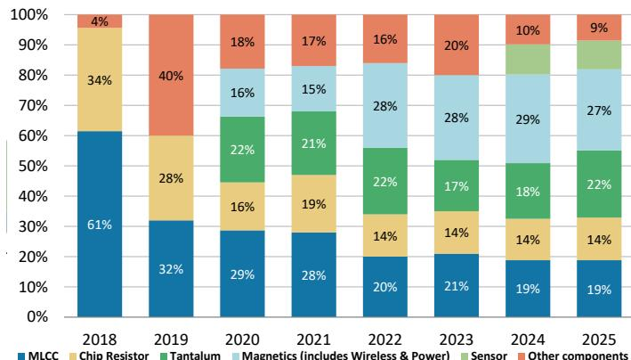  
资料来源：公司数据，MS

图表3：各渠道季度销售额，2024年一季度-2026年二季度  
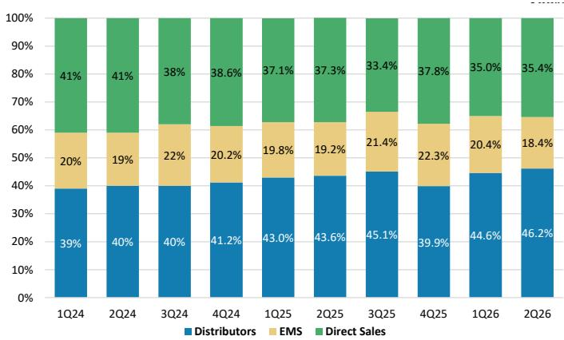  
资料来源：公司数据，MS

图表4：各渠道年度销售额，2018-25年  
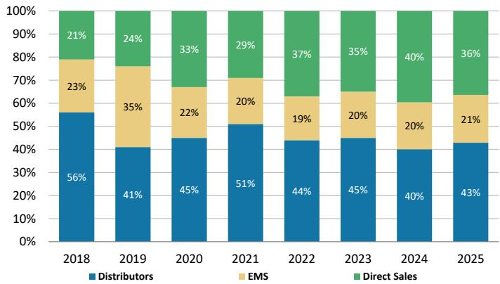  
资料来源：公司数据，MS

图表5：各分部季度销售额，2024年一季度-2026年二季度  
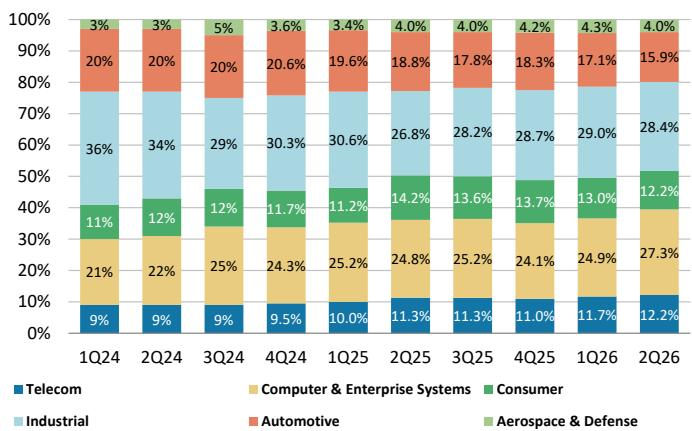  
资料来源：公司数据，MS

图表6：各分部年度销售额，2018-25年  
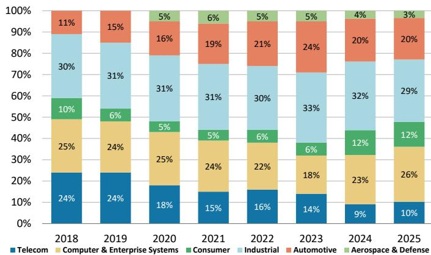  
资料来源：公司数据，MS

## 2026年二季度业绩回顾

二季度毛利率和营业利润率略低于我们及市场预期...

• 营收为新台币445亿元（环比+16%，同比+36%）。

\- 毛利率为38.5%（环比+40个基点，同比+290个基点），较我们预期低30个基点，较市场预期低60个基点。管理层将二季度毛利率改善归因于价格环境改善、产品组合优化和产能利用率提升，但部分被投入成本上升和标准品需求所抵消。

\- 营业利润率为26.4%（环比+120个基点，同比+490个基点），较我们预期低40个基点，较市场预期低20个基点。

...但税费略低于我们及市场预期...

...因此净利润较我们预期和市场预期高3%——为新台币94亿元（环比+18%，同比+88%），每股收益为新台币4.59元。

图表7：2026年二季度业绩

<table><tr><td rowspan="2">百万新台币</td><td colspan="7">业绩</td></tr><tr><td>实际</td><td>环比</td><td>同比</td><td>MS预测</td><td>差异</td><td>一致预期</td><td>差异</td></tr><tr><td>净销售额</td><td>44,456</td><td>16%</td><td>36%</td><td>44,165</td><td>1%</td><td>43,058</td><td>3%</td></tr><tr><td>销售成本</td><td>-27,340</td><td>16%</td><td>29%</td><td>-27,017</td><td>1%</td><td>-26,206</td><td>4%</td></tr><tr><td>毛利润</td><td>17,116</td><td>18%</td><td>47%</td><td>17,148</td><td>0%</td><td>16,853</td><td>2%</td></tr><tr><td>营业费用</td><td>-5,368</td><td>9%</td><td>16%</td><td>-5,290</td><td>1%</td><td>-5,376</td><td>0%</td></tr><tr><td>营业利润</td><td>11,749</td><td>22%</td><td>67%</td><td>11,858</td><td>-1%</td><td>11,476</td><td>2%</td></tr><tr><td>非营业利润</td><td>474</td><td>-33%</td><td>NM</td><td>700</td><td>-32%</td><td>537</td><td>-12%</td></tr><tr><td>税前利润</td><td>12,222</td><td>18%</td><td>74%</td><td>12,558</td><td>-3%</td><td>12,013</td><td>2%</td></tr><tr><td>所得税</td><td>-2,767</td><td>21%</td><td>37%</td><td>-3,391</td><td>-18%</td><td>-2,837</td><td>-2%</td></tr><tr><td>净利润</td><td>9,418</td><td>18%</td><td>88%</td><td>9,131</td><td>3%</td><td>9,176</td><td>3%</td></tr><tr><td>每股收益 (新台币)</td><td>4.59</td><td>18%</td><td>88%</td><td>4.45</td><td>3%</td><td>4.47</td><td>3%</td></tr><tr><td>利润率 (%)</td><td></td><td>百分点</td><td>百分点</td><td></td><td>百分点</td><td></td><td>百分点</td></tr><tr><td>毛利率</td><td>38.5%</td><td>0.4</td><td>2.9</td><td>38.8%</td><td>-0.3</td><td>39.1%</td><td>-0.6</td></tr><tr><td>营业利润率</td><td>26.4%</td><td>1.2</td><td>4.9</td><td>26.8%</td><td>-0.4</td><td>26.7%</td><td>-0.2</td></tr><tr><td>税前利润率</td><td>27.5%</td><td>0.4</td><td>6.0</td><td>28.4%</td><td>-0.9</td><td>27.9%</td><td>-0.4</td></tr><tr><td>净利润率</td><td>21.2%</td><td>0.2</td><td>5.9</td><td>20.7%</td><td>0.5</td><td>21.3%</td><td>-0.1</td></tr></table>

资料来源：公司数据，Visible Alpha，MS预测

## 预测调整

我们更新模型以反映2026年二季度业绩及财报电话会议后管理层的最新指引。我们对2026-28年的每股收益预测基本保持不变。

图表8：预测调整

<table><tr><td rowspan="2">百万新台币</td><td colspan="3">2026年盈利预测</td><td colspan="3">2027年盈利预测</td><td colspan="3">2028年盈利预测</td></tr><tr><td>新</td><td>旧</td><td>差异</td><td>新</td><td>旧</td><td>差异</td><td>新</td><td>旧</td><td>差异</td></tr><tr><td>净销售额</td><td>182,769</td><td>180,835</td><td>1%</td><td>251,501</td><td>249,369</td><td>1%</td><td>306,659</td><td>305,345</td><td>0%</td></tr><tr><td>销售成本</td><td>-110,474</td><td>-108,778</td><td>2%</td><td>-138,732</td><td>-137,335</td><td>1%</td><td>-157,970</td><td>-157,706</td><td>0%</td></tr><tr><td>毛利润</td><td>72,295</td><td>72,058</td><td>0%</td><td>112,769</td><td>112,034</td><td>1%</td><td>148,688</td><td>147,639</td><td>1%</td></tr><tr><td>营业费用</td><td>-21,706</td><td>-21,255</td><td>2%</td><td>-24,845</td><td>-24,136</td><td>3%</td><td>-27,463</td><td>-26,406</td><td>4%</td></tr><tr><td>营业利润</td><td>50,589</td><td>50,803</td><td>0%</td><td>87,924</td><td>87,898</td><td>0%</td><td>121,225</td><td>121,233</td><td>0%</td></tr><tr><td>非营业利润</td><td>2,722</td><td>2,949</td><td>-8%</td><td>3,425</td><td>3,425</td><td>0%</td><td>3,844</td><td>3,844</td><td>0%</td></tr><tr><td>税前利润</td><td>53,311</td><td>53,751</td><td>-1%</td><td>91,349</td><td>91,323</td><td>0%</td><td>125,069</td><td>125,077</td><td>0%</td></tr><tr><td>所得税</td><td>-11,660</td><td>-12,305</td><td>-5%</td><td>-20,891</td><td>-20,887</td><td>0%</td><td>-28,687</td><td>-28,688</td><td>0%</td></tr><tr><td>净利润</td><td>41,505</td><td>41,299</td><td>0%</td><td>70,311</td><td>70,290</td><td>0%</td><td>96,236</td><td>96,242</td><td>0%</td></tr><tr><td>每股收益 (新台币)</td><td>20.21</td><td>20.11</td><td>0%</td><td>34.24</td><td>34.23</td><td>0%</td><td>46.86</td><td>46.87</td><td>0%</td></tr><tr><td>利润率 (%)</td><td></td><td></td><td>百分点</td><td></td><td></td><td>百分点</td><td></td><td></td><td>百分点</td></tr><tr><td>毛利率</td><td>39.6%</td><td>39.8%</td><td>-0.3</td><td>44.8%</td><td>39.5%</td><td>5.3</td><td>48.5%</td><td>48.4%</td><td>0.1</td></tr><tr><td>营业利润率</td><td>27.7%</td><td>28.1%</td><td>-0.4</td><td>35.0%</td><td>27.0%</td><td>8.0</td><td>39.5%</td><td>39.7%</td><td>-0.2</td></tr><tr><td>税前利润率</td><td>29.2%</td><td>29.7%</td><td>-0.6</td><td>36.3%</td><td>29.0%</td><td>7.4</td><td>40.8%</td><td>41.0%</td><td>-0.2</td></tr><tr><td>净利润率</td><td>22.7%</td><td>22.8%</td><td>-0.1</td><td>28.0%</td><td>22.2%</td><td>5.8</td><td>31.4%</td><td>31.5%</td><td>-0.1</td></tr></table>

资料来源：MS (e) 预测。

图表9：MS预测 vs. 一致预期

<table><tr><td rowspan="2">国巨</td><td colspan="3">MSe</td><td colspan="3">一致预期</td><td colspan="3">差异</td></tr><tr><td>2026</td><td>2027</td><td>2028</td><td>2026</td><td>2027</td><td>2028</td><td>2026</td><td>2027</td><td>2028</td></tr><tr><td>营收</td><td>182,769</td><td>251,501</td><td>306,659</td><td>179,544</td><td>237,982</td><td>292,942</td><td>2%</td><td>6%</td><td>5%</td></tr><tr><td>毛利率</td><td>39.6%</td><td>44.8%</td><td>48.5%</td><td>39.6%</td><td>44.2%</td><td>48.0%</td><td>-0.1%</td><td>0.6%</td><td>0.4%</td></tr><tr><td>营业利润率</td><td>27.7%</td><td>35.0%</td><td>39.5%</td><td>27.3%</td><td>33.0%</td><td>37.0%</td><td>0.4%</td><td>1.9%</td><td>2.5%</td></tr><tr><td>净利润</td><td>41,505</td><td>70,311</td><td>96,236</td><td>39,608</td><td>62,757</td><td>86,433</td><td>5%</td><td>12%</td><td>11%</td></tr><tr><td>每股收益</td><td>20.21</td><td>34.24</td><td>46.86</td><td>19.29</td><td>30.56</td><td>42.09</td><td>5%</td><td>12%</td><td>11%</td></tr></table>

资料来源：Visible Alpha，MS预测。

## 目标价讨论与估值方法

我们维持12个月目标价新台币1,465元：我们的目标价是基准情形价值，源自剩余收益估值模型。与我们覆盖的其他科技硬件公司分析类似，我们认为该方法通过考虑股权成本，能提供最准确的公司价值。

我们的关键假设均未改变，包括：

• 股权成本7.8%：

• 无风险利率1.0%（10年期台湾公债回报表现）；

• 股权风险溢价6.8%；

\- Beta系数1.1；

• 中期增长率16%；

• 永续增长率3%。

我们的目标价对应2027年预期市盈率43倍和2028年预期市盈率31倍。这高于其五年历史区间（8倍至18倍），我们认为考虑到公司向全球整体解决方案提供商的长期转型故事（从被动元件拓展至主动元件），这一估值是合理的。此外，与全球被动元件同行相比，我们认为国巨的估值仍具吸引力，其ROE和利润率更高，而市盈率低于日本同行（后者平均市盈率在30倍以上）。

我们的乐观和悲观情景价值也保持不变，分别为新台币2,075元和685元。

图表10：剩余收益模型

<table><tr><td></td><td>2026E</td><td>2027E</td><td>2028E</td><td>2029E</td><td>2030E</td><td>2031E</td><td>2032E</td><td>2033E</td><td>2034E</td><td>2035E</td><td>2036E</td></tr><tr><td>总权益</td><td>217,937</td><td>262,598</td><td>315,863</td><td>363,288</td><td>418,301</td><td>482,116</td><td>556,141</td><td>642,011</td><td>741,619</td><td>857,165</td><td>955,841</td></tr><tr><td>净利润</td><td>41,505</td><td>70,311</td><td>96,236</td><td>111,633</td><td>129,495</td><td>150,214</td><td>174,248</td><td>202,128</td><td>234,468</td><td>271,983</td><td>280,143</td></tr><tr><td>净资产回报表现</td><td>21.2%</td><td>29.3%</td><td>33.3%</td><td>32.9%</td><td>33.1%</td><td>33.4%</td><td>33.6%</td><td>33.7%</td><td>33.9%</td><td>34.0%</td><td>30.9%</td></tr><tr><td>Beta</td><td>1.0</td><td>1.0</td><td>1.0</td><td>1.0</td><td>1.0</td><td>1.0</td><td>1.0</td><td>1.0</td><td>1.0</td><td>1.0</td><td>1.0</td></tr><tr><td>股权风险溢价 (Rm-Rf)</td><td>6.8%</td><td>6.8%</td><td>6.8%</td><td>6.8%</td><td>6.8%</td><td>6.8%</td><td>6.8%</td><td>6.8%</td><td>6.8%</td><td>6.8%</td><td>6.8%</td></tr><tr><td>无风险利率 (Rf)</td><td>1.0%</td><td>1.0%</td><td>1.0%</td><td>1.0%</td><td>1.0%</td><td>1.0%</td><td>1.0%</td><td>1.0%</td><td>1.0%</td><td>1.0%</td><td>1.0%</td></tr><tr><td>股权成本</td><td>7.8%</td><td>7.8%</td><td>7.8%</td><td>7.8%</td><td>7.8%</td><td>7.8%</td><td>7.8%</td><td>7.8%</td><td>7.8%</td><td>7.8%</td><td>7.8%</td></tr><tr><td>剩余收益</td><td>23,349</td><td>46,864</td><td>66,997</td><td>79,327</td><td>92,189</td><td>107,108</td><td>124,412</td><td>144,485</td><td>167,769</td><td>194,777</td><td>198,379</td></tr><tr><td>利差</td><td>13.4%</td><td>21.5%</td><td>25.5%</td><td>25.1%</td><td>25.4%</td><td>25.6%</td><td>25.8%</td><td>26.0%</td><td>26.1%</td><td>26.3%</td><td>23.1%</td></tr><tr><td>期初权益资本</td><td>217,937</td><td></td><td></td><td></td><td></td><td></td><td></td><td></td><td></td><td></td><td></td></tr><tr><td>预测期现值</td><td>757,371</td><td></td><td></td><td></td><td></td><td></td><td></td><td></td><td></td><td></td><td></td></tr><tr><td>永续价值现值</td><td>2,033,064</td><td></td><td></td><td></td><td></td><td></td><td></td><td></td><td></td><td></td><td></td></tr><tr><td>股权价值</td><td>3,008,372</td><td></td><td></td><td></td><td></td><td></td><td></td><td></td><td></td><td></td><td></td></tr><tr><td>股数</td><td>2,054</td><td></td><td></td><td></td><td></td><td></td><td></td><td></td><td></td><td></td><td></td></tr><tr><td>预测价格</td><td>1,465.0</td><td></td><td></td><td></td><td></td><td></td><td></td><td></td><td></td><td></td><td></td></tr><tr><td>隐含2027年市盈率</td><td>43x</td><td></td><td></td><td></td><td></td><td></td><td></td><td></td><td></td><td></td><td></td></tr></table>

资料来源：MS (E) 预测。

图表11：国巨市盈率  
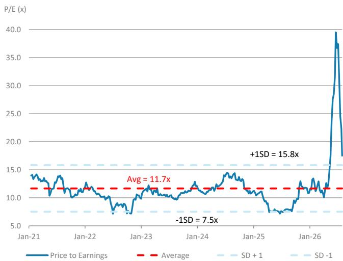  
资料来源：TEJ，MS。

图表12：国巨市净率  
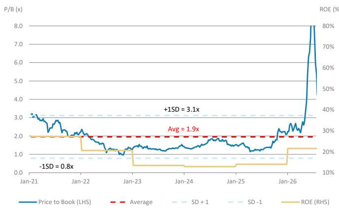  
资料来源：TEJ，MS。

图表13：MLCC同行营业利润率  
营业利润率趋势 vs. 日本/韩国被动元件供应商  
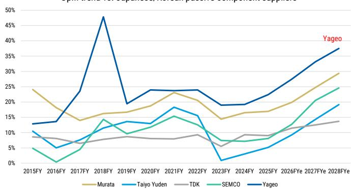  
资料来源：Visible Alpha。

图表14：2027年预期市盈率 vs. ROE  
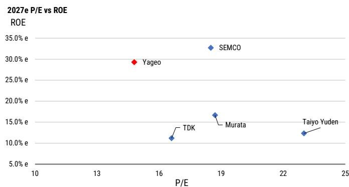  
资料来源：MS预测。

## 风险回报 – 国巨 (2327.TW)

需求增强，价格有望上行 - 维持增持

## 目标价 新台币1,465元

基准情形，多阶段剩余收益估值模型。关键假设：股权成本7.8%（无风险利率1%，股权风险溢价6.8%，Beta系数1.1），中期增长率16%，永续增长率3%。

一致预期目标价分布

资料来源：Refinitiv，MS

新台币650元

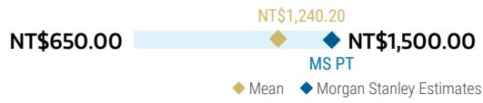

## 风险回报图

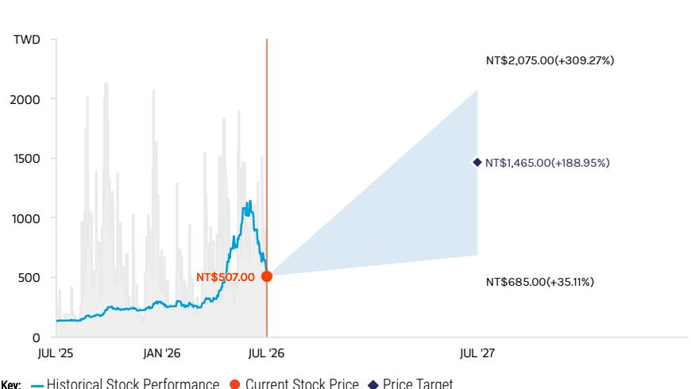  
关键：— 历史表现 ● 当前价格 ◆ 目标价  
资料来源：Refinitiv，MS

## 增持逻辑

\- 市场担忧日本和韩国领先MLCC供应商将更多产能转向高端产品，导致中低端产品供应不足。
- 2018年周期的相同逻辑再次出现。
- 产能利用率提升，供应商预期中低端产品将提价。分销商和ODM均在建立库存。
- AI需求增长，钽电容价格下半年可能进一步上涨。
- 所有这些因素应有助于支持估值重估。

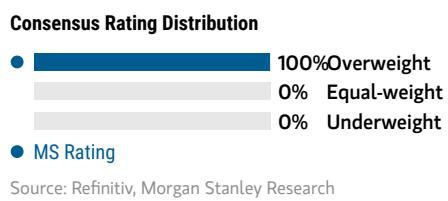  
资料来源：Refinitiv，MS

## 风险回报主题

<table><tr><td>电动汽车：</td><td>正面</td></tr><tr><td>自身改善：</td><td>正面</td></tr><tr><td>特殊情形：</td><td>正面</td></tr><tr><td colspan="2">在此查看风险回报主题说明</td></tr></table>

## 乐观情形

## 2028年预期市盈率44倍

新台币2,075元

2027-28年需求增长持续超预期：1) 需求显著改善，国巨在高端和标准产品上均获得定价权。2) 国巨在AI领域取得实质性进展，市场份额显著提升。3) 国巨采取更多并购举措以进一步拓宽产品组合。4) 严重供应不足导致价格持续上涨，
