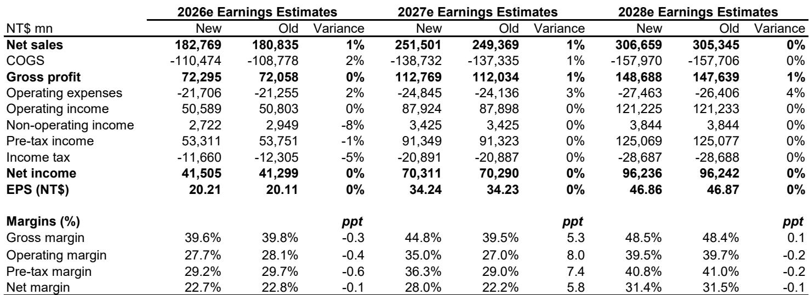
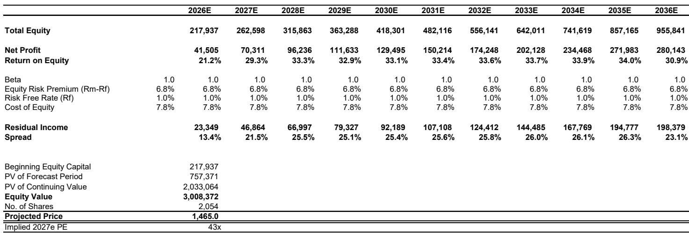
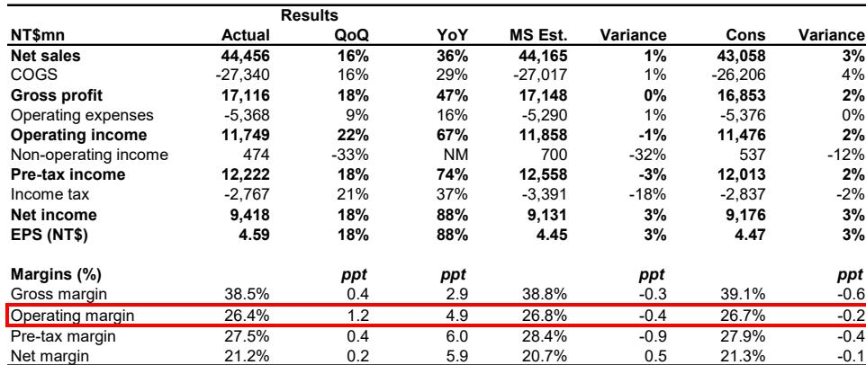

# MLCC供需格局转变：国巨订单出货比升至2.2倍，被动元件行业迎来结构性变化

国巨作为全球规模领先的被动元件制造商，近期发布的第二季度财报在数字上符合预期，但战略意义更为深远。营收达到445亿新台币，环比增长16%，同比增长36%；净利润同比增长88%至94亿新台币。然而，更值得关注的是管理层披露的订单出货比从第一季度的“1倍以上”跃升至当前的2.2倍，客户已开始主动洽谈长期供应协议以确保被动元件供应。这并非单纯的周期性回升，而是供需关系的结构性转变。

这一变化的时机值得关注。过去两年，多层陶瓷电容（MLCC）行业一直在消化过剩产能，价格承压，分销商不愿积累库存。这一阶段正在结束。目前渠道库存整体处于低位，标准品和高端产品的产能利用率均将突破90%，管理层也明确表示与AI相关的需求正在收紧MLCC供应。库存出清、产能利用率上升以及客户寻求长期供应承诺，共同构成了一个三个月前尚不存在的定价环境。市场参与者关注的重点已不再是周期是否反转，而是这一趋势能持续多久、哪些企业能更好地把握机遇。

本文分析当前周期与以往MLCC上行周期的差异、2.2倍订单出货比对定价能力的信号意义，以及如何在更广泛的被动元件产业格局中理解国巨的盈利轨迹。

## 订单出货比一个季度内弹性较高以上，显示客户从等待降价转向争取供应

国巨财报电话会议中最具信息量的数据点，是订单出货比在一个季度内从“1倍以上”升至2.2倍。订单出货比高于1.0意味着订单增速超过出货增速，而2.2倍则是一个相当高的水平，表明客户下单速度是出货速度的两倍以上。这不是渐进式改善，而是需求可见度的阶跃式变化。

管理层对需求状况的描述值得仔细解读。他们表示“过去两到三个月需求显著增强”，这与AI服务器建设以及电力输送系统对高容值MLCC需求的时点相吻合。客户开始主动洽谈长期供应协议，这本身就是一种行为转变。在买方市场中，客户倾向于现货采购并在供应商之间比价；而在卖方市场中，客户则寻求合同承诺以保障供应。这一转变的方向揭示了当前哪一方拥有更大的议价空间。

2.2倍的订单出货比也为收入可见度提供了参考。在这一订单水平下，国巨近期的产能已基本排满，制约因素从需求转向产能和利用率。这正是管理层预计第三季度标准品和高端产品产能利用率将超过90%（第二季度为80%以上）的原因。从80%提升至90%的产能利用率带来的经营杠杆效应显著，因为固定成本被更大的产出规模摊薄，增量产出将以较高的边际贡献率转化为毛利。

## AI需求不仅增加MLCC用量，更推动产品结构向供应更紧张的高容值产品倾斜

管理层关于AI相关需求正在收紧MLCC供应的表态，值得比财报电话会议中的简要提及更深入的关注。其机制不仅在于AI服务器使用更多MLCC（虽然确实如此），更重要的影响在于AI服务器供电架构需要高容值、高电压的MLCC，这些产品的制造难度远高于智能手机和消费电子产品中使用的通用型产品。

高容值MLCC需要更多层数、更薄的介电材料和更严格的工艺控制。良率曲线更陡峭，产能集中在少数供应商手中。当AI需求拉动这一细分市场时，供给端的响应比通用MLCC更慢，因为扩产不仅需要资本投入，还需要无法快速复制的工艺积累。这正是管理层表示高容MLCC需求正在收紧整体MLCC供应的原因。高端市场的紧张会传导至更广泛的市场，因为制造商会将产能配置到利润最高、战略最重要的产品上。

国巨在此的定位有其独特性。近年来公司从被动元件制造商向整体解决方案提供商转型，拓展主动元件业务，构建了涵盖MLCC、芯片电阻、钽电容、磁性元件和传感器的更广泛产品组合。这种广度在AI驱动的周期中尤为重要，因为AI服务器的物料清单同时涉及多个被动元件品类。能够将MLCC与其他被动元件捆绑供应的厂商，在采购份额和定价能力上具有单一品类供应商无法比拟的优势。

## 管理层保守指引背后，市场一致预期仍在追赶周期动能

国巨预计第三季度营收环比“温和”增长（分析师解读为中到高个位数增长），毛利率和营业利润率“小幅”改善（解读为环比增长0-3%）。当被问及这一指引是否保守时，管理层并未否认。这是一个有意义的信号。

这一模式对周期性行业的观察者而言并不陌生。经历过多次下行周期的管理团队，往往在上行周期初期倾向于保守指引，因为此前曾因过度承诺而付出代价。2.2倍的订单出货比、长期协议洽谈以及产能利用率走势，都表明实际结果可能落在指引区间上沿或更高。分析师报告将指引解读为“合理基准情形且存在上行空间”，与此判断一致。

盈利预测也反映了同样的情况。分析师在财报发布后基本维持2026-2028年每股盈余预测不变，分别为20.21、34.24和46.86新台币。但分析师的预测分别比市场一致预期高出5%、12%和11%。这一差距表明更广泛的市场尚未充分计入周期动能。2026年一致预期每股盈余19.29新台币，对定价能力和产能利用率的假设比分析师的20.21新台币更为谨慎，且这一分歧在2027年和2028年随周期推进而扩大。

营收预测也呈现类似格局。分析师预计2027年营收为2515亿新台币，而一致预期为2380亿新台币，差距为6%。到2028年，差距为5%。这些差异并非微不足道，它们反映了对上行周期持续时长以及产能利用率向95%左右推进时国巨能保留多少定价能力的不同假设。

## 估值讨论已从周期是否真实转向盈利可持续性，PEG视角提供参考框架

从表面看，当前估值并不便宜，尤其是对照该股五年历史市盈率区间8倍至18倍。但分析师通过PEG视角的框架改变了计算方式。以2026-2028年每股盈余从20.21增长至46.86新台币、复合年增长率超过50%计算，PEG比率为0.85倍，表明相对于增长轨迹，当前估值实际上并不算高。

估值问题本质上关乎可持续性。如果MLCC周期遵循以往上行周期的模式，峰值盈利不会无限期持续，在周期转折时以高倍数买入峰值盈利的读者将面临估值回调。但分析师的论点是，国巨向整体解决方案提供商的转型改变了盈利质量。公司正从被动元件向主动元件拓展，扩大可服务市场，构建一个比以往周期更少依赖MLCC商品周期的业务。

剩余收益模型采用3%的永续增长率和7.8%的股权成本。这些假设意味着市场需要为一个能够维持十年以上双位数增长的公司买单，而不仅仅是为当前的上行周期。这是一个不同于“MLCC周期”的研究逻辑，而是关于结构性转型的命题。

与日本被动元件同行的比较也具有参考意义。尽管国巨的净资产回报表现和利润率更高，但其市盈率低于平均30倍以上的日本同行。分析师预计2028年净资产回报表现为36.6%、净利率为31.4%，这将使国巨跻身整个科技硬件行业盈利能力较强的公司之列。如果这些数字得到验证，当前估值并不算高，反而是折价的。

## 被动元件读者的观察框架：以产能利用率、订单出货比和长期协议为周期持续性的领先指标

对于围绕MLCC周期进行布局的读者，财报提供了一组清晰的领先指标。第一个是产能利用率。当产能利用率低于80%时，定价能力较弱，利润率扩张有限。当突破90%时（如国巨第三季度的预期），经营杠杆开始显现，任何增量需求都会以较高比例转化为利润。从80%到90%的产能利用率转变是拐点。

第二个指标是订单出货比。比率高于1.5倍表明客户在需求之前提前下单，这可能反映真实的需求强度，也可能存在重复下单的情况。2.2倍的水平引发了一个问题：是否有部分客户同时在多家供应商处下单以确保供应，这会虚增表面需求。这是一个需要关注的风险，但长期协议洽谈提供了平衡。当客户愿意签署长期协议时，他们所做的承诺已超越现货市场的对冲行为。

第三个指标是定价行为。管理层提到如果成本继续上升，可能进一步调整价格，这表明定价权已转向供应方。在供应收紧的周期中，定价能力的第一个信号是能够转嫁成本上升；第二个信号是能够将价格提升至成本上升之上，从而扩大利润率；第三个信号是能够锁定多年期定价协议，为周期持续时间提供可见性。

由此形成的观察框架较为清晰：应关注产能利用率高、订单出货比上升、有长期协议洽谈迹象的被动元件供应商；对产能利用率低于80%、订单出货比接近1.0、无明显定价能力的供应商则应保持谨慎。周期在行业内并非均匀分布，随着上行周期推进，领先者与落后者之间的差距将扩大。

国巨第二季度的财报提供了该公司处于所有三项指标有利一侧的证据：产能利用率将突破90%，订单出货比已弹性较高至2.2倍，客户正主动洽谈长期协议。盈利预测在上升，基于PEG的估值合理，转型故事为盈利质量提供了支撑。周期是真实的，国巨有望获得超越其份额的增长。

关键问题已不再是MLCC周期是否已经反转——证据已经明确。问题在于这一周期能持续多久，以及当前的盈利能力是成为新的基准还是暂时的峰值。2.2倍的订单出货比、长期协议洽谈以及AI驱动的高容值产品需求，都指向一个由结构性需求而非单纯补库存驱动的周期。这一区别正是本次上行周期与以往的不同之处。

---

*仅供参考。部分内容可能基于原始材料经AI辅助生成、翻译、摘要或编辑，可能存在遗漏或错误。请独立核实。本文不构成投资、法律、税务、会计或其他专业建议。*
