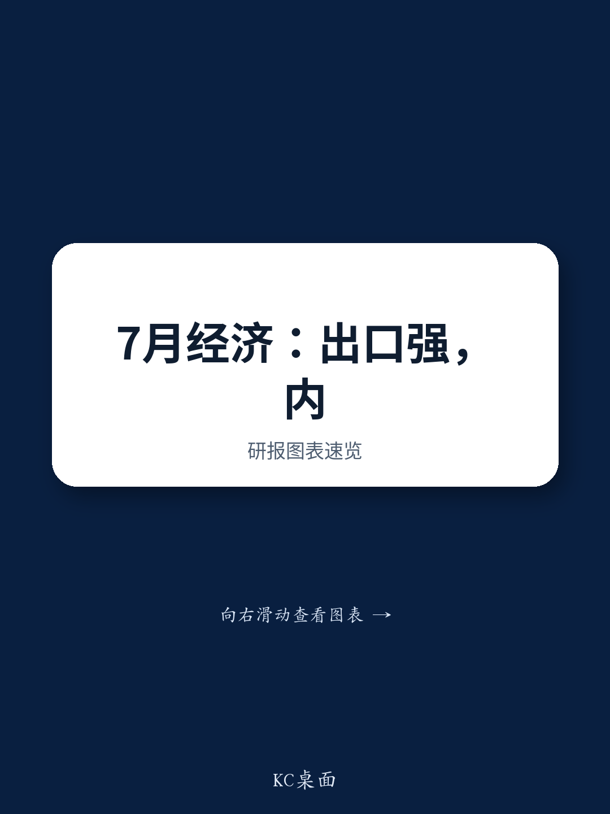

# 七月数据观察：出口动能与城市分化格局持续显现

疫后复苏进程始终呈现结构性差异，而即将公布的七月数据将进一步印证这一分化特征。二季度实际GDP增速为疫后阶段较低读数，六月活动数据显示出口活跃与内需偏弱形成鲜明对比。某全球研究机构的前瞻报告指出，这一趋势在七月仍将延续——出口增速预计维持22.9%的同比高位，而零售销售增速仅1.5%，固定资产投资同比增速为-8.2%。这并非短期波动，而是当前经济运行格局的典型特征。增长动能已不再依赖过去二十年所见的广泛内需与投资周期，而是集中于人工智能相关、出口导向且地理上更为聚焦的领域。

政策层面对此分化已有回应。七月下旬的重要会议强调了加大稳增长政策力度并加快财政支出节奏。然而，此类措施的规模预计相对有限，主要受制于对投资回报递减以及财政赤字可控性的考量。报告认为，K型格局——即人工智能驱动增长的红利主要由少数“智慧城市”获取——客观上降低了大范围强刺激的紧迫性。当生产性回报集中于部分沿海及科技枢纽地区时，全面信贷扩张的必要性自然减弱。从当前政策取向看，决策层并未选择全面刺激路径，七月数据将呈现这一选择的直接结果。

## 制造业景气度分化：结构性特征而非统计现象

七月的采购经理人指数预计将呈现分化格局，这一现象本身即是对当前宏观环境的高度概括。官方制造业PMI预计从六月的50.3降至49.9，略低于荣枯线。非制造业PMI预计从50.2降至49.9，反映暑期旅游及餐饮等内需领域表现平淡。而覆盖东部沿海地区中小型及出口企业的民间调查制造业PMI预计维持在51.5的扩张区间，仅较六月的51.7小幅回落。

这并非两项调查之间的技术性差异，而是同一经济体内两种运行状态直接测量结果的体现。官方PMI样本偏向大型、内需导向型企业及国有企业；民间调查则更多覆盖集中于沿海省份的出口导向型私营部门。后者持续处于扩张区间而前者低于荣枯线，意味着出口相关活动仍保持较高活跃度，其背后是人工智能相关需求及全球绿色产品需求的支撑。内需相关领域则相对平稳。调查数据的分化并非噪音，而是当前结构性特征的直接信号。

## 工业产出增速放缓：结构比总量更值得关注

七月工业产出同比增速预计从六月的5.3%温和回落至5.0%。报告将此归因于南方沿海地区台风天气影响及工作日效应的减弱。但增速回落的内部构成更能揭示结构性特征。受供应链因素影响的石油化工行业呈现温和回升迹象。七月中国海运原油进口量从六月的每日620万桶回升至780万桶，为相关扰动以来的首次反弹。山东地炼开工率从六月底的46.9%回升至七月底的54.2%。

然而，这一回升基础尚不稳固。原油进口量仍较相关扰动前水平低约34%，且七月中旬中东局势再度紧张，可能逆转此前的恢复势头。精对苯二甲酸工厂开工率仍较去年同期低23.2个百分点。关键不在于石油行业已全面复苏，而在于基数偏低背景下，供应端的温和修复即足以带来可见的活动改善。更广泛的工业图景仍以平稳为主：七月钢铁产量同比增速从六月的-3.6%降至-4.7%，南方电厂煤炭消耗量同比下降10.8%。工业活动主要受出口及原油供应正常化支撑，而非广泛的需求复苏驱动。

## 出口：核心动能所在，人工智能周期提供支撑

七月预测中最突出的数据是出口同比增长22.9%。尽管较六月27.0%的增速有所回落，但这一水平在两年前仍难以想象。报告将此归因于人工智能相关周期及可再生能源产品需求的上升。七月前20天来自韩国的进口同比增长94.1%，高于六月的92.0%——这一数据通常被视为半导体及电子产品贸易流向的参考指标。这并非周期性反弹，而是中国生产及出口结构转变的体现。人工智能相关需求正在带动存储芯片、消费电子产品及智能设备供应链的整体活跃度。中国作为上述领域的重要制造中心，正受益于这一趋势。

贸易顺差预计从六月的1260亿美元收窄至七月的1000亿美元，但这一变化主要源于进口价格因素，而非出口量的萎缩。进口增速预计维持31.5%的同比高位，受油价及半导体价格上涨推动。报告指出，多种半导体产品（尤其是存储芯片）的价格上行正在推高进口金额。中国进口更高价值的芯片并出口更多成品电子产品——这一价值链有利于沿海制造中心，而内需消费领域则相对平稳。出口动能由人工智能相关需求驱动，并推动经济呈现日益明显的分化格局。

## 价格信号：外部输入与内需平缓并存

七月通胀数据表面平稳。整体CPI同比增速预计从六月的1.0%降至0.8%，PPI同比增速预计维持在4.1%。但整体数据之下，内需偏弱信号清晰可见。核心CPI（剔除食品和能源）预计从1.0%降至0.9%，受内需平缓及旅游活动表现一般影响。食品价格亦有所回落，农产品批发价格200指数七月同比增速从六月的-0.4%降至-1.1%。猪肉价格同比仍为-24.4%，但较六月的-28.3%有所改善。

PPI的稳定则源于外部及人工智能相关价格因素。中东局势变化后油价回升，布伦特原油同比上涨15.3%。全球LME价格同比涨幅达37.9%，对有色金属价格形成支撑。芯片价格上涨推升计算机及电子设备制造业的PPI，该行业占PPI篮子的12.8%。国内工业部门正经历输入性价格变化——原油、金属及芯片成本上升——但缺乏强劲内需的对应支撑。这对外部成本敏感而终端需求偏弱的制造企业构成一定压力。价格数据同样呈现分化：外部因素推升生产者价格，而内需领域消费者价格表现平稳。

## 消费与投资：需求侧整体平稳，房地产市场区域分化明显

需求侧数据显示整体平稳态势。七月零售销售同比增速预计从六月的1.0%小幅回升至1.5%，报告将这一温和改善归因于去年同期基数较低。内在动能受到以旧换新政策效应减弱、消费信心有待修复以及输入性价格变化等因素影响。汽车销售预计仍为主要拖累项，销量同比增速为-16.8%，虽较六月的-23.2%有所改善。新能源汽车购置税从0%调整至5%亦对需求产生一定影响。餐饮增速维持在1.1%的温和水平，反映暑期旅游消费表现平稳。

固定资产投资方面，报告预计七月同比增速从六月的-10.0%改善至-8.2%，但累计同比增速预计从-5.7%进一步降至-6.1%。持续平稳的态势反映财政支持力度温和，七月政府债券净发行量再次低于去年同期水平。政府支出节奏平稳，私人部门投资意愿有待提升，经济运行主要依赖出口动能。

房地产市场——曾经的内需重要引擎——目前是分化格局最明显的领域。七月房地产投资预计同比下降23.0%，与六月24.1%的降幅基本持平。但区域差异显著。一线城市新房销售面积同比增速从六月的-2.2%明显回升至七月的18.0%。二线城市小幅转正至0.3%，而低线城市销售降幅从-8.2%扩大至-12.4%。报告指出一个关键变化：以往一线城市楼市回暖可被视为低线城市的先行指标，但当前情况有所不同。人工智能相关活动正在吸引资本、人才及需求从传统城市流向智慧城市，加剧了既有的区域不平衡。冰山指数（基于最低挂牌价的前瞻指标）七月环比下降0.5%，降幅较六月的0.4%略有扩大。房地产市场不仅整体平稳，更呈现结构性分化，其中一部分区域的表现对全国数据形成拖累。

## 观察框架：如何理解当前数据的结构性分化

对于市场参与者及企业战略制定者而言，七月数据前瞻提供了一个理解当前经济格局的实用框架。第一步是避免将全国总量数据视为单一信号。当官方制造业PMI与民间调查PMI分化超过一个百分点时，这并非数据质量问题，而是结构性信号。官方PMI反映内需相关领域，民间调查PMI反映出口相关领域。两者宜分开观察。

第二步是将人工智能相关供应链作为主要前瞻指标。来自韩国的进口、芯片价格及出口增速，目前对短期经济方向的指示意义或优于零售销售或固定资产投资数据。人工智能相关周期是当前相对少见产生实质性需求增长的领域，且集中于特定行业和地区。第三步是关注财政信号。报告指出七月政府债券净发行量低于去年同期水平。在财政节奏变化之前，对刺激政策的讨论更多停留在预期层面。第四步是以区域视角观察房地产市场。一线城市销售目前更多反映人工智能驱动的城市经济活力，而非全国楼市整体走势。低线城市则是另一类资产，其表现相对独立。

最后需要理解政策约束。决策层不会推出全面刺激措施，因为大规模信贷扩张的边际回报已不如以往。K型格局意味着全面信贷扩张可能流向效率较低的领域，并产生财政赤字压力，而未必带来相应的增长效果。当前政策取向是让出口及人工智能相关领域发挥引领作用，同时以有针对性的有限措施管理内需领域的调整。七月数据将表明，这并非临时性政策姿态，而是新的常态。

综上所述，七月数据前瞻所描述的经济已不再是单一整体。它表现为沿海、出口驱动、人工智能相关的增长动能，与内需消费平稳、投资温和、房地产市场区域分化的另一面并存。K型格局并非比喻，而是可从PMI分化、贸易数据、价格差异及区域地产数据中观察到的可量化事实。理解这一结构特征的观察者将据此调整视角。而那些等待全面复苏信号的人，可能需要等待相当长的时间。

*仅供参考。部分内容可能基于原始材料由人工智能辅助生成、翻译、摘要或编辑，可能存在遗漏或错误。请独立核实。本文不构成任何专业建议。*
