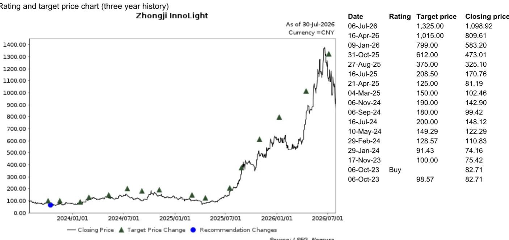
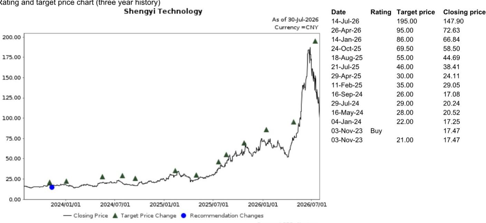

# 全球AI趋势追踪

## 科技板块

# META 2026年第二季度业绩观察

## 简报

META（META US，未评级）于2026年7月30日美股收盘后公布了2026年第二季度业绩，同日管理层召开了分析师沟通会。管理层主要讨论了其AI产品与服务进展、提升商业化效率的措施以及改善用户体验的相关工作。公司2026财年资本开支指引基本维持不变，为1300-1450亿美元（此前为1250-1450亿美元），管理层未就2027财年资本开支指引提供更多细节。关于算力的商业化，管理层认为销售智能服务的利润率将持续显著高于直接销售算力。我们认为这表明公司继续致力于大语言模型和生成式AI应用的投入。我们关注全球光模块龙头中际旭创（300308 CH，报告评级），以及主要PCB/CCL供应商如生益科技（600183 CH，报告评级）。

## 第二季度核心业务表现

- META第二季度营收同比增长28.0%，较彭博一致预期高出1%；盈利同比下降13.6%，较一致预期低14%。对于2026年第三季度，管理层给出610-640亿美元的总营收指引，汇率因素对同比增速形成约1%的拖累。

- Reality Labs部门第二季度营收为4.31亿美元，同比增长16%，主要得益于AI眼镜收入的强劲增长，部分被Quest头显销售下滑所抵消。

- 第二季度资本开支（购买物业、厂房及设备）同比增长82.1%、环比增长58.5%，达到301亿美元；含融资租赁本金支付的资本开支为311亿美元，主要投向服务器、数据中心和网络基础设施。

- 管理层预计2026财年含融资租赁本金支付的资本开支在1300-1450亿美元区间，较此前1250-1450亿美元的预估有所收窄。

## AI发展与商业化进展

- Meta正在开发新的个人智能代理，将为其下一波产品和收入线奠定基础。

- 据管理层介绍，按美元计算，Meta广告业务的同比营收增速高于其他可比公司的广告业务。

- 平台上已有900万小型企业使用至少一款Meta的AI广告创意工具。

- 公司推出了Meta One，这是一项新的订阅服务，在各项应用中提供更多工具和AI功能。随着需求增长，管理层计划提供多种不同档位和定价选项。

- Meta还宣布与贝莱德（未上市）建立新的战略合作，在德克萨斯州埃尔帕索开发一个新的1吉瓦数据中心。

- Meta已将首个生成式模型部署到其广告检索系统中，广告效果出现显著改善。

- Advantage+端到端解决方案本季度年化营收超过750亿美元。

## 研究分析师

中国科技行业

段冰 - NIHK

bing.duan1@NOM.com

+852 2252 2141

Joel Ying, CFA - NIHK

joel.ying@NOM.com

+852 2252 2153

图1：META – 第二季度财务摘要

<table><tr><td>单位：百万美元</td><td>2026Q2实际</td><td>2026Q2预期</td><td>实际vs彭博一致预期</td><td>2026Q3指引</td></tr><tr><td>营收</td><td>60,801</td><td>60,231</td><td>1%</td><td>610~640亿</td></tr><tr><td>同比%</td><td>28.0%</td><td>26.8%</td><td></td><td>19%~25%</td></tr><tr><td>环比%</td><td>8.0%</td><td>7.0%</td><td></td><td></td></tr><tr><td>毛利润</td><td>49,471</td><td>48,409</td><td>2%</td><td></td></tr><tr><td>毛利率%</td><td>81.4%</td><td>80.4%</td><td></td><td></td></tr><tr><td>营业利润</td><td>18,775</td><td>21,374</td><td>-12%</td><td></td></tr><tr><td>营业利润率%</td><td>30.9%</td><td>35.5%</td><td></td><td></td></tr><tr><td>净利润</td><td>15,848</td><td>18,498</td><td>-14%</td><td></td></tr><tr><td>净利率%</td><td>26.1%</td><td>30.7%</td><td></td><td></td></tr></table>

资料来源：公司数据、彭博财经、NOM

图2：META – 季度资本开支趋势  
  
资料来源：彭博财经、NOM

## 附录A-1

本报告由NOM国际（香港）有限公司（NIHK）编制。NOM集团实体详情请参阅免责声明。

## 分析师认证

本人段冰，特此证明：(1) 本研究报告中所表达的观点准确反映了我个人对报告中提及的任何或所有标的公司或发行人的看法；(2) 我的薪酬中没有任何部分直接或间接与本研究报告中表达的具体建议或观点相关；(3) 我的薪酬中没有任何部分与NOM证券国际公司、NOM国际公众有限公司或任何其他NOM集团公司执行的任何特定投资银行业务交易挂钩。

## 发行人特定监管披露

本文中使用的"NOM"和"NOM集团"指NOM控股公司及其关联公司和子公司，包括NOM证券国际公司（'NSI'）和Instinet有限责任公司（'ILLC'），均为美国注册经纪交易商及SIPC成员。

## 重点提及的发行人

<table><tr><td>发行人</td><td>代码</td><td>价格</td><td>价格日期</td><td>评级</td><td>行业评级</td><td>披露</td></tr><tr><td>中际旭创</td><td>300308 CH</td><td>人民币951.00元</td><td>2026年7月29日</td><td>买入</td><td>不适用</td><td></td></tr><tr><td>生益科技</td><td>600183 CH</td><td>人民币108.18元</td><td>2026年7月29日</td><td>买入</td><td>不适用</td><td></td></tr></table>

人民币951.00元（2026年7月29日）买入（行业评级：不适用）  
  
评级说明请参阅图表后的评级定义

估值方法 我们的目标价人民币1,325.00元基于2027年预期每股收益人民币66.06元的20倍估值，与WIND中国A股科技/电子元器件行业中位数市盈率区间一致。基准指数为沪深300。可能阻碍目标价实现的风险因素：1）数通和电信市场对高端光模块的需求低于预期；2）400G和800G光模块领域竞争激烈；3）产品升级（即800G、1.6T）慢于预期；4）价格竞争加剧，可能影响公司对全球客户的出口。

<table><tr><td>日期</td><td>评级</td><td>目标价</td><td>收盘价</td></tr><tr><td>2026年7月14日</td><td></td><td>195.00</td><td>147.90</td></tr><tr><td>2026年4月26日</td><td></td><td>95.00</td><td>72.63</td></tr><tr><td>2026年1月14日</td><td></td><td>86.00</td><td>66.84</td></tr><tr><td>2025年10月24日</td><td></td><td>69.50</td><td>58.50</td></tr><tr><td>2025年8月18日</td><td></td><td>55.00</td><td>44.69</td></tr><tr><td>2025年7月21日</td><td></td><td>46.00</td><td>38.41</td></tr><tr><td>2025年4月29日</td><td></td><td>30.00</td><td>24.11</td></tr><tr><td>2025年2月11日</td><td></td><td>35.00</td><td>29.05</td></tr><tr><td>2024年9月16日</td><td></td><td>26.00</td><td>17.08</td></tr><tr><td>2024年7月29日</td><td></td><td>29.00</td><td>20.24</td></tr><tr><td>2024年5月16日</td><td></td><td>28.00</td><td>20.52</td></tr><tr><td>2024年1月4日</td><td></td><td>22.00</td><td>17.25</td></tr><tr><td>2023年11月3日</td><td>买入</td><td></td><td>17.47</td></tr><tr><td>2023年11月3日</td><td></td><td>21.00</td><td>17.47</td></tr></table>

人民币108.18元（2026年7月29日）买入（行业评级：不适用）  
  
评级说明请参阅图表后的评级定义

估值方法 我们的目标价人民币195.00元基于2027年预期每股收益人民币4.51元的43倍估值，与2026-28财年预期盈利复合增长率43%一致。基准指数为沪深300。

可能阻碍目标价实现的风险因素包括：1）5G、服务器、汽车电子等下游领域对PCB的需求低于预期；2）CCL市场竞争加剧导致利润率承压。

## 重要披露

## 研究报告在线获取及利益冲突披露

NOM集团研究报告可在www.NOMnow.com/research、彭博、Capital IQ、Factset、LSEG上获取。

重要披露信息可访问 http://go.NOMnow.com/research/m/Disclosures 阅读，或向NOM证券国际公司索取。如网站访问遇到问题，请发送邮件至 grpsupport@NOM.com 寻求帮助。

负责编写本报告的分析师薪酬基于多种因素，包括公司总收入，其中一部分来自投资银行业务活动。除非另有说明，本报告首页列出的非美国分析师未在FINRA规则下注册/取得研究分析师资格，可能不是NSI的关联人员，且可能不受FINRA规则2241关于与所覆盖公司沟通、公开露面以及研究分析师账户持有证券交易等限制的约束。

NOM全球金融产品公司（NGFP）、NOM衍生品公司（NDP）和NOM国际公众有限公司（NIplc）在美国商品期货交易委员会和美国全国期货协会（NFA）注册为互换交易商。NGFP、NDPI和NIplc主要从事互换和其他衍生品交易，其中任何产品均可能构成本报告的主题。

## 评级分布（NOM集团）

NOM集团全球股票研究发布的所有评级分布如下：

58%被授予报告评级，出于强制披露目的，该评级被归类为报告评级；其中33%的公司是NOM集团\*的投资银行客户。0%被授予该评级的公司（在EEA受监管市场上市交易）由NOM集团提供重要服务\*\*。

39%被授予中性评级，出于强制披露目的，该评级被归类为持有评级；其中57%的公司是NOM集团\*的投资银行客户。0%被授予该评级的公司（在EEA受监管市场上市交易）由NOM集团提供重要服务。

3%被授予减持评级，出于强制披露目的，该评级被归类为报告评级；其中15%的公司是NOM集团\*的投资银行客户。0%被授予该评级的公司（在EEA受监管市场上市交易）由NOM集团提供重要服务。

截至2026年6月30日。

\*NOM集团定义见本报告末尾的免责声明部分。

\*\*根据欧盟市场滥用监管条例的定义。

## NOM集团股票研究评级体系及行业定义

评级体系为相对体系，表示相对于为每只个股确定的特定基准的预期表现，并受有限的管理裁量权约束。分析师的目标价是基于分析师确定的适当估值方法对股票当前内在公允价值的评估。估值方法包括但不限于现金流折现分析、预期净资产回报表现和倍数分析。分析师也可能指出相对于所述目标价的预期相对上涨/下跌空间，定义为（目标价-当前价格）/当前价格。

## 股票

"买入"评级表示分析师预期该股票在未来12个月内跑赢基准。"中性"评级表示分析师预期该股票在未来12个月内与基准表现一致。"减持"评级表示分析师预期该股票在未来12个月内跑输基准。"暂停"评级表示评级、目标价和预测已暂时中止，以遵守适用法规和/或公司政策。被标记为"未评级"或"无评级"的证券和/或公司不在常规研究覆盖范围内。读者不应期望NOM继续提供或提供有关此类证券和/或公司的额外信息。基准如下：美国/欧洲/亚洲（除日本）：请参阅估值方法中关于股票相关基准的说明，可访问：http://go.NOMnow.com/research/m/Disclosures；全球新兴市场（除亚洲）：MSCI新兴市场除亚洲指数，除非估值方法中另有说明；日本：Russell/NOM大盘指数。

## 行业

"看多"立场表示分析师预期该行业在未来12个月内跑赢基准。"中性"立场表示分析师预期该行业在未来12个月内与基准表现一致。"看空"立场表示分析师预期该行业在未来12个月内跑输基准。被标记为"未评级"或显示为"不适用"的行业不分配评级。基准如下：美国：标普500；欧洲：道琼斯STOXX 600；全球新兴市场（除亚洲）：MSCI新兴市场除亚洲指数。日本/亚洲（除日本）：不分配行业评级。

## 目标价

如讨论到目标价，表示分析师对股票价格在12个月时间范围内的预测，部分反映了分析师对该公司盈利的预测。任何目标价的实现可能受到总体市场和宏观经济趋势的阻碍，以及公司与市场相关的其他风险的影响，如果公司盈利与预测不符，目标价可能无法实现。

## 免责声明

本出版物包含由第1页所标识的NOM集团实体准备的材料，并可能包含一个或多个NOM集团实体的贡献，其员工及其各自隶属关系在第1页或本出版物其他地方标明。本文中使用的"NOM集团"指NOM控股公司及其关联公司和子公司，包括：(a) NOM证券株式会社（'NSC'），日本东京；(b) NOM金融产品欧洲有限公司（'NFPE'），德国；(c) NOM国际公众有限公司（'NIplc'），英国；(d) NOM证券国际公司（'NSI'），美国纽约；(e) NOM国际（香港）有限公司（'NIHK'），中国香港；(f) NOM金融投资（韩国）有限公司（'NFIK'），韩国（在韩国金融投资协会（'KOFIA'）注册的NOM分析师信息可在KOFIA内网 http://dis.kofia.or.kr 查询）；(g) NOM新加坡有限公司（'NSL'），新加坡（注册号197201440E，受新加坡金融管理局监管）；(h) NOM澳大利亚有限公司（'NAL'），澳大利亚（ABN 48 003 032 513），受澳大利亚证券和投资委员会（'ASIC'）监管，持有澳大利亚金融服务牌照号246412；(i) NOM证券马来西亚有限公司（'NSM'），马来西亚；(j) NIHK台北分公司（'NITB'），中国台湾；(k) NOM金融咨询和证券（印度）私人有限公司（'NFASL'），印度孟买（注册地址：Ceejay House, Level 11, Plot F, Shivsagar Estate, Dr. Annie Besant Road, Worli, Mumbai- 400 018, India；电话：91 22 4037 4037，传真：91 22 4037 4111；CIN号：U74140MH2007PTC169116，SEBI证券经纪业务注册号：INZ000255633；SEBI商人银行注册号：INM000011419；SEBI研究注册号：INH000001014 - 合规官：Ms. Pratiksha Tondwalkar，电话：91 22 40374904，投诉邮箱：investorgrievancesra@NOM.com 网页：链接

对于涉及印度公众公司或由印度NFASL研究分析师撰写的报告：(i) 证券投资受市场风险影响。投资前请仔细阅读所有相关文件。(ii) SEBI的注册和NISM的认证不以任何方式保证中介机构的业绩或向读者提供任何回报保证。(iii) NFASL提供研究服务的条款和条件已在NFASL网页上披露。

(l) NOM信托研究咨询有限公司（'NFRC'），日本东京。(m) NOM东方国际证券有限公司（"NOI"）是NOM集团、东方国际（集团）有限公司和上海黄浦投资控股（集团）有限公司共同持股的合资企业，NOM集团持有多数股权。根据中华人民共和国（"中国"，就本文件而言不包括香港、澳门和台湾）法律，NOI在中国境内获许可提供证券研究和研究交流，并独立于NOM集团其他成员运营；特别是，NOI在中国证券中的利益不向任何其他NOM集团实体披露或与其持仓合并计算，其他NOM集团实体在中国证券中的利益也不向NOI披露或与其持仓合并计算。研究报告首页上印有NOI名称的个人表示该个人受雇于NOI，根据研究合作协议为NIHK提供研究协助。研究报告首页上员工姓名旁的'NSFSPL'表示该个人受雇于NOM结构性融资服务私人有限公司，根据公司间协议为某些NOM实体提供协助。研究报告首页上个人姓名旁的'Verdhana'表示该个人受雇于PT Verdhana Sekuritas Indonesia（'Verdhana'），根据研究合作协议为NIHK提供研究协助，Verdhana及该个人均未在印度尼西亚境外获得许可。

本材料：(I) 仅供您私人参考，我们不据此招揽任何行动；(II) 不得被解释为在任何司法管辖区出售或招揽购买任何证券的要约，在该等司法管辖区此类要约或招揽将属非法；(III) 除与NOM集团相关的披露外，基于我们认为可靠的来源信息编制，但未经NOM集团独立核实。

除与NOM集团相关的披露外，NOM集团不对本文件的公平性、准确性、完整性、正确性、可靠性或适用于任何特定目的或适销性作出明示或暗示的保证、陈述或承诺，并在适用法律和/或法规允许的最大范围内，不对因使用本文件及相关数据而导致的任何行为（或决定不行为）承担（过失或其他方面的，全部或部分的）责任。在适用法律和/或法规允许的最大范围内，NOM集团的所有保证和其他承诺在此予以排除，NOM集团不对因使用、误用或分发本材料或其中包含的信息或以其他方式与之相关的任何损失承担（过失或其他方面的，全部或部分的）责任。

本文件中表达的观点或估计为原始发布日期当前的观点，本文件中的信息（包括其中包含的观点和估计）如有变更，恕不另行通知。但NOM集团明确声明不承担更新或修订本文件的任何义务，因此没有更新或修订本文件的义务。本文中的任何评论或陈述均为作者本人的观点，可能与NOM集团内部其他方持有的观点不同。客户应考虑本报告中的任何建议或推荐是否适合其特定情况，并在适当情况下寻求专业建议，包括税务建议。NOM集团不提供税务建议。

在适用法律和/或法规允许的范围内，NOM集团及其高级管理人员、董事、员工和关联方可能以主事人、代理人或其他身份进行交易，或持有本文提及的发行人或证券的多头或空头头寸，或买入或卖出其证券、商品或工具，或基于其的期权或其他衍生工具。NOM集团公司也可能担任发行人金融工具的市场做市商或流动性提供者（根据英国适用法规的定义）。如果做市商活动按照美国或其他司法管辖区的特定法律法规赋予的定义进行，将在特定发行人披露中单独披露。

本文件可能包含从第三方获得的信息，包括但不限于信用评级机构（如标准普尔）的评级。NOM集团特此明确声明，对于本材料中包含的或以其他方式与之相关的从第三方获得的任何信息，不承担原创性、公平性、准确性、完整性、正确性、适销性或特定目的适用性的所有陈述、保证或承诺，并且不对与本材料中包含的或以其他方式与之相关的任何第三方信息的任何使用或误用相关的任何直接、间接、附带、示范性、补偿性、惩罚性、特殊或后果性损害、成本、费用、法律费用或损失（包括收入损失和利润损失及机会成本）承担（过失或其他方面的，全部或部分的）责任。未经相关第三方事先书面许可，禁止以任何形式复制和分发第三方内容。第三方内容提供者不对任何信息（包括评级）的公平性、准确性、完整性、正确性、及时性或可用性作出明示或暗示的保证，不对任何错误或遗漏（无论过失与否，无论原因如何）或使用或误用此类内容所获得的结果承担任何责任。第三方内容提供者不作任何明示或暗示的保证，包括但不限于适销性或特定目的或用途的适用性的任何保证。第三方内容提供者不对与其内容（包括评级）的任何使用或误用相关的任何直接、间接、附带、示范性、补偿性、惩罚性、特殊或后果性损害、成本、费用、法律费用或损失（包括收入损失和利润损失及机会成本）承担（过失或其他方面的，全部或部分的）责任。信用评级是意见陈述，不是事实陈述，也不是购买、持有或出售证券的建议。它们不涉及证券的适合性或证券对投资目的的适合性，不应作为研究交流依赖。本文件中的任何MSCI来源信息均为MSCI公司（'MSCI'）的专有财产。未经MSCI事先书面许可，不得为任何目的复制、转载、再传播、再分发或使用本信息及任何其他MSCI知识产权，包括创建任何金融产品和任何指数。本信息按"现状"提供。使用者承担使用本信息的全部风险。MSCI、其关联方及参与计算或编制本信息的任何第三方特此明确声明，对本材料或其中包含的信息或以其他方式与之相关的任何原创性、公平性、准确性、完整性、正确性、适销性或特定目的适用性的所有陈述、保证或承诺不承担责任。在不限制前述规定的前提下，MSCI、其任何关联方或参与计算或编制本信息的任何第三方在任何情况下均不对任何类型的任何损害承担（过失或其他方面的，全部或部分的）责任。MSCI和MSCI指数是MSCI及其关联方的服务标志。

Russell/NOM日本股票指数的知识产权和其他权利属于NOM信托研究咨询有限公司（"NFRC"）和FTSE Russell（"Russell"）。NFRC和Russell不保证指数的公平性、准确性、完整性、正确性、可靠性、有用性、适销性、可销售性或特定目的适用性，不对任何指数用户和/或其关联方使用该指数进行的业务活动或服务负责。

读者应仅将本文件视为做出投资决策的单一因素，因此，本报告不应被视为识别或暗示与任何投资决策相关的所有直接或间接风险。NOM集团制作多种不同类型的研究产品，包括但不限于基本面分析和定量分析；一种研究产品中包含的建议可能与其他类型研究产品中的建议不同，无论是由于不同的时间范围、方法论或其他原因。NOM集团以多种不同方式发布研究产品，包括在NOM集团门户网站上发布产品和/或直接向客户分发。不同客户群体可能根据其个人需求从研究部门获得不同的产品和服务。

本文中呈现的数字可能涉及过往表现或基于过往表现的模拟，这些不是未来或可能表现的可靠指标。当信息包含对未来表现和业务前景的预期、预测或指示时，此类预测可能不是未来或可能表现的可靠指标。此外，模拟基于模型和简化假设，可能过度简化且不能反映未来的回报分布。本文档中为说明目的创建和发布的任何数字、策略或指数均不旨在"用作"欧洲基准监管条例定义的"基准"。某些证券受汇率波动影响，可能对投资的价值或价格或由此产生的收入产生不利影响。

关于固定收益研究：建议分为两类：战术性建议，通常持续最多三个月；或战略性建议，通常持续6-12个月。然而，交易建议可能随时根据情况变化进行审查。交易还提供"止损"水平；如果触及，将自动平仓交易建议。建议中显示的价格和回报表现在提交发布时获取，基于当时彭博、LSEG或NOM的指示性价格和回报表现。显示的价格和回报表现不一定是可以执行交易建议的价格。

本文所述证券可能未根据美国1933年证券法（"1933年法案"）注册，在此情况下，除非已根据1933年法案注册，或符合1933年法案注册要求的豁免，否则不得在美国或向美国人发售或出售。除非适用法律另有许可，任何交易应通过您所在司法管辖区的NOM实体执行。

本文件已获批准在英国作为投资研究由NIplc分发。NIplc受审慎监管局授权并受金融行为监管局和审慎监管局监管。NIplc是伦敦证券交易所成员。本文件不构成英国适用法规定义的个人推荐，也不考虑个人读者的特定投资目标、财务状况或需求。本文件仅面向英国适用法规定义的"合格对手方"或"专业客户"读者，因此不得再分发给"零售客户"。

本文件已获批准在欧洲经济区作为投资研究由NOM金融产品欧洲有限公司（"NFPE"）分发。NFPE是一家根据德国法律注册成立的有限责任公司，在法兰克福法院商业登记处注册，注册号HRB 110223。NFPE受德国联邦金融监管局（BaFin）授权和监管。

本文件已获NIHK批准，NIHK受香港证券及期货事务监察委员会监管，由NIHK在香港分发。本文件仅面向香港适用法规定义的"专业读者"，因此不得再分发给非"专业读者"。

本文件已获批准由NAL在澳大利亚分发，NAL在澳大利亚受ASIC授权和监管。

本文件也已获批准由NSM在马来西亚分发。

在新加坡，本文件由NSL分发，NSL是《财务顾问法》（第110章）定义的豁免财务顾问，受新加坡金融管理局监管。NSL可根据《财务顾问条例》第32C条安排分发其外国关联公司制作的此文件。本文件面向《证券和期货法》（第289章）定义的认可、专家或机构读者。如果本文件的接收者不是认可、专家或机构读者，NSL仅在法律要求的范围内对此类接收者承担本文件内容的法定义务。新加坡的本文件接收者应就本文件引起或与之相关的事项联系NSL。本文件供一般分发。它不考虑任何特定个人的特定投资目标、财务状况或特殊需求。接收者在做出购买任何证券的承诺前应考虑其特定的投资目标、财务状况或特殊需求，包括在单独委托下向独立财务顾问寻求关于投资适合性的建议。除非1933年法案S条例的规定禁止，本材料在美国由NSI分发，NSI是一家美国注册经纪交易商，根据1934年美国证券交易法规则15a-6的规定接受其内容的义务。编制本文件的实体允许NOM集团内独立运营的关联公司向其客户提供此类文件的副本。

本文件未获批准在沙特阿拉伯王国（"沙特阿拉伯"）向资本市场管理局定义的"授权人士"、"豁免人士"或"机构"以外的人士分发，或在阿拉伯联合酋长国（"阿联酋"）向迪拜金融服务管理局定义的"市场对手方"或"专业客户"以外的人士分发，或在卡塔尔国（"卡塔尔"）向卡塔尔金融中心监管局定义的"市场对手方"或"商业客户"以外的人士分发，由NOM沙特阿拉伯、NIplc或NOM集团任何其他成员（视情况而定）进行。本文件及其任何副本不得由未经授权的人士直接或间接带入、传输或分发到沙特阿拉伯、阿联酋或卡塔尔，或分发给沙特阿拉伯境内的"授权人士"、"豁免人士"或"机构"以外的任何人士，或阿联酋的"市场对手方"或"专业客户"以外的任何人士，或卡塔尔的"市场对手方"或"商业客户"以外的任何人士。未能遵守这些限制可能构成违反阿联酋、沙特阿拉伯或卡塔尔法律。

对于涉及台湾公众公司或由台湾研究分析师撰写的报告：

本文件仅供参考。您应独立评估投资风险，并自行承担投资决策的责任。未经NOM集团书面授权，任何媒体或其他人士不得复制或引用本报告的任何部分。根据台湾证券商推介客户买卖有价证券作业办法和/或其他适用法律或法规，您不得将报告提供给他人（包括但不限于关联方、关联公司和任何其他第三方）或从事与报告相关的可能涉及利益冲突的任何活动。关于NOM国际（香港）有限公司台北分公司不可执行的证券/工具的信息仅供参考，不得解释为推荐或招揽交易此类证券/工具。

本材料不得在印度尼西亚分发或传入印度尼西亚共和国境内，或分发给印度尼西亚公民（无论其居住地或所在地）或印度尼西亚实体或居民，如果该等分发构成印度尼西亚共和国法律定义的公开募股。本文件中提及的证券不得在印度尼西亚或向印度尼西亚公民（无论其居住地或所在地）或印度尼西亚实体或居民发售或出售，如果该等发售构成印度尼西亚共和国法律定义的公开募股。

研究报告首页上印有NOI名称的个人表示本文件是NOI在中国发布的研究报告的翻译版本。在所有其他情况下，本文件由未在中国获得证券研究许可的NOM集团或其子公司或关联公司（统称"离岸发行人"）编制。本研究报告未经批准在中国境内分发，也不打算在中国境内分发。A股相关分析（如有）不面向位于中国境内或在中国注册成立的任何人士。接收者不应依赖本研究报告中包含的任何信息做出投资决策，离岸发行人对由此产生的任何事项不承担责任。未经NOM集团成员事先书面同意，不得以任何方式（I）复制、影印、翻印或复制本材料的任何部分；或（II）再传播、再发布或再分发本材料。如果本文件通过电子传输方式分发，如电子邮件，则此类传输不能保证安全或无错误，因为信息可能被拦截、损坏、丢失、销毁、延迟到达或不完整，或包含病毒。因此，发送方不对本文件内容的任何错误或遗漏承担（过失或其他方面的，全部或部分的）责任，这些错误或遗漏可能因电子传输而产生。如需验证，请索取纸质版本。

NOM集团通过其合规政策和程序（包括但不限于利益冲突、中国墙和保密政策）以及维护中国墙和员工培训来管理研究生产的利益冲突。

有关本文件中包含的任何研究交流所使用的方法或模型的额外信息，可通过联系本报告首页列出的NOM研究分析师获取。披露信息可应要求提供，披露信息可在NOM披露网页获取：

版权所有 © 2026 NOM国际（香港）有限公司，香港。保留所有权利。
