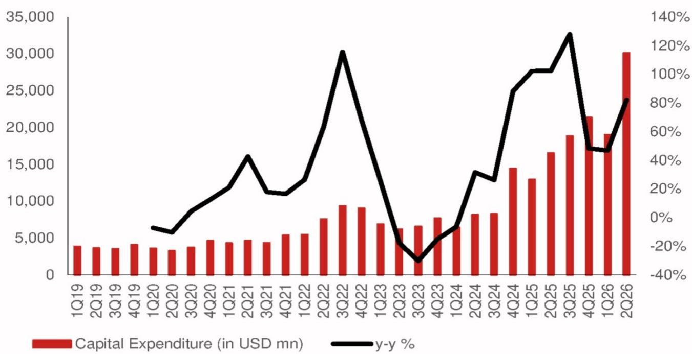
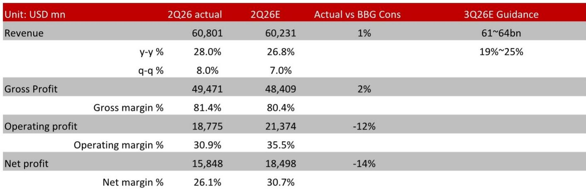

# Meta的AI建设正成为变现引擎，供应链是最清晰的参与路径

Meta于2026年7月30日发布的2026年第二季度财报呈现出一个当前AI基础设施投资阶段特有的现象：营收同比增长加速至28.0%，超出市场一致预期整整一个百分点；净利润同比下降13.6%，低于预期14%。这不是一家处于转型期的公司，而是一家正在执行明确战略、将社交图谱转化为AI变现引擎的公司。市场被要求接受短期盈利能力下降，作为持有最终赢家的代价。从数据来看，这一交换目前正在奏效，但更具持久价值的洞察在供应链端。Meta本季度资本支出同比增长82.1%至301亿美元，管理层将2026全年指引收窄至1300-1450亿美元，表明建设进度符合计划，而非放缓。对于观察者而言，这一逻辑最清晰的表达并非Meta本身的股权——那承载着执行风险和估值复杂性——而是直接受益于实体建设的光模块和PCB/CCL供应商。

战略逻辑很直接。Meta不仅仅是在AI上投入；它是在带着变现模式进行AI投入。管理层表示，出售"智能"的利润率将显著高于直接出售算力，这清晰地表明公司意图占据应用层，而非成为商品化的基础设施提供者。这一区分很重要，因为它改变了资本支出周期的性质。这不是防御性支出以避免被颠覆，而是进攻性支出以捕捉新的收入线。证据正在累积：九百万家小企业现在使用至少一种Meta的AI广告创意工具，Advantage+端到端解决方案的年化收入运行率已超过750亿美元，公司已将其首个生成式模型部署到广告检索系统中并取得显著性能提升。这些不是试点项目，而是产生可衡量收入的生产系统。

营收增长与利润下降之间的张力是这份财报中最重要的单一事实，值得仔细拆解。Meta在2026年第二季度营收同比增长28.0%，但营业利润低于一致预期12%，净利润低于预期14%。顶线与底线之间的差距正是AI建设本身。用于服务器、数据中心和网络基础设施的资本支出速度远超当前产生的增量收入。这是典型的AI投资周期模式：基础设施支出领先变现数个季度，市场必须判断这一滞后是暂时的会计现象还是商业模式的結構性缺陷。本报告中的证据支持前一种解读，但前提是你接受Meta的AI产品仍处于采用曲线的早期阶段。另一种观点——即Meta相对于其变现能力过度建设——需要公司自身的指引显示出压力的迹象。但指引并未如此。管理层将资本支出区间从1250-1450亿美元收窄至1300-1450亿美元，这是信心的信号，而非谨慎。

## 核心业务不仅在支撑，而且在复利增长，AI是加速器

Meta的核心广告业务是整个AI押注的基础，数据表明这一基础比市场最初反应所暗示的更为坚实。2026年第二季度营收608亿美元，同比增长28.0%，第三季度指引为610-640亿美元，意味着中位数19-25%的增长。管理层提出了一个引人注目的说法：按美元计算，Meta的广告业务报告的同比增长速度超过其他任何公司报告的广告业务。这是关于相对美元增长的表述，而非百分比增长，它之所以重要，是因为表明Meta不仅仅受益于水涨船高，而是在夺取份额。现在有九百万家小企业使用的AI广告创意工具，是这一份额增长的直接贡献者。这些工具降低了广告创作的门槛，使较小的广告主能够制作更有效的营销活动，进而增加Meta平台上的总广告支出。这是一个飞轮效应：更多AI工具带来更多广告主，更多广告主带来更多数据，更多数据带来更好的AI工具。

Meta One的推出——一项跨应用捆绑AI功能的订阅产品——代表了一年前尚不存在的新收入线。管理层计划随着需求增长提供多个层级和定价选项，这表明他们将其视为可扩展的业务，而非小众产品。这一举措的意义在于，它使Meta的收入基础多元化，超越了历史上作为公司单一风险点的广告业务。如果订阅收入增长到总收入的显著比例，估值讨论将完全改变。市场目前将Meta定价为一家带有AI期权的广告公司。如果Meta One成为有意义的收入贡献者，期权开始成为核心业务。

Reality Labs部门一直是盈利能力的持续拖累，本季度显示出活力迹象，收入4.31亿美元，同比增长16%。增长由AI眼镜收入驱动，部分抵消了Quest头显销售的下滑。这是一个有意义的转变。围绕Meta硬件雄心的叙事一直是元宇宙需要多年才能成熟。AI眼镜是另一个故事：它们是近期的消费产品，具有明确的用例和不需要消费者做出巨大信念飞跃的价格点。AI眼镜收入增长而Quest头显销售下滑的事实表明，Meta已在VR领域难以企及的产品市场契合上取得了突破。

## 资本支出纪律并不矛盾；它是建设走向成熟的信号

本报告中的资本支出数据是供应链论点最重要的数据点，值得仔细阅读。Meta在2026年第二季度资本支出301亿美元，同比增长82.1%，环比增长58.5%。包括融资租赁本金支付在内，该数字为311亿美元。全年指引1300-1450亿美元，较此前1250-1450亿美元的区间有所收窄，意味着下限提高了50亿美元。这是一个有意义的信号。管理层并未削减投资计划；而是在确认支出速度正朝着预期区间的上端运行。

与贝莱德合作开发德克萨斯州埃尔帕索1吉瓦数据中心的战略合资项目是一个值得注意的进展。这不是典型超大规模数据中心。这是一个需要大量电力基础设施、冷却系统和网络设备的大型设施。Meta愿意为此设施进入战略合资而非完全自建，表明建设规模即使对Meta雄厚的资产负债表也构成压力。这对供应链是一个积极信号，因为它表明对光模块、PCB和CCL的需求不是一个季度的现象，而是多年的承诺。

关键洞察在于，资本支出没有被削减，而是在被精细化。指引区间的收窄表明Meta对自身支出需求的图景比一个季度前更清晰。这种清晰是运营成熟的标志，而非承诺减弱的标志。公司已过了AI基础设施的初始圈地阶段，现在处于优化阶段，支出被导向预期回报最高的项目。

## "智能vs.算力"的区分是报告中最具战略意义的表述

管理层关于出售智能的利润率将显著高于直接出售算力的表述，是一个微妙但关键的战略定位。它表明Meta不打算成为传统意义上的云基础设施提供者。它不打算向第三方提供原始算力。相反，它打算构建通过广告、订阅和其他服务产生收入的AI模型和应用。这是一种与驱动云服务商资本支出周期根本不同的商业模式。

对供应链的启示是，Meta的基础设施支出将导向构建最先进的AI系统，而非最大化商品化算力的效率。这意味着对高端光模块的需求——大型语言模型训练和推理所需高速数据传输的关键——将保持强劲。这也意味着对先进PCB和CCL的需求——这些设备构建的物理基板——将持续。

首个生成式模型部署到广告检索系统是智能变现如何实际运作的具体例子。广告检索是决定向哪些用户展示哪些广告的系统。通过将生成式模型部署到该系统中，Meta提高了广告定向的相关性，直接改善了广告主的广告支出回报。这不是理论上的好处，而是核心收入引擎的可衡量改进。管理层报告广告性能"显著提升"的事实表明模型按预期工作，公司正在学习如何在生产系统中部署生成式AI。

## 供应链是Meta AI论点最清晰的表达，数据支持这一判断

对于希望参与Meta AI建设而不承担平台公司本身执行风险的观察者而言，供应链是合乎逻辑的替代路径。报告点名了两家具体公司为受益者：中际旭创，全球光模块领导者；生益科技，主要PCB和CCL供应商。两者均以行业市盈率中位数区间进行估值。该公司是超大规模资本支出周期的直接受益者，因为光模块是数据中心内服务器高速数据连接以及数据中心之间互联的关键。从400G向800G并最终向1.6T光模块的过渡是一个多年的升级周期，将推动该领域领导者的出货量和定价能力。

该公司2026-2028年预测盈利复合年增长率为43%。该公司是PCB和CCL的主要供应商，这些是几乎所有电子设备的基础材料，包括构成AI数据中心的服务器、交换机和存储系统。43%的盈利复合年增长率反映了AI建设将在未来数年推动对这些材料的持续需求的预期。

研究逻辑很直接：Meta 2026年1300-1450亿美元的资本支出指引，加上其他超大规模企业的类似支出，为整个AI供应链创造了多年的需求顺风。最有能力捕捉这一需求的公司是那些拥有领先市场地位、成熟技术和产能扩展能力的公司。中际旭创和生益科技符合这一特征。

## AI基础设施投资周期的决策框架

对于评估是否通过供应链参与AI基础设施周期的观察者，Meta财报提供了一个有用的框架。第一个问题是需求信号是否持久。Meta的资本支出指引收窄至1300-1450亿美元，表明公司看到AI基础设施的多年需求。管理层在盈利不及预期的情况下并未削减支出，这是一个强烈信号，表明公司相信变现将跟随投资而来。

第二个问题是供应链能否满足需求。光模块市场正围绕少数领导者整合，向800G和1.6T速度的过渡为新进入者设置了壁垒。同样，PCB和CCL市场需要大量资本投入和技术专长，有利于既有参与者。报告中提到的公司——中际旭创和生益科技——是各自细分领域的领导者。

第三个问题涉及估值。中际旭创交易于20倍前瞻市盈率，对于具有其增长前景的公司而言是合理的。生益科技交易于43倍前瞻市盈率，价格较高但由43%的盈利复合年增长率所支撑。关键风险在于AI建设放缓或这些公司失去市场份额给竞争对手。

第四个问题是风险。对于中际旭创，风险包括高端光模块需求弱于预期、400G和800G细分市场竞争激烈、产品升级慢于预期以及价格战。对于生益科技，风险包括下游领域PCB需求低于预期以及CCL市场竞争加剧。这些是投资周期性科技供应链的标准风险。

Meta财报对第一个问题提供了明确答案。需求信号是持久的。公司没有削减资本支出；它在精细化指引。供应链是这一承诺的直接受益者，报告中提到的公司是处于最佳位置以捕捉价值的公司。

报告还强调了Meta AI投资性质的一个微妙但重要的点。通过强调智能的利润率将高于算力，Meta表明它打算拥有从基础设施到应用的完整AI堆栈。这是一个比简单提供云服务更雄心勃勃的战略，意味着更长更密集的资本支出周期。对供应链而言，这是一个积极的发展。对光模块、PCB和CCL的需求不仅由初始建设驱动，还由随着AI模型变得更加复杂而持续升级和扩展基础设施的需求驱动。

最后一个考虑因素是变现的节奏。Meta 28%的同比增长率，加上AI相关广告工具和订阅产品的增长，表明变现进展快于市场最初预期。九百万家小企业使用AI广告创意工具和Advantage+ 750亿美元的年化收入运行率是AI变现引擎正在运作的具体证据。盈利不及预期是投资周期的函数，而非商业模式的失败。

投资启示是，AI基础设施建设仍处于早期阶段，供应链是最清晰的参与路径。为AI数据中心建设提供物理组件的公司正受益于一个尚未完全反映在其估值中的多年需求周期。Meta财报——强劲的营收增长、积极的资本支出和清晰的变现信号的组合——为这一论点提供了令人信服的案例。

*仅供参考。部分内容可能基于源材料由AI辅助生成、翻译、总结或编辑，可能包含遗漏或错误。请独立核实。本文不构成投资、法律、税务、会计或其他专业建议。*

仅供参考。部分内容可能基于源材料由AI辅助生成、翻译、总结或编辑，可能包含遗漏或错误。请独立核实。本文不构成投资、法律、税务、会计或其他专业建议。

