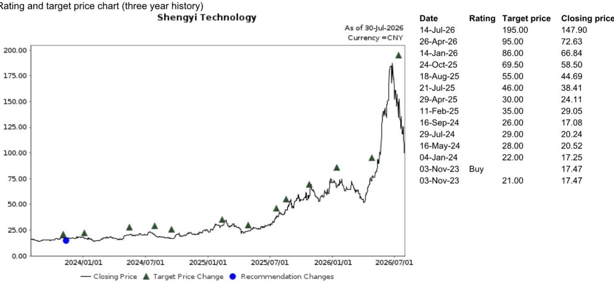

EQUITY: TECHNOLOGY

## Amazon 2Q26 业绩观察

## 简评

Amazon（AMZN US，未评级）于7月31日美股收盘后公布了2Q26（6月季度）业绩，管理层于当日召开了业绩交流会。会上讨论了AWS的AI芯片、Agent平台及AI应用进展，以及FY28F的回报表现与需求展望。2Q26资本开支同比增长51.5%至542亿美元，管理层将FY26E资本开支指引从2000亿美元上调至2200亿美元，主要由于内存成本上升。

管理层表示，AWS云业务长期有望实现年收入1万亿美元，2028年的部分产能已被预订。我们认为，AWS云业务稳健的收入增长以及持续强劲的云产能需求（我们预计持续至2028F），应有助于缓解市场对AI基础设施过度投入的担忧，同时管理层关于回报周期（服务器及网络设备投入平均不到三年达到盈亏平衡）的表述，也有助于稳定市场情绪。我们关注全球光模块龙头中际旭创（300308 CH，买入），以及主要PCB/CCL供应商如生益科技（600183 CH，买入）和生益电子（688183 CH，买入）。以下为主要要点：

## 2Q26核心业务表现

\- 2Q26，AMZN收入同比增长19.6%至2006亿美元，高于公司指引的1940-1990亿美元，较彭博一致预期高2%。同时，经营利润同比增长43%，较一致预期高16%。

\- AWS收入同比增长36.8%至422亿美元，环比增长12.4%，较彭博一致预期高4%，经营利润率环比提升1.7个百分点至39.4%。AWS积压订单达4960亿美元，同比增长三位数，AWS年化收入（ARR）达1690亿美元。

\- 3Q26E，管理层指引收入为1970-2020亿美元（同比增长9-12%），经营利润为225-265亿美元。

\- 2Q26资本开支同比增长68.4%至542亿美元，主要与AWS及生成式AI相关，以支持强劲的客户需求。

AI基础设施与AI商业化进展：AWS产能已预订至2028F；芯片业务ARR超过250亿美元；AI收入年化运行率超过250亿美元

\- 据管理层介绍，Graviton芯片相较其他选项可提供30%至40%的性价比优势。

\- 除Anthropic（未上市）和OpenAI（未上市）外，越来越多的AI初创公司也在采用Trainium，如Neurobotics（未上市）、Odyssey（未上市）等。

\- AWS前1000大EC2客户中有98%使用Graviton。收入承诺环比增长近3倍，Graviton 5的增速约为Graviton 4同期的近2倍。

\- 芯片业务ARR现已超过250亿美元，同比增长三位数。

\- 服务器及网络设备投入平均不到三年达到盈亏平衡。

## 研究分析师

中国科技行业

段冰 - NIHK

bing.duan1@NOM.com

+852 2252 2141

Joel Ying, CFA - NIHK

joel.ying@NOM.com

+852 2252 2153

\- 据管理层介绍，服务器目前的使用寿命至少为五至六年，公司大部分AI产能的合同期限至少为五年，这意味着在盈亏平衡后的两到三年内，公司可在服务器和网络设备上产生可观的自由现金流。

\- AWS数据中心的使用寿命超过30年；公司应可获得至少五至六代服务器的经济效益。

\- 在之前的交流中，管理层预计到2027年底，公司电力容量将较2025年弹性较高。目前进展符合预期。此外，2027年的大部分产能已被预订，2028年的部分产能也已预订。

• AI收入年化运行率超过250亿美元，同比增长三位数。

\- 管理层认为，2200亿美元的资本开支仍无法满足AWS在2026年的全部需求，并认为这一态势将持续至2027年。管理层还指出，2028年AWS的需求表现突出，并认为长期实现年收入1万亿美元是可能的。

图1：Amazon – 2Q26业绩摘要

<table><tr><td>单位：百万美元</td><td>1Q26</td><td>2Q26</td><td>2Q26E 公司此前指引</td><td>3Q26E 公司指引</td><td>2Q26E（彭博）</td><td>实际 vs 彭博一致预期</td></tr><tr><td>收入</td><td>181,500</td><td>200,606</td><td>1940~1990亿</td><td>1970~2020亿</td><td>196,969</td><td>2%</td></tr><tr><td>同比 %</td><td>16.6%</td><td>19.6%</td><td>16~19%</td><td>9~12%</td><td></td><td></td></tr><tr><td>环比 %</td><td>-14.9%</td><td>10.5%</td><td></td><td></td><td></td><td></td></tr><tr><td>毛利</td><td>94,037</td><td>104,828</td><td></td><td></td><td>103,033</td><td>2%</td></tr><tr><td>毛利率 %</td><td>51.8%</td><td>52.3%</td><td></td><td></td><td></td><td></td></tr><tr><td>经营利润</td><td>23,852</td><td>27,461</td><td>200~240亿</td><td>225~265亿</td><td>23,580</td><td>16%</td></tr><tr><td>经营利润率 %</td><td>13.1%</td><td>13.7%</td><td></td><td></td><td></td><td></td></tr></table>

资料来源：公司数据，NOM

图2：Amazon – 2Q26分部数据

<table><tr><td colspan="2">单位：百万美元</td><td>1Q26</td><td>2Q26 实际</td><td>2Q26E</td><td>实际 vs 彭博一致预期</td></tr><tr><td>北美销售</td><td></td><td>104,143</td><td>116,177</td><td>113,951</td><td>2%</td></tr><tr><td></td><td>同比 %</td><td>12.1%</td><td>16.1%</td><td>13.9%</td><td></td></tr><tr><td></td><td>环比 %</td><td>-18.1%</td><td>11.6%</td><td>9.4%</td><td></td></tr><tr><td>国际销售</td><td></td><td>39,789</td><td>42,197</td><td>42,711</td><td>-1%</td></tr><tr><td></td><td>同比 %</td><td>18.7%</td><td>14.8%</td><td>16.2%</td><td></td></tr><tr><td></td><td>环比 %</td><td>-21.6%</td><td>6.1%</td><td>7.3%</td><td></td></tr><tr><td>Amazon Web Services (AWS)</td><td></td><td>37,587</td><td>42,232</td><td>40,538</td><td>4%</td></tr><tr><td></td><td>同比 %</td><td>28.4%</td><td>36.8%</td><td>31.3%</td><td></td></tr><tr><td></td><td>环比 %</td><td>5.6%</td><td>12.4%</td><td>7.9%</td><td></td></tr><tr><td>北美经营利润</td><td></td><td>8,267</td><td>9,123</td><td>8,499</td><td>7%</td></tr><tr><td colspan="2">经营利润率 %</td><td>7.9%</td><td>7.9%</td><td>7.5%</td><td></td></tr><tr><td colspan="2">国际经营利润</td><td>1,424</td><td>1,717</td><td>1,898</td><td></td></tr><tr><td colspan="2">经营利润率 %</td><td>3.6%</td><td>4.1%</td><td>4.4%</td><td></td></tr><tr><td colspan="2">AWS经营利润</td><td>14,161</td><td>16,621</td><td>13,682</td><td>21%</td></tr><tr><td colspan="2">经营利润率 %</td><td>37.7%</td><td>39.4%</td><td>33.7%</td><td></td></tr></table>

图3：Amazon – 季度资本开支趋势  
  
资料来源：彭博金融终端，NOM

## 附录A-1

本报告由NOM国际（香港）有限公司（NIHK）编制。有关NOM集团实体的详情，请参阅免责声明。

## 分析师声明

本人段冰特此证明：（1）本研究报告中所表达的观点准确反映本人对相关证券或发行人的个人观点；（2）本人薪酬中没有任何部分与本研究报告中表达的具体建议或观点直接或间接相关；（3）本人薪酬中没有任何部分与NOM国际公司、NOM国际有限公司或任何其他NOM集团公司进行的特定投资银行业务相关。

## 发行人特定监管披露

本文中使用的"NOM"和"NOM集团"指NOM控股公司及其关联公司和子公司，包括NOM国际公司（NSI）和Instinet有限责任公司（ILLC），均为美国注册经纪交易商及SIPC成员。

## 主要提及的发行人

<table><tr><td>发行人</td><td>代码</td><td>价格</td><td>价格日期</td><td>股票评级</td><td>行业评级</td><td>披露</td></tr><tr><td>中际旭创</td><td>300308 CH</td><td>人民币 864.00</td><td>2026年7月30日</td><td>买入</td><td>不适用</td><td></td></tr><tr><td>生益科技</td><td>600183 CH</td><td>人民币 100.08</td><td>2026年7月30日</td><td>买入</td><td>不适用</td><td></td></tr></table>

## 中际旭创（300308 CH）

人民币 864.00（2026年7月30日）买入（行业评级：不适用）  
  
评级说明请参阅图表后的股票评级图例  
估值方法 我们的目标价人民币1,325.00元基于2027F每股收益人民币66.06元的20倍估值，与万得中国A股科技/电子元器件行业中位数市盈率区间一致。基准指数为沪深300。可能阻碍目标价实现的风险：1）数通和电信市场对高端光模块的需求弱于预期；2）400G和800G光模块领域竞争激烈；3）产品升级（即800G、1.6T）慢于预期；4）价格竞争加剧，可能影响公司对全球客户的出口。

人民币 100.08（2026年7月30日）买入（行业评级：不适用）  
  
评级说明请参阅图表后的股票评级图例

估值方法 我们的目标价人民币195.00元基于2027F每股收益人民币4.51元的43倍估值，与FY26-28F盈利复合增长率43%一致。基准指数为沪深300。

可能阻碍目标价实现的风险：1）5G、服务器、汽车电子等下游领域对PCB需求低于预期；2）CCL市场竞争加剧导致利润率承压。

## 重要披露

## 研究报告在线获取及利益冲突披露

NOM集团研究报告可在www.NOMnow.com/research、彭博、Capital IQ、Factset、LSEG上获取。

重要披露可访问 http://go.NOMnow.com/research/m/Disclosures 阅读，或向NOM国际公司索取。如访问遇到问题，请发送邮件至 grpsupport@NOM.com 寻求帮助。

负责编写本报告的分析师已根据多种因素获得薪酬，包括公司总收入的一部分来自投资银行活动。除非另有说明，本报告首页列出的非美国分析师未在FINRA规则下注册/取得研究分析师资格，可能不是NSI的关联人员，且可能不受FINRA规则2241关于与所覆盖公司沟通、公开露面及研究分析师账户持有证券交易等限制的约束。

NOM全球金融产品公司（NGFP）、NOM衍生产品公司（NDP）和NOM国际有限公司（NIplc）已在商品期货交易委员会和全国期货协会注册为互换交易商。NGFP、NDPI和NIplc主要从事互换及其他衍生产品交易，其中任何产品均可能为本报告的主题。

## 评级分布（NOM集团）

NOM集团全球股票研究发布的所有评级分布如下：

58%被授予报告评级，就强制性披露而言，该评级被归类为报告评级；其中33%的公司是NOM集团\*的投资银行客户。0%的公司（在EEA受监管市场上市交易）由NOM集团提供实质性服务\*\*。

39%被授予中性评级，就强制性披露而言，该评级被归类为持有评级；其中57%的公司是NOM集团\*的投资银行客户。0%的公司（在EEA受监管市场上市交易）由NOM集团提供实质性服务。

3%被授予减持评级，就强制性披露而言，该评级被归类为报告评级；其中15%的公司是NOM集团\*的投资银行客户。0%的公司（在EEA受监管市场上市交易）由NOM集团提供实质性服务。

截至2026年6月30日。

\*NOM集团定义见本报告末尾的免责声明部分。

\*\* 按欧盟市场滥用监管条例定义。

## NOM集团股票研究评级体系及行业定义

评级体系为相对体系，表示相对于为每只个股确定的特定基准的预期表现，并受有限的管理裁量权约束。分析师的目标价是基于分析师确定的适当估值方法对股票当前内在公允价值的评估。估值方法包括但不限于现金流折现分析、预期净资产回报表现和倍数分析。分析师也可能指出相对于所述目标价的预期相对上涨/下跌空间，定义为（目标价-当前价格）/当前价格。

## 股票

"买入"评级表示分析师预期该股票在未来12个月内跑赢基准。"中性"评级表示分析师预期该股票在未来12个月内与基准表现一致。"减持"评级表示分析师预期该股票在未来12个月内跑输基准。"暂停"评级表示评级、目标价和预测已暂时中止，以遵守适用法规和/或公司政策。标记为"未评级"或"无评级"的证券和/或公司不在常规研究覆盖范围内。读者不应期望NOM继续或提供有关此类证券和/或公司的额外信息。基准如下：美国/欧洲/亚洲（除日本）：请参阅估值方法中关于股票相关基准的说明，可访问：http://go.NOMnow.com/research/m/Disclosures；全球新兴市场（除亚洲）：MSCI新兴市场（除亚洲），除非估值方法中另有说明；日本：罗素/NOM大盘指数。

## 行业

"看多"立场表示分析师预期该行业在未来12个月内跑赢基准。"中性"立场表示分析师预期该行业在未来12个月内与基准表现一致。"看空"立场表示分析师预期该行业在未来12个月内跑输基准。标记为"未评级"或"不适用"的行业不分配评级。基准如下：美国：标普500；欧洲：道琼斯STOXX 600；全球新兴市场（除亚洲）：MSCI新兴市场（除亚洲）。日本/亚洲（除日本）：不分配行业评级。

## 目标价

如讨论目标价，表示分析师对股价未来12个月走势的预测，部分反映分析师对该公司盈利的预测。任何目标价的实现可能受到总体市场和宏观经济趋势以及公司与市场相关的其他风险的阻碍，且如果公司盈利与预测不符，目标价可能无法实现。

## 免责声明

本出版物包含由第1页所标识的NOM集团实体编制的内容，并可能包含一个或多个NOM集团实体的贡献，其员工及各自隶属关系在第1页或本出版物其他位置标明。本文中使用的"NOM集团"指NOM控股公司及其关联公司和子公司，包括：(a) NOM株式会社（NSC），日本东京；(b) NOM金融产品欧洲有限公司（NFPE），德国；(c) NOM国际有限公司（NIplc），英国；(d) NOM国际公司（NSI），美国纽约；(e) NOM国际（香港）有限公司（NIHK），香港；(f) NOM金融投资（韩国）有限公司（NFIK），韩国（有关在韩国金融投资协会注册的NOM分析师信息可在KOFIA内联网http://dis.kofia.or.kr 查询）；(g) NOM新加坡有限公司（NSL），新加坡（注册号197201440E，受新加坡金融管理局监管）；(h) NOM澳大利亚有限公司（NAL），澳大利亚（ABN 48 003 032 513），受澳大利亚证券和投资委员会监管，持有澳大利亚金融服务牌照号246412；(i) NOM马来西亚有限公司（NSM），马来西亚；(j) NIHK台北分公司（NITB），台湾；(k) NOM金融咨询和证券（印度）私人有限公司（NFASL），印度孟买（注册地址：Ceejay House, Level 11, Plot F, Shivsagar Estate, Dr. Annie Besant Road, Worli, Mumbai- 400 018, India；电话：91 22 4037 4037，传真：91 22 4037 4111；CIN号：U74140MH2007PTC169116，SEBI股票经纪业务注册号：INZ000255633；SEBI商人银行注册号：INM000011419；SEBI研究注册号：INH000001014 - 合规官：Ms. Pratiksha Tondwalkar，91 22 40374904，投诉邮箱：investorgrievancesra@NOM.com 网页：链接

对于涉及印度上市公司或由印度NFASL研究分析师撰写的报告：(i) 证券投资受市场风险影响。投资前请仔细阅读所有相关文件。(ii) SEBI注册及NISM认证不保证中介机构的业绩或向读者提供任何回报保证。(iii) NFASL研究服务的条款和条件已在NFASL网页上披露。

(l) NOM受托研究咨询有限公司（NFRC），日本东京。(m) NOM东方国际证券有限公司（NOI），是NOM集团、东方国际（控股）有限公司和上海黄浦投资控股（集团）有限公司共同持股的合资企业。根据中华人民共和国（"中国"，就本文件而言不包括香港、澳门和台湾）法律，NOI在中国境内获准提供证券研究和研究交流，并独立于NOM集团其他成员运营；特别是，NOI在中国证券中的利益不向任何其他NOM集团实体披露或与其持仓合并计算，其他NOM集团实体在中国证券中的利益也不向NOI披露或与其持仓合并计算。研究报告首页上NOI旁边的个人姓名表示该个人受雇于NOI，根据研究合作协议为NIHK提供研究协助。研究报告首页上员工姓名旁的"NSFSPL"表示该个人受雇于NOM结构性融资服务私人有限公司，根据公司间协议为某些NOM实体提供协助。研究报告首页上个人姓名旁的"Verdhana"表示该个人受雇于PT Verdhana Sekuritas Indonesia（"Verdhana"），根据研究合作协议为NIHK提供研究协助，Verdhana及该个人均未在印度尼西亚境外获得许可。

本材料：(I) 仅供您私人参考，我们不据此招揽任何行动；(II) 不构成在任何该等要约或招揽非法的司法管辖区出售证券的要约或购买证券的要约招揽；及(III) 除与NOM集团相关的披露外，基于我们认为可靠的来源信息编制，但未经NOM集团独立核实。

除与NOM集团相关的披露外，NOM集团不对本文件的公平性、准确性、完整性、正确性、可靠性、适用于任何特定目的或适销性作出明示或暗示的保证、陈述或承诺，并在适用法律和/或法规允许的最大范围内，不对因使用本文件及相关数据而产生的任何行为（或决定不作为）承担（过失或其他方面的，全部或部分的）责任。在适用法律和/或法规允许的最大范围内，NOM集团的所有保证和其他承诺特此排除，NOM集团不对因使用、误用或分发本材料或其中包含的信息或以其他方式与之相关的任何损失承担（过失或其他方面的，全部或部分的）责任。

本材料中表达的观点或估计为原始发布日期当前的观点，本材料中包含的信息（包括其中包含的观点和估计）如有变更，恕不另行通知。但NOM集团明确声明不承担任何更新或修订本文件的义务，因此没有责任进行更新或修订。本文中的任何评论或陈述均为作者的观点，可能与NOM集团其他方的观点不同。客户应考虑本报告中的任何建议或推荐是否适合其特定情况，并酌情寻求专业建议，包括税务建议。NOM集团不提供税务建议。

在适用法律和/或法规允许的范围内，NOM集团及其高级管理人员、董事、员工和关联方可能以主事人、代理人或其他身份进行交易，或持有本文提及的发行人或证券的多头或空头头寸，或买入或卖出该等证券、商品或工具，或基于其的期权或其他衍生工具。NOM集团公司也可能担任发行人金融工具的市场做市商或流动性提供者（按英国适用法规的定义）。如市场做市商活动按照美国或其他司法管辖区的特定法律法规定义执行，将在特定发行人披露中单独披露。

本文件可能包含从第三方获得的信息，包括但不限于信用评级机构（如标准普尔）的评级。NOM集团特此明确声明，对本文材料中包含的或以其他方式与之相关的从第三方获得的任何信息的原创性、公平性、准确性、完整性、正确性、适销性或适用于特定目的的所有陈述、保证或承诺不承担责任，并且不对因使用或误用本文材料中包含的或以其他方式与之相关的从第三方获得的任何信息而产生的任何直接、间接、附带、示例性、补偿性、惩罚性、特殊或后果性损害、成本、费用、法律费用或损失（包括收入损失、利润损失和机会成本）承担（过失或其他方面的，全部或部分的）责任。未经相关第三方事先书面许可，禁止以任何形式复制和分发第三方内容。第三方内容提供者不对任何信息（包括评级）的公平性、准确性、完整性、正确性、及时性或可用性作出明示或暗示的保证，并且不对因使用或误用该等内容而产生的任何错误或遗漏（无论过失与否，无论原因如何）或结果负责。第三方内容提供者不作任何明示或暗示的保证，包括但不限于适销性或适用于特定目的或用途的任何保证。第三方内容提供者不对因使用或误用其内容（包括评级）而产生的任何直接、间接、附带、示例性、补偿性、惩罚性、特殊或后果性损害、成本、费用、法律费用或损失（包括收入损失、利润损失和机会成本）承担（过失或其他方面的，全部或部分的）责任。信用评级是意见陈述，不是事实陈述，也不是购买、持有或出售证券的建议。它们不涉及证券的适用性或证券用于投资目的的适用性，不应作为研究交流依赖。本文件中任何MSCI来源的信息均为MSCI公司（"MSCI"）的专有财产。未经MSCI事先书面许可，不得为任何目的（包括创建任何金融产品和任何指数）复制、转载、再传播、再分发或使用本信息及其任何其他MSCI知识产权（全部或部分）。本信息按"现状"提供。使用者承担使用本信息的全部风险。MSCI、其关联方及任何参与计算或编制信息的第三方特此声明不对本材料或其中包含的信息的原创性、公平性、准确性、完整性、正确性、适销性或适用于特定目的作出所有陈述、保证或承诺。在不限制前述规定的前提下，MSCI、其任何关联方或任何参与计算或编制信息的第三方不对任何类型的任何损害承担（过失或其他方面的，全部或部分的）责任。MSCI和MSCI指数是MSCI及其关联方的服务标志。

罗素/NOM日本股票指数的知识产权及其他权利属于NOM受托研究咨询有限公司（NFRC）和富时罗素（"Russell"）。NFRC和Russell不保证指数的公平性、准确性、完整性、正确性、可靠性、有用性、适销性、可销售性或适用性，且不考虑任何指数用户和/或其关联方使用该指数所进行的业务活动或服务。

读者应仅将本文件视为做出投资决策的单一因素，因此，本报告不应被视为识别或暗示与任何投资决策相关的所有直接或间接风险。NOM集团制作多种不同类型的研究产品，包括但不限于基本面分析和定量分析；一种研究产品中的建议可能与其他类型研究产品中的建议不同，无论是由于时间跨度、方法论或其他原因。NOM集团以多种不同方式发布研究产品，包括在NOM集团门户网站上发布产品和/或直接向客户分发。不同客户群体可能根据其个人需求从研究部门获得不同的产品和服务。

本文中呈现的数字可能涉及过往表现或基于过往表现的模拟，这些并非未来或可能表现的可靠指标。当信息包含对未来表现和业务前景的预期、预测或指示时，该等预测可能不是未来或可能表现的可靠指标。此外，模拟基于模型和简化假设，可能过度简化且不能反映未来的回报分布。本文件中为说明目的创建和发布的任何数字、策略或指数均不旨在"用作"欧洲基准监管条例定义的"基准"。某些证券受汇率波动影响，可能对投资的价值、价格或收入产生不利影响。

关于固定收益研究：建议分为两类：战术性建议，通常持续最多三个月；或战略性建议，通常持续6-12个月。然而，交易建议可能随时根据情况变化而重新审视。交易还提供"止损"水平；如触及，将自动平仓交易建议。建议中显示的价格和回报表现在提交发布时获取，基于当时彭博、LSEG或NOM的指示性价格和回报表现。显示的价格和回报表现不一定是可以执行交易建议的价格和回报表现。

本文所述证券可能未根据美国1933年证券法（"1933年法案"）注册，在此情况下，除非已根据1933年法案注册，或符合1933年法案注册要求的豁免，否则不得在美国或向美国人发行或出售。除非适用法律另有允许，任何交易应通过您所在司法管辖区的NOM实体执行。

本文件已获NIplc批准在英国作为投资研究分发。NIplc受审慎监管局授权并受金融行为监管局和审慎监管局监管。NIplc是伦敦证券交易所会员。本文件不构成英国适用法规定义的个人推荐，也不考虑个人读者的特定投资目标、财务状况或需求。本文件仅面向英国适用法规定义的"合格对手方"或"专业客户"，因此不得向"零售客户"再分发。

本文件已获NOM金融产品欧洲有限公司（NFPE）批准在欧洲经济区作为投资研究分发。NFPE是一家根据德国法律组织的有限责任公司，在法兰克福法院商业登记处注册，注册号HRB 110223。NFPE受德国联邦金融监管局（BaFin）授权和监管。

本文件已获NIHK批准在香港分发，NIHK受香港证券及期货事务监察委员会监管。本文件仅面向香港适用法规定义的"专业读者"，因此不得向非"专业读者"再分发。

本文件已获NAL批准在澳大利亚分发，NAL在澳大利亚受ASIC授权和监管。

本文件也已获NSM批准在马来西亚分发。

在新加坡，本文件由NSL分发，NSL是《财务顾问法》（第110章）定义的豁免财务顾问，并受新加坡金融管理局监管。NSL可根据《财务顾问条例》第32C条安排分发其外国关联公司编制的本文件。本文件面向《证券及期货法》（第289章）定义的认可、专家或机构读者。如本文件接收者不是认可、专家或机构读者，NSL仅在法律要求的范围内就该接收者对本文件内容承担法律责任。新加坡的接收者应就本文件引起或与之相关的事项联系NSL。本文件供一般分发。它不考虑任何特定个人的特定投资目标、财务状况或特殊需求。接收者在做出购买任何证券的承诺前，应考虑其特定投资目标、财务状况或特殊需求，包括在认为合适的情况下，通过单独委托独立财务顾问就投资的适用性寻求建议。除非1933年法案S条例的规定禁止，本材料在美国由NSI分发，NSI是一家美国注册经纪交易商，根据1934年美国证券交易法规则15a-6的规定接受其内容责任。编制本文件的实体允许NOM集团内独立运营的关联公司制作该等文件的副本。

本文件未经批准分发给沙特阿拉伯王国（"沙特阿拉伯"）的"授权人士"、"豁免人士"或"机构"（按资本市场管理局定义）、阿拉伯联合酋长国（"阿联酋"）的"市场对手方"或"专业客户"（按迪拜金融服务管理局定义）或卡塔尔国（"卡塔尔"）的"市场对手方"或"商业客户"（按卡塔尔金融中心监管局定义）以外的人士，由NOM沙特阿拉伯、NIplc或NOM集团任何其他成员（视情况而定）分发。本文件及其任何副本不得由未经授权的人士直接或间接带入、传输或分发到沙特阿拉伯、阿联酋或卡塔尔，或分发给沙特阿拉伯的"授权人士"、"豁免人士"或"机构"、阿联酋的"市场对手方"或"专业客户"、卡塔尔的"市场对手方"或"商业客户"以外的人士。未能遵守这些限制可能构成违反阿联酋、沙特阿拉伯或卡塔尔法律。

关于涉及台湾上市公司或由台湾研究分析师撰写的报告：

本文件仅供参考。您应独立评估投资风险，并对您的投资决策自行负责。未经NOM集团书面授权，任何部分报告不得由新闻媒体或任何其他人复制或引用。根据台湾证券商推介客户买卖有价证券业务管理办法和/或其他适用法律法规，您不得将报告提供给他人（包括但不限于关联方、关联公司和任何其他第三方）或从事与报告相关的可能涉及利益冲突的任何活动。关于NOM国际（香港）有限公司台北分公司不可执行的证券/工具信息仅供参考，不构成对该等证券/工具的交易推荐或招揽。

本材料不得在印度尼西亚分发或传入印度尼西亚共和国境内，或分发给印度尼西亚公民（无论其居住地或所在地）或印度尼西亚实体或居民，如果该等行为构成印度尼西亚共和国法律下的公开发行。本文件中提及的证券不得在印度尼西亚或向印度尼西亚公民（无论其居住地或所在地）或印度尼西亚实体或居民发行或出售，如果该等行为构成印度尼西亚共和国法律下的公开发行。

研究报告首页上NOI旁边的个人姓名表示本文件是NOI在中国发布的研究报告的翻译版本。在所有其他情况下，本文件由未在中国获得证券研究许可的NOM集团或其子公司或关联公司（统称"离岸发行人"）编制。本研究报告未经批准在中国境内分发。A股相关分析（如有）不面向位于中国境内或在中国注册的任何人士。接收者不应依赖本研究报告中的任何信息做出投资决策，离岸发行人对该等事项不承担责任。未经NOM集团成员事先书面同意，本材料的任何部分不得(I)以任何方式、任何形式复制、影印、翻印或复印；或(II)再传播、再发布或再分发。如本文件通过电子传输（如电子邮件）分发，则该等传输无法保证安全或无错误，因为信息可能被截获、损坏、丢失、销毁、延迟到达或不完整，或包含病毒。因此，发送方不对本文件内容中的任何错误或遗漏承担（过失或其他方面的，全部或部分的）责任，该等错误或遗漏可能因电子传输而产生。如需验证，请索取纸质版本。

NOM集团通过其合规政策和程序（包括但不限于利益冲突、中国墙和保密政策）以及维护中国墙和员工培训来管理与研究报告制作相关的冲突。

有关本文件中包含的任何研究交流所使用的方法或模型的额外信息，可通过联系NOM首页所列研究分析师获取。披露信息可应要求提供，披露信息可在NOM披露网页获取：

版权所有 © 2026 NOM国际（香港）有限公司，香港。保留所有权利。
