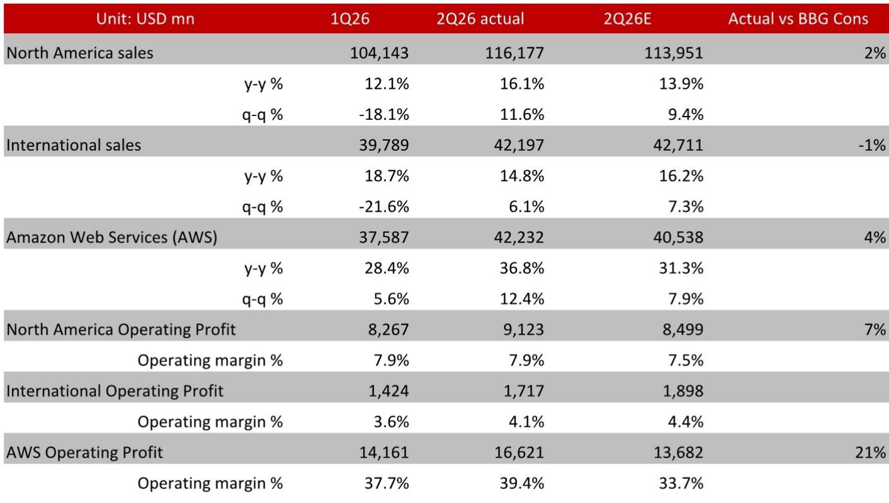
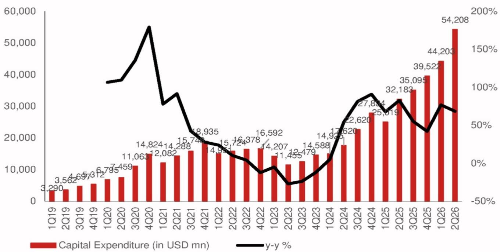
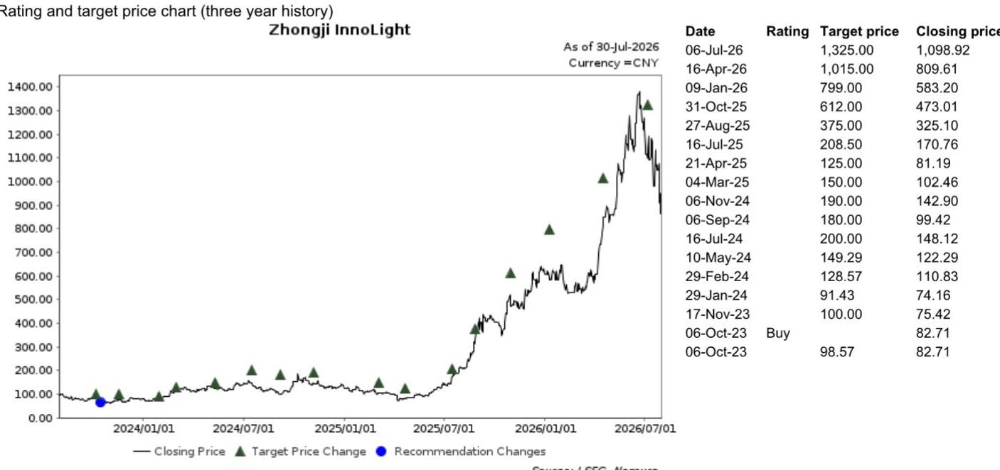

# NOM：全球AI趋势追踪-亚马逊二季度财报解读

亚马逊在7月31日美股盘后交出二季度成绩单。营收2006亿美元，同比增长19.6%，高出公司此前指引区间上限；经营利润同比增长43%，超出市场一致预期16%。这些数字本身不算意外，真正引起NOM关注的是管理层对AI基础设施投入节奏和回报周期的表述——全年资本开支指引从2000亿美元上调至2200亿美元，理由是内存成本上升。

这份报告的核心判断是：AWS云业务的收入增速和客户对算力容量的预订情况，正在为市场关于AI基础设施过度投入的担忧提供一种回答。管理层给出的信号是，2028年的部分产能已经被预订，服务器和网络设备的投入回收期不到三年。

## 1. AWS收入增速加快，积压订单同比三位数增长

AWS在二季度实现收入422亿美元，同比增长36.8%，环比增长12.4%，高出彭博一致预期4%。经营利润率环比提升1.7个百分点至39.4%。更值得留意的是积压订单达到4960亿美元，同比三位数增长，年化收入（ARR）达到1690亿美元。

这些数字放在一起看，说明AWS的增速不是靠降价或一次性合同撑起来的。管理层在电话会上提到，AWS云业务长期有望成为年收入1万亿美元的业务。NOM认为，云产能需求持续到2028年的可见度，有助于缓解市场对AI基础设施投入过度的担忧。

> **KC评论：** 积压订单4960亿美元这个数字，比单季收入更能说明问题。它意味着客户已经签了约、但还没消耗完的云资源承诺，是未来收入的先行指标。

## 2. 芯片业务年化收入超250亿美元，Trainium客户范围扩大

管理层在电话会上披露，芯片业务现在的年化收入超过250亿美元，同比三位数增长。Graviton芯片的性价比比其他选项高出30%到40%，Graviton已被AWS前1000大EC2客户中的98%使用。Graviton 5的增速大约是Graviton 4同期的两倍。

Trainium的采用范围也在扩大。除了Anthropic和OpenAI，越来越多的AI初创公司开始采用Trainium，包括Neurobotics、Odyssey等。芯片业务的收入承诺环比增长近三倍。这些信息合在一起，指向一个判断：AWS自研芯片正在从成本优化工具变成一项有规模的收入来源。

## 3. 服务器投入回收期不到三年，产能已预订至2028年

管理层给出了一个具体的回报测算：服务器和网络设备的投入，平均不到三年就能达到盈亏平衡点。而服务器的使用寿命至少五到六年，大部分AI产能的合同期限至少五年。这意味着在盈亏平衡之后的两到三年里，这些资产可以产生可观的自由现金流。AWS数据中心的使用寿命超过30年，管理层认为公司至少能经历五到六代服务器的宏观环境周期。

产能方面，管理层此前预计到2027年底电力容量将比2025年弹性较高，目前仍在按计划推进。2027年的大部分产能已被预订，2028年的部分产能也已有人预订。管理层还表示，2200亿美元的资本开支仍然无法满足2026年的全部需求，并认为这种供需关系会延续到2027年。

> **KC评论：** 服务器投入回收期不到三年、使用寿命五到六年，这两个数字之间的差额就是自由现金流的来源。报告认为，市场对AI资本开支的担忧，部分源于没有把资产的使用寿命和合同期限放在一起看。

## 4. 观察AI基础设施投入的四个锚点

这份报告提供了一个可以复用的观察框架，核心是四个相互独立又彼此印证的指标。

第一是积压订单的增速和规模，它反映客户对未来算力需求的承诺强度。第二是芯片业务的年化收入，它衡量自研芯片从替代方案变成独立收入来源的进度。第三是投入回收期与资产使用寿命之间的差额，它决定资本开支在盈亏平衡之后能释放多少自由现金流。第四是产能预订的时间跨度，2027年大部分已预订、2028年部分已预订，这个时间维度比单季资本开支数字更能说明需求的持续性。

NOM在这份报告里同时给出了对相关市场相关供应商的观察，包括全球光模块龙头中际旭创，以及主要PCB和覆铜板供应商生益科技和生益电子。报告认为，AWS云业务的收入增长和云产能需求的持续性，对这些上游供应商的订单可见度有直接含义。

For informational purposes only. Portions may be generated,translated,summarized,or edited with AI assistance based on source materials and may contain omissions or errors. Please verify independently. This is not investment,legal,tax,accounting,or other professional advice.

For informational purposes only. Portions may be generated,translated,summarized,or edited with AI assistance based on source materials and may contain omissions or errors. Please verify independently. This is not investment,legal,tax,accounting,or other professional advice.

