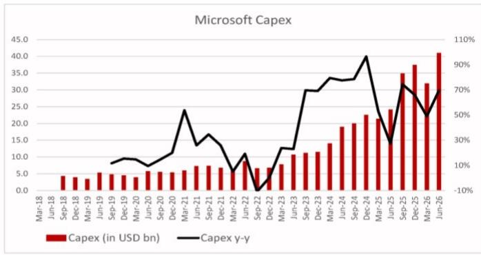
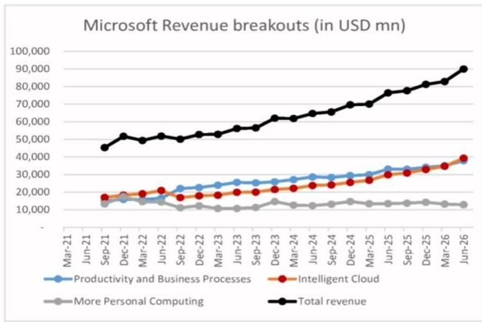

# 微软六月季度业绩观察笔记

## 核心要点

微软（MSFT US，未评级）于2026年7月30日美股收盘后公布了2026财年第四季度（截至2026年6月）的业绩，管理层同日召开了电话会议，讨论了AI基础设施、AI平台、应用与智能体，以及对2027财年第一季度和全年的展望。

管理层预计2027财年第一季度资本开支将超过500亿美元；2026自然年资本开支指引保持不变，但由于部分数据中心从融资租赁转为经营租赁，会计口径下从1900亿美元调整为1750亿美元。管理层预计2027财年资本开支将继续增长，同时自由现金流保持为正。

我们注意到，近期AI数据中心基础设施相关公司面临一定调整，部分原因在于市场对超大规模AI平台资本开支增长的持续性和自由现金流状况存在担忧。我们认为，微软对2027财年资本开支继续增长和自由现金流为正的展望，有助于缓解市场对AI基础设施板块的担忧。我们关注全球光模块龙头中际旭创（300308 CH），以及主要PCB/CCL供应商如生益科技（600183 CH）和深南电路（002463 CH）。

## 业绩概览

- 微软云第四财季收入超过593亿美元，同比增长27%，反映出Azure和AI应用的强劲需求。
- 商业订单量同比增长18%（不含OpenAI[未上市]影响）；若计入来自OpenAI的Azure承诺，订单量同比增长10%（固定汇率下增长11%）。不含OpenAI的剩余履约义务（RPO）同比增长25%，主要由前沿模型公司之外的客户承诺驱动。

## 核心业务表现

**生产力与业务流程**

- 该板块收入为378亿美元，同比增长14%，由M365商业云驱动。
- M365商业云收入同比增长16%，M365 Copilot席位超过3000万。包括Copilot、E5以及E7早期进展在内的高端产品推动了本季度每用户平均收入（ARPU）的增长。
- Dynamics 365收入同比增长13%（固定汇率下增长12%），订单量增速持续温和。
- M365商业产品收入同比增长19%，主要得益于大额长期M365合同带来的Windows商业本地组件当期收入确认增加。

**智能云**

- 智能云收入为393亿美元，同比增长32%（固定汇率下增长31%），由Azure驱动。Azure及其他云服务收入同比增长43%，客户需求持续超过可用容量。
- M365消费者云收入同比增长24%（固定汇率下增长22%），由ARPU增长驱动。M365消费者订阅数同比增长7%。

**资本开支**

- 第四财季资本开支为410亿美元（含融资租赁），同比增长69%，环比下降29%。约三分之二的资本开支用于短期资产，主要为GPU和CPU。

## 资本开支指引与2027财年展望

- 2026自然年资本开支指引不变，但会计口径从1900亿美元调整为1750亿美元，原因是融资租赁向经营租赁的转变。
- 2027财年第一季度资本开支指引为500亿美元以上，包含使用寿命更新带来的租赁重分类影响。管理层预计2027财年资本开支同比增长。
- 2027财年第一季度总收入指引为898.5亿至909.5亿美元，同比增长18%-19%。
- 管理层预计本财年商业云收入增长将逐步加快。

## AI基础设施

- 管理层预计Cobalt 200机架将部署在全球超过25个数据中心。
- 微软正在将部分推理模型与其自研芯片协同设计，在Maia 200上运行MAI模型时，每瓦性能提升约40%。

## AI智能体、应用与平台的商业化进展

- Fabric付费客户超过4万家，同比增长60%以上；使用Foundry和Fabric的客户超过1.7万家，同比增长60%。
- Foundry客户达10万家，第四财季收入同比增长超过一倍；年化运行率达到1万亿token的Foundry客户数量同比增长4倍。
- 付费Microsoft 365 Copilot席位超过3000万，净增席位环比增长超过一倍。Copilot正从对话协作向自动化方向快速演进。
- 席位超过5万的客户数量同比增长超过7倍；将Copilot部署给大多数信息工作者的企业客户数量环比增长近75%。
- GitHub用户达2.25亿，GitHub Copilot用户达5000万，Copilot收入环比增长超过60%。微软引入了基于使用量的计费模式，商业和企业席位持续增长。

## 附录：季度业绩摘要

| 微软 | 季度 | 2026年6月 | | |
|---|---|---|---|---|
| 收入单位：百万美元（资本开支除外） | 收入 | 同比 | 环比 | 下季度指引 |
| 总收入 | 90,007 | 18% | 9% | |
| 生产力与业务流程 | 37,847 | 14% | 8% | 367-370亿美元，同比+11~12% |
| 智能云 | 39,306 | 32% | 13% | 409.5-412.5亿美元，同比+37~38% |
| 更多个人计算 | 12,854 | -4% | -3% | 122-127亿美元，同比-6~-9% |
| 资本开支（十亿美元） | 41.0 | 69% | 29% | 500亿美元以上 |

数据来源：公司数据、NOM

## 资本开支增长趋势

数据来源：公司数据、NOM

## 收入结构（百万美元）

数据来源：公司数据、NOM
