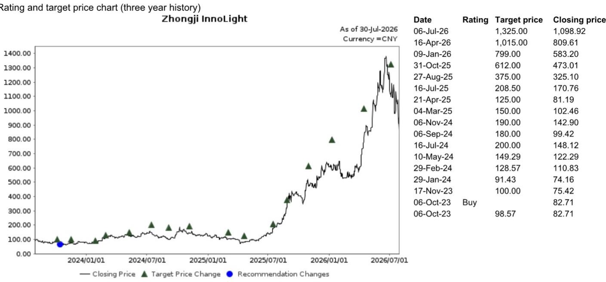
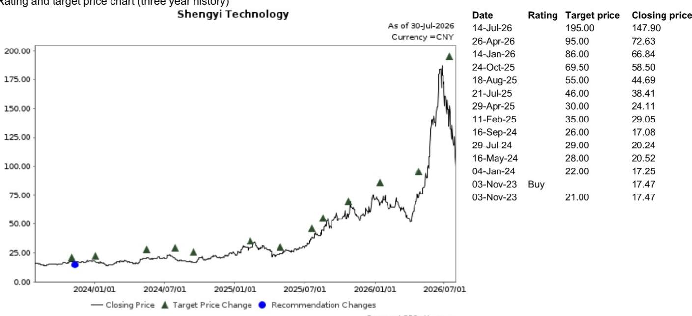
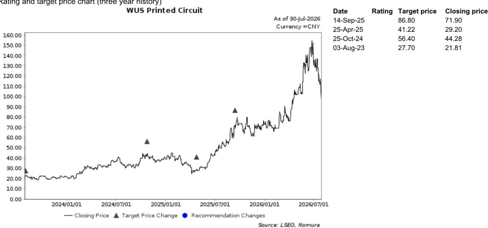

# Microsoft 六月季度回应 AI 资本开支讨论：增长而非自由现金流是核心约束

Microsoft 于 2026 年 7 月 30 日发布的第四财季业绩，对“超大规模 AI 基础设施支出即将见顶”的观点给出了有力回应。公司实现营收 900 亿美元，同比增长 18%，Azure 及其他云服务按固定汇率计算增长 43%，客户需求仍超过可用产能。更具前瞻意义的信号在于：管理层预计 2027 财年第一季度资本开支将超过 500 亿美元，确认 2026 日历年资本开支在会计基础上维持 1750 亿美元不变，并明确表示 2027 财年资本开支将同比增长，同时自由现金流保持为正。

这一表态之所以重要，是因为 AI 基础设施领域此前一直受到一种担忧的困扰：超大规模云厂商最终不得不在增长与现金创造之间做出取舍，AI 的资本密集度将迫使行业面临调整。Microsoft 的前瞻指引对这一二元对立提出了挑战。公司用具体数字说明，它可以同时实现资本开支增长、营收增长和自由现金流保持。对于 AI 供应链的参与者而言，这一信号的传导是直接的：来自最大企业云提供商的需求信号依然强劲，近期光模块、PCB 和 CCL 板块的调整或许已超出基本面所支持的范围。

本季度还揭示了第二个较为低调的变化。Microsoft 的 AI 商业化已不再是对未来采用曲线的承诺，而是一组围绕付费席位、客户数量和收入加速的具体指标。超过 3000 万付费 Microsoft 365 Copilot 席位、5000 万 GitHub Copilot 用户、10 万 Foundry 客户和 4 万 Fabric 付费客户，这些数字并非愿景性目标，而是支撑“AI 正在成为持久收入来源而非成本中心”这一判断的证据基础。市场面临的关键问题已不再是 AI 能否实现自我回报，而是技术栈的哪一层——应用、平台还是物理基础设施——能够创造最大价值。

## 资本开支指引重塑 AI 基础设施供应商的风险评估

本季度最重要的数字并非营收，而是 2027 财年第一季度超过 500 亿美元的资本开支指引，这表明 Microsoft 的基础设施建设正在新财年加速推进。资本开支从 2026 财年第三季度的 581 亿美元降至第四季度的 410 亿美元，属于季度性时间安排因素，而非战略收缩。管理层明确表示 2027 财年资本开支将同比增长，加上 2026 日历年 1750 亿美元的指引保持不变，确立了未来多个季度投资持续上升的轨迹。

2026 日历年资本开支从 1900 亿美元调整至 1750 亿美元的会计处理值得仔细解读。这一调整并非支出削减，而是反映了一些数据中心融资方式的变化——从融资租赁转向经营租赁。这是资产负债表层面的优化，在保持实际建设规模不变的同时调整了报表中的资本开支数字。对于光模块、PCB 和覆铜板供应商而言，这一区别不如总体需求信号重要。Microsoft 仍在大规模建设，转向经营租赁并不会减少所需的物理组件。

自由现金流指引是这一论证的另一半。管理层预计 2027 财年自由现金流在资本开支增长的同时仍将保持为正。这一判断基于商业云业务中嵌入的运营杠杆——本季度 Microsoft Cloud 收入增长 27%，Intelligent Cloud 增长 32%，为基础设施建设提供了现金流支持。市场此前的担忧是 AI 资本开支最终会挤压股东回报或导致资产负债表承压。Microsoft 的指引表明情况恰恰相反：公司视 AI 基础设施为一项自我融资的投资，收入增长与现金转化同步推进。

对 AI 供应链而言，这意味着近期相关板块的调整更多由情绪驱动而非基本面变化。与超大规模资本开支关联度最高的公司——全球光模块龙头及主要 PCB 和 CCL 供应商——已被重新定价，仿佛建设周期即将见顶。Microsoft 的指引表明，在可预见的规划期内看不到峰值。来自最大企业云提供商的需求信号是：AI 基础设施仍是增长的核心约束，而非可在成本审查中随意削减的可选项。

## 商业云加速是资本开支承诺的引擎

资本开支指引的可信度取决于收入轨迹，而 Microsoft 本季度交出的成绩单支持了积极的建设计划。Microsoft Cloud 收入超过 593 亿美元，同比增长 27%；Intelligent Cloud 增长 32% 至 393 亿美元。Azure 及其他云服务按固定汇率计算增长 43%，管理层表示客户需求持续超过可用产能——这是关键数据点。当一家超大规模云厂商表示需求超过供给时，这不是营销话术，而是下一轮资本支出的运营依据。

商业订单数据进一步支持了这一判断。剔除 OpenAI 的影响后，商业订单同比增长 18%，RPO（剩余履约义务）剔除 OpenAI 后同比增长 25%，增长动力来自前沿模型公司之外的企业客户。这是一个重要区分。市场此前担心 AI 需求集中在少数前沿实验室，这将使资本开支周期变得脆弱且依赖狭窄的客户基础。Microsoft 剔除 OpenAI 后的 RPO 增长表明，需求正在企业客户中扩大，而非集中在少数 AI 初创公司。

下一季度的指引支持加速增长的判断。管理层预计 2027 财年第一季度总营收为 898.5 亿至 909.5 亿美元，同比增长 18% 至 19%，并预计商业云收入增长将在整个财年逐步加速。产能约束、RPO 上升和明确的加速指引三者结合，形成了一个连贯的叙事：需求是真实的，积压订单在增长，资本开支是对供给约束的回应，而非对未经验证市场的押注。

对于观察者而言，订单和 RPO 数据是最重要的先行指标。收入是云需求的滞后指标；RPO 捕捉的是未来几个季度将转化为收入的已承诺支出。剔除 OpenAI 后 RPO 增长 25% 意味着收入加速已经锁定，这降低了资本开支计划中的执行风险。AI 基础设施的研究逻辑并非押注未来需求的出现，而是押注 Microsoft 将现有积压订单转化为产能的能力。

## AI 商业化指标显示从试验到生产工作负载的转变

本季度最被低估的方面是 Microsoft AI 商业化指标的成熟度。公司目前报告超过 3000 万付费 Microsoft 365 Copilot 席位，净增席位环比增长超过一倍。拥有超过 5 万席位的客户数量同比增长超过 7 倍，将 Copilot 部署到大多数信息工作者中的企业客户数量环比增长近 75%。这些数字并非早期采用者的规模；它们表明 Copilot 正从试点项目走向企业级全面部署。

GitHub Copilot 提供了更清晰的生产使用信号。拥有 5000 万用户，Copilot 收入环比加速增长超过 60%，基于使用量的计费模式似乎扩大了采用范围而非限制了它。席位增长与基于使用量的收入相结合，形成了双重商业化引擎：企业为访问付费，开发者为消耗付费。2.25 亿 GitHub 用户为后续转化提供了庞大的安装基础。

数据平台指标补全了整体图景。Fabric 目前拥有超过 4 万付费客户，同比增长超过 60%；1.7 万客户同时使用 Foundry 和 Fabric。Foundry 拥有 10 万客户，2026 财年第四季度收入同比增长超过一倍，年化处理量达到 1 万亿 token 级别的客户数量同比增长 4 倍。Token 消耗数据尤为重要，因为它衡量的是实际的 AI 工作负载使用情况，而非仅仅是订阅数量。年处理量达万亿 token 级别的客户数量增长 4 倍，表明 AI 正在进入具有真实计算需求的生产工作负载。

战略意义在于，Microsoft 同时在技术栈的多个层面实现 AI 商业化：应用层（Copilot）、开发者工具层（GitHub Copilot）、数据平台层（Fabric）和模型部署层（Foundry）。这种多元化降低了任何单一商业化路径无法实现的风险。同时也意味着资本开支并非资助一项投机性押注，而是在建设一项已经产生可衡量回报的生产基础设施。

## 硬件路线图显示芯片级优化正成为竞争武器

Microsoft 关于其芯片和硬件路线图的阐述揭示了 AI 基础设施讨论中常被忽视的第二层优势。公司预计 Cobalt 200 机架将部署于全球超过 25 个数据中心，并正在与其芯片协同设计推理模型，在 Maia 200 上运行 MAI 模型时每瓦性能提升 40%。这些并非渐进式的效率改进，而是随时间推移不断累积的架构优势。

每瓦性能的提升之所以重要，有两个原因。首先，它直接回应了电力约束——这正成为许多地区数据中心扩张的硬性限制。40% 的效率提升意味着 Microsoft 可以在相同的电力范围内部署更多算力，这在电网容量有限的市场中具有战略价值。其次，它改变了 AI 推理的经济性。推理模型计算密集，大规模服务的成本取决于硬件效率和软件优化的共同作用。Microsoft 的协同设计方法表明，它正在 AI 部署的成本结构上构建护城河。

芯片战略对供应链也有影响。当超大规模云厂商设计定制芯片时，它仍然依赖外部供应商提供周边基础设施：光互连、PCB、CCL 和电源管理组件。转向定制芯片并不会减少物理建设规模；它改变了组件组合，并可能增加系统复杂性。对于能够满足超大规模部署性能和可靠性要求的供应商而言，需求背景依然有利。

Cobalt 200 在 25 个数据中心的部署是规模化和标准化的信号。这表明 Microsoft 已超越试点部署阶段，进入可在全球范围内复制的标准化基础设施平台阶段。正是这种标准化使得 500 亿美元以上的季度资本开支指引所隐含的快速部署成为可能。公司并非为每个数据中心构建定制基础设施，而是在部署可重复的架构，这降低了执行风险并加快了扩张步伐。

## AI 基础设施投资的分析框架

Microsoft 本季度业绩为评估 AI 基础设施相关投资提供了一个参考模板，并提出了一套区分持久需求与周期性噪音的具体标准。第一个标准是对已确认多年轨迹的超大规模资本开支的敞口。Microsoft 对 2027 财年资本开支增长的指引，加上 2026 日历年计划保持不变，确立了一个超出当前季度的规划周期。与此支出直接相关的供应商，应评估其产能扩张能力是否与超大规模云厂商的部署时间表相匹配。

第二个标准是供应链内部的技术路线图。光模块市场正在向 800G 和 1.6T 模块过渡，PCB 和 CCL 市场正在向更高层数板和支持更快信号传输的材料转变。引领这些转型而非跟随的供应商，更有可能在超大规模云厂商升级基础设施时创造价值。Microsoft 通过定制芯片实现的每瓦性能提升，将增加对更高性能互连和封装解决方案的需求，这有利于各组件类别中的技术领先者。

第三个标准是供应商的资产负债表和现金流状况。Microsoft 在资本开支增长的同时保持正自由现金流的能力，是其规模和定价能力的体现，并非 AI 供应链中所有公司都具备。拥有强劲利润率和可控债务水平的供应商，更有能力自主融资产能扩张以满足超大规模云厂商的需求。AI 基础设施领域的风险不在需求侧，而在供给侧——无法为产能扩张融资的公司将把份额让给能够做到这一点的公司。

第四个标准是客户基础的多元化。Microsoft 剔除 OpenAI 后的 RPO 增长提醒我们，最持久的 AI 需求来自企业客户，而非仅来自前沿实验室。服务多家超大规模云厂商和多个企业细分市场的供应商，对任何单一客户的资本开支决策的敞口都较小。在当前周期中获益最多的公司，正是那些对 AI 建设拥有最广泛敞口的公司，而这种广度不仅是增长驱动力，也是风险缓释因素。

从 Microsoft 本季度业绩中得出的最终综合判断是：AI 基础设施周期正由一个自我强化的循环驱动——收入增长为资本开支提供资金，资本开支创造产能，产能支撑更多收入。这一循环并非没有风险——执行失误、需求不足或技术变革都可能打破它——但本季度的证据表明，这一循环仍然完好且正在加速。市场对自由现金流和资本开支可持续性的关注是一种有益的约束，但 Microsoft 的指引表明，这种约束被应用得过于严格，定价了一个公司自身数据并不支持的放缓情景。

*仅供参考。部分内容可能基于原始材料由 AI 辅助生成、翻译、摘要或编辑，可能包含遗漏或错误。请独立核实。本文不构成投资、法律、税务、会计或其他专业建议。*

仅供参考。部分内容可能基于原始材料由 AI 辅助生成、翻译、摘要或编辑，可能包含遗漏或错误。请独立核实。本文不构成投资、法律、税务、会计或其他专业建议。

