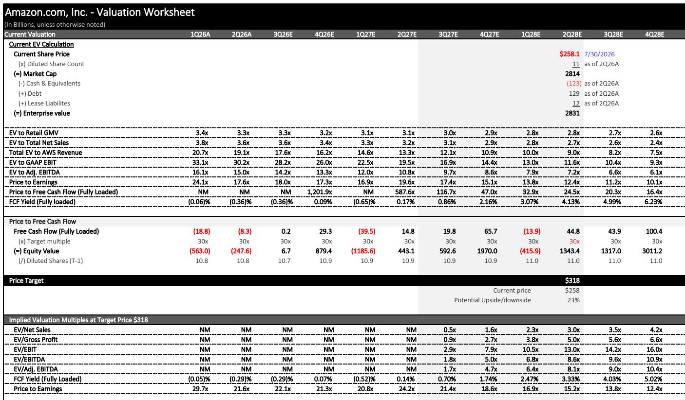
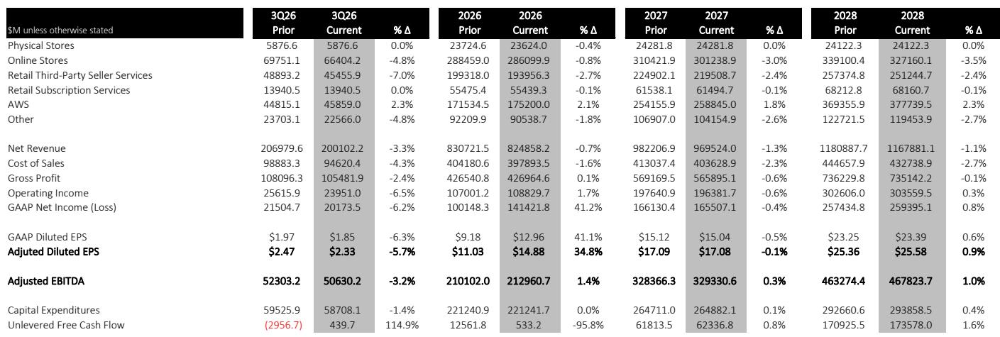

# AWS’s $496 Billion Backlog Is the Real Story,Not the Quarter

Amazon’s second-quarter 2026 results contained a number that should reset how investors think about the company’s next three years. AWS disclosed $25 billion in annualized AI revenue,and total remaining performance obligations jumped to $496 billion. The first figure confirms that Amazon’s AI bet is working. The second is more important:it is the contractual foundation for a growth trajectory that most of the market still refuses to model. The stock trades at roughly 19 times 2027 GAAP earnings estimates,a multiple that implies the market views Amazon as a mature retailer with a side business in cloud computing. The backlog says otherwise. AWS is on track to grow nearly 39 percent year over year in the second half of 2026,and the acceleration into 2027 is built on contracts already signed,not hopes.

The timing of this inflection matters. Amazon has spent the past two years absorbing the cost of building out AI infrastructure,and the market has rewarded that spending with skepticism about whether the returns would ever justify the capital. The $220 billion capital expenditure guide for 2026 only deepened that concern. But the quarter’s data points suggest the spending is now converting into revenue commitments at a pace that outruns the cost curve. AWS grew 37 percent year over year,well above the 31 percent consensus expectation. Even adjusting for a one-time $1.2 billion benefit from tariff refunds and energy contract changes,operating income beat by a meaningful margin. The narrative that Amazon is sacrificing profitability for AI growth is no longer supported by the numbers.

The market’s hesitation is understandable. Amazon’s reported net income included a $53.4 billion gain from the mark-to-market of its Anthropic investment,which distorts the quality of the headline beat. Excluding that gain,reported results would have come in below the Street. Bears will point to that as evidence that the core business is not as strong as it appears. That argument misses the structural shift underway. The $496 billion backlog,the $25 billion AI revenue run rate,and the 37 percent AWS growth are not accounting artifacts. They are contractual obligations and recurring revenue streams that compound over time. The Anthropic gain is noise. The backlog is signal.

The question for investors is no longer whether Amazon can grow. It is whether the market will re-rate the stock to reflect the earnings power that the backlog implies. The analysis below walks through the mechanics of that re-rating,the margin dynamics that most investors are getting wrong,and the decision framework for positioning ahead of what should be a multi-year earnings acceleration.

## The $496 Billion Backlog Resets the Growth Debate Because It Represents Signed Contracts,Not Pipelines

Amazon’s remaining performance obligations grew by $51 billion quarter over quarter to $496 billion,a figure that includes the $100 billion Anthropic agreement. The market had expected the backlog to step up by roughly $100 billion in the quarter given the previously announced Anthropic deal,but the actual increase was smaller because some of that commitment was already recognized in prior periods. The more important detail is the composition. The backlog is not a pipeline of potential deals. It is a set of signed contracts that Amazon will recognize as revenue over time. Every dollar in that backlog is already committed by a customer,and the duration of these contracts typically spans multiple years.

This changes the nature of the AWS growth debate. When AWS grew 37 percent in the quarter,skeptics could argue that the growth was driven by a few large deals that would not repeat. The backlog removes that argument. A $496 billion backlog against an AWS revenue base of roughly $175 billion for the full year means Amazon has more than two and a half years of AWS revenue already contracted. The question is not whether AWS will grow. It is how fast the contracted revenue will be recognized,and the answer to that question is determined by capacity deployment,not customer demand.

The acceleration is already visible in the estimates. AWS growth rates rise to 38.9 percent in the third quarter of 2026 and 36.1 percent for the full year,up from prior estimates of 35.8 percent and 33.3 percent respectively. The step-up is driven by the combination of the backlog conversion and the ramp of AI workloads on Bedrock and core services. The reported $25 billion in AI annualized revenue,up from $20 billion in the first quarter,shows that the AI demand is not concentrated in a single customer or use case. It is broad-based enterprise adoption,and it is growing faster than the underlying AWS business.

The second-order implication is that the market’s growth models are still too conservative. Consensus estimates for AWS revenue are below the revised estimates,and the gap widens in 2027 and 2028. As the backlog converts and AI workloads scale,the Street will be forced to revise upward. The re-rating of Amazon’s stock will follow the revision of AWS estimates,not precede it. Investors who wait for the consensus to catch up will pay a higher multiple for the same earnings power.

## AWS Margins Are Expanding Despite the AI Mix Shift,and the Math Shows Why the Street Is Wrong to Assume Otherwise

The conventional wisdom on AWS margins is that rising AI compute workloads will compress operating margins because AI inference and training are more capital-intensive than traditional cloud workloads. The second-quarter results challenge that assumption. AWS operating margins were flat sequentially at 38 percent,after adjusting for a $600 million energy cost benefit. That stability came in a quarter where AI revenue more than doubled sequentially from $10 billion to $25 billion in annualized run rate. The margin held because AWS is pricing AI services at a level that covers the incremental cost of the underlying infrastructure.

The more interesting dynamic is what happens to margins as AWS revenue accelerates into 2027. The revenue dollar growth for AWS is so large that Amazon would have to increase selling,general,and administrative expenses at three times the rate of recent years just to keep segment margins flat. That is not going to happen. SG&A is not scaling linearly with AI revenue because the cost structure of AWS is dominated by depreciation and cost of revenue,not by headcount or marketing. The result is that AWS operating margins are more likely to expand than contract over the next two years,even as AI workloads become a larger share of the mix.

This is the margin story that the market is missing. The bear case on Amazon has always been that the company cannot grow into its cost base,that the e-commerce business is structurally low-margin,and that AWS will eventually face the same commoditization pressure that hit other technology infrastructure businesses. The current data does not support any of those conclusions. AWS margins are stable to expanding. E-commerce margins are improving as units grow faster than shipping costs on a sequential basis. And the backlog provides visibility into revenue growth that most technology companies cannot match.

The operating income trajectory reinforces the point. Operating income estimates for 2027 are now $217.8 billion,up from $99.4 billion in 2025. That implies an operating margin of 22.5 percent,up from 13.9 percent. The margin expansion is driven by AWS operating leverage,but it is also supported by the e-commerce business,where faster delivery times are driving higher purchase frequency and better unit economics. The combination of AWS acceleration and e-commerce improvement creates a margin profile that the stock price does not reflect.

## The E-Commerce Business Is Inflecting Toward Higher-Margin Recurring Purchases,Not Slowing

The second-quarter data on units and shipping costs deserves more attention than it has received. Shipping cost growth of 19 percent outpaced unit growth of 17 percent,the first time the metrics have inflected since the pandemic. The immediate read is that Amazon is spending more to deliver each unit,which would be a margin negative. But the sequential detail tells a different story. Unit growth accelerated by 2 percentage points sequentially,which means customer demand is strengthening off a much larger base. The higher shipping costs are driven by fuel prices and investments in faster delivery,including same-day and one-day shipping,the expansion of Amazon Now into international markets,and a higher volume of essentials,groceries,and pharmacy items.

The mix shift toward consumables is the strategic story. Essentials,groceries,and pharmacy are repeat-purchase categories with higher frequency than discretionary items. When customers 报告观点groceries through Amazon,they are establishing a weekly or biweekly habit that drives sustained order volume. The higher shipping costs associated with these categories are offset by the lifetime value of the customer relationship. The unit growth acceleration suggests the strategy is working,and the margin impact of faster delivery is being absorbed by higher purchase frequency.

The e-commerce margin story is also supported by the Prime Day timing shift. The US Prime Day moved from July to June,which pulled forward revenue that would typically be recognized in the third quarter. The third-quarter revenue guide of $197 billion to $202 billion looks light against the Street at $203.9 billion,but excluding the Prime Day impact,growth would be approximately 400 basis points higher. The market will focus on the headline miss against the guide,but the underlying demand is stronger than the reported numbers suggest.

The advertising business is the other piece of the e-commerce margin puzzle. Advertising revenue came in modestly below expectations in the quarter,but the long-term trajectory is intact. Prime Video with ads is still in its early innings,and the combination of retail media and video advertising creates a high-margin revenue stream that should become a more meaningful contributor over time. The advertising business has operating margins well above the company average,and every dollar of advertising revenue is a dollar that does not require incremental fulfillment or shipping cost.

## The Decision Framework:What the Backlog and Margin Data Mean for Positioning

The investment question is not whether Amazon is a good company. It is whether the stock price reflects the earnings power that the backlog and margin trajectory imply. The current valuation of approximately 19 times 2027 GAAP earnings per share of $17.08 is below the market multiple. That discount exists because the market is still modeling AWS growth at rates that are below what the backlog and AI revenue disclosures support. The gap between the current estimates and the revised estimates is the opportunity.

The decision framework for investors has three components. The first is the growth rate of AWS. If AWS grows at the revised estimates of roughly 39 percent in the second half of 2026 and above 40 percent in 2027,the revenue base will be meaningfully higher than consensus models. The second is the margin trajectory. If AWS operating margins 报告观点at or above 38 percent while revenue accelerates,the operating income growth will outpace revenue growth,creating operating leverage that flows directly to the bottom line. The third is the e-commerce unit economics. If unit growth continues to accelerate while shipping cost growth moderates,the e-commerce segment will contribute more to operating income than the market expects.

The risk to the framework is the capital expenditure trajectory. The 2026 capital expenditure guide was revised upward to $220 billion,driven largely by higher memory costs. That revision is a double-edged sword. On one side,it funds the capacity needed to convert the backlog into revenue. On the other side,it pressures free cash flow in the near term. The free cash flow yield is expected to remain below 1 percent in 2026 before inflecting to 2.2 percent in 2027 and 6.5 percent in 2028. The inflection is the bet. The market is being asked to underwrite two years of depressed free cash flow in exchange for a multi-year earnings acceleration that the backlog makes visible.

The more compelling way to think about the capital expenditure is as a pre-payment for the backlog. Amazon is spending $220 billion in 2026 to build capacity that will generate revenue for years. The return on that investment is already contracted. The market is treating the capital expenditure as a cost without fully crediting the revenue that the capacity will generate. That asymmetry is the source of the mispricing.

## The Re-Rating Case Rests on the Street Closing the Gap to Revised Estimates,Not on a Multiple Expansion

o the free cash flow estimate of $116.3 billion for the period from the third quarter of 2027 to the second quarter of 2028. The multiple is unchanged. The target increase comes entirely from higher estimates. This is the correct way to think about the re-rating. Amazon does not need a multiple expansion to generate attractive returns. It needs the Street to close the gap between current estimates and the revised estimates that the backlog and margin data support.

The gap is substantial. Consensus 2027 earnings per share estimates are $10.06 against the revised estimate of $17.08. The difference is 70 percent. That gap will close as the Street updates its AWS growth assumptions and incorporates the margin trajectory into its models. Each revision will push the stock higher as the earnings power becomes more visible. The re-rating is not a matter of if,but when.

The pace of the revision depends on the quarterly execution. The third-quarter guide looks light,but the Prime Day timing shift explains the gap. The fourth quarter should show the acceleration more clearly,and the 2027 guidance should confirm the trajectory. The market will be watching the AWS growth rate and the operating margin with equal intensity. If AWS maintains growth above 35 percent while margins 报告观点at or above 38 percent,the consensus revisions will accelerate.

The stock at 19 times 2027 earnings does not deserve to trade below the market multiple. The earnings growth rate through 2028 is above 50 percent compounded annually,driven by AWS acceleration,e-commerce margin expansion,and advertising growth. A company growing earnings at that rate while trading below the market multiple is either mispriced or facing structural decline. The backlog,the AI revenue disclosure,and the margin data all point to the former. The market will eventually agree,and the re-rating will follow the estimate revisions.

*For informational purposes only. Portions may be generated,translated,summarized,or edited with AI assistance based on source materials and may contain omissions or errors. Please verify independently. This is not investment,legal,tax,accounting,or other professional advice.*

For informational purposes only. Portions may be generated,translated,summarized,or edited with AI assistance based on source materials and may contain omissions or errors. Please verify independently. This is not investment,legal,tax,accounting,or other professional advice.
