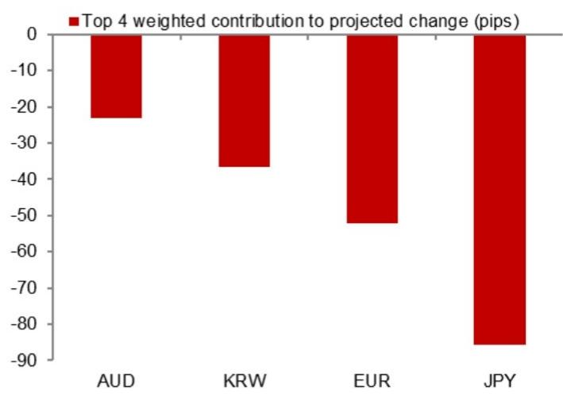
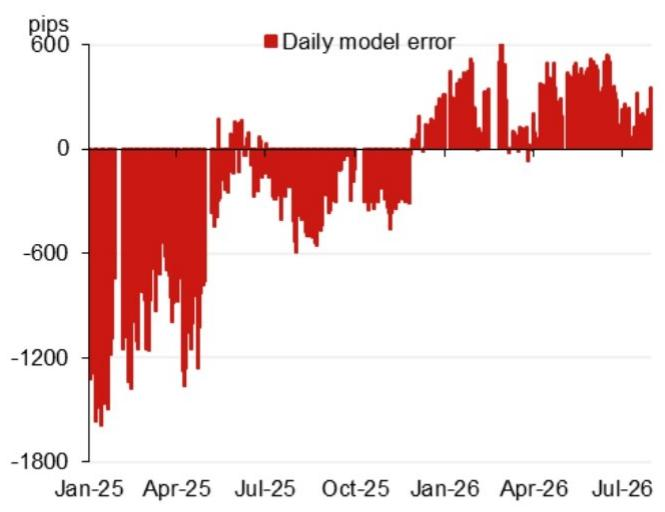

# 美元兑人民币报价观察模型

2026年7月31日

外汇市场 - 亚洲（除日本外）

## 模型测算：6.7300

模型测算值为6.7300，此前为6.7892（较上次官方报价低592个基点；较上次官方收盘价低264个基点）。

含逆周期因子的模型测算值：6.7426（较上次报价低466个基点）。

## 研究分析师

亚洲外汇策略团队
Craig Chan - NSL
craig.chan@NOM.com

Wee Choon Teo - NSL
weechoon.teo@NOM.com

Vicky Chen - NSL
vicky.chen1@NOM.com

Manthan Shingala - NSL
manthan.shingala1@NOM.com

图1：对测算变化贡献最大的前4项隔夜权重（不含逆周期因子）  
  
来源：NOM

图2：近期模型误差（不含逆周期因子调整）  
  
来源：Bloomberg, NOM

图3：美元兑人民币报价每日变化  
  
来源：Bloomberg, NOM

图4：事件日历

<table><tr><td>日期</td><td>事件</td><td>地点</td><td>备注</td></tr><tr><td>2026年7月下旬</td><td>政治局经济工作会议</td><td>中国</td><td>政治局通常每月召开一次会议，7月会议的通稿通常包含经济工作要点及高层优先事项的相关线索。</td></tr><tr><td>2026年8月中旬</td><td>央行2026年二季度货币政策报告</td><td></td><td></td></tr><tr><td>2026年9月24日</td><td>国家主席习近平对美国进行国事访问</td><td>美国华盛顿特区</td><td></td></tr><tr><td>2026年9月下旬</td><td>央行货币政策委员会会议</td><td></td><td></td></tr><tr><td>2026年10月1-7日</td><td>国庆黄金周假期</td><td>中国</td><td></td></tr></table>

来源：Bloomberg, NOM

## 附录A-1

本报告由NOM新加坡有限公司（NSL）编制。

NOM集团实体详情请参阅免责声明。

## 分析师声明

我们，Craig Chan、Wee Choon Teo、Vicky Chen和Manthan Shingala，特此声明：（1）本研究报告中所表达的观点准确反映了我们个人对相关标的或发行人的看法；（2）我们的薪酬中没有任何部分直接或间接与本研究报告中的具体建议或观点相关；（3）我们的薪酬中没有任何部分与NOM Securities International, Inc.、NOM International plc或任何其他NOM集团公司执行的特定投资银行业务挂钩。

## 重要披露

## 研究报告在线获取及利益冲突披露

NOM集团研究报告可在www.NOMnow.com/research、Bloomberg、Capital IQ、Factset、LSEG平台获取。

重要披露内容可访问 http://go.NOMnow.com/research/m/Disclosures 阅读，或向NOM Securities International, Inc.索取。如网站访问遇到问题，请发送邮件至 grpsupport@NOM.com 寻求帮助。

负责编制本报告的分析师薪酬基于多种因素，包括公司总收入，其中一部分来自投资银行业务。除非另有说明，本报告首页列出的非美国分析师未在FINRA规则下注册/取得研究分析师资格，可能不是NSI的关联人员，且可能不受FINRA第2241条关于与所覆盖公司沟通、公开露面及研究分析师账户持仓交易等限制的约束。

NOM Global Financial Products Inc. (NGFP)、NOM Derivative Products Inc. (NDP) 和 NOM International plc (NIplc) 已在商品期货交易委员会和美国期货业协会（NFA）注册为掉期交易商。NGFP、NDPI和NIplc主要从事掉期及其他衍生品交易，相关产品可能为本报告涉及的主题。

## 美国境内额外披露要求

主要交易：NOM Securities International, Inc.及其关联公司通常以主事人身份参与本研究报告所涉及固定收益证券（或相关衍生品）的交易。分析师与其他NOM Securities International, Inc.人员的互动：NOM Securities International, Inc.及其关联公司的固定收益研究分析师定期与销售和交易部门人员互动，以获取其各自覆盖范围内的流动性和定价信息。

## 估值方法 - 固定收益

NOM固定收益策略师通过提供交易建议来表达对证券价格和金融市场的看法。这些建议可以是相对价值建议、方向性交易建议、资产配置建议，或三者的组合。交易建议中包含的分析包括但不限于：

- 关于证券价格是否偏离其宏观或微观基本面基础的基本面分析。

- 价格变动的定量分析。

- 技术因素，如监管变化、市场风险偏好变化、意外评级行动、一级市场活动和供需考量。

交易建议的时间框架各不相同。战术性建议时间框架较短，通常不超过三个月。战略性交易建议的时间框架较长，通常超过三个月。

就欧盟市场滥用条例而言，NOM全球固定收益研究发布的评级分布如下：

52%被授予买入（或同等）评级；其中50%的发行人由NOM集团提供了实质性服务*。
0%被授予中性（或同等）评级。

48%被授予卖出（或同等）评级；其中50%的发行人由NOM集团提供了实质性服务。截至2026年6月30日。

*按欧盟市场滥用条例定义

**NOM集团定义见本报告末尾免责声明部分

## 免责声明

本出版物包含由第1页所列NOM集团实体编制的内容，如适用，还包括一位或多位NOM集团实体的贡献，其员工及各自隶属关系在第1页或本出版物其他地方注明。本出版物中使用的"NOM集团"一词指NOM Holdings, Inc.及其关联公司和子公司，包括：(a) NOM Securities Co., Ltd.（'NSC'）日本东京，(b) NOM Financial Products Europe GmbH（'NFPE'）德国，(c) NOM International plc（'NIplc'）英国，(d) NOM Securities International, Inc.（'NSI'）美国纽约，(e) NOM International (Hong Kong) Ltd.（'NIHK'）中国香港，(f) NOM Financial Investment (Korea) Co., Ltd.（'NFIK'）韩国（在韩国金融投资协会（'KOFIA'）注册的NOM分析师信息可在KOFIA内网 http://dis.kofia.or.kr 查询），(g) NOM Singapore Ltd.（'NSL'）新加坡（注册号197201440E，受新加坡金融管理局监管），(h) NOM Australia Ltd.（'NAL'）澳大利亚（ABN 48 003 032 513），受澳大利亚证券和投资委员会（'ASIC'）监管，持有澳大利亚金融服务牌照号246412，(i) NOM Securities Malaysia Sdn. Bhd.（'NSM'）马来西亚，(j) NIHK台北分公司（'NITB'）中国台湾，(k) NOM Financial Advisory and Securities (India) Private Limited（'NFASL'）印度孟买（注册地址：Ceejay House, Level 11, Plot F, Shivsagar Estate, Dr. Annie Besant Road, Worli, Mumbai- 400 018, India；电话：91 22 4037 4037；传真：91 22 4037 4111；CIN号：U74140MH2007PTC169116；SEBI证券经纪业务注册号：INZ000255633；SEBI投资银行业务注册号：INM000011419；SEBI研究业务注册号：INH000001014 - 合规官：Ms. Pratiksha Tondwalkar，电话：91 22 40374904，投诉邮箱：investorgrievancesra@NOM.com 网页：链接

关于印度上市公司或由印度NFASL研究分析师撰写的报告：(i) 证券市场投资存在市场风险。投资前请仔细阅读所有相关文件。(ii) SEBI的注册和NISM的认证不以任何方式保证中介机构的业绩或向读者提供任何回报保证。(iii) NFASL提供研究服务的条款和条件已在NFASL网页上披露。

(l) NOM Fiduciary Research & Consulting Co., Ltd.（'NFRC'）日本东京。(m) NOM Orient International Securities Co., Ltd（"NOI"）是NOM集团、东方国际（集团）有限公司和上海黄浦投资控股（集团）有限公司共同出资的合资企业，NOM集团持有多数股权。根据中华人民共和国（"中国"，就本文件而言不包括香港、澳门和台湾）法律，NOI在中国境内获得证券研究和研究交流的许可，并独立于NOM集团其他成员运营；特别是，NOI在中国证券中的利益不向NOM集团任何其他实体披露，也不与其持仓合并计算，NOM集团其他实体在中国证券中的利益也不向NOI披露或与其持仓合并计算。研究报告首页上NOI旁边印制的个人姓名表示该个人受雇于NOI，根据研究合作协议为NIHK提供研究协助。研究报告首页员工姓名旁的'NSFSPL'表示该个人受雇于NOM Structured Finance Services Private Limited，根据公司间协议为某些NOM实体提供协助。研究报告首页个人姓名旁的'Verdhana'表示该个人受雇于PT Verdhana Sekuritas Indonesia（'Verdhana'），根据研究合作协议为NIHK提供研究协助，Verdhana及该个人均未在印度尼西亚境外获得许可。

本材料：(I) 仅供您私人参考，我们不基于此材料招揽任何行动；(II) 不构成在任何司法管辖区内出售要约或购买任何证券的要约邀请，在该等司法管辖区内此类要约或邀请将属非法；(III) 除与NOM集团相关的披露外，基于我们认为可靠的来源信息编制，但NOM集团未独立核实。

除与NOM集团相关的披露外，NOM集团不对本文件的公平性、准确性、完整性、正确性、可靠性、适用于任何特定目的或适销性作出明示或暗示的保证、陈述或承诺，并在适用法律和/或法规允许的最大范围内，不对因使用本文件及相关数据而产生的任何行为（或不作为决定）承担责任（无论是过失或其他，全部或部分）。在适用法律和/或法规允许的最大范围内，NOM集团的所有保证和其他承诺在此予以排除，NOM集团不对因使用、误用或分发本材料或其中所含信息或以其他方式与之相关的任何损失承担责任（无论是过失或其他，全部或部分）。

本材料中表达的观点或估计为原始发布日期当时的最新观点，本材料中包含的信息（包括其中所含的观点和估计）如有变更，恕不另行通知。但NOM集团明确否认任何更新或修订本文件的义务，因此没有更新或修订本文件的责任。本文中的任何评论或陈述均为作者的观点，可能与其他NOM集团内部人士的观点不同。客户应考虑本报告中的任何建议或推荐是否适合其特定情况，并在适当时寻求专业建议，包括税务建议。NOM集团不提供税务建议。

在适用法律和/或法规允许的范围内，NOM集团及/或其高级管理人员、董事、员工和关联公司可能以主事人、代理人或其他身份进行交易，或持有本文提及的发行人或证券的多头或空头头寸，或买入或卖出基于其的证券、商品或工具，或期权或其他衍生工具。NOM集团公司也可能担任发行人金融工具的市场做市商或流动性提供者（按英国适用法规的含义）。如市场做市商活动按照美国或其他司法管辖区特定法律法规的定义进行，将在特定发行人披露中单独说明。

本文件可能包含从第三方获得的信息，包括但不限于信用评级机构（如标准普尔）的评级。NOM集团特此明确否认对从第三方获得的任何信息的原创性、公平性、准确性、完整性、正确性、适销性或适用于特定目的的所有陈述、保证或承诺，并且不对因使用或误用本材料中包含的或与之相关的任何第三方信息而导致的任何直接、间接、附带、惩戒性、补偿性、惩罚性、特殊或后果性损害、成本、费用、法律费用或损失（包括收入或利润损失和机会成本）承担责任（无论是过失或其他，全部或部分）。除非获得相关第三方事先书面许可，禁止以任何形式复制和分发第三方内容。第三方内容提供者不对任何信息（包括评级）的公平性、准确性、完整性、正确性、及时性或可用性作出明示或暗示的保证，并且不对因使用或误用此类内容而导致的任何错误或遗漏（无论是过失或其他）或结果负责。第三方内容提供者不作任何明示或暗示的保证，包括但不限于适销性或适用于特定目的或用途的任何保证。第三方内容提供者不对因使用或误用其内容（包括评级）而导致的任何直接、间接、附带、惩戒性、补偿性、惩罚性、特殊或后果性损害、成本、费用、法律费用或损失（包括收入或利润损失和机会成本）承担责任（无论是过失或其他，全部或部分）。信用评级是意见陈述，不是事实陈述，也不是购买、持有或出售证券的建议。它们不涉及证券的适用性或证券用于投资目的的适用性，不应作为研究交流依赖。本文件中任何MSCI来源的信息均为MSCI Inc.（'MSCI'）的专有财产。未经MSCI事先书面许可，不得为任何目的全部或部分复制、转载、再传播、再分发或使用本信息及任何其他MSCI知识产权，包括创建任何金融产品和任何指数。本信息按"现状"提供。使用者承担使用本信息的全部风险。MSCI、其关联公司及参与计算或编制信息的任何第三方特此明确否认对本材料或其中所含信息或以其他方式与之相关的任何内容的原创性、公平性、准确性、完整性、正确性、适销性或适用于特定目的的所有陈述、保证或承诺。在不限制前述规定的情况下，MSCI、其任何关联公司或参与计算或编制信息的任何第三方在任何情况下均不对任何类型的损害承担责任（无论是过失或其他，全部或部分）。MSCI和MSCI指数是MSCI及其关联公司的服务标志。

Russell/NOM日本股票指数的知识产权及其他权利属于NOM Fiduciary Research & Consulting Co., Ltd.（"NFRC"）和FTSE Russell（"Russell"）。NFRC和Russell不保证指数的公平性、准确性、完整性、正确性、可靠性、有用性、适销性、可销售性或适用于特定目的，也不考虑任何指数用户和/或其关联公司使用该指数进行的业务活动或服务。

读者应将本文件视为做出投资决策的单一因素之一，因此，本报告不应被视为识别或暗示与任何投资决策相关的所有直接或间接风险。NOM集团制作多种不同类型的研究产品，包括但不限于基本面分析和定量分析；一种研究产品中的建议可能与其他类型研究产品中的建议不同，无论是由于时间框架、方法论或其他方面的差异。NOM集团以多种不同方式发布研究产品，包括在NOM集团门户网站上发布产品和/或直接分发给客户。不同客户群体可能根据其个人需求从研究部门获得不同的产品和服务。

本文所呈现的数字可能涉及过往表现或基于过往表现的模拟，这些不是未来或可能表现的可靠指标。如果信息包含对未来表现和业务前景的预期、预测或指示，此类预测可能不是未来或可能表现的可靠指标。此外，模拟基于模型和简化假设，可能过度简化且不能反映未来的回报分布。本文件中为说明目的创建和发布的任何数字、策略或指数不旨在"用作"欧洲基准条例所定义的"基准"。某些证券受汇率波动影响，可能对投资的价值或价格或收入产生不利影响。

关于固定收益研究：建议分为两类：战术性建议，通常持续不超过三个月；或战略性建议，通常持续6-12个月。但交易建议可能随时根据情况变化进行审查。建议中还提供了交易的"止损"水平；一旦触及，交易建议将自动关闭。建议中显示的价格和回报表现是在提交发布时获取的，基于当时指示性的Bloomberg、LSEG或NOM价格和回报表现。显示的价格和回报表现不一定是可以实施交易建议的价格。

本文所述证券可能未根据美国1933年证券法（"1933年法案"）注册，在此情况下，除非已根据1933年法案注册，或符合1933年法案注册要求的豁免，否则不得在美国或向美国人发售或出售。除非适用法律允许，任何交易应通过您所在司法管辖区的NOM实体执行。

本文件已获批准在英国作为投资研究由NIplc分发。NIplc由审慎监管局授权并受金融行为监管局和审慎监管局监管。NIplc是伦敦证券交易所会员。本文件不构成英国适用法规所指的个人推荐，也不考虑个人读者的特定投资目标、财务状况或需求。本文件仅面向英国适用法规所指的"合格交易对手"或"专业客户"，因此不得向"零售客户"再分发。

本文件已获批准在欧洲经济区作为投资研究由NOM Financial Products Europe GmbH（"NFPE"）分发。NFPE是一家根据德国法律组织的有限责任公司，在法兰克福/美因法院商业登记处注册，注册号HRB 110223。NFPE由德国联邦金融监管局（BaFin）授权和监管。

本文件已获NIHK批准在香港分发，NIHK受香港证券及期货事务监察委员会监管。本文件仅面向香港适用法规所指的"专业读者"，因此不得向非"专业读者"人士再分发。

本文件已获批准在澳大利亚由NAL分发，NAL在澳大利亚由ASIC授权和监管。

本文件也已获批准在马来西亚由NSM分发。

在新加坡，本文件由NSL分发，NSL是《财务顾问法》（第110章）所定义的豁免财务顾问，并受新加坡金融管理局监管。NSL可根据《财务顾问条例》第32C条的安排分发其外国关联公司制作的本文件。本文件面向《证券及期货法》（第289章）所定义的认可、专家或机构读者。如本文件接收者不是认可、专家或机构读者，NSL仅在法律要求的范围内对此类接收者承担本文件内容的法定义务。新加坡的本文件接收者应就本文件引起或与之相关的事项联系NSL。本文件供一般传阅。它不考虑任何特定个人的具体投资目标、财务状况或特殊需求。接收者在做出购买任何证券的承诺前应考虑其具体投资目标、财务状况或特殊需求，包括在单独委托下寻求独立财务顾问关于投资适用性的建议。除非1933年法案S条例的规定禁止，本材料在美国由NSI分发，NSI是一家美国注册经纪交易商，根据1934年美国证券交易法第15a-6条的规定接受其内容的义务。编制本文件的实体允许NOM集团内独立运营的关联公司向其客户提供此类文件的副本。

本文件未经批准分发给沙特阿拉伯王国（"沙特阿拉伯"）的"授权人士"、"豁免人士"或"机构"（按资本市场管理局定义）、阿拉伯联合酋长国（"阿联酋"）的"市场交易对手"或"专业客户"（按迪拜金融服务管理局定义）或卡塔尔国（"卡塔尔"）的"市场交易对手"或"商业客户"（按卡塔尔金融中心监管局定义）以外的人士，由NOM Saudi Arabia、NIplc或NOM集团任何其他成员（视情况而定）分发。本文件及其任何副本不得由未经授权的人士直接或间接带入、传输或分发到沙特阿拉伯、阿联酋或卡塔尔，或分发给沙特阿拉伯的"授权人士"、"豁免人士"或"机构"、阿联酋的"市场交易对手"或"专业客户"、卡塔尔的"市场交易对手"或"商业客户"以外的人士。未能遵守这些限制可能构成违反阿联酋、沙特阿拉伯或卡塔尔法律。

关于涉及台湾上市公司或由台湾研究分析师撰写的报告：

本文件仅供参考。您应独立评估投资风险，并对您的投资决策自行承担责任。未经NOM集团书面授权，新闻媒体或任何其他人士不得复制或引用本报告的任何部分。根据台湾证券商推介客户买卖有价证券作业办法及/或其他适用法律法规，您不得将报告提供给他人（包括但不限于关联方、关联公司和任何其他第三方）或从事与报告相关的可能涉及利益冲突的任何活动。关于NOM International (Hong Kong) Ltd.台北分公司不可执行的证券/工具信息仅供参考，不构成对此类证券/工具的交易推荐或招揽。

本材料不得在印度尼西亚分发或传入印度尼西亚共和国境内，或分发给印度尼西亚公民（无论其住所或所在地）或印度尼西亚实体或居民，如果该等行为构成印度尼西亚共和国法律下的公开募股。本文件中提及的证券不得在印度尼西亚或向印度尼西亚公民（无论其住所或所在地）或印度尼西亚实体或居民发售或出售，如果该等行为构成印度尼西亚共和国法律下的公开募股。

研究报告首页上NOI旁边印制的个人姓名表示本文件是NOI在中国发布的研究报告的翻译件。在所有其他情况下，本文件由未在中国获得证券研究许可的NOM集团或其子公司或关联公司（统称"离岸发行人"）编制。本研究报告未经批准在中国境内传阅。A股相关分析（如有）不面向位于中国境内或在中国注册成立的任何人士。接收者不应依赖本研究报告中的任何信息做出投资决策，离岸发行人对本报告不承担任何责任。未经NOM集团成员事先书面同意，不得以任何形式（I）复制、影印、翻印或复制本材料的任何部分；或（II）再传播、再发布或再分发。如本文件通过电子传输方式分发，如电子邮件，则此类传输无法保证安全或无错误，因为信息可能被拦截、损坏、丢失、销毁、延迟到达或不完整，或包含病毒。因此，发送方不对本文件内容中可能因电子传输而产生的任何错误或遗漏承担责任（无论是过失或其他）。如需验证，请索取纸质版本。

NOM集团通过其合规政策和程序（包括但不限于利益冲突、中国墙和保密政策）以及维护中国墙和员工培训来管理与研究报告制作相关的冲突。

如需获取本文件所含任何研究交流所使用的方法或模型的额外信息，请联系本报告首页所列NOM研究分析师。披露信息可应要求提供，披露信息可在NOM披露网页获取：

版权所有 © 2026 NOM Singapore Ltd.，新加坡。保留所有权利。
