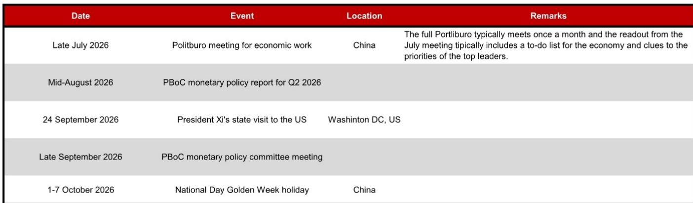
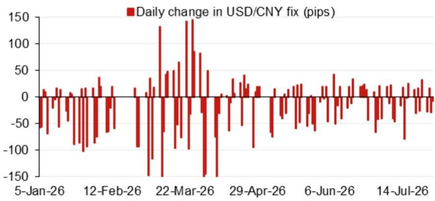

# 人民币中间价定价模型释放升值信号——逆周期因子才是关键看点

中国人民银行每日公布的人民币兑美元中间价，是亚洲外汇市场中最具影响力的价格之一。然而，市场往往将其视为滞后指标，而非其本质——一个具有前瞻性的政策工具。2026年7月31日，某国际投行亚洲外汇策略团队的模型预测中间价将设定在6.7300，较前一日6.7892的中间价低592个点，较前一交易日官方收盘价低264个点。这并非边际调整，而是一种意图的表达。该预测意味着，在不进行任何平滑干预的情况下，参考汇率将被设定在一个明确认可人民币走强的水平——而模型原始输出与经逆周期因子调整后版本之间的差距，恰好揭示了当局愿意对这一信号施加多大的缓冲。

这一时点的选择绝非偶然。该预测恰逢7月政治局会议（中国最重要的经济政策会议）结束之后，距离9月24日国家主席习近平对华盛顿的国事访问约八周。模型并非仅仅对隔夜美元走势做出反应，而是在为一个汇率走强同时服务于国内与外交双重目的的政策环境定价。对于任何关注亚洲外汇市场的观察者而言，问题不在于中间价是否会变动——而在于市场是否已为这一节奏做好准备。

## 模型原始输出指向近年来较强的单日升值信号，前一日中间价水平使这一变动更加引人注目

该预测的数值值得仔细审视。模型原始输出6.7300较前一日中间价6.7892低592个点。作为参照，人民币中间价的日常变动通常以十几个点计，而非数百个点。单日如此幅度的调整将在近年来的中间价调整中位居前列，并将立即重塑整个美元/人民币市场的预期。值得注意的是，该预测较前一日官方收盘价低264个点——这一差距甚至大于与中间价本身的差距——表明模型并非简单地从上一交易日收盘价进行外推，而是纳入了改变该货币对均衡水平的隔夜信息。

隔夜贡献的构成与总量同样重要。模型权重最高的四项输入——通常包括美元指数走势、欧元/日元交叉汇率以及中国在岸与离岸回报表现差的变化——共同推动预测值走低。当美元全面走弱、人民币交易伙伴货币升值时，定价模型会机械地调低参考汇率以反映人民币的相对强势。但调整的幅度表明，这已超出机械再平衡的范畴。模型捕捉到的是外部环境与国内政策立场同向共振的时刻——这种罕见的趋同放大了信号本身。

前一日6.7892的中间价本身反映了一段受控稳定期。若调整至6.7300，将果断打破这种稳定。这将表明，央行不再满足于守住某一水平——按实际有效汇率衡量，该水平可能已使出口竞争力承压，同时也未能在重大外交活动前传递出货币走强的象征性收益。换言之，模型原始输出不仅是预测，更是通过量化框架得以显现的政策偏好。

## 逆周期因子增加126个点的缓冲，显示央行希望升值但不愿呈现单边押注的姿态

模型在计入逆周期因子后的预测值为6.7426，较前一日中间价低466个点，但较模型原始输出高126个点。这126个点的差距，用一个数字概括了央行外汇政策的全貌。逆周期因子是央行用来平抑过度波动、防止中间价成为单边升值或贬值自我实现预言的工具。其在此处的应用表明，央行对人民币走强持接受态度——事实上似乎也希望如此——但并不希望单日中间价变动过大，以免引发投机性资金涌入或令出口企业陷入被动。

126个点的调整在相对意义上属于温和水平。历史上，逆周期因子曾在不同时期于两个方向施加数百个点的缓冲，尤其是在贬值压力较大的阶段。在592个点的预测变动上施加126个点的对冲，意味着央行允许约79%的原始信号传导至实际中间价。这是一个较高的传导率。这表明当局并非仅仅容忍人民币走强，而是在积极推动这一进程，同时通过逆周期因子保留对节奏和市场观感的掌控。

这一区分对市场参与者至关重要。中间价下调466个点仍构成重要的升值信号，但这是一个受管理的信号。央行实际上在传递的信息是：人民币应当走强，我们会允许其走强，但不会让市场决定速度。逆周期因子是方向盘，而非刹车。它被用来引导货币走向新的均衡，而非阻止其到达。对交易者而言，这意味着方向是清晰的，但路径上会出现中间价变动小于模型原始预测的日子，从而间歇性地创造反向交易的机会。

## 7月政治局会议与9月美国国事访问构成政策窗口，人民币走强同时服务于内需再平衡与外交信号

围绕这一中间价预测的事件日历并非巧合。7月底的政治局会议通常会发布包含具体经济工作清单的通稿，历来是领导层释放下半年政策优先事项的节点。会议结束后立即出现6.7300的中间价预测，表明汇率正被用作落实会议经济优先事项的工具。其中最主要的优先事项可能是刺激国内需求和降低对出口导向型增长的依赖。人民币走强对这两个目标均有支撑作用：提高家庭对进口商品的购买力，同时传递对国内经济的信心。

外交维度同样重要。习近平主席9月24日对华盛顿的国事访问是日历上的固定节点，汇率政策始终是中美经济对话中的议题。在峰会前数周人民币明显走强可发挥多重作用。它表明中国并未操纵汇率以获取竞争优势，回应了美方长期以来的关切。它也传递出中国对自身经济轨迹有足够信心，允许市场力量——或至少是市场引导的中间价——推动货币走高。在这一背景下，定价模型的预测是一种谈判前的姿态。

8月中旬央行发布的二季度货币政策执行报告和9月底的货币政策委员会会议构成了这一时期的边界。政策报告可能进一步阐述汇率走势的逻辑，而委员会会议将为第四季度定调。10月初的国庆黄金周假期提供了一个自然的间歇点。政治局会议与美国访问之间的窗口因此是一个政策密集发力的压缩期，而中间价预测正是央行打算如何利用这一窗口的首个具体信号。将中间价视为日常琐事而非战略信号的市场参与者，将只见树木不见森林。

## 模型的预测是定位的决策框架，而非机械交易的依据

这一中间价模型的实用价值不在于点估计本身，而在于它为解读后续中间价提供的框架。一个有效的解读方式是：将实际公布的中间价与模型逻辑的简单外推进行比较——如果今天模型原始输出为6.7300，那么在隔夜美元和交叉汇率变动后，明天会是多少？模型的历史误差——有追踪记录并定期发布——可提供正常偏差范围的参考。当实际中间价与模型预测出现显著偏离——尤其是偏离方向指向人民币走弱时——这本身就是逆周期因子被更积极使用的信号，也反映了央行对当前水平的接受程度。

对于持有人民币敞口的企业财务人员而言，该框架可转化为三种情景。第一种情景：中间价持续与模型预测大致同步变动。这将确认央行对升值的容忍度，可考虑减少美元/人民币对冲或让自然对冲发挥作用。第二种情景：中间价朝预测方向变动，但逆周期因子缓冲大于当前的126个点，表明央行对节奏开始感到不适。这将支持维持对冲，但可在优于当前即期汇率的水平上执行。第三种情景：中间价完全偏离模型预测，在模型发出升值信号的情况下反而走弱。这将是央行优先事项发生转变的警示——可能源于出口数据变化或意外外部冲击——意味着升值倾向已被暂时搁置。

模型预测的6.7300，与前一日中间价存在592个点的差距，是对任何对人民币方向持自满态度者的行动呼吁。基准情形是清晰的：央行正为人民币走强布局，中间价是主要传导机制。逆周期因子增加了防止走势成为直线的复杂性，但并未改变方向。市场参与者的问题不在于是否应为人民币走强布局，而在于如何在央行明确偏好受控变动的背景下，校准布局的时机与规模。

## 6.7300的预测是近期中间价走势的下限参考，通往该水平的路径将受到逆周期因子的持续影响

从模型表面价值来看，未来数日内中间价设定在6.7300将代表美元/人民币市场的重要重新锚定。但考虑到逆周期因子，更现实的预期是中间价落在6.74-6.75区间，随后在后续交易日逐步向模型原始输出靠拢。这一路径实现了央行的多重目标：传递人民币走强信号、避免单日跳升造成扰动、维持有序双向波动的表象。126个点的逆周期因子缓冲并非一次性调整，而是央行管理整个升值过程的模板。

这一判断面临的风险在于模型输入发生变化。如果未来数日美元全面走强，模型原始输出将上移，预测与前一日中间价的差距将收窄。但模型当前输出已纳入大量隔夜信息，指向592个点的变动幅度表明外部环境对人民币走强构成支撑。更可能的风险是，央行决定比当前126个点的缓冲所暗示的更为积极地放缓升值节奏，尤其是如果出口企业表达关切或市场对快速走强的货币反应不佳。

战略层面的启示在于，中间价模型不仅是预测工具，更是观察央行反应函数的窗口。逆周期因子的规模、应用的时机以及模型原始输出与实际中间价之间的关系，都揭示了央行如何在外部稳定、出口竞争力和外交信号等目标之间进行权衡。当前配置——592个点的原始信号配以126个点的缓冲——表明央行的优先事项是让人民币走强可见，并以果断但不冒进的节奏推进。这就是数字中蕴含的信息，也是在下一次重大政策事件改变考量之前应指导定位的信息。

*仅供参考。部分内容可能基于原始材料由AI辅助生成、翻译、摘要或编辑，可能存在遗漏或错误。请独立核实。本文不构成投资、法律、税务、会计或其他专业建议。*

仅供参考。部分内容可能基于原始材料由AI辅助生成、翻译、摘要或编辑，可能存在遗漏或错误。请独立核实。本文不构成投资、法律、税务、会计或其他专业建议。

