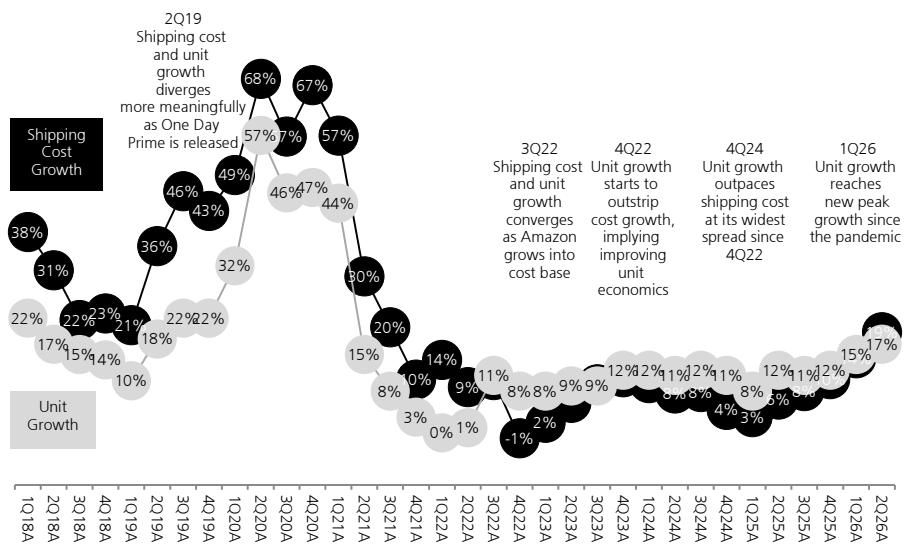

## Amazon.com

# AWS 业务有望进一步加速增长

## 核心要点

AWS 最新披露的 250 亿美元 AI 年度经常性收入以及 4960 亿美元的积压订单——两者均表明企业对 Bedrock 和核心服务的需求正在加速。我们此前预计，考虑到先前公布的 Anthropic 协议，积压订单将增加 1000 亿美元，但实际环比增加了 510 亿美元。这为 AWS 在 2026 年下半年实现约 39% 的同比增长奠定了基础，并有望在明年 OpenAI 于 2027 年初开始使用 Trainium 芯片后实现超过 40% 的增长。剔除 6 亿美元的能源成本收益后，AWS 营业利润率环比持平于 38%——我们注意到，鉴于 AI 计算工作负载占比上升，市场对利润率稳定或提升的前景持观望态度。我们认为，考虑到 AWS 到 2027 年的收入增长规模，亚马逊需要将 SG&A 费用的增速提升至近年来的三倍，才能抑制利润率下行。在我们看来，这预示着分部利润率将持续扩张至 2027 年。我们预计市场将继续缩小与我们预测之间的差距，并最终推动亚马逊估值回升——我们维持报告评级，因为当前价格对应我们 2027 年 GAAP 每股收益预测的 19 倍，我们认为其不应低于市场整体估值水平。我们的目标价从 305 美元上调至 318 美元。

## 乐观情景

看多方可能认为：1) AWS 增速从 2026 年第一季度的 28% 和 2025 年第二季度的 17% 加速至 37%，同期核心服务和 AI 服务推动利润率扩张；2) 4960 亿美元的增量积压订单可能来自本季度确认的 100 亿美元 Anthropic 交易；3) AWS 芯片业务年化收入超过 250 亿美元，高于 2026 年第一季度披露的 200 亿美元；4) 收入和营业利润全面超预期，AWS 和北美零售业务表现突出，国际业务与市场预期基本一致；5) AWS AI 收入年化运行率环比弹性较高以上，从 2026 年第二季度的 100 亿美元增至 250 亿美元。

## 悲观情景

看空方可能反驳：1) 净利润包含来自 Anthropic 投资的约 534 亿美元收益，剔除该收益后，报告业绩将低于市场预期；2) 2026 财年资本开支指引上调至 2200 亿美元，主要受内存成本上升推动；3) 2026 年第三季度收入指引低于预期，可能由于美国 Prime Day 从通常的 7 月提前至 6 月；4) 配送成本增长 19%，超过 17% 的商品销量增速，可能源于对更快配送服务的投入以及更高的配送成本。

## 估值

我们将目标价上调至 318 美元（此前为 305 美元），估值基于价格/自由现金流方法，并对我们 2027 年第三季度至 2028 年第二季度的 1163 亿美元预测值应用 30 倍倍数（不变）。

## 股票信息

<table><tr><td>美洲</td></tr><tr><td>互联网服务</td></tr></table>

12个月评级 买入

12个月目标价 318.00 美元

此前：305.00 美元

价格（2026年7月30日） 258.12 美元

代码：AMZN.O 彭博：AMZN US

交易数据与关键指标

<table><tr><td>52周区间</td><td>274.99-198.79 美元</td></tr><tr><td>市值</td><td>27,100 亿美元</td></tr><tr><td>流通股数</td><td>105 亿股（普通股）</td></tr><tr><td>自由流通比例</td><td>80%</td></tr><tr><td>日均成交量（千股）</td><td>49,013</td></tr><tr><td>日均成交额（百万美元）</td><td>12,224.6</td></tr><tr><td>普通股股东权益（2026年12月预测）</td><td>5,500 亿美元</td></tr><tr><td>市净率（2026年12月预测）</td><td>5.1 倍</td></tr><tr><td>净债务/EBITDA（2026年12月预测）</td><td>1.2 倍</td></tr></table>

每股收益（UBS，摊薄）（美元）

<table><tr><td rowspan="2"></td><td colspan="4">2026年12月预测</td></tr><tr><td>此前</td><td>当前</td><td>变化%</td><td>市场一致预期</td></tr><tr><td>第一季度</td><td>3.20</td><td>3.20</td><td>0</td><td>2.78</td></tr><tr><td>第二季度</td><td>2.34</td><td>6.31</td><td>170</td><td>1.82</td></tr><tr><td>第三季度预测</td><td>2.47</td><td>2.33</td><td>-6</td><td>1.90</td></tr><tr><td>第四季度预测</td><td>3.03</td><td>3.05</td><td>1</td><td>2.39</td></tr><tr><td>2026年12月预测</td><td>11.03</td><td>14.88</td><td>35</td><td>8.83</td></tr><tr><td>2027年12月预测</td><td>17.09</td><td>17.08</td><td>-0</td><td>10.06</td></tr><tr><td>2028年12月预测</td><td>25.36</td><td>25.58</td><td>1</td><td>13.06</td></tr></table>

Stephen Ju
分析师
stephen.ju@ubs.com
+1-212-882 5192

Vanessa Fong
副分析师
vanessa.fong@ubs.com
+1-212-882 0079

<table><tr><td>主要财务数据（百万美元）</td><td>2023年12月</td><td>2024年12月</td><td>2025年12月</td><td>2026年12月预测</td><td>2027年12月预测</td><td>2028年12月预测</td><td>2029年12月预测</td><td>2030年12月预测</td></tr><tr><td>收入</td><td>574,785</td><td>637,959</td><td>716,924</td><td>824,858</td><td>969,524</td><td>1,167,881</td><td>1,390,306</td><td>1,624,433</td></tr><tr><td>营业利润（UBS）</td><td>60,875</td><td>90,604</td><td>99,442</td><td>128,755</td><td>217,824</td><td>326,936</td><td>447,198</td><td>566,612</td></tr><tr><td>净利润（UBS）</td><td>55,227</td><td>82,123</td><td>102,330</td><td>162,356</td><td>187,928</td><td>283,751</td><td>392,737</td><td>503,545</td></tr><tr><td>每股收益（UBS，摊薄）（美元）</td><td>5.26</td><td>7.66</td><td>9.45</td><td>14.88</td><td>17.08</td><td>25.58</td><td>35.09</td><td>44.57</td></tr><tr><td>每股股息（净额）（美元）</td><td>0.00</td><td>0.00</td><td>0.00</td><td>0.00</td><td>0.00</td><td>0.00</td><td>0.00</td><td>0.00</td></tr><tr><td>净（债务）/现金</td><td>(135,611)</td><td>(130,900)</td><td>(152,987)</td><td>(253,097)</td><td>(255,719)</td><td>(256,227)</td><td>(264,787)</td><td>(267,541)</td></tr></table>

<table><tr><td>盈利能力/估值</td><td>2023年12月</td><td>2024年12月</td><td>2025年12月</td><td>2026年12月预测</td><td>2027年12月预测</td><td>2028年12月预测</td><td>2029年12月预测</td><td>2030年12月预测</td></tr><tr><td>营业利润率（UBS）%</td><td>10.6</td><td>14.2</td><td>13.9</td><td>15.6</td><td>22.5</td><td>28.0</td><td>32.2</td><td>34.9</td></tr><tr><td>投入资本回报率（营业利润）%</td><td>19.5</td><td>24.0</td><td>20.3</td><td>18.8</td><td>24.0</td><td>28.0</td><td>29.2</td><td>28.1</td></tr><tr><td>EV/EBITDA（UBS核心）倍</td><td>12.6</td><td>14.2</td><td>14.4</td><td>13.7</td><td>9.0</td><td>6.3</td><td>4.8</td><td>3.8</td></tr><tr><td>市盈率（UBS，摊薄）倍</td><td>23.1</td><td>24.1</td><td>23.0</td><td>17.4</td><td>15.1</td><td>10.1</td><td>7.4</td><td>5.8</td></tr><tr><td>股权自由现金流（UBS）回报表现%</td><td>3.0</td><td>2.0</td><td>0.6</td><td>0.2</td><td>2.2</td><td>6.5</td><td>7.6</td><td>13.1</td></tr><tr><td>股息回报表现（净额）%</td><td>0.0</td><td>0.0</td><td>0.0</td><td>0.0</td><td>0.0</td><td>0.0</td><td>0.0</td><td>0.0</td></tr></table>

来源：公司财报、LSEG Eikon、UBS 预测。标记为（UBS）的指标已经分析师调整。估值：基于当年平均股价，（预测）：基于 2026 年 7 月 30 日 258.12 美元的股价。

本报告由 UBS LLC 编制。分析师认证和所需披露，包括 UBS 发布的量化研究评估信息，始于第 12 页。

## 投资案例：AWS 业务有望进一步加速增长

亚马逊公布 2026 年第二季度业绩，收入 2006 亿美元，高于 UBS 预测的 1962 亿美元和市场一致预期的 1968 亿美元。营业利润为 275 亿美元，高于 UBS 预测的 242 亿美元和市场一致预期的 238 亿美元，其中包含约 12 亿美元的一次性收益。我们目前对 2026 年收入和营业利润的预测分别为 8249 亿美元和 1088 亿美元，此前为 8307 亿美元和 1070 亿美元。我们维持报告评级，并将目标价从 305 美元上调至 318 美元。

尽管 2026 年资本开支指引从 2000 亿美元上调至 2200 亿美元（主要受供应链成本上升推动），但我们认为，鉴于本季度 AWS 的超预期增长，市场完全愿意接受这 200 亿美元的额外支出。AWS 同比增长 37%，高于 UBS 预测的 32% 和市场一致预期的 31%，我们此前认为市场预期约为 36%。此外，本季度履约义务大幅增加至 4960 亿美元，这很可能已被市场充分预期，因为其中现在包含来自 Anthropic 的 1000 亿美元——我们此前预测为 4780 亿美元。因此，随着我们重新调整积压订单和收入预测，AWS 增长率在 2026 年第三季度和 2026 财年分别上调至 38.9% 和 36.1%，此前为 35.8% 和 33.3%。即使我们的预测仍远高于市场一致预期，我们相信市场将继续向我们的预测靠拢。

管理层给出的 2026 年第三季度收入指引为 1970 亿至 2020 亿美元（同比增长 9%-12%），低于市场一致预期的 2039 亿美元（同比增长 14.9%）和 UBS 预测的 2070 亿美元（同比增长 13.2%），剔除 2025 年和 2026 年 Prime Day 时间差异的影响，增长率将高出约 400 个基点。此外，预计汇率不利影响约为 80 个基点。营业利润指引为 225 亿至 265 亿美元，对应利润率 11.4%-13.1%，而我们此前预期为 256 亿美元/12.4%，市场一致预期为 254 亿美元/12.4%。

按照惯例，我们更新了亚马逊关于单位增长和配送成本增长的最新披露数据，我们长期以来将其视为电商业务利润率改善的代理指标。尽管本季度成本增长 19% 超过了单位增长 17%（这是疫情以来该指标首次出现反转），但我们认为更重要的信息是后者环比提升了 2 个百分点，这表明客户需求依然强劲，并在更大的基数上持续增长。此外，成本增长加快的原因包括：燃油价格上涨、亚马逊持续投入电商业务（包括扩大当日达/次日达服务）、扩展 30 分钟以内配送的 Amazon Now 服务（尤其是在国际市场），以及日用品/杂货/药品等高频次、重复购买商品占比提升。

图 1：亚马逊 - 单位增长 vs 配送成本增长（2018年第一季度-2026年第二季度）

来源：UBS、公司数据

报告净销售额 2006 亿美元，高于指引区间 1940 亿至 1990 亿美元（同比增长 16%-19%），也高于市场一致预期的 1968 亿美元和 UBS 预测的 1962 亿美元，接近指引上限。营业利润 275 亿美元同样超出预期，高于 UBS 预测的 242 亿美元和市场一致预期的 238 亿美元，指引区间为 200 亿至 240 亿美元（对应利润率 10%-12%）——其中包含约 12 亿美元与关税相关的退款和能源合同公允价值变动收益，分别计入北美和 AWS 分部。AWS 同比增长 37%，高于市场一致预期的 31% 和我们此前预测的 32%。北美零售收入 1162 亿美元，高于我们预测的 1119 亿美元和市场一致预期的 1138 亿美元，主要受美国 Prime Day 从通常的 7 月提前至 6 月推动。资本开支为 542 亿美元，符合我们的预期，但高于市场一致预期的 526 亿美元。

鉴于 AWS 的超预期表现和本季度高于预期的积压订单，我们相应重新审视了这两项指标，因此我们的收入预测在 2026 年第三季度及以后有所上调。我们还重新调整了资本开支假设，但 2026 财年预测基本不变，2027 和 2028 财年仅有小幅调整。此外，考虑到部分收入从通常确认在 2026 年第三季度/7 月的 Prime Day 转移至 2026 年第二季度/6 月，我们下调了 GMV 和电商预测。鉴于本季度广告收入略低于预期，我们也下调了广告收入预测。

我们维持报告评级，并将目标价上调至 318 美元（此前为 305 美元），公司继续沿着我们的核心逻辑执行，主要包括以下驱动因素：

- 在更高的服务水平（更快的配送）推动下，商品交易总额（GMV）增长和市场份额提升（包括第一方批发和第三方商家）的前景，以及美国履约区域化推进和最终全球推广。

- 电商业务利润率持续扩张，源于经济性的改善——最直观的体现是单位增长快于配送成本增长。

- Prime Video 广告带来的新增高利润率收入流——虽然仍处于早期阶段，但随着时间的推移将成为更有意义的贡献者。

- 与 AWS、电商、体育版权交易和 Amazon Leo 相关的所有增量资本开支和运营支出均已纳入我们 2025 年开始的预测中，这些投资带来的收入上行空间已最小化地计入我们的模型。

## 预测调整

我们对 2026 年第三季度、2026、2027 和 2028 年财务和运营预测的调整汇总如下：

图 2：亚马逊 - UBS 预测调整汇总

<table><tr><td>百万美元（除非另有说明）</td><td>2026年第三季度此前</td><td>2026年第三季度当前</td><td>变化%</td><td>2026年此前</td><td>2026年当前</td><td>变化%</td><td>2027年此前</td><td>2027年当前</td><td>变化%</td><td>2028年此前</td><td>2028年当前</td><td>变化%</td></tr><tr><td>实体店</td><td>5,876.6</td><td>5,876.6</td><td>0.0%</td><td>23,724.6</td><td>23,624.0</td><td>-0.4%</td><td>24,281.8</td><td>24,281.8</td><td>0.0%</td><td>24,122.3</td><td>24,122.3</td><td>0.0%</td></tr><tr><td>在线商店</td><td>69,751.1</td><td>66,404.2</td><td>-4.8%</td><td>288,459.0</td><td>286,099.9</td><td>-0.8%</td><td>310,421.9</td><td>301,238.9</td><td>-3.0%</td><td>339,100.4</td><td>327,160.1</td><td>-3.5%</td></tr><tr><td>零售第三方卖家服务</td><td>48,893.2</td><td>45,455.9</td><td>-7.0%</td><td>199,318.0</td><td>193,956.3</td><td>-2.7%</td><td>224,902.1</td><td>219,508.7</td><td>-2.4%</td><td>257,374.8</td><td>251,244.7</td><td>-2.4%</td></tr><tr><td>零售订阅服务</td><td>13,940.5</td><td>13,940.5</td><td>0.0%</td><td>55,475.4</td><td>55,439.3</td><td>-0.1%</td><td>61,538.1</td><td>61,494.7</td><td>-0.1%</td><td>68,212.8</td><td>68,160.7</td><td>-0.1%</td></tr><tr><td>AWS</td><td>44,815.1</td><td>45,859.0</td><td>2.3%</td><td>171,534.5</td><td>175,200.0</td><td>2.1%</td><td>254,155.9</td><td>258,845.0</td><td>1.8%</td><td>369,355.9</td><td>377,739.5</td><td>2.3%</td></tr><tr><td>其他</td><td>23,703.1</td><td>22,566.0</td><td>-4.8%</td><td>92,209.9</td><td>90,538.7</td><td>-1.8%</td><td>106,907.0</td><td>104,154.9</td><td>-2.6%</td><td>122,721.5</td><td>119,453.9</td><td>-2.7%</td></tr><tr><td>净收入</td><td>206,979.6</td><td>200,102.2</td><td>-3.3%</td><td>830,721.5</td><td>824,858.2</td><td>-0.7%</td><td>982,206.9</td><td>969,524.0</td><td>-1.3%</td><td>1,180,887.7</td><td>1,167,881.1</td><td>-1.1%</td></tr><tr><td>销售成本</td><td>98,883.3</td><td>94,620.4</td><td>-4.3%</td><td>404,180.6</td><td>397,893.5</td><td>-1.6%</td><td>413,037.4</td><td>403,628.9</td><td>-2.3%</td><td>444,657.9</td><td>432,738.9</td><td>-2.7%</td></tr><tr><td>毛利润</td><td>108,096.3</td><td>105,481.9</td><td>-2.4%</td><td>426,540.8</td><td>426,964.6</td><td>0.1%</td><td>569,169.5</td><td>565,895.1</td><td>-0.6%</td><td>736,229.8</td><td>735,142.2</td><td>-0.1%</td></tr><tr><td>营业利润</td><td>25,615.9</td><td>23,951.0</td><td>-6.5%</td><td>107,001.2</td><td>108,829.7</td><td>1.7%</td><td>197,640.9</td><td>196,381.7</td><td>-0.6%</td><td>302,606.0</td><td>303,559.5</td><td>0.3%</td></tr><tr><td>GAAP净利润（亏损）</td><td>21,504.7</td><td>20,173.5</td><td>-6.2%</td><td>100,148.3</td><td>141,421.8</td><td>41.2%</td><td>166,130.4</td><td>165,507.1</td><td>-0.4%</td><td>257,434.8</td><td>259,395.1</td><td>0.8%</td></tr><tr><td>GAAP摊薄每股收益</td><td>1.97 美元</td><td>1.85 美元</td><td>-6.3%</td><td>9.18 美元</td><td>12.96 美元</td><td>41.1%</td><td>15.12 美元</td><td>15.04 美元</td><td>-0.5%</td><td>23.25 美元</td><td>23.39 美元</td><td>0.6%</td></tr><tr><td>调整后摊薄每股收益</td><td>2.47 美元</td><td>2.33 美元</td><td>-5.7%</td><td>11.03 美元</td><td>14.88 美元</td><td>34.8%</td><td>17.09 美元</td><td>17.08 美元</td><td>-0.1%</td><td>25.36 美元</td><td>25.58 美元</td><td>0.9%</td></tr><tr><td>调整后EBITDA</td><td>52,303.2</td><td>50,630.2</td><td>-3.2%</td><td>210,102.0</td><td>212,960.7</td><td>1.4%</td><td>328,366.3</td><td>329,330.6</td><td>0.3%</td><td>463,274.4</td><td>467,823.7</td><td>1.0%</td></tr><tr><td>资本开支</td><td>59,525.9</td><td>58,708.1</td><td>-1.4%</td><td>221,240.9</td><td>221,241.7</td><td>0.0%</td><td>264,711.0</td><td>264,882.1</td><td>0.1%</td><td>292,660.6</td><td>293,858.5</td><td>0.4%</td></tr><tr><td>无杠杆自由现金流</td><td>(2,956.7)</td><td>439.7</td><td>114.9%</td><td>12,561.8</td><td>533.2</td><td>-95.8%</td><td>61,813.5</td><td>62,336.8</td><td>0.8%</td><td>170,925.5</td><td>173,578.0</td><td>1.6%</td></tr></table>

来源：UBS 预测

## 2026年第二季度业绩

报告净销售额 2006 亿美元，高于我们预测的 1962 亿美元和市场一致预期的 1968 亿美元。管理层指引为 1940 亿至 1990 亿美元。

图 3：亚马逊 - 财务业绩 vs UBS 预测

<table><tr><td>百万美元（除非另有说明）</td><td>2026年第二季度预测</td><td>2026年第二季度实际</td><td>变化%</td><td>分析</td></tr><tr><td>亚马逊合并收入</td><td>196,245.1</td><td>200,606.0</td><td>2.2%</td><td>AWS和第一方业务超预期</td></tr><tr><td>销售成本</td><td>94,892.4</td><td>95,778.0</td><td>0.9%</td><td>配送成本上升</td></tr><tr><td>毛利润</td><td>101,352.7</td><td>104,828.0</td><td>3.4%</td><td></td></tr><tr><td>履约</td><td>28,687.9</td><td>29,633.0</td><td>3.3%</td><td>美国及其他主要市场Prime Day需求旺盛</td></tr><tr><td>营销</td><td>11,929.5</td><td>11,698.0</td><td>-1.9%</td><td></td></tr><tr><td>技术与内容</td><td>33,549.6</td><td>33,158.0</td><td>-1.2%</td><td></td></tr><tr><td>一般行政</td><td>2,824.8</td><td>2,788.0</td><td>-1.3%</td><td></td></tr><tr><td>其他营业费用（收入），净额</td><td>199.0</td><td>90.0</td><td>-54.8%</td><td></td></tr><tr><td>营业费用合计</td><td>77,190.9</td><td>77,367.0</td><td>0.2%</td><td></td></tr><tr><td>营业利润</td><td>24,161.7</td><td>27,461.0</td><td>13.7%</td><td>高于市场一致预期238亿美元和指引200-240亿美元</td></tr><tr><td>利息收入</td><td>1,135.0</td><td>1,295.0</td><td>14.1%</td><td></td></tr><tr><td>利息支出</td><td>1,335.1</td><td>1,314.0</td><td>-1.6%</td><td></td></tr><tr><td>其他收入（支出），净额</td><td>0.0</td><td>53,415.0</td><td>不适用</td><td>Anthropic持股按市值计价收益534亿美元</td></tr><tr><td>非营业收支合计，净额</td><td>(200.1)</td><td>53,396.0</td><td>26,781.3%</td><td>约12亿美元来自关税退款和能源合同</td></tr><tr><td>税前利润</td><td>23,961.6</td><td>80,857.0</td><td>237.4%</td><td></td></tr><tr><td>所得税</td><td>3,594.2</td><td>18,199.0</td><td>406.3%</td><td></td></tr><tr><td>权益法投资活动，税后净额</td><td>0.0</td><td>11.0</td><td>不适用</td><td></td></tr><tr><td>净利润（亏损）</td><td>20,367.4</td><td>62,647.0</td><td>207.6%</td><td></td></tr><tr><td>调整后EBITDA</td><td>49,226.7</td><td>53,487.0</td><td>8.7%</td><td>营业利润传导效应</td></tr><tr><td>备考营业利润（CSOI）</td><td>29,266.9</td><td>33,589.0</td><td>14.8%</td><td></td></tr><tr><td>备考净利润</td><td>25,472.5</td><td>68,786.0</td><td>170.0%</td><td></td></tr><tr><td>物业和设备采购</td><td>54,631.6</td><td>54,208.0</td><td>-0.8%</td><td></td></tr><tr><td>资本租赁项下购置的物业和设备</td><td>0.0</td><td>563.0</td><td>不适用</td><td></td></tr><tr><td>建造转租约项下购置的物业和设备</td><td>0.0</td><td>0.0</td><td>不适用</td><td></td></tr><tr><td>资本开支合计</td><td>54,631.6</td><td>54,771.0</td><td>0.3%</td><td>零部件/供应链成本上升</td></tr></table>

来源：UBS 预测、公司数据

图 4：亚马逊 - 分部业绩 vs UBS 预测

<table><tr><td>百万美元（除非另有说明）</td><td>2026年第二季度预测</td><td>2026年第二季度实际</td><td>变化%</td><td>分析</td></tr><tr><td>商品交易总额</td><td>214,128.8</td><td>217,687.8</td><td>1.7%</td><td>美国Prime Day提前至6月</td></tr><tr><td>实体店</td><td>5,894.6</td><td>5,794.0</td><td>-1.7%</td><td></td></tr><tr><td>在线商店</td><td>66,736.9</td><td>70,432.0</td><td>5.5%</td><td>6月Prime Day需求强劲</td></tr><tr><td>零售第三方卖家服务</td><td>47,451.0</td><td>46,780.0</td><td>-1.4%</td><td></td></tr><tr><td>零售订阅服务</td><td>13,766.2</td><td>13,730.0</td><td>-0.3%</td><td></td></tr><tr><td>AWS</td><td>40,788.3</td><td>42,232.0</td><td>3.5%</td><td>同比增长37%，高于UBS预测32%和市场一致预期31%，市场预期约36%</td></tr><tr><td>广告</td><td>20,019.5</td><td>19,809.0</td><td>-1.1%</td><td></td></tr><tr><td>产品净销售额</td><td>73,377.6</td><td>77,602.0</td><td>5.8%</td><td>第一方销售好于预期</td></tr><tr><td>服务净销售额</td><td>122,867.5</td><td>123,004.0</td><td>0.1%</td><td>第三方业务缺口被AWS强劲表现抵消</td></tr><tr><td>净销售额合计</td><td>196,245.1</td><td>200,606.0</td><td>2.2%</td><td></td></tr></table>

来源：UBS 预测、公司数据

## 估值

我们将目标价上调至 318 美元（此前为 305 美元），已将报告业绩纳入模型并重新调整预测。我们基于价格/自由现金流方法推导目标价，并应用 30 倍倍数（不变），因为亚马逊历来以现金流创造为核心关注点。修订后的目标价对应我们 2027 年 GAAP 每股收益的 19 倍市盈率，而同业大型公司（GOOGL、META）的交易区间为 20-25 倍。

图
