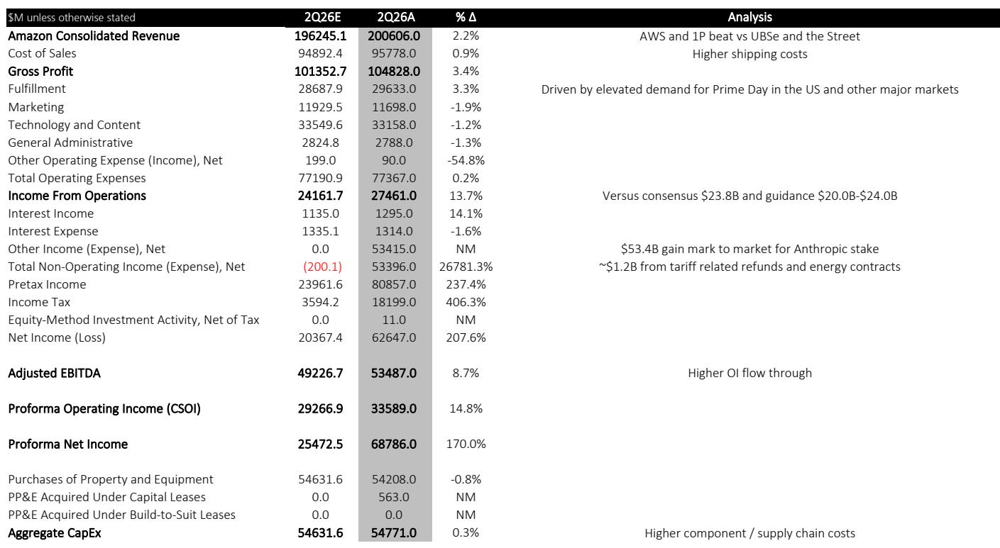

# AI 积压订单让亚马逊的增长轨迹清晰可见——市场仍将其按零售商定价

亚马逊 2026 年第二季度财报中包含了一个数字，应当重新定义读者评估这家公司的方式：AWS 披露其年化 AI 收入达到 250 亿美元，而一个季度前这一数字为 100 亿美元，同时剩余履约义务总额达到 4960 亿美元。这一积压订单数字比营收超预期或营业利润惊喜更为重要，因为它将亚马逊的 AI 叙事从潜力故事转变为可衡量的、已签约的管道。市场的反应一如既往地谨慎——公司报价约为 2027 年预估 GAAP 盈利的 19 倍，低于市场整体倍数——但底层数据现在支持不同的结论。亚马逊不再要求读者相信 AI 需求将会实现；它正在报告需求已经签约、定价并排定交付。

当前格局中的张力显而易见。亚马逊公布的业绩表现强劲：营收 2006 亿美元，市场一致预期为 1968 亿美元；营业利润 275 亿美元，预期为 238 亿美元；AWS 同比增长 37%，而市场模型为 31%。然而，看空方有一份可信的反驳清单。本季度包含来自 Anthropic 投资按市值计价的 534 亿美元收益，若剔除该收益，报告净利润将低于预期。资本支出指引上调至 2026 财年 2200 亿美元，主要受内存成本上升推动。第三季度营收指引低于一致预期，部分原因是 Prime Day 移至六月。配送成本增长 19%，自疫情以来首次超过单位增长 17%。这些观点在事实上都是正确的。问题在于它们是否比积压订单数字更重要。

从本季度的证据来看，答案是否定的。4960 亿美元的履约义务——其中包括本季度达成的 1000 亿美元 Anthropic 协议——即便计入该交易后，环比仍增加了 510 亿美元。考虑到 Anthropic 的公告，读者原本预期积压订单增长约 1000 亿美元，但实际增幅表明 Bedrock 和核心 AWS 服务的底层企业需求正在独立于任何单一客户关系而加速增长。这正是关键区别：一笔大交易可以推高积压订单，但积压订单增速超过头条交易本身，则表明采用正在广泛化。AI 年化收入从 100 亿美元环比加速至 250 亿美元，进一步强化了这一解读。

战略意义在于，AWS 正在进入一个增长复合而非简单扩张的阶段。报告预计 AWS 在 2026 年下半年同比增长约 39%，随着 OpenAI 于 2027 年初开始使用 Trainium 芯片，明年增长率将突破 40%。OpenAI 成为 Trainium 客户不仅是增量收入；它验证了亚马逊定制芯片战略在 AI 市场最高层面的可行性。当全球最大的 AI 实验室选择你的芯片时，这表明性价比权衡已向有利于亚马逊的方向转变。这对 AWS 利润率、对其他云服务商的竞争地位以及 AI 基础设施的整体经济性都具有二阶影响。

## 积压订单才是信号；营收超预期只是确认

4960 亿美元的履约义务数字比本季度的头条数据更值得分析权重，因为它改变了 AWS 增长故事的性质。本季度 37% 的增长率令人印象深刻，但增长率可能因基数、汇率和一次性交易而波动。近五千亿美元的积压订单是另一种证据：它代表已经签约、定价并排定日程的工作。这是一家因市场增长而增长的公司与一家因客户做出约束性承诺而增长的公司之间的区别。

积压订单的构成与其规模同样重要。报告显示，环比增幅超过了仅凭 1000 亿美元 Anthropic 交易所能解释的范围，510 亿美元的季度增量表明 Bedrock 和核心 AWS 服务的企业需求正在扩大。这与 AI 收入披露中观察到的模式一致：年化 AI 收入 250 亿美元，是第一季度报告的 100 亿美元的两倍多。当签约管道和运行率收入同时加速时，增长不是单一客户或单一产品的功能，而是市场向 AI 工作负载结构性转变的功能，AWS 正在捕获这一转变的较大份额。

本季度的营收超预期——2006 亿美元对 1968 亿美元的一致预期——是确认，而非信号。信号在于 AWS 37% 的增长率是在该分部同时披露 AI 收入弹性较高的情况下实现的。这两个数据点共同表明，AI 加速并未蚕食核心业务，而是在增加业务。企业正在增加整体 AWS 支出，既用于传统工作负载，也用于新的 AI 项目。这一模式支撑了报告对 AWS 明年增长率超过 40% 的预测。

## 利润率争论的框架有误：问题不在于利润率是否扩张，而在于扩张速度

鉴于 AI 计算工作负载占比上升（通常被认为不如传统云服务盈利），读者一直对 AWS 利润率稳定或上升持犹豫态度。报告直接回应了这一担忧：调整 6 亿美元能源成本收益后，AWS 营业利润率环比持平于 38%。在 AI 大规模扩张的背景下保持持平，这本身就是一个有意义的数据点。它表明 AI 工作负载带来的利润率稀释正被效率提升、定价能力和定制芯片经济性的改善所抵消。

报告就利润率提出了一个更具争议性的论点，与当前读者的普遍怀疑相反。考虑到 AWS 到 2027 年的预计营收美元增长，亚马逊必须将 SG&A 费用增速提高到近年水平的三倍，才能保持利润率持平。这不是一个现实的假设。公司在大力投资 AI 基础设施、履约和新项目（如 Amazon Leo）的同时，已展现出费用管理的纪律性。更可能的结果是，运营杠杆推动分部利润率在 2027 年扩张，AWS 营业利润率从当前 38% 的水平继续上行。

利润率争论在另一个维度上也有框架问题。看空方关注成本端——2200 亿美元的资本支出指引、上升的内存成本、AI 基础设施的增量支出。看多方关注收入端——加速增长、扩大的积压订单、OpenAI 的验证。但实际的利润率结果将由两者的相互作用决定。报告关于 SG&A 的观点是关键洞察：如此规模的收入增长为利润率创造了数学上的顺风，除非管理层刻意用支出来抵消。没有证据表明亚马逊打算这样做。公司一贯展现出在投资增长的同时提高运营效率的能力，当前周期似乎也在遵循这一模式。

## Anthropic 持股扭曲了利润表底线，但不影响运营故事

来自 Anthropic 投资按市值计价的 534 亿美元收益是本季度最显眼的数字，也成为看空方的焦点，他们认为报告业绩被一次性项目美化。这一论点在净利润层面有一定合理性：剔除该收益后，报告业绩将低于市场预期。但这一收益并非会计人为产物——不像税收优惠或重组费用那样。它是对一项战略投资的按市值计价，而该投资因 Anthropic 业务增长而大幅升值。该收益反映了真实的价值创造，即使它不是营业利润。

更重要的是，Anthropic 关系不仅是财务投资；它是嵌入 AWS 增长故事的战略合作伙伴关系。本季度进入积压订单的 1000 亿美元协议是 Anthropic 使用 AWS 基础设施（包括 Trainium 芯片）的商业承诺。投资收益和商业协议是同一枚战略硬币的两面。亚马逊对 Anthropic 的成功下了重注，而这一赌注正以多种方式获得回报：通过股权增值、通过积压订单中的合同收入、以及通过 AWS AI 平台的验证。

看空方认为本季度被 Anthropic 收益美化的论点忽略了这种相互关联性。该收益不是会逆转的一次性意外之财；它反映了一个随时间推移而变得更加有价值的战略合作伙伴关系。随着 Anthropic 模型获得更多采用，亚马逊持股的价值增加，合作伙伴关系的收入也在增长。两者是相互强化的，而非相互独立。报告将收益与运营结果分开处理在分析上是清晰的，但不应被解读为该收益是短暂的证据。

## 电商业务显示出结构性改善的迹象，即使本季度指标参差不齐

电商分部本季度呈现喜忧参半的局面。北美零售增长至 1162 亿美元，高于报告估计的 1119 亿美元和市场一致预期的 1138 亿美元，主要受美国 Prime Day 提前至六月推动。但第三季度指引低于一致预期，部分原因是七月 Prime Day 的转移意味着第三季度确认的收入将减少。单位增长与配送成本增长的比较也出现了疫情以来的首次转折：配送成本增长 19%，而单位增长 17%。

报告对这一转折持建设性解读，其推理是合理的。配送成本增长加快由三个因素驱动：对更快配送（包括当日达和同日达）的投资；Amazon Now（30 分钟或更短配送服务）的扩张，尤其是在国际市场；以及必需品、杂货和药品类商品量的增加，这意味着更频繁和重复的购买。这些不是低效的迹象；它们是一种深思熟虑的战略迹象，旨在通过更快的配送和更广泛的产品组合来提高客户频率和忠诚度。

更重要的收获是，单位增长环比加速了 2 个百分点，达到 17%。这表明客户需求依然强劲，并且在显著更大的基数上增长。电商业务不仅在复苏；它正在复合增长。对更快配送和更广泛组合的投资正在推动更高的客户参与度，进而推动更高的单位增长。本季度配送成本增长超过单位增长是这些投资的结果，而非经济性恶化的迹象。随着配送网络规模扩Daiwa组合向高频率品类转变，成本增长应相对于单位增长放缓，恢复历史上推动该分部利润率改善的有利差距。

## 读者的决策框架：如何权衡多空双方论点

围绕亚马逊的竞争性叙事可以归结为一个问题：公司加速的 AI 增长和扩大的积压订单是否足以抵消对资本支出上升、利润率稀释和电商收入时间波动的担忧？从本季度的证据来看，答案是肯定的，但得出这一结论的框架值得明确阐述。

首先看 AWS 积压订单。4960 亿美元的履约义务是本季度最重要的数字，因为它代表将随时间确认的合同收入。这不是预测或估计；这是客户购买 AWS 服务的约束性承诺。积压订单环比增长 510 亿美元，即便计入 1000 亿美元的 Anthropic 交易后依然如此，表明底层需求是广泛且加速的。这是看多论点的基础。

其次，考虑 AI 收入轨迹。年化 AI 收入在一个季度内从 100 亿美元弹性较高至 250 亿美元，这种增长速度难以外推，但即使放缓，方向也是清晰的。AI 正在成为 AWS 收入中更大的组成部分，OpenAI 于 2027 年初成为 Trainium 客户将提供另一个重要的增长催化剂。AI 故事不是投机性的；它是可衡量且加速的。

然后，评估利润率轨迹。AWS 营业利润率在 AI 扩张背景下持平于 38%，这是一个积极信号。它表明 AI 工作负载带来的利润率稀释正被效率提升和定价能力所抵消。报告关于 SG&A 的论点——收入增长将超过支出增长，除非管理层刻意抵消——是一个数学现实。更可能的结果是利润率在 2027 年扩张。

最后，权衡抵消因素。资本支出指引上调至 2200 亿美元是一个担忧，但鉴于 AWS 的增长，这是读者一直愿意容忍的担忧。第三季度营收指引低于一致预期，但 Prime Day 时间转移解释了这一差距。配送成本增长超过单位增长可以用对更快配送和更广泛组合的刻意投资来解释。这些抵消因素中没有一个是看多论点的致命伤；它们都是可管理且可解释的。

看空论点依赖于不同的权重。看空方关注 534 亿美元 Anthropic 收益美化净利润、资本支出升级、营收指引不及预期和配送成本转折。每个观点都有效，但综合起来，它们无法超过 AI 需求加速和积压订单扩大的证据。市场对重新定价的犹豫——报价为 2027 年盈利的 19 倍，而市场整体倍数为——反映了一种数据已不再支持的怀疑态度。报告的结论是，市场将继续缩小与其在营收和营业利润上的估计差距，报价最终将重新定价至更高水平。

对读者而言，实用的框架是关注 AWS 积压订单作为领先指标，AI 收入作为确认指标，利润率轨迹作为结果指标。积压订单告诉你什么即将到来；AI 收入告诉你现在正在发生什么；利润率告诉你增长是否盈利。三者都指向同一方向。

*仅供参考。部分内容可能基于原始材料由 AI 辅助生成、翻译、总结或编辑，可能包含遗漏或错误。请独立核实。本文不构成投资、法律、税务、会计或其他专业建议。*

仅供参考。部分内容可能基于原始材料由 AI 辅助生成、翻译、总结或编辑，可能包含遗漏或错误。请独立核实。本文不构成投资、法律、税务、会计或其他专业建议。

