# 中国经济观察

# AI正在重塑中国的贸易格局——2026年贸易展望更新

## AI已成为中国贸易的重要驱动力

2026年上半年，中国贸易表现持续超出市场预期，出口同比增长18%，进口增长26%。我们认为，与AI相关的贸易是主要驱动力，贡献了上半年总出口和进口增长的近一半。这一增长更多由价格而非数量驱动，反映出市场供应偏紧和产品升级的趋势。中国AI贸易中有相当大一部分是与周边经济体进行的，促进了进口和出口，也体现了中国在全球科技供应链中的深度融合。

## 韧性不仅限于AI领域

上半年非AI出口同比增长11%，主要受绿色产品（电池、太阳能、电力设备等）海外销售强劲以及汽车出口激增（尤其是电动汽车和混合动力汽车）的推动。消费品出口未能跟上这一势头。非AI进口同比增长19%，主要由黄金、石油和其他大宗商品带动，均受到价格上涨的支撑。我们预计这一价格利好将在2026年晚些时候消退。

## 更新2026年贸易增长预期

考虑到AI相关出口的持续强劲表现以及其他领域的韧性，我们预计2026年出口按名义美元计算将增长约18%。强劲的AI相关出口应会带动相关进口，而非AI进口可能因大宗商品价格增速放缓而有所减弱。因此，我们将2026年进口增长预期上调至24%。剔除价格影响后，我们预计净出口对实际GDP增长的贡献为0.8个百分点，明显低于2025年的1.6个百分点，这凸显了稳定内需的必要性。主要风险包括全球AI周期的强度、大宗商品价格波动、贸易政策变化以及内需增长动能。

## 宏观与政策影响

尽管出口强劲且AI相关财富效应显现，但二季度内需走弱表明政策可能转向。我们认为，全球大宗商品的增量需求更可能来自AI及相关基础设施投资，而非中国房地产领域的强劲反弹。出口价格在经历过去三年累计下跌17%后，于2026年开始回升，主要由科技产品和国内再通胀推动。这可能缓解关于输出通缩的担忧，但也可能在特定领域增加全球通胀压力。进口价格上升更快，进一步削弱了中国的贸易条件。尽管如此，人民币汇率保持韧性，央行允许渐进升值，可能作为信心信号并有助于缓解贸易紧张局势。

## 经济学

中国

Jennifer Zhong

经济学家

jennifer-a.zhong@ubs.com

+86-105-832 8324

Yu Song

经济学家

S1460526010002

yu-za.song@ubs.com

+86-10-5832 8508

William Deng

经济学家

william-w.deng@ubs.com

+852-2971 6765

Grace Wang

经济学家

S1460524050003

grace-zc.wang@ubs.com

+86-105-832 8335

2026年以来，中国贸易动能持续超出预期。上半年出口同比增长17.6%，进口同比增长26%，均远超市场预期。尽管人民币对美元升值（上半年升值3%），且贸易加权汇率走强（名义有效汇率+5.5%，实际有效汇率+3.1%），出口增长依然强于预期。

这一强劲表现很大程度上与价格因素相关：出口价格自2026年初以来反弹，上半年同比上涨6.5%，而进口价格飙升18%。两者均受到科技产品价格显著上涨以及大宗商品价格全面走高的支撑，尤其是原油。剔除价格影响后，实际出口增长基本稳定在同比10%（2025年为9.4%）。实际进口显著增长9%（去年仅增长0.5%），一季度动能强劲，二季度有所放缓。

在本报告中，我们考察了增长背后的驱动因素，识别主要增长动力，并评估这些趋势的可持续性。

图1：价格上涨解释了年初至今贸易强劲表现的很大一部分
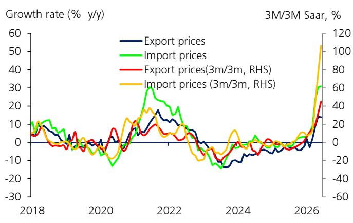
来源：CEIC，UBS估算

图2：人民币在有效汇率口径下走强
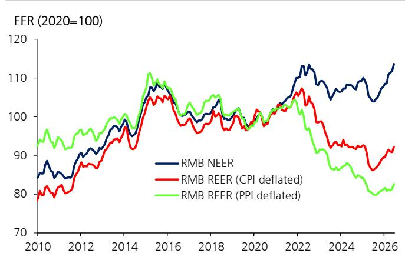
来源：Haver，UBS估算

## AI贸易已成为关键驱动力

全球AI热潮已成为中国贸易增长的重要推动力。过去几年，AI在全球范围内的快速发展和部署重塑了科技供应链。中国正日益融入AI硬件生态系统，作为大型硬件组件供应商，正受益于这些有利因素。

为量化这一影响，我们使用两份参考清单来界定"AI相关"商品：WTO的AI赋能清单（104个HS6产品），以及NBER的更广泛清单（HS10级别的665个项目）。两种方法均显示出异常增长：AI相关出口同比增长40-47%，AI相关进口同比增长44-47%。由于中美贸易编码差异使得HS10级别的映射较为复杂，我们主要依赖较窄的WTO清单。

中国大部分AI出口是中间品，其中集成电路（IC）是核心。按WTO定义，中国AI出口中超过四分之三是中间品，其余大部分是设备，而化学品或原材料出口很少。AI出口篮子包括集成电路、计算机零部件、通信设备（如光模块）、印刷电路板（PCB）、数据存储设备、电力设备等。虽然微观层面的观察表明某些产品是专门为AI用途设计的，如光学组件和PCB，但很大一部分是也用于汽车或工业制造的成熟制程芯片，这些产品在WTO的AI赋能清单上。这可能高估了AI的具体贡献。

中国的AI贸易深度嵌入全球供应链，尤其是亚洲供应链。超过70%的贸易与亚洲其他经济体相关。香港是最大的出口目的地，大部分货物可能再出口至其他目的地——总体而言，再出口一直占香港商品出口的98%以上，尽管缺乏AI相关产品的详细再出口数据。越南、韩国和台湾是亚洲前三大出口目的地，直接承接了四分之一的AI出口，反映了中国与其他主要AI出口国以及亚洲供应链的紧密联系。

进口方面，芯片占主导地位：超过60%的AI相关进口是各类半导体（存储、处理器和放大器），此外还有先进计算机组件、数据存储单元和半导体制造设备。中国AI出口中有很大一部分是"加工贸易"，本质上依赖生产早期阶段的进口组件。

图3：AI出口涵盖广泛的科技硬件品类
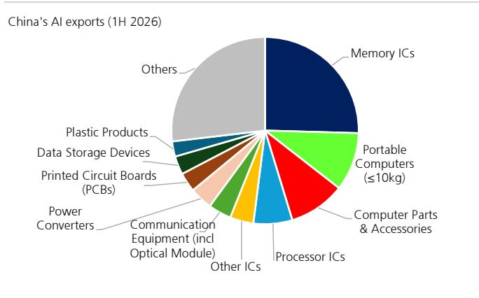
来源：CEIC，WTO，中国海关，UBS估算

图4：AI进口以集成电路为主
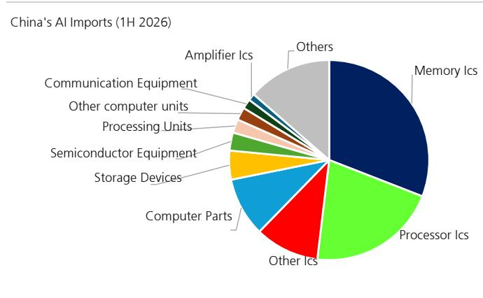
来源：CEIC，WTO，中国海关，UBS估算

AI相关产品已占2026年贸易增长的近一半。上半年，中国总出口中约23%和进口中约30%为AI相关产品，较2023年的17%和22%显著提升。AI相关产品的进口和出口均同比增长47%，贡献了整体进出口增长的一半左右（分别为49%和47%）。

图5：上半年AI产品贡献了49%的出口增长和47%的进口增长
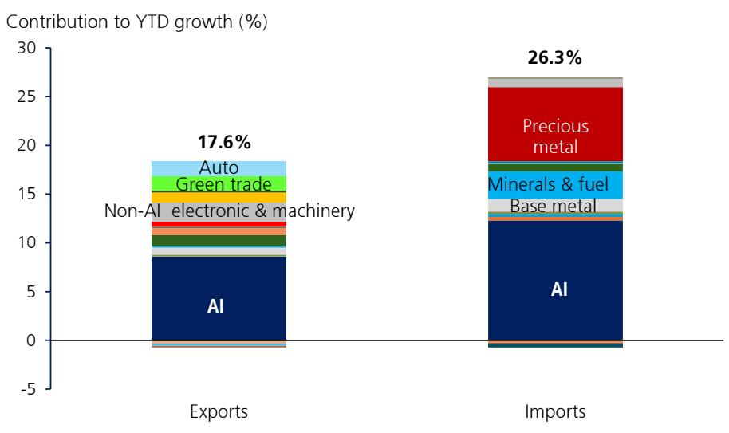
来源：CEIC，WTO，中国海关，UBS估算

AI贸易的繁荣主要是名义价格故事，而非数量周期。AI贸易的增长比以往周期更依赖价格变化。以电子集成电路为例，上半年中国电子IC出口额同比大幅增长96%，但数量仅增长6%，且近期有所放缓（按件数计）。数量放缓可能反映了基数效应和部分细分市场需求走软的综合影响。进口方面，金额同比增长56%，但数量仅增长8%。价格上涨是增长的主要驱动力。价格的急剧上涨反映了供应受限市场中AI驱动的需求，产能向高端AI相关产品转移，收紧了其他领域的供应，更广泛地推高了科技产品价格。每单位出口/进口产品的内容变化也可能提升了平均售价。

图6：价格上涨是主要驱动因素
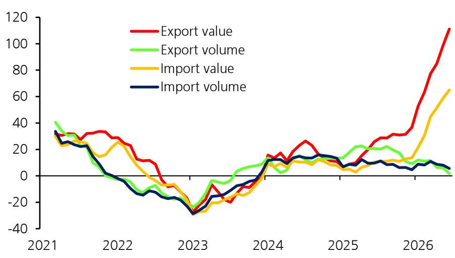
来源：CEIC，UBS估算

## 中国AI贸易繁荣能否持续？

根据UBS科技团队预测，AI资本开支将在未来几个季度进一步扩张（见此处）。该团队预计将出现前所未有的存储上行周期，DRAM/NAND供应偏紧将持续至2028年二季度/2027年四季度。定价方面，他们估计长期协议（LTA）可能锁定行业总量的约20-30%以及未来2-3年的价格（见此处）。此外，由于需求持续远超供应，他们预测非LTA DDR合约价格在2026年二季度环比上涨67%后，三季度将环比上涨32%，四季度环比上涨18%；NAND价格在二季度环比上涨67%后，三季度环比上涨30%，四季度环比上涨12%（见此处）。因此，同比增速可能在2026年年中见顶，随后放缓，但仍处于较高水平。中国主要科技产品的出口价格短期内将继续受益。

外部需求方面，鉴于中国现有的生产规模和与供应链的早期连接，我们预计中国制造商将继续受益于全球AI资本开支的进一步扩张和其他科技相关需求。进口方面，中国科技进口中有相当大一部分是用于进一步加工后再出口的加工投入品，因此AI出口的繁荣机械地带动了AI进口。2026年进口瓶颈的放松——例如，特朗普总统访华后，美国批准向部分中国企业销售英伟达H200 AI芯片——为国内数据中心获取先进GPU提供了一定缓解，但我们认为这算不上突破（见此处）。

展望更长期，中期挑战是中国能在多大程度上继续向价值链上游移动。中国现有的产业规模为其作为大型硬件组件供应商提供了早期优势，但目前全球贸易中最先进的AI基础设施，如GPU和高带宽存储器（HBM），由其他经济体主导。此外，中国获取先进半导体制造设备的渠道受限。因此，中期内市场份额和国内附加值进一步提升的空间可能有限。

## AI之外的韧性

在快速增长的AI相关领域之外，其他出口也保持了良好表现。上半年非AI出口同比增长11%。

汽车仍是重要的韧性来源。上半年中国汽车出口增速加快至同比增长60%，主要由混合动力汽车（同比增长115%）和电动汽车（同比增长57%）驱动。在能源转型趋势和中东冲突之后，电动汽车的吸引力在2026年进一步增强。自2023年成为汽车净出口国以来，中国汽车制造商预计到2030年将占据全球市场份额的三分之一（UBS估算），凭借先进的电动汽车技术和不断扩大的国际布局。

绿色贸易已成为另一个关键增长引擎，受到电气化和基础设施需求的支撑。"绿色出口"包括电池、太阳能、风能、电气设备和光纤，上半年同比增长31%（2025年为15%），对整体出口增长贡献了8个百分点。其中，电池出口增长40%，太阳能设备增长24%，电气设备增长24%。电气化的紧迫性和基础设施的韧性需求——尤其是中东冲突之后——提振了对中国绿色技术的需求，这得益于其成本竞争力、不断提升的产品质量和经过验证的制造规模。然而，未来增长将取决于主要市场的政策变化，尤其是欧洲——中国的最大客户（见UBS ESG团队报告和月度追踪；注意该分析排除了与AI清单重叠的产品）——以及中国自身的政策，如取消太阳能出口增值税退税。

传统消费品出口依然疲弱。纺织品和服装（上半年同比增长1.4%）、鞋帽（-5%）、家具和照明（0.6%）、玩具和体育用品（-12%）等品类表现不佳，反映出持续通胀背景下全球消费需求低迷。6月份，家具和家电出口显著加速，可能反映了与热浪相关的需求增加（见6月读数）。因此，年初至今的强劲出口增长主要由科技和工业需求驱动，而传统商品则相对滞后。

图7：中国已从汽车净进口国转变为净出口国
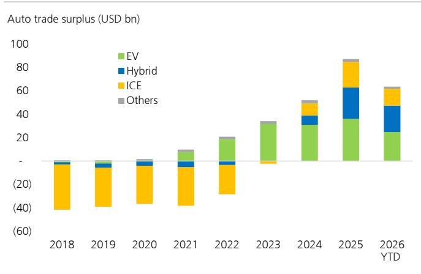
来源：CEIC，中国海关，UBS估算

图8：2026年绿色出口动能增强
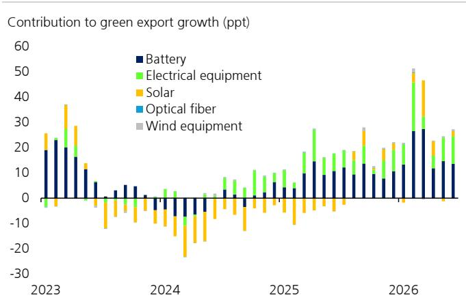
来源：CEIC，中国海关，UBS估算

非AI进口的强劲并不表明内需全面反弹。上半年中国非AI进口同比增长19%，其中贵金属（尤其是黄金）和大宗商品表现突出。我们认为，这一强劲表现主要反映价格上涨、选择性工业需求以及资金配置需求，而非国内活动的广泛复苏。

价格效应推高了进口金额。上半年，铜矿石进口价格上涨38%，未锻造铜上涨36%，原油上涨20%，石油产品上涨24%，铁矿石价格上涨5%。这解释了整体进口强劲的很大一部分，表明金额增长不应被解读为广泛的数量的反弹。

主要大宗商品的进口数量表现不一。原油是最明显的例子：在中东紧张局势导致二季度价格飙升期间，进口量同比下降30%（一季度增长9%），环比年化下降76%（一季度下降5%）。这可能反映了下游需求走弱，如化工行业开工率下降所示（直到7月20日当周国企开工率出现改善迹象），加上下游行业因预期油价冲击是暂时性的而减少库存。工业大宗商品进口中，铜矿石数量同比基本持平，未锻造铜同比下降5%，铁矿石同比增长6%。经季节性调整后，铜矿石数量环比年化下降12%（一季度为0%），铁矿石小幅增长4%（一季度为-21%）。我们认为，实际大宗商品需求日益与电气化、电动汽车、电力基础设施和出口导向型制造业相关。由于房地产新开工面积在二季度仍呈下行趋势，尽管政策放松且部分城市销售出现复苏迹象，但房地产主导的补库存周期仍未出现。

黄金进口主要反映资金配置需求。年初至今黄金进口同比增长189%，贡献了总进口增长的四分之一以上。中国的黄金配置需求通常滞后于价格上涨：随着价格上涨，一季度金条和金币需求同比增长67%，受全球不确定性和地缘政治紧张局势推动，而珠宝消费在创纪录高价下同比下降。二季度强劲的价格动能可能仍提供短期支撑，尽管已有所减弱。注意这些数据指商业黄金进口，不包括央行直接购买，尽管部分进口可能随后被央行购入。与零售读者不同，央行倾向于在价格下跌时增加购买，在价格飙升时放缓步伐（见更多）。未来1-2年，随着黄金价格动能消退，我们预计国内商业需求将正常化。其他贵金属进口，包括白银、铂金和贵金属矿石，也随黄金上涨，部分反映了金价上涨的外溢效应。

图9：一季度黄金配置需求反弹
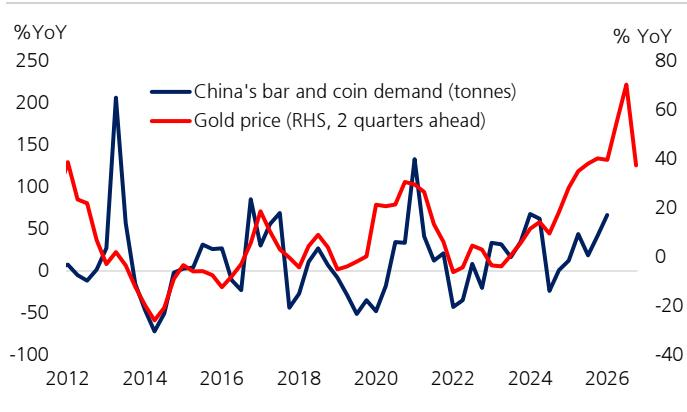
来源：世界黄金协会，Wind，UBS

图10：电气化趋势可能成为铜需求的顺风
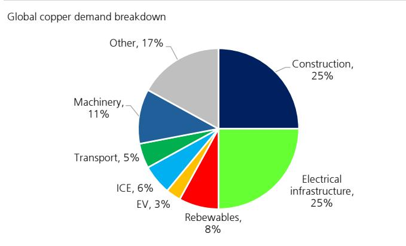
来源：WoodMac，UBS

## 更新2026年贸易预期

价格仍是进出口的关键变量，尤其是在科技贸易中，AI硬件和存储定价比终端需求数量更重要。我们认为，科技价格较强劲的环比动能已经过去。科技出口价格水平可能仍会上升，但同比增速可能在今年晚些时候放缓。与此同时，我们的黄金策略师预计年底前价格将反弹，我们的全球矿业团队鉴于供应约束和AI/能源需求，对铜价保持建设性看法。尽管如此，对贸易价格同比的提振效应可能减弱。相比之下，铁矿石价格预计下半年将趋于下行，因为它与AI相关贸易和中东相关扰动的直接关联较少。

实际层面，贸易放缓在二季度已经明显。实际出口增速从一季度的14%放缓至同比7%，环比年化下降21%（一季度为增长37%），主要受科技产品——尤其是计算机组件和电子IC——以及传统消费品和船舶数量走软拖累。实际进口增长也明显降温，从一季度的同比增长16%放缓至二季度的1%，环比年化下降24%（一季度为增长26%），主要受石油和科技进口走弱影响。

展望未来，我们预计进出口金额增长将在下半年失去动能。AI相关出口应保持韧性但增速放缓，而绿色转型产品和汽车应继续支撑非AI出口。消费品不太可能显著反弹，除了热浪相关的家电需求暂时提振。进口方面，AI相关加工贸易和一定的政策支持应帮助实际需求从疲弱的二季度恢复，但价格增速放缓可能限制其名义金额增长。

我们上调2026年全年贸易预期。目前预计出口按名义美元计算增长18%，进口增长24%，远高于此前分别3%和1.8%的预测。强劲的名义贸易数据并不自动意味着更强的GDP增长，因为增长中有很大一部分是价格驱动的。实际层面，我们预计2026年商品出口增长8-9%，较2025年的9-10%略有下降，而进口应增长7-8%，2025年基本持平。我们预计净出口对实际GDP增长的贡献为0.8个百分点，与上半年读数基本一致，略高于此前0.7个百分点的预测。值得注意的是，这低于2025年1.6个百分点的贡献。含义很直接：内需需要承担更多重任。

图11：UBS预计2026年下半年大宗商品价格将放缓
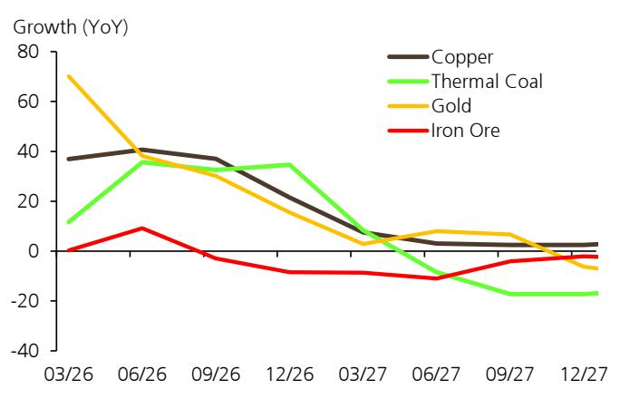
来源：UBS

图12：上半年净出口对GDP的贡献为0.8个百分点，2025年为1.6个百分点
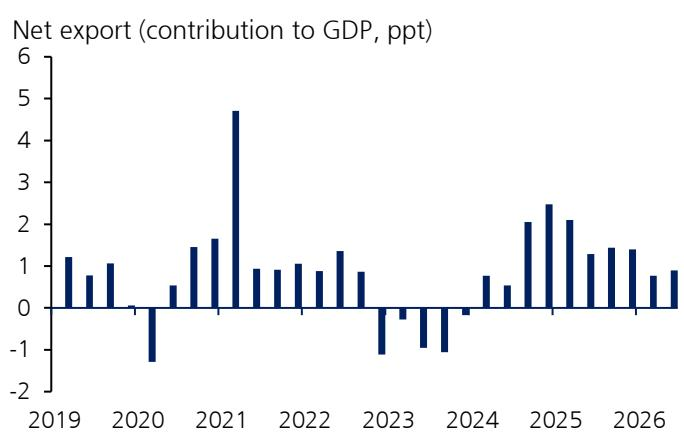
来源：CEIC，UBS估算

关键风险在于全球AI周期的走势。科技资本开支若明显回落，将对相关出口造成压力，而强于预期的资本开支或供应约束的缓解可能重塑需求。由于这轮AI贸易周期比典型的科技上行周期更受价格驱动，关键AI投入品（尤其是存储芯片）的价格将是观察重点。

科技之外，贸易政策仍是主要外部风险。更高的关税或更严的非关税措施将对出口构成下行风险。最近的301条款关税调整影响可能有限，但另一项与产能相关的301调查仍在进行中。欧盟也对中国采取了更强硬的立场，但具体政策行动尚不明朗。增量贸易壁垒、地缘政治冲击、全球需求走弱或大宗商品价格波动仍可能在边际上影响出口。进口方面，关键风险是国内活动走软：如果二季度的疲弱持续，进口数量可能低于预期。

## 宏观与政策影响

政策宽松是必要的，但房地产回升可能性不大。强劲的出口支撑了工业生产，并在部分地区和行业创造了AI相关的财富效应，但收益仍集中在科技和出口部门。这不足以抵消更广泛的内需逆风，二季度GDP增长的明显放缓反映了这一点。如果二季度的动能持续，全年GDP增长将低于目标区间4.5%的下限。由于进口增速将超过出口，净出口对2026年实际GDP增长的贡献将减小，凸显了稳定内需的必要性。

在此背景下，我们预计即将召开的政治局会议将释放明确的宽松信号。政策可能聚焦于加快财政执行、加强与货币宽松的协调，以及继续支持基础设施投资，尤其是"六张网"（算力、通信、水利、电网、物流和地下管网）。房地产支持应继续以稳定为目标，而非启动新一轮上行周期，而额外的消费刺激措施可能相对有限。这一组合应更有利于铜、电网设备和部分工业金属，而非大宗房地产相关商品。我们认为，行政措施上的宽松基调以及更稳定的监管环境也很重要。

中国贸易结构的转变正在推升出口价格。在三年累计下降约17%之后，出口价格上半年同比反弹6.5%，主要由AI相关产品驱动，并受到国内再通胀的支撑。由于AI产品在出口中的占比可能高于在PPI篮子中的占比，且它们在更紧俏、更全球一体化的市场中定价，出口价格通胀可能比PPI更具持续性，并在油价冲击消退后保持在PPI之上。出口价格上涨可能缓解部分关于输出通缩的担忧，但也可能增加全球通胀压力，且冲击集中在AI硬件和部分资本品，而非广泛的消费品。

贸易条件恶化并未阻止人民币升值。进口价格涨幅快于出口价格，导致贸易条件恶化。通常这会带来贬值压力。然而，人民币自2025年年中以来对美元和一篮子货币升值，部分反映了地缘政治风险降低和市场预期转变。资本外流压力减轻强化了这一走势。央行似乎对人民币走强持容忍态度，只要升值不是快速的（见此处），可能是因为较强的货币有助于缓解贸易摩擦，并显示对中国出口竞争力的信心。随着出口日益由供应偏紧的AI产品驱动，对汇率变动的敏感度可能也低于以往周期。

展望下半年，UBS外汇团队仍预计美元将走强约2%（见此处），可能在边际上对美元/人民币汇率产生影响。我们预计下半年美元/人民币将双向波动：地缘政治风险降低、外流压力减轻和央行容忍度支撑人民币，而贸易条件走弱、美元可能走强和内需偏软应限制升值空间。

## 所需披露

本文件由UBS Asia Limited（UBS AG的关联公司）编制。UBS AG及其子公司、分支机构和关联公司（包括前CS AG及其子公司、分支机构和关联公司）在本文件中统称为"UBS"。

有关UBS管理利益冲突和保持其UBS全球研究产品独立性的方式、历史业绩信息、有关UBS全球研究建议的某些额外披露以及研究报告中使用的某些第三方数据的条款和条件，请访问https://www.ubs.com/disclosures。除非另有说明，本报告中的信息和数据基于公司披露，包括但不限于年度、中期、季度报告和其他公司公告。业绩图表中的数字指过去的表现；过往表现并非未来结果的可靠指标。可根据要求提供额外信息。UBS Co. Limited获中国证券监督管理委员会许可从事证券投资咨询业务。UBS担任或可能担任本报告可能涉及的债务证券（或相关衍生品）的委托人。本建议定稿于：2026年7月29日下午4:17 GMT。UBS已指定部分UBS全球研究部门成员为衍生品研究分析师，这些成员主要发表关于衍生品价格或市场分析的研究，并提供足以据此做出衍生品交易决策的合理充分信息。当衍生品研究分析师与股票研究分析师或经济学家共同撰写研究报告时，衍生品研究分析师负责衍生品的观点、预测和/或建议。定量研究回顾：UBS全球研究发布对其分析师关于某一产品中若干短期因素发生可能性的回答的定量评估，称为"定量研究回顾"。本评估中对特定股票的观点仅反映对这些短期因素的看法，其时间框架与本文中任何股票评级所反映的12个月时间框架不同。最新回答请参阅本报告末尾的定量研究回顾附录（如适用）。此前回答请参考(i)之前的UBS全球研究报告；及(ii)如当月未发布适用的研究报告，请参阅定量研究回顾，可在https://neo.ubs.com/quantitative获取，或联系您的UBS销售代表获取报告，或通过ubs-quant-answers@ubs.com联系定量研究团队。包含所有回答的综合报告也可获取，详情和定价请联系您的UBS销售代表或通过上述邮箱联系定量研究团队。

## 分析师认证：

每位对本研究报告内容负主要责任的研究分析师，整体或部分地证明，就本报告所涵盖的每个证券或发行人：(1) 本报告中表达的所有观点准确反映了他或她对这些证券或发行人的个人观点，并且是独立准备的，包括对UBS而言；(2) 他或她的报酬中没有任何部分过去、现在或将来直接或间接地与研究报告中所表达的具体建议或观点相关。

为本报告做出贡献但受雇于UBS LLC任何非美国关联公司的研究分析师未在FINRA注册/取得研究分析师资格。这些分析师可能不是UBS LLC的关联人员，因此不受FINRA关于与目标公司沟通、公开露面以及交易研究分析师账户持有的证券的限制。为本报告做出贡献的各关联公司及受雇于该关联公司的分析师姓名如下（如有）。

UBS AG香港分行：William Deng。UBS Co. Limited：Grace Wang, Jennifer Zhong, Yu Song。

除非另有说明，请参阅本报告正文中的估值和风险部分。有关本报告所讨论公司的完整披露声明，包括估值和风险信息，请联系UBS LLC, 11 Madison Avenue, New York, NY 10010, USA，收件人：投资研究部。

## UBS全球研究免责声明

本文件由UBS Asia Limited（UBS AG的关联公司）编制。UBS AG及其子公司、分支机构和关联公司（包括前CS AG及其子公司、分支机构和关联公司）在本文件中统称为"UBS"。

本文件中表达的任何观点可能随时更改，恕不另行通知，且仅在发布日期有效。UBS内部不同领域、团队和人员可能独立编制和发布不同的研究产品。例如，UBS CIO的研究出版物由UBS全球财富管理编制。UBS全球研究由UBS投资银行编制。各独立研究机构的研究方法和评级体系可能不同，例如在建议、时间范围、模型假设和估值方法方面。因此，除某些经济预测（UBS CIO和UBS全球研究可能就此合作）外，各独立研究机构提供的建议、评级、目标价和估值可能不同或不一致。您应参阅各相关研究产品以了解其方法和评级体系的详情。并非所有客户都能访问每个机构的所有产品。每个研究产品均受编制该产品的机构的政策和程序约束。

本文件仅提供给经UBS明确授权接收的接收方。如果您未获授权，必须立即销毁本文件。

UBS全球研究通过UBS Neo，以及在某些情况下通过UBS.com和任何其他经UBS Neo或UBS.com（每个均为"系统"）明确批准用于分发UBS全球研究的系统或分发方式提供给我们的客户。也可能通过第三方供应商提供，并由UBS和/或第三方通过电子邮件或其他电子方式分发。

所有UBS全球研究均可在UBS Neo上获取。请联系您的UBS销售代表讨论您对UBS Neo的访问权限。当UBS全球研究提及"UBS Evidence Lab Inside"或使用了UBS Evidence Lab提供的数据，且您希望访问该数据时，请联系您的UBS销售代表。UBS Evidence Lab数据可在UBS Neo上获取。UBS全球研究和UBS Evidence Lab向客户提供的服务水平和类型可能因多种因素而异，包括客户个人对通信频率和方式的偏好、客户的风险状况和关注视角（如全市场、特定行业、长期、短期等）、客户与UBS全球研究和UBS Evidence Lab整体关系的规模和范围，以及法律和监管约束。UBS HOLT和UBS Pharma Values是UBS全球研究的产品。HOLT Lens是一个公司绩效平台，提供客观的、以会计为主导的框架，用于比较和评估公司价值，可供UBS全球研究客户使用；详情和定价请联系您的UBS销售代表。特别是，HOLT根据所选情景提供多种合理价格；如有兴趣了解特定公司的合理价格，请发送邮件至UBS LLC, 11 Madison Avenue, New York, NY 10010, USA，收件人：投资研究部，同样需考虑商业因素。UBS Pharma Values是一个分析工具，涉及基于已发布的药品销售预测创建多个单个产品净现值计算，可供UBS全球研究客户使用；详情和定价请联系您的UBS销售代表。有关所有其他特定免责声明，请参阅https://www.ubs.com/disclosures。

当您通过系统接收UBS全球研究时，您对UBS全球研究的访问和/或使用受本UBS全球研究免责声明、UBS Neo平台使用协议（"Neo条款"）以及适用于相关系统的任何其他相关使用条款约束。

当您通过第三方供应商、电子邮件或其他电子方式接收UBS全球研究时，您同意使用受本UBS全球研究免责声明、Neo条款以及适用的UBS投资银行业务条款（https://www.ubs.com/global/en/investment-bank/regulatory.html）和UBS使用条款/免责声明（https://www.ubs.com/global/en/legalinfo2/disclaimer.html）约束。此外，您同意UBS根据我们的隐私声明（https://www.ubs.com/global/en/legalinfo2/privacy.html）和cookie通知（https://www.ubs.com/global/en/legal/privacy/users.html）处理您的个人数据并使用cookie。

如果您收到UBS全球研究，无论是通过系统还是任何其他方式，您同意不得复制、修改、修订、创作衍生作品、提供给任何第三方，或以任何方式商业利用UBS通过UBS全球研究或其他方式提供的任何内容，且未经UBS事先书面同意，不得从通过UBS全球研究或其他方式提供给您的研究或估算中提取数据。您同意未经UBS事先书面同意，不在任何人工智能系统中使用UBS全球研究。

在某些情况下，您可能以非UBS客户身份收到UBS全球研究，您理解并同意在这种情况下：(i) UBS全球研究仅供信息参考；(ii) 就接收而言，您不是也不应被视为UBS的"客户"；(iii) 不得依赖或依据UBS全球研究采取任何行动；及(iv) 此类内容受相关免责声明约束。

本文件仅可在法律允许的范围内分发。不面向任何司法管辖区的公民或居民，或位于任何地方、州、国家或其他司法管辖区的任何人或实体分发或使用，如果此类分发、发布、可用性或使用违反法律或法规，或需要UBS在此类司法管辖区进行任何注册或许可。

本文件为一般性沟通，具有教育性质；不是广告，也不是购买或出售任何金融工具或参与任何特定交易策略的邀约或要约。本文件中的任何内容均不构成任何策略或建议适合或适用于读者个人情况的陈述，也不构成个人建议。通过提供本文件，UBS或其代表均无任何责任或授权以受托身份或其他方式提供或已提供建议。投资涉及风险，读者应审慎自行判断做出决策。UBS或其代表均不暗示接收方或任何其他人采取特定行动方案或任何行动。接收方应完整阅读本文件，不应仅从评级中推断结论。接收本文件即表示接收方确认并同意上述目的，并进一步放弃任何认为该信息构成对接收方的建议或旨在满足接收方目标的期望或信念。

本文件中描述的金融工具可能并非在所有司法管辖区或对某些类别的读者均可销售。期权、结构化衍生品和期货（包括场外衍生品）并非适合所有读者。交易这些工具被认为具有风险，可能仅适合成熟读者。在购买或出售期权之前，以及了解期权的完整风险，您必须收到"标准化期权的特征和风险"的副本。您可以在https://www.theocc.com/publications/risks/riskchap1.jsp阅读该文件，或向您的销售人员索取副本。关于这些工具相关风险的各
