# 东京电子（Tokyo Electron）季度观察笔记

## 评级与目标价

**评级：跑赢市场**

**目标价：79,300日元（原为59,200日元）**

**研究分析师：**
- David Dai, CFA | +852 2918 5704 | david.dai@bernsteinsg.com
- Juho Hwang | +81 3 6777 6980 | juho.hwang@bernsteinsg.com
- Carmine Milano, CFA | +44 20 7762 1857 | carmine.milano@bernsteinsg.com

---

## 核心要点：利润率改善早于预期，目标价上调至79,300日元

**第一季度业绩符合预期。** 收入7,324亿日元（环比+2.9%），略低于市场一致预期，与此前预判一致。毛利率46.8%、营业利润率28.9%，均高于市场一致预期。营业利润2,114亿日元（环比+2.8%），与市场预期持平。分应用看：逻辑/代工较预期低10%，DRAM较预期低9%，NAND符合预期。第二季度指引上调幅度超预期，收入较市场预期高8%，营业利润较市场预期高6%。

**2027财年WFE市场展望上调至1,900亿美元。** 公司将2027年WFE市场预期从此前的1,700亿美元上调至1,900亿美元，主要增长动力来自AI，同时首次提及传统DRAM和CPU的贡献。2026年WFE预期维持1,500亿美元不变。分应用看，公司预计2026年逻辑/代工同比增长15%，DRAM增长超30%，NAND增长40%，整体增长约20%。

**公司预计将继续跑赢市场。** 上半年销售指引同比增长37%，下半年"预计显著超过上半年"，隐含全年增速超37%。公司持续看好涂胶显影设备和刻蚀设备的增长（预计年收入可达1万亿日元），以及由探针台引领的先进封装业务。在产能方面，CEO强调了公司稳健的供应链管理能力，以及与客户建立的深厚合作关系——客户能够提供足够的能见度，使公司得以提前做好充分准备。

**明年毛利率有望突破50%。** 管理层确认，价格调整带来的利润率提升将从第四季度开始显现，下一财年初即可实现50%以上的毛利率目标，早于市场预期的FY29/3。毛利率50%以上、营业利润率35%以上仍有进一步上行空间。就营业利润而言，CEO表示本财年有望接近1万亿日元。

**维持跑赢评级。** 基于第一季度业绩以及对明年增长和利润率的更乐观展望，我们将FY27/28收入预测分别上调6%/20%，利润预测分别上调12%/43%。估值倍数调整至28倍PE（原为32倍），并滚动一个季度，目标价上调至79,300日元，隐含52%的上行空间。

---

## 关键数据一览

| 项目 | 数值 |
|------|------|
| 报告日期 | 2026年7月30日 |
| 收盘价（日元） | 52,240 |
| 目标价（日元） | 79,300 |
| 上行/下行空间 | 52% |
| 52周区间 | 81,260 / 19,870 |
| 基准指数（JPL） | 2,570.52 |
| 财年截止 | 3月 |
| 股息率 | 1.4% |
| 市值（十亿日元） | 24,450.03 |
| EV（十亿日元） | 23,982.12 |

**近期表现：**

| 表现 | 年初至今 | 1个月 | 6个月 | 12个月 |
|------|---------|-------|-------|--------|
| 相对表现（%） | 52.2 | (32.3) | 26.5 | 91.6 |
| JPL（%） | 16.5 | (1.9) | 11.5 | 37.4 |
| 相对表现（%） | 35.7 | (30.4) | 14.9 | 54.2 |

*来源：Bloomberg，Bernstein预测与分析*

**一年价格走势：**
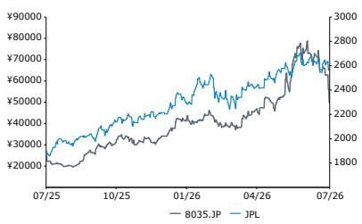

---

## 投资含义

**我们对东京电子的评级为跑赢市场（目标价79,300日元）。**

| 项目 | F25A | F26E | F27E | 财务数据 | F25A | F26E | F27E | CAGR | 估值指标 | F25A | F26E | F27E |
|------|------|------|------|----------|------|------|------|------|----------|------|------|------|
| 每股收益（日元） | 1,250.88 | 1,687.17 | 2,635.81 | 收入（百万）* | 2,444 | 3,411 | 4,436 | -- | 报告PE（倍） | 41.8 | 31.0 | 19.8 |

*\*数值以十亿为单位；来源：Bloomberg，Bernstein预测与分析*

---

## 详细分析

### 图表1：第一季度业绩摘要

| 东京电子 FY27/3 Q1业绩 | 实际值 | 差异 | 同比增速 |
|------------------------|--------|------|---------|
| | Q1 FY27/3 | vs. Bernstein | vs. 市场一致 | 实际 | 市场一致 |
| **收入** | **732.4** | **-4.2%** | **-3.0%** | **33.3%** | **37.4%** |
| Bernstein预测 | 764.8 | | | | |
| 市场一致预期 | 755.3 | | | | |
| **毛利润** | **342.7** | **-0.4%** | **-1.9%** | **34.9%** | **37.6%** |
| Bernstein预测 | 344.2 | | | | |
| 市场一致预期 | 349.5 | | | | |
| **毛利率** | **46.8%** | **1.8%** | **0.5%** | **0.6%** | **0.1%** |
| Bernstein预测 | 45.0% | | | | |
| 市场一致预期 | 46.3% | | | | |
| **营业利润** | **211.4** | **3.5%** | **0.0%** | **46.1%** | **46.1%** |
| Bernstein预测 | 204.2 | | | | |
| 市场一致预期 | 211.4 | | | | |
| **营业利润率** | **28.9%** | **2.2%** | **0.9%** | **2.5%** | **1.7%** |
| Bernstein预测 | 26.7% | | | | |
| 市场一致预期 | 28.0% | | | | |
| **净利润** | **164.3** | **2.9%** | **4.3%** | **39.5%** | **33.8%** |
| Bernstein预测 | 159.7 | | | | |
| 市场一致预期 | 157.6 | | | | |
| **每股收益** | **360.15** | **3.3%** | **5.1%** | **40.4%** | **33.7%** |
| Bernstein预测 | 348.56 | | | | |
| 市场一致预期 | 342.81 | | | | |

*来源：公司披露，Bloomberg，Bernstein预测与分析*

### 图表2：第一季度业绩分项

| 分项 | 实际值 Q1 FY27/3 | 同比增速 | Bernstein Q1 FY27/3 | 差异 | 市场一致 Q1 FY27/3 | 差异 |
|------|-----------------|----------|---------------------|------|--------------------|------|
| SPE（半导体设备） | 732.4 | 33.3% | 764.8 | -4.2% | 767.0 | -4.5% |
| 逻辑与代工 | 302.8 | 19.8% | 332.1 | -8.8% | 336.9 | -10.1% |
| DRAM | 170.0 | 65.5% | 189.1 | -10.1% | 187.5 | -9.3% |
| NAND | 58.4 | 48.0% | 57.0 | 2.5% | 58.6 | -0.2% |
| 现场解决方案 | 188.0 | 33.1% | 177.5 | 5.9% | 174.2 | 7.9% |

*来源：公司披露，Bloomberg，Bernstein预测与分析*

### 图表3：第二季度指引摘要

| 指引分项 | 2Q FY27/3E指引 | 原指引 | 差异 | Bernstein 2Q FY27/3E | 差异 | 市场一致 2Q FY27/3E | 差异 |
|----------|---------------|--------|------|---------------------|------|--------------------|------|
| 收入 | 887.6 | 837.6 | 6.0% | 824.8 | 7.6% | 824.7 | 7.6% |
| 毛利润 | 405.3 | 372.3 | 8.9% | 379.4 | 6.8% | 383.7 | 5.6% |
| 营业利润 | 246.6 | 219.6 | 12.3% | 234.2 | 5.3% | 232.7 | 6.0% |
| 净利润 | 184.7 | 163.7 | 12.8% | 182.3 | 1.3% | 179.0 | 3.1% |
| 新设备 | 708.7 | 668.7 | 6.0% | 622.1 | 13.9% | 617.6 | 14.8% |
| 逻辑/代工 | 404.0 | 381.2 | 6.0% | 352.0 | 14.8% | 353.2 | 14.4% |
| DRAM | 226.8 | 214.0 | 6.0% | 194.8 | 16.4% | 193.0 | 17.5% |
| NAND | 78.0 | 73.6 | 6.0% | 75.3 | 3.5% | 70.3 | 10.9% |

*来源：公司披露，Bloomberg，Bernstein预测与分析*

### 图表4：预测调整摘要

| 东京电子：预测调整 | FY26/3 | 1Q27 | 2Q27E | 3Q27E | 4Q27E | FY27/3E | FY28/3E | FY29/3E |
|-------------------|--------|------|-------|-------|-------|---------|---------|---------|
| **收入（十亿日元）** | | | | | | | | |
| Bernstein - 原预测 | 2,443.5 | 764.8 | 824.8 | 738.1 | 890.0 | 3,217.6 | 3,704.7 | 4,042.7 |
| 同比增速 | 0.5% | 39.2% | 30.9% | 33.7% | 25.0% | 31.7% | 15.1% | 9.1% |
| Bernstein - 新预测 | 2,443.5 | 732.4 | 887.6 | 814.8 | 976.0 | 3,410.8 | 4,435.9 | 5,491.6 |
| 同比增速 | 0.5% | 33.3% | 40.9% | 47.6% | 37.1% | 39.6% | 30.1% | 23.8% |
| 市场一致预期 | | | 824.7 | 817.8 | 881.0 | 3,261.8 | 4,008.5 | 4,594.7 |
| 同比增速 | | | 30.9% | 48.1% | 23.8% | 33.5% | 22.9% | 14.6% |
| 新 vs. 原 | | | 7.6% | 10.4% | 9.7% | 6.0% | 19.7% | 35.8% |
| Bernstein vs. 市场一致 | | | 7.6% | -0.4% | 10.8% | 4.6% | 10.7% | 19.5% |
| **营业利润（十亿日元）** | | | | | | | | |
| Bernstein - 原预测 | 624.9 | 204.2 | 234.2 | 195.6 | 250.1 | 884.1 | 1,081.8 | 1,200.7 |
| 同比增速 | -10.4% | 41.1% | 47.8% | 68.4% | 21.6% | 41.5% | 22.4% | 11.0% |
| 利润率 | 25.6% | 26.7% | 28.4% | 26.5% | 28.1% | 27.5% | 29.2% | 29.7% |
| Bernstein - 新预测 | 624.9 | 211.4 | 252.1 | 232.2 | 288.9 | 984.6 | 1,530.4 | 1,977.0 |
| 同比增速 | -10.4% | 46.1% | 59.1% | 99.9% | 40.5% | 57.6% | 55.4% | 29.2% |
| 利润率 | 25.6% | 28.9% | 28.4% | 28.5% | 29.6% | 28.9% | 34.5% | 36.0% |
| 市场一致预期 | | | 232.7 | 238.6 | 270.0 | 948.5 | 1,272.4 | 1,549.2 |
| 同比增速 | | | 46.9% | 105.5% | 31.3% | 51.8% | 34.1% | 21.8% |
| 利润率 | | | 28.2% | 29.2% | 30.7% | 29.1% | 31.7% | 33.7% |
| 新 vs. 原 | | | 7.6% | 18.7% | 15.5% | 11.4% | 41.5% | 64.7% |
| Bernstein vs. 市场一致 | | | 8.3% | -2.7% | 7.0% | 3.8% | 20.3% | 27.6% |
| **每股收益（日元）** | | | | | | | | |
| Bernstein - 原预测 | 1,250.9 | 348.6 | 397.9 | 332.7 | 424.9 | 1,504.1 | 1,848.8 | 2,064.7 |
| 同比增速 | 6.1% | -24.1% | -13.5% | -27.7% | -7.3% | 20.2% | 22.9% | 11.7% |
| Bernstein - 新预测 | 1,250.9 | 360.2 | 432.8 | 398.6 | 495.6 | 1,687.2 | 2,635.8 | 3,424.7 |
| 同比增速 | 6.1% | 40.4% | 60.8% | 54.7% | 6.0% | 34.9% | 56.2% | 29.9% |
| 市场一致预期 | | | 390.8 | 387.8 | 483.6 | 1,600.4 | 2,126.1 | 2,623.9 |
| 同比增速 | | | 45.2% | 50.5% | 3.4% | 27.9% | 32.8% | 23.4% |
| 新 vs. 原 | | | 8.7% | 19.8% | 16.6% | 12.2% | 42.6% | 65.9% |
| Bernstein vs. 市场一致 | | | 10.7% | 2.8% | 2.5% | 5.4% | 24.0% | 30.5% |

*来源：公司披露，Bloomberg，Bernstein预测与分析*

### 图表5：东京电子历史一年前瞻PE倍数
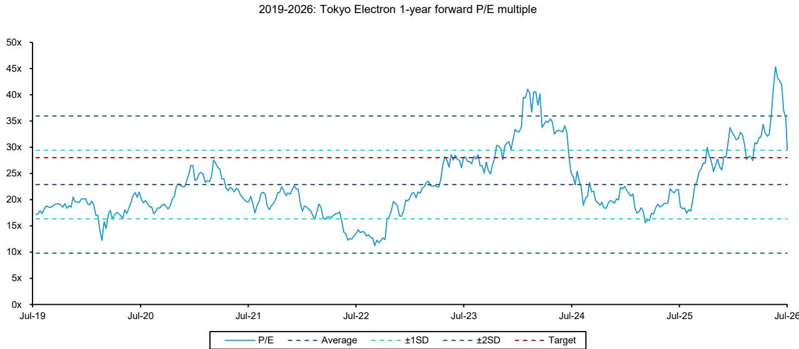
*来源：Bloomberg，Bernstein分析*

---

## 第一季度业绩图表摘要

### 图表6：第一季度收入7,324亿日元，同比增长33%
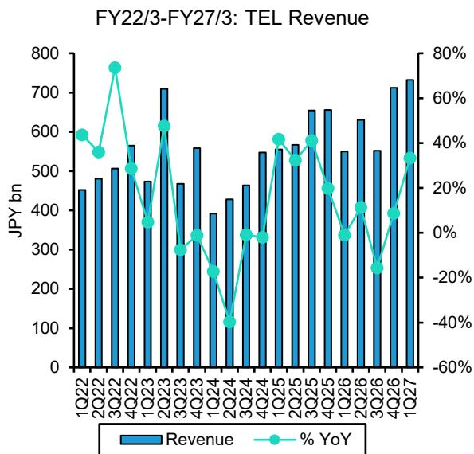
*来源：公司披露，Bernstein预测与分析*

### 图表7：第一季度毛利率/营业利润率分别为46.8%/28.9%，环比基本持平
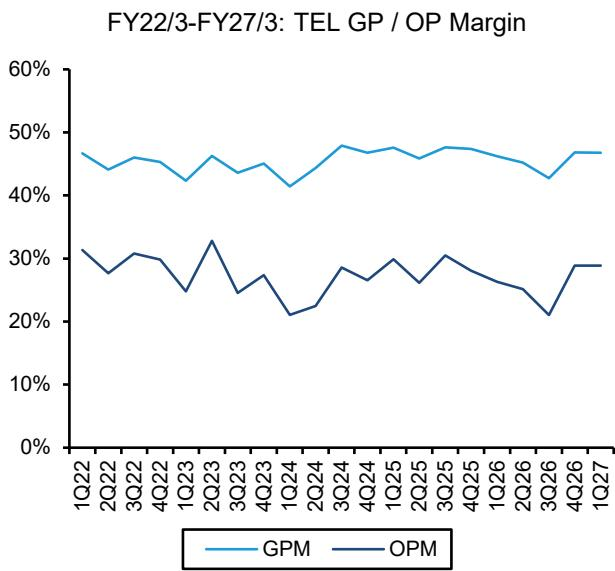
*来源：公司披露，Bernstein预测与分析*

### 图表8：第一季度每股收益360.15日元，同比增长40.4%
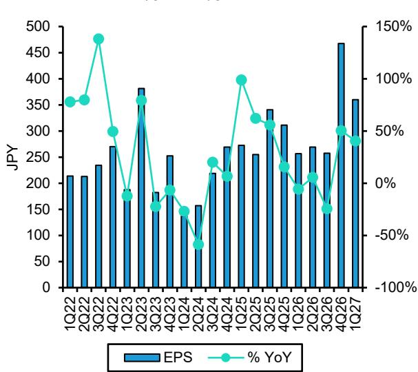
*来源：公司披露，Bernstein预测与分析*

### 图表9：第一季度中国区销售占比30.4%，环比提升3个百分点（上季度为26.8%）

**FY23/3-FY26/3：东京电子收入地区分布**
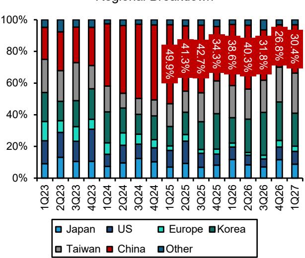
*来源：公司披露，Bernstein分析*

### 图表10：第一季度逻辑/代工占比57%（上季度为58%）

**FY22/3-FY27/3：东京电子NAND收入**
**FY23/3-FY27/3：东京电子SPE收入应用分布**
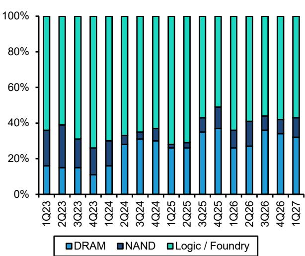
*来源：公司披露，Bernstein分析*

### 图表11：第一季度DRAM销售额1,700亿日元，同比增长65.5%
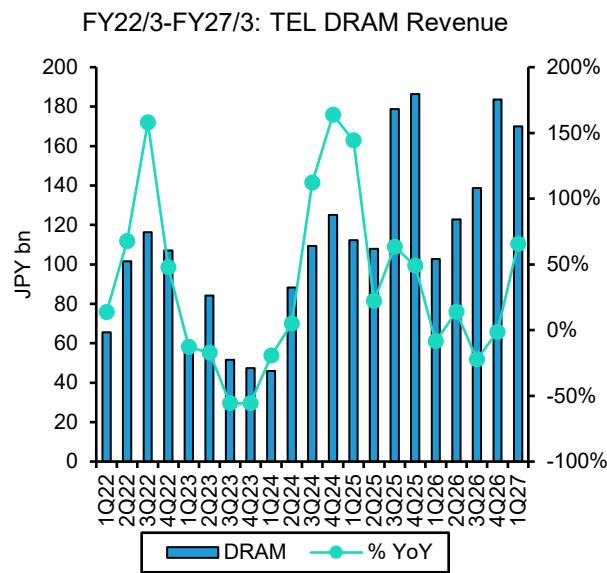
*来源：公司披露，Bernstein分析*

### 图表12：第一季度NAND销售额584亿日元，同比增长48.0%
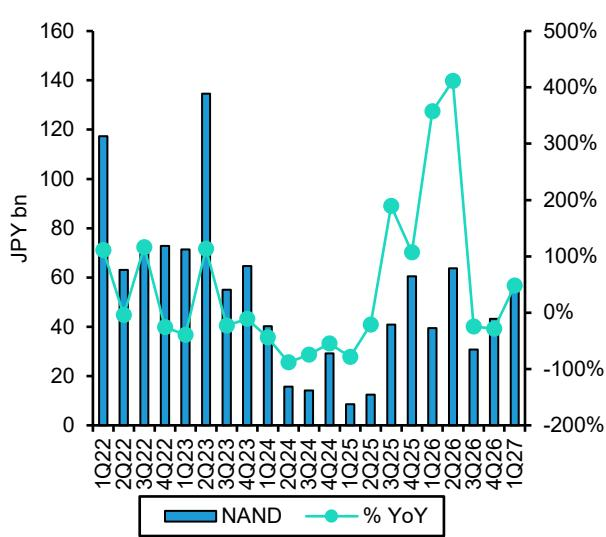
*来源：公司披露，Bernstein分析*

### 图表13：第一季度逻辑/代工销售额3,028亿日元，同比增长19.8%
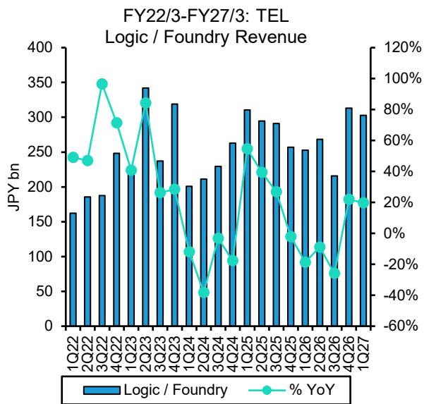
*来源：公司披露，Bernstein分析*

### 图表14：第一季度现场解决方案销售额1,880亿日元，同比增长33.1%
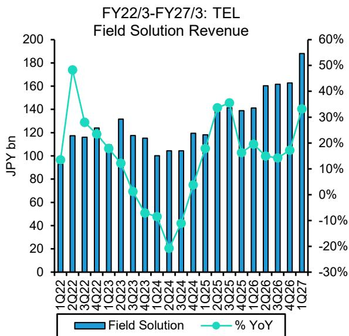
*来源：公司披露，Bernstein分析*

### 图表15：第一季度韩国区销售额1,524亿日元，同比增长73%
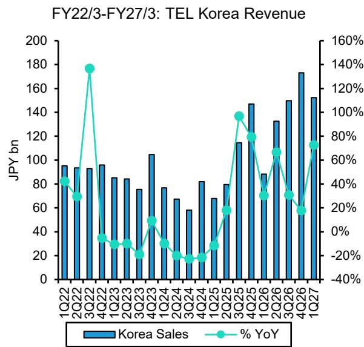
*来源：公司披露，Bernstein分析*

### 图表16：第一季度中国台湾地区销售额1,861亿日元，同比增长66.9%
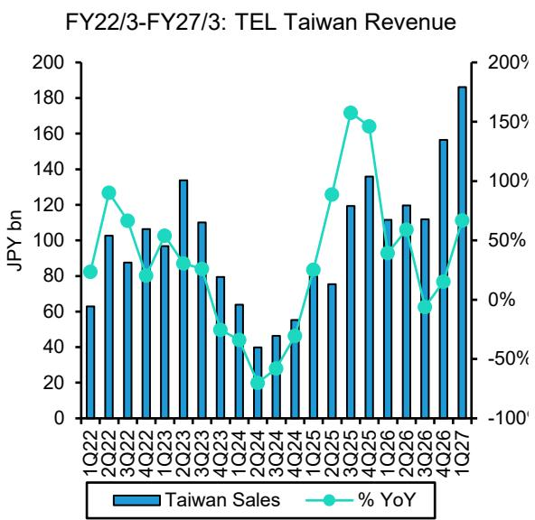
*来源：公司披露，Bernstein分析*

### 图表17：第一季度中国大陆销售额2,229亿日元，同比增长5%
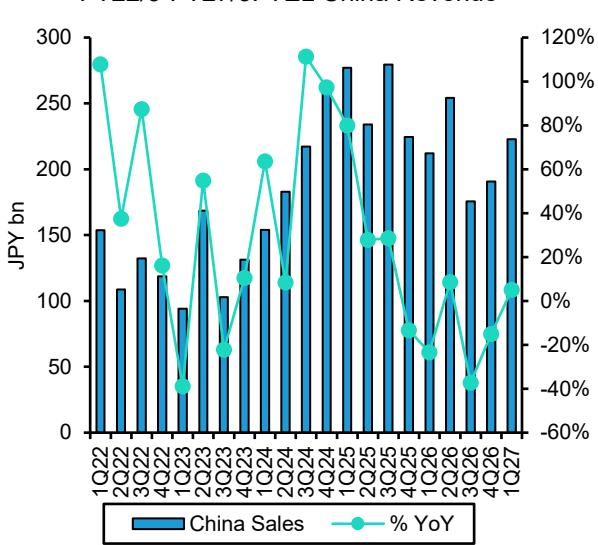
*来源：公司披露，Bernstein分析*

### 图表18：第一季度美国区销售额590亿日元，同比增长36%
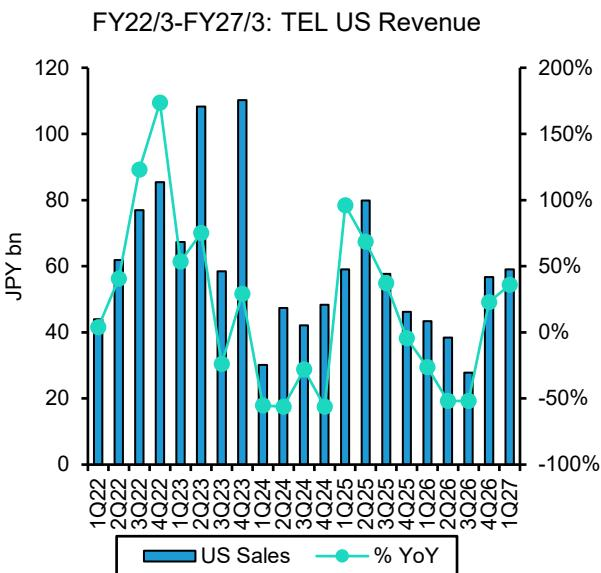
*来源：公司披露，Bernstein分析*

---

## 附录：财务预测

### 图表19：东京电子：利润表

| 十亿日元 | FY26/3 | 1Q27 | 2Q27E | 3Q27E | 4Q27E | FY27/3E | FY28/3E | FY29/3E |
|----------|--------|------|-------|-------|-------|---------|---------|---------|
| 收入 | 2,443.5 | 732.4 | 887.6 | 814.8 | 976.0 | 3,410.8 | 4,435.9 | 5,491.6 |
| 毛利润 | 1,107.9 | 342.7 | 408.3 | 382.9 | 468.5 | 1,602.5 | 2,240.1 | 2,800.7 |
| 销售及管理费用 | 205.1 | 59.3 | 69.2 | 61.1 | 72.2 | 261.8 | 310.5 | 357.0 |
| 研发费用 | 277.9 | 72.0 | 87.0 | 89.6 | 107.4 | 356.0 | 399.2 | 466.8 |
| 其他运营支出 | 482.9 | 131.3 | 156.2 | 150.7 | 179.6 | 617.9 | 709.7 | 823.7 |
| 营业利润 | 624.9 | 211.4 | 252.1 | 232.2 | 288.9 | 984.6 | 1,530.4 | 1,977.0 |
| 折旧与摊销 | 81.0 | 22.5 | 28.4 | 26.1 | 31.2 | 108.2 | 133.1 | 164.7 |
| EBITDA | 705.9 | 233.9 | 280.5 | 258.3 | 320.1 | 1,092.8 | 1,663.4 | 2,141.7 |
| 非营业收支 | 123.2 | 4.1 | 4.4 | 4.1 | 4.9 | 17.5 | 22.2 | 27.5 |
| 税前利润 | 748.2 | 215.5 | 256.5 | 236.3 | 293.8 | 1,002.1 | 1,552.5 | 2,004.4 |
| 所得税费用 | 173.7 | 51.2 | 60.3 | 55.5 | 69.0 | 236.0 | 364.8 | 471.0 |
| 归母净利润 | 574.5 | 164.3 | 196.2 | 180.8 | 224.7 | 766.1 | 1,187.7 | 1,533.4 |
| 摊薄每股收益（日元） | 1,250.9 | 360.2 | 432.8 | 398.6 | 495.6 | 1,687.2 | 2,635.8 | 3,424.7 |
| **利润率** | | | | | | | | |
| 毛利率 | 45.3% | 46.8% | 46.0% | 47.0% | 48.0% | 47.0% | 50.5% | 51.0% |
| 营业利润率 | 25.6% | 28.9% | 28.4% | 28.5% | 29.6% | 28.9% | 34.5% | 36.0% |
| EBITDA利润率 | 28.9% | 31.9% | 31.6% | 31.7% | 32.8% | 32.0% | 37.5% | 39.0% |
| 税前利润率 | 30.6% | 29.4% | 28.9% | 29.0% | 30.1% | 29.4% | 35.0% | 36.5% |
| 净利润率 | 23.5% | 22.4% | 22.1% | 22.2% | 23.0% | 22.5% | 26.8% | 27.9% |
| **同比增速** | | | | | | | | |
| 收入 | 0.5% | 16.2% | 60.8% | 14.5% | -60.1% | 39.6% | 30.1% | 23.8% |
| 毛利润 | -3.4% | 20.3% | 73.1% | 14.9% | -57.7% | 44.6% | 39.8% | 25.0% |
| 营业利润 | -10.4% | 33.4% | 117.0% | 12.9% | -53.8% | 57.6% | 55.4% | 29.2% |
| EBITDA | -7.1% | 31.7% | 104.3% | 12.7% | -54.6% | 54.8% | 52.2% | 28.8% |
| 税前利润 | 6.0% | 33.8% | 67.3% | -16.2% | -60.7% | 33.9% | 54.9% | 29.1% |
| 净利润 | 5.6% | 32.7% | 65.5% | -15.6% | -60.9% | 33.4% | 55.0% | 29.1% |

*来源：公司披露，Bernstein预测与分析*

### 图表20：东京电子：资产负债表

| 十亿日元 | FY23/3 | FY24/3 | FY25/3 | FY26/3E | FY27/3E | FY28/3E | FY29/3E |
|----------|--------|--------|--------|---------|---------|---------|---------|
| 现金及现金等价物 | 472.5 | 461.6 | 485.1 | 505.4 | -66.3 | 72.7 | 118.9 |
| 应收账款 | 464.9 | 391.4 | 485.6 | 525.9 | 643.5 | 729.2 | 902.7 |
| 存货 | 652.2 | 763.0 | 749.1 | 713.1 | 1,394.3 | 1,443.8 | 1,695.6 |
| 其他流动资产 | 151.4 | 84.5 | 80.9 | 91.0 | 99.0 | 99.0 | 99.0 |
| 流动资产合计 | 1,741.0 | 1,700.5 | 1,800.8 | 1,835.5 | 2,070.6 | 2,344.6 | 2,816.3 |
| 固定资产净额 | 259.1 | 337.4 | 441.7 | 589.3 | 685.4 | 907.2 | 1,126.8 |
| 其他非流动资产 | 311.5 | 418.6 | 383.5 | 436.2 | 542.0 | 542.0 | 542.0 |
| 总资产 | 2,311.6 | 2,456.5 | 2,626.0 | 2,861.0 | 3,298.0 | 3,793.8 | 4,485.1 |
| 应付账款及应计费用 | 187.5 | 172.4 | 217.5 | 236.8 | 278.9 | 330.9 | 405.5 |
| 短期债务及租赁 | 0.0 | 0.0 | 0.0 | 0.0 | 0.0 | 0.0 | 0.0 |
| 其他流动负债 | 442.4 | 439.5 | 460.4 | 442.4 | 477.1 | 477.1 | 477.1 |
| 流动负债合计 | 629.9 | 611.9 | 677.9 | 679.2 | 756.0 | 808.0 | 882.6 |
| 长期债务及租赁 | 0.0 | 0.0 | 0.0 | 0.0 | 0.0 | 0.0 | 0.0 |
| 其他非流动负债 | 82.2 | 84.4 | 92.8 | 111.8 | 127.6 | 127.6 | 127.6 |
| 总负债 | 712.1 | 696.3 | 770.8 | 791.0 | 883.6 | 935.6 | 1,010.2 |
| 股东权益 | 1,599.5 | 1,760.2 | 1,855.2 | 2,070.0 | 2,414.4 | 2,858.2 | 3,474.9 |
| 负债及股东权益合计 | 2,311.6 | 2,456.5 | 2,626.0 | 2,861.0 | 3,298.0 | 3,793.8 | 4,485.1 |

*来源：公司披露，Bernstein预测与分析*

### 图表21：东京电子：现金流量表

| 十亿日元 | FY23/3 | FY24/3 | FY25/3 | FY26/3E | FY27/3E | FY28/3E | FY29/3E |
|----------|--------|--------|--------|---------|---------|---------|---------|
| 净利润 | 471.6 | 364.0 | 544.1 | 574.5 | 766.1 | 1,187.7 | 1,533.4 |
| 折旧与摊销 | 38.5 | 52.3 | 62.1 | 81.0 | 108.2 | 133.1 | 164.7 |
| 营运资本变动 | -77.6 | -85.5 | 36.2 | -45.1 | -714.2 | -83.1 | -350.8 |
| 其他调整 | -10.7 | 103.9 | -60.3 | -70.6 | 79.6 | 0.0 | 0.0 |
| 经营活动现金流 | 421.9 | 434.7 | 582.2 | 539.7 | 239.7 | 1,237.7 | 1,347.4 |
| 资本支出 | -76.8 | -135.1 | -177.6 | -209.0 | -195.0 | -354.9 | -384.4 |
| 其他 | 35.0 | 10.0 | 8.0 | 112.5 | -4.2 | 0.0 | 0.0 |
| 投资活动现金流 | -41.8 | -125.1 | -169.6 | -96.5 | -199.2 | -354.9 | -384.4 |
| 筹资活动现金流 | -256.5 | -325.0 | -388.8 | -311.7 | -508.8 | -743.9 | -916.7 |
| 汇率变动影响 | 13.3 | 4.6 | -0.3 | 2.5 | 1.3 | 0.0 | 0.0 |
| 现金净变动 | 136.8 | -10.9 | 23.5 | 134.0 | -467.1 | 139.0 | 46.2 |

*来源：公司披露，Bernstein预测与分析*

---

## Bernstein股票列表

| 代码 | 评级 | 货币 | 收盘价 | 目标价 | 相对表现 | TTM | 报告每股收益 | 报告PE（倍） |
|------|------|------|--------|--------|----------|-----|-------------|-------------|
| | | | | | | | 2025A | 2026E | 2027E | 2025A | 2026E | 2027E |
| 8035.JP（东京电子） | O | JPY | 52,240 | 79,300 | 54.2% | JPY | 1,250.88 | 1,687.17 | 2,635.81 | 41.8 | 31.0 | 19.8 |
| 原目标价 | | | | 59,200 | | | | 1,504.14 | 1,848.77 | | | |
| JPL | | | 2,570.52 | | | | | | | | | |

**目标价/预测调整以粗体标示**

O - 跑赢市场，M - 与市场同步，U - 跑输市场，NR - 未评级，CS - 暂停覆盖
*来源：Bloomberg，Bernstein预测与分析*

---

## 估值方法

### 东京电子

我们采用28倍PE倍数，基于前瞻Q5-Q8每股收益预测，设定目标价79,300日元。

## 风险因素

### 东京电子

东京电子目标价存在多项下行风险：（1）美国贸易限制变化对全球半导体资本开支产生不利影响；（2）全球半导体需求（包括逻辑和存储）出现调整，导致资本开支和产能扩张减少；（3）不利的汇率波动对日本市场整体构成下行风险。

---

##
