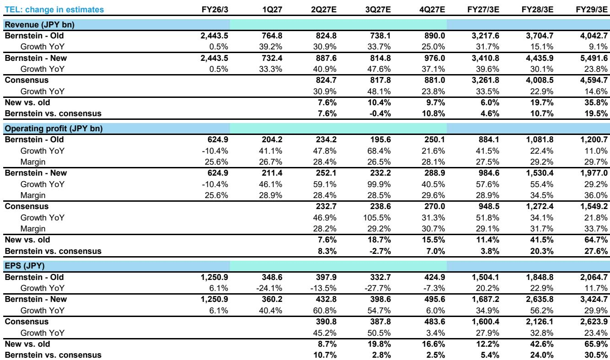
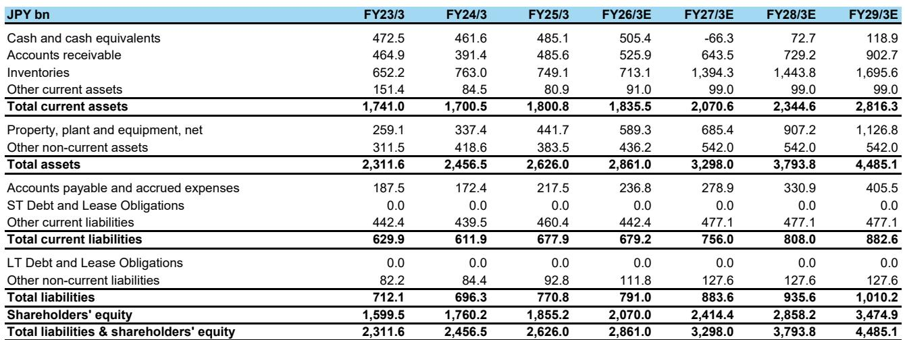
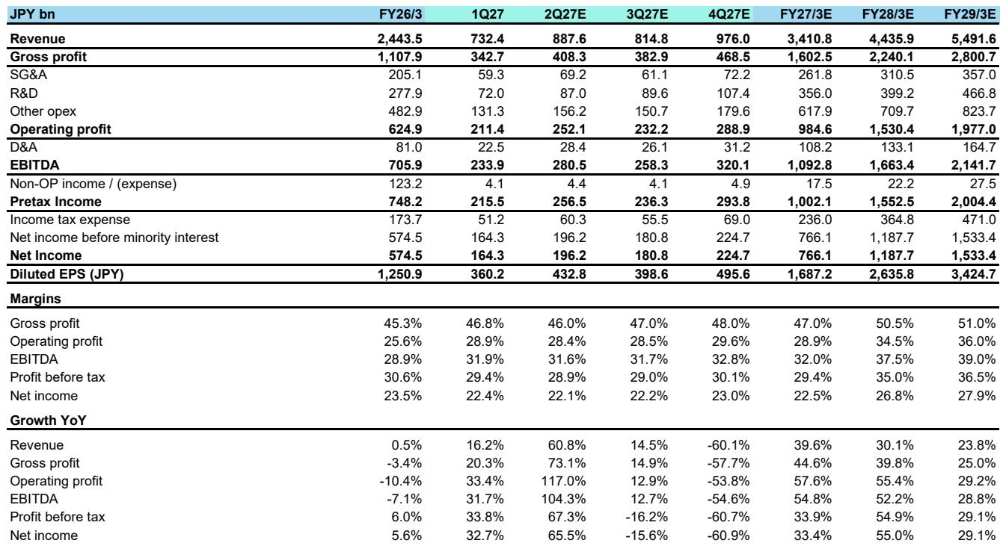

# 东京电子利润率拐点提前一年到来，市场仍在按旧周期定价

东京电子公布第一财季营收为7324亿日元，较市场共识低约3%。这一表面上的营收不及预期，却掩盖了更具实质性的变化：毛利率46.8%、营业利润率28.9%，均超出分析师预期，且管理层明确表示提价将从第四季度开始体现，目标是在下一财年初实现毛利率超过50%。市场此前预计这一利润率里程碑将在2028财年（截至2029年3月）实现，而公司现在表示将在2027财年（截至2028年3月）达成，整整提前一年。

营收不及预期与利润率超预期之间的落差，并非统计上的偶然。它标志着一家公司盈利驱动力的转变——从数量驱动转向定价驱动。围绕东京电子的长期讨论一直集中在晶圆制造设备（WFE）支出周期和存储资本开支时点上。第一财季的业绩重新框定了这一讨论。更重要的问题不是下一轮WFE上行周期何时见顶，而是公司未来利润率扩张中有多少已经锁定、可见且被低估。

一家全球投资机构在7月30日收盘价52,240日元的基础上重申了其观点。这一修正不仅幅度显著，其构成同样值得关注：分析师将2026财年（截至2027年3月）营业利润预期上调11.4%，2027财年（截至2028年3月）上调41.5%，2028财年（截至2029年3月）上调64.7%。预期调整集中在远端，因为利润率故事本身就集中在远端。然而，市场远期市盈率已从32倍降至28倍。分析师以更低的倍数对应更高的盈利流。这种组合——更低倍数、大幅上调的预期——表明市场仍将东京电子视为周期性设备供应商，而非具有结构性定价优势的公司。

## 市场上调WFE展望，但更重要的变化在于增长驱动力的定义

东京电子将2027日历年度WFE市场展望从1700亿美元上调至1900亿美元，同时维持2026日历年度在1500亿美元不变。公司指出AI是主要增长驱动力，但此次明确将传统DRAM和CPU列为贡献因素。这一新增值得关注。AI叙事已充分传播两年，市场已对AI相关半导体需求赋予了显著的增长溢价。将传统DRAM和CPU纳入考量，传递出不同信号：升级周期正在从AI加速器扩展到此前预期持平或下滑的基础计算和存储市场。

公司对2026日历年的应用层面指引使周期的广度更加明确。东京电子预计逻辑/代工同比增长15%，DRAM增长超过30%，NAND增长40%，整体WFE增长约20%。NAND数据尤为引人注目。NAND在多个周期中一直是存储板块的落后者，受困于供应过剩和定价疲软。NAND WFE增长40%的预期意味着存储制造商终于开始落实此前推迟的产能替换和技术迁移。DRAM数据则不仅反映AI驱动的高带宽内存需求，也包含公司明确指出的传统DRAM替换周期。

这意味着WFE支出不再是单一引擎。逻辑/代工、DRAM和NAND在2026日历年度均预期增长，且增速并非边际水平。当三大细分领域同时以两位数速度增长时，整体市场扩张比任何单一应用驱动的周期更具持续性。当传统存储和CPU驱动的支出也在加速时，AI资本开支放缓拖累整个设备市场的风险更低。然而，市场可能仍在按更窄的周期建模。如果东京电子的展望正确，共识WFE轨迹不仅在幅度上被低估，在广度上同样如此。

## 公司的超预期表现不是预期，而是积压订单

东京电子指引上半年销售同比增长37%，并表示下半年预计将显著超过上半年。这意味着全年增长超过37%。对于东京电子这样的规模——2025财年（截至2026年3月）营收2.44万亿日元——持续超过37%的增长不是周期性波动，而是一家产能受限的供应商在需求超过供应能力的环境中的表现。

公司预计涂胶显影设备和刻蚀设备增长超过50%，后者年营收预计达到1万亿日元。以探针台为代表的先进封装也被列为超预期表现的驱动力。这些不是广泛的市场Beta押注，而是东京电子占据主导份额的特定产品类别，且技术路线图要求每片晶圆更多工艺步骤，而不仅仅是更多晶圆。

CEO关于产能和供应链管理的表态是指引中被低估的要素。管理层强调了稳健的供应链管理和强大的客户关系，这些提供了足够的可见性以便提前准备。在设备交付周期可能超过一年的行业中，提前锁定产能和零部件的能力是一种竞争护城河。公司不仅在预测需求，还在将客户承诺转化为生产计划。管理层能够指引下半年增长超过上半年，这本身就意味着大多数设备供应商无法匹敌的可见性。

市场的怀疑可能源于一个合理的担忧：半导体设备是周期性行业，东京电子历来是该板块中周期性较强的公司之一。但当前周期的构成不同。增长来自多个应用领域的同时推进，定价环境在改善，产品组合正向更高价值的工艺步骤转移。这个周期可能比市场历史模板所暗示的更持久、更有利可图。

## 利润率故事才是真正的盈利驱动力，且才刚刚开始

本季度最重要的数据点不是营收或订单，而是管理层确认提价带来的利润率提升将从第四季度开始，支撑下一财年初实现50%以上毛利率的目标。公司还表示在50%以上毛利率和35%以上营业利润率之外还有进一步上行空间。CEO表示本财年营业利润可能接近1万亿日元。

市场此前的预期，如分析师报告所反映的，是50%以上毛利率将在2028财年（截至2029年3月）实现。公司现在表示将在2027财年（截至2028年3月）达成。这不是温和的加速，而是结构性盈利改善整整提前一年。分析师的预期修正反映了这一点：2028财年（截至2029年3月）营业利润上调64.7%，营业利润率预期从之前的29.7%升至36.0%。

利润率扩张并非仅来自经营杠杆，而是来自定价权。东京电子已提高价格，客户正在接受。在产能受限的环境中，延迟生产的成本远超设备成本，设备供应商拥有谈判优势。提价不是一次性调整，它为未来利润率表现重置了基数。一旦提价进入基数，利润率改善将随销量增长而复合累积。

分析师的模型显示毛利率从2026财年（截至2027年3月）的47.0%升至2027财年（截至2028年3月）的50.5%和2028财年（截至2029年3月）的51.0%。营业利润率呈现类似轨迹：2026财年28.9%，2027财年34.5%，2028财年36.0%。这些不是渐进式改善，而是公司盈利能力的台阶式跃升。然而，市场对这一轨迹的重新定价一直缓慢。分析师将目标倍数从32倍降至28倍，同时大幅上调预期，这表明市场的怀疑集中在倍数而非盈利上。这是一个值得审视的脱节。

## 决策框架：利润率拐点对定位与风险的意义

对于试图将这份业绩报告转化为定位决策的读者，框架包含三个要素：需求周期的持续性、利润率扩张的可见性，以及市场对这一组合赋予的估值。

关于持续性，关键问题是WFE市场能否在2027日历年度维持1900亿美元。东京电子的指引假设三大应用领域均实现增长，AI是锚点但非相对少见驱动力。传统DRAM和CPU的纳入是关键信号。如果这些市场确实进入替换周期，WFE市场的增长对AI资本开支连续性的依赖就会降低。风险在于传统DRAM和CPU周期比AI驱动需求更短，一旦替换浪潮过去，市场可能面临更急剧的修正。反方观点是技术转型——全环绕栅极晶体管、高带宽内存、先进封装——需要每片晶圆更多设备，即使数量持平也能延长周期。

关于利润率可见性，提价已经锁定。管理层对下一财年初实现50%以上毛利率目标的信心不是预测，而是对已签约订单的陈述。第四季度利润率提升的启动时间意味着当前季度的出货已承载新定价。市场此前对该里程碑在2028财年（截至2029年3月）的预期偏保守，公司已予以修正。剩余风险不在于利润率扩张是否发生，而在于能否在初始提价之后持续。公司关于50%以上毛利率之外还有进一步上行空间的表态表明管理层看到了额外的定价杠杆，但这些不如已承诺的提价那样确定。

关于估值，分析师对2027财年（截至2028年3月）每股收益2,635.81日元给出的28倍远期市盈率，对应的市值仍包含周期性风险。该股年初至今已上涨52.2%，但52周区间19,870至81,260日元反映了该标的的波动特征。分析师79,300日元的目标价低于52周高点，这承认即使盈利兑现，市场也可能不会完全重新定价。因此，决策框架不在于东京电子是否是一家好公司——显然是——而在于市场对其周期性折价是否适用于一家正在展现历史上周期性设备供应商所不具备的定价权和利润率持续性的公司。

二阶影响更为广泛。如果东京电子能够维持50%以上毛利率和35%以上营业利润率，这将改变整个半导体设备板块的盈利格局。其他具有类似技术地位的设备供应商可能尝试类似提价，行业利润池将扩大。反之，如果东京电子的定价权反映的是暂时性产能短缺而非结构性转变，当供应赶上需求时利润率扩张将逆转。第一财季的证据——营收不及预期但利润率超预期——指向前者，但行业的周期性历史支持谨慎态度。

本季度的地区数据增加了另一层信息。中国销售占比为30.4%，高于上一季度的26.8%，但中国营收同比仅增长5%，而韩国增长73%，台湾增长66.9%。地区结构的变化表明增长来自韩国和台湾的领先存储和逻辑制造商，而非中国的产能扩张。这是一个更健康的增长形态，因为它反映技术驱动需求而非政策驱动产能增加。这一结构的可持续性将决定利润率扩张能否维持。

最后一个考量是分析师预期中嵌入的经营杠杆。模型显示营业利润从2026财年（截至2027年3月）的9,846亿日元增至2027财年（截至2028年3月）的15,304亿日元，增长55.4%，营收增长30.1%。营业利润率从28.9%扩张至34.5%是超额利润增长的来源。这不是数量故事，而是利润率故事。仅关注WFE市场份额或出货量的读者将错过要点。盈利驱动力是提价在固定成本基数上的体现。

市场的怀疑可以理解。东京电子历史上的盈利周期性曾让读者受损，该股52周区间反映了这种创伤。但当前周期形态不同。需求更广泛，定价权真实存在，利润率轨迹是已锁定的而非期望中的。分析师在降低倍数的同时上调预期，是在认可盈利改善与尊重周期性风险之间的折中。52%的隐含上行空间表明市场尚未接受利润率故事。第一财季的业绩使这种接受更有可能，但路径将取决于接下来两个季度的执行。

公司对第二财季的指引强化了这一轨迹。隐含营收8,876亿日元，高于共识7.6%；营业利润2,466亿日元，高于共识6.0%。从第一财季7,324亿日元的环比加速幅度显著，全年隐含增长39.6%较此前31.7%有大幅上调。市场对这些数据的反应将具有指示意义。如果股票在预期修正后仍未重新定价，将确认市场的担忧不在于盈利而在于周期持续性。如果股票重新定价，则表明利润率拐点已成为共识观点。

研究案例建立在一个简单命题上：东京电子的盈利能力增长快于市场为其定价的意愿。第一财季的业绩提供了利润率扩张真实且提前到来的证据。问题在于市场最终是否会接受这一证据，还是继续持观望态度。

*仅供参考。部分内容可能基于原始材料经AI辅助生成、翻译、摘要或编辑，可能存在遗漏或错误。请独立核实。本文不构成投资、法律、税务、会计或其他专业建议。*

仅供参考。部分内容可能基于原始材料经AI辅助生成、翻译、摘要或编辑，可能存在遗漏或错误。请独立核实。本文不构成投资、法律、税务、会计或其他专业建议。

