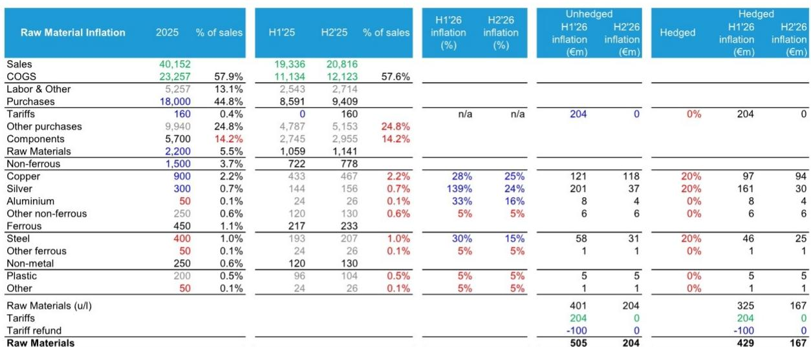
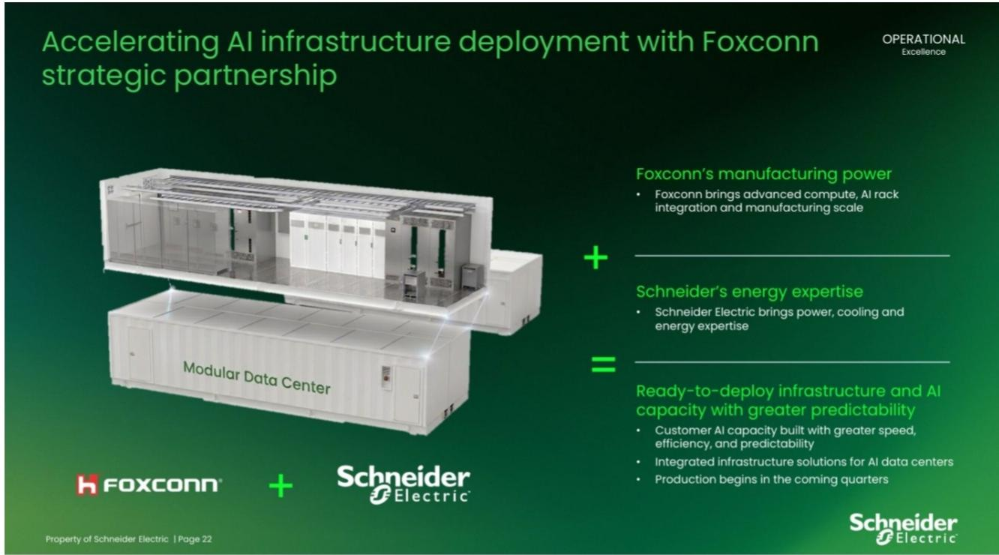
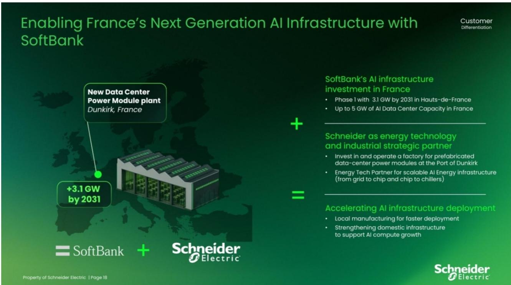

# Bernstein：施耐德电气上半年业绩与数据中心产能布局

施耐德电气在7月30日发布上半年业绩后，报价单日上涨超过10%。这份由Bernstein分析师Alasdair Leslie主笔的报告，将这一表现概括为“用一年修复，用一天证明”。过去12个月，市场对施耐德电气偏弱的经营杠杆多有审视，管理层年初设定加速生产率、成本节约与定价的路径，上半年数据看起来是对这套执行方案的直接回应。

报告的核心判断是：施耐德电气正在从执行调整期转向执行改善期，而数据中心相关业务的结构性增长，叠加原材料通胀在下半年的自然回落，为这一转变提供了双重支撑。Bernstein据此将2026年有机增长预期上调280个基点，目标报价从310欧元上调至330欧元。

## 1. 上半年有机增长全面超预期，各地区各业务均实现正增长

报告显示，施耐德电气集团层面LFL销售增长为16.5%，较市场一致预期高出约6个百分点。能源管理业务LFL增长17.7%，较一致预期高出620个基点，其中北美地区表现突出，LFL增长达24.8%，较一致预期高出840个基点。工业自动化业务增长11.0%，较一致预期高出490个基点，中国与东亚地区表现尤为亮眼，LFL增长19.6%，较一致预期高出12个百分点。

数据中心订单在二季度实现三位数增长。报告认为，这一增长势头并非孤立现象——以nVent为例，其需要在二季度实现37%的LFL增长才能超越施耐德电气在当季的表现，伊顿和西门子则需要分别达到19%和20%的LFL增长。这种比较本身说明了施耐德电气在电气板块中的增长位置。

> **KC评论：** 这里容易被忽略的是增长质量。施耐德电气不是靠单一区域或单一业务拉动，而是北美、中国、能源管理、工业自动化同时超预期。这种全面性比任何一个单项数字都更能说明问题——它指向的是执行层面的系统性恢复，而非某个偶然订单的集中释放。

## 2. 定价能力加速与原材料成本回落形成下半年利润支撑

报告详细拆解了施耐德电气的利润驱动因素。二季度定价实现约为一季度的2.5倍，一季度产品定价约2%，二季度加速后上半年整体定价约2.8%。报告预计下半年定价将进一步加速约50个基点，因为二季度的新定价将在下半年遇到更有利的比较基数。

原材料方面，报告用披露数据和同业基准估算了施耐德电气的原材料敞口。铜、银、铝、钢是主要品种，其中铜约占销售额的2.2%，银占0.7%。报告假设施耐德电气对前三大大宗商品按价值对冲20%，在此假设下，上半年原材料通胀对利润的影响约为4.29亿欧元，下半年预计降至1.67亿欧元。关税方面，上半年约2.04亿欧元的关税影响中，有1亿欧元获得退款。

上半年生产率贡献达5.35亿欧元，仅比2025财年全年结果少10%。报告认为，这一数字是理解上半年利润率扩张的关键——集团调整后EBITA利润率19.3%，有机利润率同比扩张120个基点，是一致预期53个基点的两倍以上。

## 3. 模块化数据中心采用轻资产模式扩张，富士康与软银成为产能杠杆

报告将施耐德电气在预制模块化解决方案领域数十年的经验视为持续增长的竞争优势。管理层将当前的主要约束描述为产能和供应链扩展，而非项目执行本身，这背后是较强的客户可见度和有纪律的产能规划。

具体做法上，施耐德电气正在借助富士康和软银等合作伙伴增加制造规模和AI机架集成能力，同时自身继续供应底层设备。这种安排使其能够在不完全依赖自有生产设施和资本开支的情况下扩大部署规模。报告特别指出，当同业如Vertiv在扩展集成AI基础设施解决方案时面临规模化挑战，施耐德电气相对处于更有利的位置。

> **KC评论：** 轻资产模式的关键不在节省资本开支，而在降低需求波动时的固定成本不确定性。如果数据中心增长最终节奏变化，施耐德电气不需要为过剩的自有产能买单。这是报告在讨论富士康合作时真正想表达的意思——它把增长期权和资产负债表不确定性做了分离。

## 4. 混合因素与下半年执行节奏仍需观察

报告并非没有保留。上半年系统业务增长22%，比集团整体快8个百分点，这对产品组合产生了约0.7个百分点的利润率影响。净价格在上半年仍为负值，关税走向也存在不确定性。管理层在电话会上表示，6月的退出价格水平如果在下半年持续，足以抵消原材料通胀和关税影响，但这一判断依赖二季度更强的定价节奏得以维持。

报告还提到，Cognite的收购将在下半年对调整后EBITA产生约7000万欧元的谨慎影响。这些因素合在一起，意味着下半年利润率扩张的斜率可能不如上半年陡峭，但方向是清晰的。

施耐德电气当前报价284.60欧元，52周区间为208.80至293.70欧元。报告给出的目标报价330欧元对应2027年预期市盈率约25倍，基于2027至2030年13%的每股收益复合增长率，PEG低于2倍。在电气设备板块中，这一估值对应的是报告所认为的行业最佳增长潜力。

For informational purposes only. Portions may be generated,translated,summarized,or edited with AI assistance based on source materials and may contain omissions or errors. Please verify independently. This is not investment,legal,tax,accounting,or other professional advice.

For informational purposes only. Portions may be generated,translated,summarized,or edited with AI assistance based on source materials and may contain omissions or errors. Please verify independently. This is not investment,legal,tax,accounting,or other professional advice.

