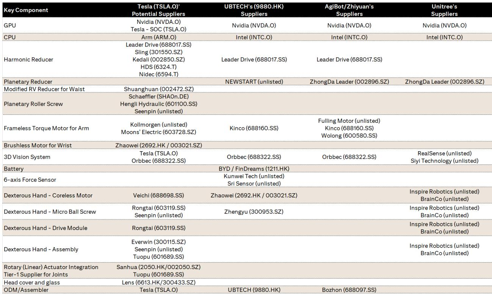

# 美国对境外人形机器人的限制将重塑全球供应链格局——但影响路径与多数人的预期不同

2026年7月28日，美国联邦通信委员会将先进机器人设备（包括人形机器人和四足机器人）列入其受限清单，以国家安全为由，实质上禁止从外国进口此类机器进入美国市场。对于一个过去三年一直将中国定位为人形机器人时代制造引擎的行业而言，这一决定如同断路器跳闸。然而，最深远的影响并不会落在禁令直接针对的成品机器人上，而是会波及那张从上海延伸至蒙特雷再到曼谷的、错综复杂且往往不可见的零部件供应链网络。

对此事件的常规解读直截了当：拥有美国客户的中国机器人制造商面临直接且重大的威胁。这种解读是正确的，但并不完整。更深层的故事在于，这项禁令加速了全球机器人产业中一场早已开始的分离——地缘政治风险正迫使机器人的设计地、组装地以及最关键零部件的生产地走向分化。对于观察者而言，问题不再是哪家公司制造出最好的执行器或最精密的丝杠，而是哪些公司已经构建了足够的地理选择余地，以便在一个贸易壁垒不断升级的世界中生存下来。

这并非假设性的情景推演。美国联邦通信委员会的这一行动，遵循了美国对中国技术限制的既有模式——从电信设备到半导体——机器人行业对此早有准备。此次禁令的不同之处在于其范围：它不仅针对成品，还覆盖了整个先进机器人设备类别，这表明华盛顿方面将人形机器人视为潜在敏感的数据收集平台，而非消费级小工具。其影响波及价值链的每一个环节，从传感器制造商到执行器集成商，再到最终组装厂。

## 禁令催生双重市场格局，终端客户归属决定企业存续

美国联邦通信委员会将其列入受限清单，意味着任何在美国境外制造的人形或四足机器人——无论其零部件源自何处——都无法进入美国市场。对于优必选、智元机器人和宇树科技等中国机器人制造商而言，这是对其最具价值的增长市场的直接冲击。这一时间点尤为不利：人形机器人行业正处于商业化的临界点，物流、制造和医疗领域的试点部署预计将在未来18至24个月内扩大规模。在此阶段失去美国市场准入，不仅是收入上的挫折，更是在定义主导性人形机器人平台的全球竞赛中，战略地位被降级的体现。

中国机器人制造商与美国同行之间的不对称性十分明显。总部位于美国的公司，如特斯拉的Optimus项目以及少数资金充裕的初创企业，可以不受阻碍地进入本土市场，而其中国竞争对手则被拒之门外。这形成了双重市场结构：美国市场成为本土企业及其盟友的专属领地，而中国及其他非美国市场则仍是竞争之地。每个层级内部的竞争动态将显著分化。在美国层级，本土公司在价格和创新速度方面面临的竞争压力将减小，这可能会减缓技术进步的步伐。在非美国层级，中国企业将加倍投入其已拥有坚实基础的东南亚、中东和欧洲市场，但将面临在没有美国市场所提供的规模经济效应的情况下实现扩张的挑战。

中国机器人制造商的战略考量，如今已从“如何在美国取胜”转变为“如何在没有美国市场的情况下生存”。这并非无解之题——中国企业在其他科技领域也曾经历过类似的排斥——但这从根本上改变了人形机器人生产的经济学逻辑。人形机器人的单位经济性依赖于大规模产量来分摊高昂的研发和工装成本。失去美国市场准入，这些产量目标将更难实现，可能使行业实现盈利的路径推迟数年。

## 与美国供应链关联的零部件制造商成为禁令的意外受益者

这项监管措施背后隐藏着一个反直觉的洞察：禁令实际上可能有利于特定一部分中国零部件制造商——即那些已经嵌入美国人形机器人公司供应链的企业。逻辑很简单：如果美国联邦通信委员会的禁令限制外国制造的机器人进入美国，那么美国机器人制造商必须扩大本土生产以满足需求。扩大生产需要零部件，而其中许多零部件——谐波减速器、行星滚柱丝杠、微型滚珠丝杠和专用电机——目前由中国制造商供应。

以恒立液压为例，该公司生产对人形机器人直线执行器至关重要的行星滚柱丝杠。该公司正逐步将这一零部件的生产线迁往墨西哥。这种地理多元化布局，在启动时或许看似防御性对冲，如今却成为战略优势。墨西哥制造的零部件不受美国联邦通信委员会进口禁令的限制，使恒立液压能够不间断地继续为美国机器人制造商供货。这项禁令实际上奖励了那些预见到地缘政治风险并采取先发制人行动来实现制造布局多元化的公司。

绿的谐波提供了另一个例证。该公司已与敏实集团在美国本土成立了人形机器人执行器合资企业，将其谐波减速器生产置于美国市场内部。这不仅仅是供应链对冲，更是一条竞争护城河。面临禁令的美国机器人制造商将承受压力，需要证明其供应链的本土来源，而绿的谐波在美国的生产使其成为理想合作伙伴。该公司实际上已将监管威胁转化为市场机遇。

这一模式同样适用于荣泰和伟创，它们在泰国成立了合资企业，生产微型滚珠丝杠和电机——这些是人形机器人灵巧手的关键部件，而灵巧手是机器人制造中技术难度最高的部分之一。泰国不受美国进口禁令限制，且靠近东南亚主要电子制造中心，使其成为合理的生产基地。这些公司已将自己定位为既能服务美国客户，又能维持其在中国面向其他市场的制造基地。

## 地理多元化已成为机器人零部件板块的核心价值驱动力

美国联邦通信委员会的禁令，使评估机器人零部件制造商的方式发生了根本性转变。传统分析聚焦于技术能力、生产效率和客户关系。这些因素仍然重要，但如今已退居其次，一个更基本的问题浮出水面：公司在何处生产其产品？那些已将生产迁往中国以外——墨西哥、美国或东南亚——的公司，拥有其专注于本土的竞争对手所缺乏的监管选择权。

这并非细微差别。报告中指出的四家已建立海外工厂的公司——恒立液压、绿的谐波、荣泰和伟创——代表了人形机器人关键零部件领域的核心力量。它们的产品涵盖行星滚柱丝杠、谐波减速器、微型滚珠丝杠和微型电机，覆盖了人形机器人制造中技术要求最高的环节。这四家公司均做出建立海外生产的战略决策并非巧合，这反映了对地缘政治走向的深刻理解，以及为此进行昂贵投资以对冲风险的意愿。

竞争影响深远。未实现制造布局多元化的零部件制造商，将发现自己日益被排除在美国市场之外——并非直接因法规限制，而是因美国机器人制造商的采购决策。面对禁令，美国公司将强烈倾向于从拥有非中国生产设施的供应商处采购零部件，既为降低监管风险，也为表明其符合受限清单的合规精神。这形成了一种自我强化的动态：多元化的供应商获得市场份额，从而有能力进一步投资海外产能，进而巩固其优势。

对于观察者而言，启示很明确：制造产能的地理位置已变得与产品的技术规格同等重要。一家拥有世界级技术但仅在中国生产的零部件制造商，与拥有相当技术但生产布局多元化的竞争对手相比，面临的风险特征截然不同。市场尚未完全消化这一区别，这为能够识别处于地理多元化早期阶段的公司创造了潜在机会。

## 人形机器人供应链版图正沿地缘政治断层线重塑

美国联邦通信委员会的禁令并非孤立存在。它是中美技术脱钩这一更广泛模式的一部分，该模式已重塑了半导体、电信，如今又波及机器人领域的供应链。人形机器人供应链最初建立在全球贸易畅通无阻的假设之上，如今正沿地缘政治线重新组织。这种重组具有读者需要理解的不同特征。

第一个特征是机器人领域“中国+1”战略的出现。正如电子制造商将部分生产转移至越南和印度以对冲中美紧张局势，机器人零部件制造商也在友好司法管辖区建立次级生产基地。选择墨西哥、泰国和美国本身作为生产地点颇具深意。墨西哥靠近美国市场，并享有《美墨加协定》的优惠。泰国可接入东南亚供应链，且地缘位置具有优势。美国则提供了应对进口限制的终极对冲，但伴随着更高的劳动力和生产成本。

第二个特征是成品机器人组装与零部件制造之间的分化。禁令针对成品机器人，但并未直接限制零部件进口。这创造了一个有趣的套利机会：零部件可在中国制造，运往第三国进行最终组装，然后作为该第三国的产品进口到美国。然而，这种变通方案不太可能在持续的监管审查下长期存续。美国联邦通信委员会的受限清单认定，很可能是更广泛监管框架的第一步，该框架最终也将涵盖零部件采购问题。

第三个特征是知识产权保护在供应链决策中日益重要。人形机器人不仅是机械设备，更是人工智能、传感器融合和数据收集的平台。美国联邦通信委员会的国家安全理由反映了对数据收集和传输的担忧。这意味着美国机器人制造商将面临压力，不仅要确保其零部件的生产地点，还要确保其软件和数据处理的发生地点。这可能推动人形机器人技术栈中最敏感环节的进一步本地化。

## 应对机器人领域新地缘格局的决策框架

对于观察者和行业参与者而言，美国联邦通信委员会的禁令需要一套系统性的方法来评估机会与风险。以下框架综合了此次监管转变中浮现的关键考量。

第一个维度是市场准入。应基于公司对美国市场的敞口进行评估，既包括作为收入来源，也包括作为其产品的市场。拥有大量美国收入的中国机器人制造商面临直接风险，而拥有美国客户但生产在非中国地区的零部件制造商则处于有利地位。关键问题不在于一家公司是否有美国敞口，而在于这种敞口是弱点还是优势。

第二个维度是制造布局。在中国以外拥有生产设施的公司拥有一种关键的监管选择权。这些设施的地点很重要：美国本土生产提供最高级别的安全性，但成本也最高；墨西哥在 proximity 和成本之间取得平衡；东南亚具有成本优势，但供应链更长。应评估一家公司的制造布局是否与其客户群和监管敞口相匹配。

第三个维度是客户集中度。在现行监管体制下，为美国人形机器人公司供货的零部件制造商具有结构性优势，因为这些美国公司将寻求保护其供应链免受进一步的地缘政治干扰。然而，这种优势也伴随着自身风险：过度依赖美国客户会造成对美国采购政策变化或特定机器人制造商商业命运的脆弱性。

第四个维度是技术关键性。对人形机器人功能至关重要且替代供应商稀少的零部件，拥有定价权和战略重要性。报告指出谐波减速器、行星滚柱丝杠和微型滚珠丝杠是关键零部件，而生产这些零部件的公司——尤其是那些制造布局多元化的——很可能从持续的供应链重组中获取不成比例的价值。

第五个维度是监管演变的步伐。美国联邦通信委员会的禁令不太可能是最终结论。对零部件进口、数据流或技术转让的进一步限制是可能的，中国也可能采取对等措施。公司和观察者应构建考虑升级限制的情景，并据此检验其假设。

## 禁令加速必然趋势：机器人供应链将镜像半导体供应链

美国联邦通信委员会针对外国制造人形机器人的行动并非孤立的监管决定；它标志着机器人已加入半导体行列，成为中美战略竞争的一个领域。模式是熟悉的：最初限制成品，随后对供应链的审查日益严格，最终导致两国技术生态系统逐步但不可逆转地脱钩。认识到这一轨迹并相应定位的公司将蓬勃发展；而那些假设当前监管环境是暂时或可协商的公司，将发现自己被边缘化。

半导体行业提供了一个有用的模板。当美国最初限制向中国出口先进芯片时，直接反应集中在成品上。然而，随着时间的推移，限制扩大到包括制造芯片的设备、设计芯片的软件，最终还包括生产芯片所需的人才和知识。机器人行业应预期类似的轨迹。当前对成品机器人的禁令之后，很可能会对最敏感的零部件实施限制，然后是对制造这些零部件的工具和设备，甚至可能涉及技术知识和标准的共享。

这一轨迹对机器人行业的全球地理分布具有深远影响。正如半导体制造已集中在少数几个战略要地——台湾地区负责前沿逻辑芯片，韩国负责存储芯片，美国和欧洲负责专业设备——机器人制造也可能聚集在地缘政治立场一致的地区。美国、墨西哥和东南亚正成为服务美国市场的首选地点，而中国将专注于服务其国内市场及友好海外市场。这种分化将降低全球机器人供应链的效率，但也将为能够在两个领域有效运营的公司创造机会。

那些已经建立海外生产的公司——恒立液压、绿的谐波、荣泰和伟创——不仅仅是在对冲监管风险；它们正在将自己定位为脱钩后世界的主导供应商。它们的早期行动赋予了它们先发优势，得以构建从非中国生产基地服务美国客户所需的关系网络、物流体系和运营专长。后来者将面临更高的成本、更长的周期，以及在争取客户承诺方面更大的困难。

对于更广泛的机器人行业而言，美国联邦通信委员会的禁令标志着无摩擦全球化时代的终结，以及战略竞争新时代的开始。在这个环境中成功的公司，将是那些将地缘政治风险视为核心战略变量、而非被动应对的外部因素的公司。人形机器人行业的供应链版图正在被重新绘制，而绘制得最好的公司，将定义这个行业的未来。

*仅供参考。部分内容可能基于源材料由AI辅助生成、翻译、总结或编辑，可能存在遗漏或错误。请独立核实。本文不构成投资、法律、税务、会计或其他专业建议。*
