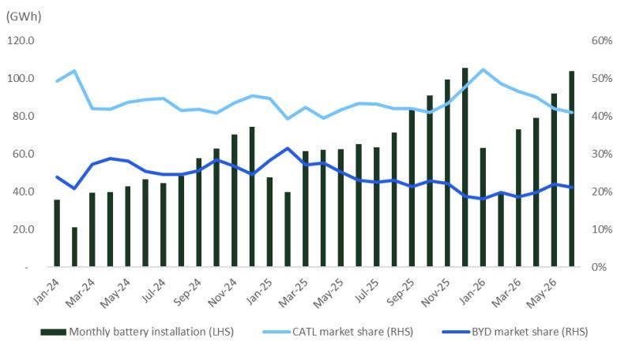
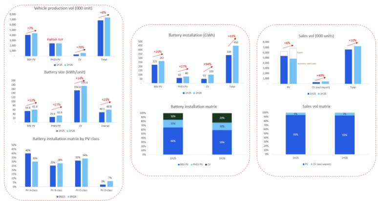

# 中国电池材料行业观察

## 研究摘要

根据行业数据，2026年上半年中国动力电池装机量同比增长33%，达到约451.6 GWh。其中，纯电动乘用车、插电混动乘用车和商用车的电池装机量分别同比增长20%、27%和94%。我们将上半年新能源汽车销量同比增长10%与电池装机量同比增长33%之间的差异进行了对比分析，认为主要归因于：（1）各车型（包括乘用车和商用车）电池容量持续提升的趋势；（2）商用车占比上升；（3）高端乘用车占比提高。宁德时代继续作为市场领导者，期内市场份额同比提升3个百分点至45%。我们对碳酸锂价格在8-9月旺季前的表现保持关注。重点关注公司：赣锋锂业、湖南裕能、宁德时代。

## 年初至今动态

根据行业数据，中国动力电池装机总量达451.6 GWh，同比增长33%。宁德时代（不含时代上汽合资公司）市场份额同比提升3个百分点至45%，而比亚迪市场份额同比下降7个百分点至20%（2025年上半年为27%）。前两大电池厂商在2026年上半年合计占据65%的市场份额，较2025年上半年的69%下降4个百分点。

**图1：宁德时代和比亚迪持续主导市场**

---

## 销量与装机量差异的解读

2026年上半年电池装机量同比增长33%，显示出较好的增长势头，同期新能源汽车销量（含乘用车和商用车）同比增长10%。这一差异主要归因于：（1）电池容量持续提升——纯电动乘用车、插电混动乘用车和商用车的单车电池容量分别同比增长12%、27%和14%；（2）商用车重要性上升——商用车占2026年上半年电池装机量的约23%，而2025年上半年为16%；（3）乘用车市场向高端化转移——A级乘用车电池装机占比从2025年上半年的40%降至2026年上半年的30%，而B/C/D级乘用车占比持续提升。

**图2：销量与装机量差异的解读**

**图3：供应链关系**

<table><tr><td>(MWh)</td><td>宁德时代</td><td>比亚迪</td><td>中创新航</td><td>国轩高科</td><td>亿纬锂能</td><td>正力新能</td><td>瑞浦兰钧</td><td>蜂巢能源</td><td>欣旺达</td><td>LGES（中国）</td><td>其他</td><td>合计</td></tr></table>

---

## 附录

### 分析师声明

本研究报告的主要撰写分析师已在作者栏中以“AC”标注。每位分析师确认：（1）报告中所表达的观点准确反映了其个人观点，并以独立方式完成；（2）分析师薪酬的任何部分均未直接或间接与本报告中的具体建议或观点挂钩。

### 重要披露

本报告由Citi全球市场亚洲有限公司发布。报告中的信息和数据来源于公开渠道和行业数据提供商，仅供参考之用。过往表现不代表未来结果，预测亦不构成对未来表现的保证。

---

*本文档仅供信息参考，不构成任何形式的研究交流。读者应基于自身情况独立判断，并在必要时咨询专业人士。*
