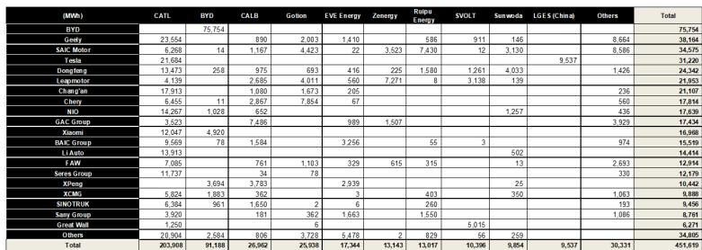

# 电池装机量增长33%：远超电动车销量增速背后的结构性变化

2026年上半年，中国汽车电池供应链完成装机量451.6 GWh，同比增长33%，而同期电动车销量增速为10%。这23个百分点的差距并非统计偏差或数据采集异常，而是传递出一个清晰的信号：中国电动化的发展逻辑，正在从“数量驱动”转向“强度驱动”。对于关注能源转型的研究者和观察者而言，这两个数字之间的差异，揭示了产业价值正在向何处迁移——更大容量的电池、更重的车型，以及具备溢价能力的高端乘用车细分市场。那些布局于这三个方向的企业，而非单纯追逐销量的企业，将定义中国电池市场下一阶段的发展格局。

这一差异之所以值得关注，在于其正在加速扩大。乘用车和商用车的电池容量提升、商用车装机占比的持续上升，以及B/C/D级乘用车份额的决定性增长，都指向同一个结论：中国电池包的平均容量在增大，产品结构在优化。市场领先企业宁德时代在2026年上半年占据45%的装机份额，同比提升3个百分点；比亚迪的份额则下降7个百分点至20%。头部两家企业合计控制65%的市场，低于一年前的69%——这种分散化趋势表明，需求的深化在为挑战者创造空间，即便领先者仍在巩固其优势。

这并非关于电动车普及放缓的故事，而是关于市场在跨越早期采用阶段后，开始优化性能、续航和实用性，而非仅仅关注价格的故事。来自真锂研究的数据，经由全球投资银行的研究视角进行解读，为了解重塑全球最大电动车电池市场的结构性力量提供了一个难得的窗口。其影响远超中国国境，因为服务这一市场的电池供应链，也将在未来十年为欧洲、东南亚和美洲提供供应。

## 电池容量提升不是趋势，而是需求预测的新基准

上半年数据中最具深远意义的发现，是单车电池容量的增长规模。电动乘用车的平均电池容量同比增长12%，插电式混合动力车型跃升27%，商用车单车容量增加14%。这些并非渐进式调整，而是对电动车预期性能的根本性重新定价。一年前搭载20 kWh电池包的插混车型，如今搭载约25 kWh——这一变化既反映了消费者对更长纯电续航的偏好，也体现了车企通过性能而非价格实现差异化的策略。

其战略含义直接明确：任何将电池需求锚定于电动车销量的预测模型，都将系统性低估市场规模。10%的销量增速，在原有产品结构下或许对应12-15%的电池需求增长，实际却实现了33%的增长。容量提升的乘数效应已成为需求方程中的主导变量。对于电池制造商而言，这是利好利润率的发展，因为更大的电池包通常意味着更高价值的订单和更稳定的产能利用率。对于原材料供应商，尤其是锂生产商，其影响更为显著，因为电池容量是碳酸锂消费的主要驱动力。

插混车型的数据尤其值得关注。平均插混电池容量同比增长27%，表明这一长期被视为过渡技术的细分市场，正在被打造为接近纯电性能的产品。车企实际上正在模糊插混与纯电的界限，推出纯电续航超过100公里的混动车型，使其在绝大多数日常驾驶场景中可作为纯电车使用。这一策略似乎正在奏效：期内插混电池装机量增速超过纯电装机量，该细分市场在整体装机结构中的占比持续攀升。电池供应链成为受益者，因为每辆售出的插混车现在消耗的电池容量，已达到纯电车的相当比例。

## 商用车成为隐藏的增长引擎，其电池强度正在重绘需求版图

2026年上半年，商用车电池装机量同比增长94%，将该细分市场从总装机的16%提升至23%。这是数据中最大的结构性变化，对电池化学体系、电芯设计和原材料需求产生深远影响。商用车——卡车、客车和物流车队——的运行工况与乘用车根本不同：行驶路线更长、载重更大、对总拥有成本的压力更为敏感。商用车平均电池容量同比增长14%，表明车队运营者正在根据实际续航需求而非最低合规标准来配置电池。

商用车电动化的经济性已跨越临界点。随着电池成本持续下降和柴油价格维持高位，电动卡车和客车的回收期已缩短至车队运营者可以接受更高前期资本支出的水平。94%的装机增长并非单季度脉冲，而是采购决策的结构性转变。这对电池供应链意义重大，因为商用车通常使用更大规格的电芯、针对循环寿命优化的不同化学体系，以及更 robust 的热管理系统。能够盈利地服务这一细分市场的供应商，正在构建乘用车导向的竞争对手难以跨越的护城河。

商用车的转变还具有读者不应忽视的地域维度。中国广阔的高速公路网络、集中的物流枢纽以及对绿色货运的政策支持，创造了商用车电动化快速扩张的环境。类似的动态正在欧洲卡车运输行业和东南亚客车车队中初步显现，尽管处于更早期阶段。中国的经验为全球商用车电动化市场提供了预览，而电池强度数据表明，单车需求将显著高于大多数全球预测的假设。

## 乘用车结构上移，重塑竞争格局

推动装机量增长与销量增速背离的第三股力量，是乘用车销售结构的持续变化。A级车——这一中国电动车普及的主力细分市场——在2025年上半年占电池装机的40%，但2026年上半年仅占30%。A级车失去的份额被B/C/D级车型吸收——这些中型、大型和豪华细分市场价格更高、所需电池容量更大。这是需求侧的升级周期，而非供给侧的推动。消费者正在选择更大、续航更长的车型，车企则以突破电池容量上限的车型作为回应。

竞争格局的影响十分显著。宁德时代市场份额提升3个百分点至45%，不仅是规模优势的体现，更反映了该公司在增长最快的细分市场中的精准布局。报告中的供应商表格显示，宁德时代向特斯拉供应21,684 MWh、向吉利供应23,554 MWh、向蔚来供应14,267 MWh、向理想汽车供应13,913 MWh——这些均为偏向大型车辆的高端或高销量品牌。比亚迪份额下降7个百分点至20%，表明其垂直整合模式虽然在大众市场高效，但在高端化转型中定位欠佳，尤其是其自有车辆销售面临日益激烈的竞争。

头部两家企业的分化值得关注。头部两家合计份额从69%降至65%，即便宁德时代份额在增长。这意味着挑战者——中创新航、国轩高科、亿纬锂能等——正在同时从比亚迪和长尾企业手中获取份额。报告中的供应商矩阵显示，中创新航向广汽集团供应7,496 MWh、向小鹏汽车供应3,783 MWh；国轩高科向奇瑞供应7,854 MWh、向上汽集团供应4,423 MWh。这些合作关系并非静态。随着乘用车结构上移，车企正在分散电池供应以确保产能并争取更有利的条款，为能够以略低价格匹配宁德时代质量的二线供应商创造了机会。

## 宁德时代的份额增长源于细分市场布局，而非仅靠规模优势

仔细解读供应商数据，可以揭示宁德时代为何在竞争加剧中仍能获得份额。该公司的装机基础高度集中于增长最快的细分市场。其向特斯拉供应21,684 MWh、向小米供应12,047 MWh、向赛力斯（AITO品牌背后的高端电动车企业）供应11,727 MWh，展示了其客户组合在推动结构变化的B/C/D级车型中具有不成比例的高敞口。相比之下，比亚迪主要供应自有车辆，集中在正在失去份额的A级和B级细分市场。

这是结构性优势，而非暂时现象。宁德时代作为高端和高销量电动车品牌默认供应商的地位，形成了良性循环：高端车型的更大电池带来更高的单车收入，为下一代化学体系的研发提供资金，进而使宁德时代成为下一波高端车型的首选合作伙伴。2026年上半年3个百分点的份额增长可能持续，不是因为宁德时代在价格战中胜出，而是因为它占据了市场正在走向的细分领域。

对比亚迪而言，启示更具警示性。使比亚迪成为全球销量最大电动车制造商的垂直整合模式，如今在一个奖励电池强度和高端定位的市场中成为制约因素。比亚迪20%的装机份额（低于一年前的27%）表明，其内部电池供应未能跟上市场向更大电池包转变的步伐。该公司的应对措施——据报道正在开发更先进的电池化学体系，并考虑部分车型采用外部供应——将决定其能否遏制下滑。对于观察者而言，信息明确：在中国电池市场，份额增长越来越取决于细分市场定位，而非单纯的制造规模。

## 电池供应链布局的决策框架

上半年数据为评估中国电池市场敞口的读者和企业战略制定者提供了一个实用框架。该框架基于三个问题，价值链上的任何参与者在投入资源或建立合作关系之前都应加以思考。

第一，需求来自哪里？答案决定了价值链的哪个环节受益。33%的装机增长由容量提升、商用车和高端乘用车驱动——而非销量增长。为这些细分市场供应电池材料、电芯或电池包组件的企业，其需求增速将快于整体电动车销量数据所暗示的水平。相反，专注于A级乘用车或低容量入门级电池包的供应商，所面对的是一个在总量中占比不断缩小的细分市场。

第二，客户是谁？报告中的供应商矩阵显示，头部车企正在分散电池来源，但仅限于合格供应商的狭窄范围内。宁德时代的主导地位体现在其几乎覆盖所有主要车企——从特斯拉到小米再到理想汽车。二线供应商如中创新航和国轩高科正在赢得特定客户——中创新航获得广汽、国轩高科获得奇瑞——但尚未在高端市场取代宁德时代。车企的战略问题是：将订单集中给市场领导者以确保供应和技术获取，还是采用双源策略以维持议价能力。数据表明大多数车企选择双源策略，这为前五名供应商创造了机会，但经济性仍有利于领导者。

第三，锂价走势如何？报告维持对碳酸锂价格在8月/9月旺季前的短期看涨判断，这一观点源于装机数据。如果电池装机量以33%的速度增长且平均电池包容量在增加，那么锂需求增速将快于大多数供应预测。锂价近期走势——从2022年高点大幅回调后企稳——表明市场正在再平衡，2026年上半年装机数据提供了需求处于较强一侧的证据。对于赣锋锂业等锂生产商和云能等材料供应商而言，装机量激增是定价能力改善的领先指标。

该框架也包含一个审慎提示。报告数据来自真锂研究的月度装机追踪，反映的是中国车辆电池装机情况。装机与产量之间的区别很重要：装机反映实际道路上的车辆，而产量包括库存积累。33%的装机增长如果持续，最终将转化为产量增长，但时间和幅度取决于电池和车辆层面的库存动态。观察者应关注季度产量数据，以确认装机激增正在转化为持续的制造活动，而非一次性的库存消耗。

## 二阶效应远超中国国境

中国2026年上半年电池数据中可见的结构性变化并不局限于国内市场。中国是全球最大的电动车市场和电池及电池材料的主导生产国。那里正在出现的电池强度趋势——更大电池包、商用车普及和高端化——将在本十年剩余时间内塑造全球对锂、镍、钴及其他原材料的需求。欧洲和北美的车企已经在效仿中国模式，推出更大电池容量的电动车并扩大商用车电动化项目。中国数据为这些市场成熟后的全球需求提供了早期预判。

商用车领域的发现尤其具有全球相关性。欧洲的卡车脱碳法规和美国的《通胀削减法案》激励措施都在推动商用车电动化，但步伐慢于中国。中国商用车装机量94%的增长表明，电动卡车和客车的可寻址市场远大于当前全球普及率所暗示的水平。能够以正确的电芯规格、化学体系和热管理服务这一细分市场的电池供应商，将拥有远超中国国境的多年度增长跑道。

对于锂生产商，影响更为直接。报告对碳酸锂价格在8月/9月旺季前的看涨立场，基于装机数据。如果中国电池装机量以33%的速度增长且结构向更大电池包转变，那么锂需求增速是大多数供应侧预测尚未充分纳入的。锂价在从2022年高点大幅回调后近期企稳，可能是持续复苏的前奏。那些在低迷期保持生产纪律、并与在中国赢得份额的电池制造商签订供应协议的企业，最有能力捕捉上行空间。

中国电池市场的竞争动态也为全球行业提供了启示。宁德时代在市场分散化中仍能获得份额，表明技术领先和客户关系比单纯规模更重要。该公司在高端乘用车细分市场的主导地位，是其研发投入和与车企共同开发电池解决方案意愿的证明。对于任何市场的挑战者而言，教训是：赢得份额需要的不仅是产能，还需要嵌入客户的产品路线图，并能够交付增长最快细分市场所要求的特定性能特征。

33%的装机增长与10%的销量增长之间的差异，并非需要解决的谜题，而是电池供应链价值积累方向的路线图。理解这一区别的企业——电池需求现在是强度的函数，而非仅仅是数量的函数——将做出更优的资源配置决策，建立更持久的客户关系，并捕获能源转型所创造利润中的不成比例份额。2026年上半年的数据是最清晰的证据：电池需求作为电动车销量简单衍生品的时代已经结束。

*仅供参考。部分内容可能基于原始材料由AI辅助生成、翻译、摘要或编辑，可能存在遗漏或错误。请独立核实。本文不构成投资、法律、税务、会计或其他专业建议。*

仅供参考。部分内容可能基于原始材料由AI辅助生成、翻译、摘要或编辑，可能存在遗漏或错误。请独立核实。本文不构成投资、法律、税务、会计或其他专业建议。

