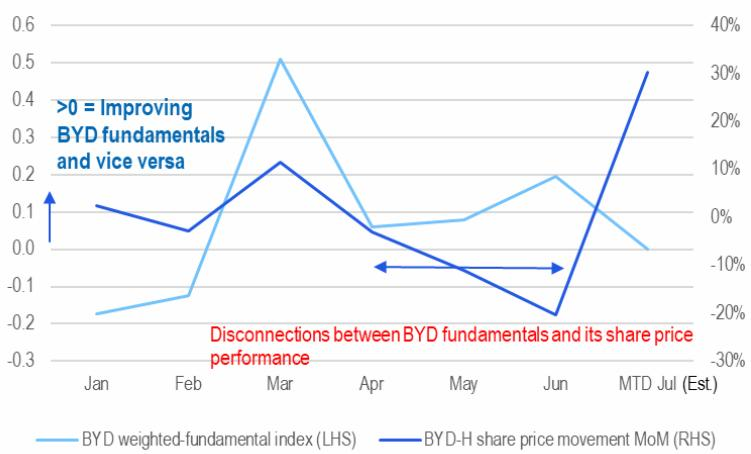
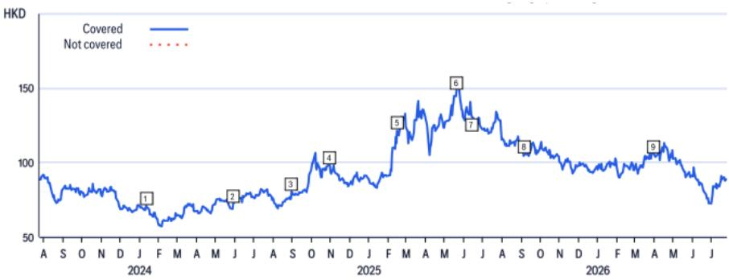
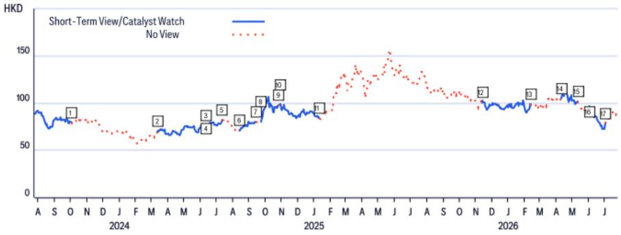

29 Jul 2026 01:47:13 ET | 13 pages

# 比亚迪 (1211.HK)

## 基本面、AI资金流向、比亚迪机器人动态

## 核心观察

我们注意到：1) 本周中国7月新能源车零售同比预测好于上周（7月电动车订单追踪环比-9%，零售同比-6.8%）；2) 比亚迪订单（周环比持平/月内累计环比-10%）在考虑上月高基数后趋于稳定；3) 根据乘联会数据，比亚迪周度批发数据较上周明显改善，月内累计环比从-13%收窄至-1%。另一方面，AI及商用车相关标的（潍柴/Generac/Bloom Energy/中国重汽指数，见图3）报价月内进一步调整约-26%/周内-10%，显示资金流动调整仍在延续。基于上述实际数据，我们调整了对比亚迪7月的预测，并生成以下输出（图1-3）：我们预计比亚迪加权基本面指数将保持稳态（即未改善或恶化时处于0）。读者可参考上周更新：比亚迪 (1211.HK) - 基本面与资金流向监测

比亚迪二季度业绩：在近一个月的资金流动调整后，我们预计8月发布的二季度业绩将十分关键（即二季度净利润在人民币90-100亿元区间），以验证：(1) 比亚迪在国内电动车市场是否实现盈利；(2) 比亚迪国内电动车市场份额能否恢复；(3) 若国内市场不产生亏损，2027财年270万辆出口量将支撑超过人民币50亿元的净利润。

长鑫存储/地平线机器人进一步增强中国乘用车出口竞争力：近期市场对长鑫存储的积极情绪，以及地平线机器人L3/L4与大众汽车的合作，表明中国汽车出口（比亚迪/吉利/奇瑞/蔚来/小鹏/零跑）可能通过纳入新变量（中国半导体及智驾供应），在降本和研发节奏上进一步获得相对于国际同行的优势。

比亚迪机器人：关于比亚迪8月的人形机器人公告（钛媒体，2026年7月28日），从宏观视角看，我们认为这可能对主要汽车制造商具有长期盈利增厚潜力，因为：(1) 宇树科技2025财年全年资本开支不足比亚迪的0.5%；(2) 宇树科技2025财年毛利率超过60%，而主要汽车制造商在10-20%区间；(3) 汽车零部件与人形机器人零部件的生产和开发可能有60-80%的重叠，而智驾/Robotaxi算法与人形机器人/机器人算法也可以基于相似传感器融合的同一平台构建。因此，我们认为汽车制造商没有理由不积极推进人形机器人的研发。

<table><tr><td colspan="2">买入</td></tr><tr><td>报价（2026年7月28日16:10）</td><td>89.80港元</td></tr><tr><td>目标价</td><td>142.00港元</td></tr><tr><td>预期报价回报</td><td>58.1%</td></tr><tr><td>预期股息率</td><td>1.7%</td></tr><tr><td>预期总回报</td><td>59.8%</td></tr><tr><td>市值</td><td>8,187.24亿港元 / 1,044.18亿美元</td></tr></table>

Jeff Chung $^{AC}$ +852-2501-2787
jeff.m.chung@citi.com

+852-2501-8483

kyle.wu@citi.com

## 见附录A-1：分析师认证、重要披露及研究分析师关联信息

本报告不适用于中华人民共和国境内分发，香港特别行政区及合格境外机构读者除外。

## 个股观点：

防御性长期买入：奇瑞、吉利、敏实

高贝塔上行弹性（进入汽车销售旺季）：零跑、小鹏

二季度及下半年出口带来的业绩重估潜力：比亚迪/潍柴/中国重汽/宇通

卖出：赛力斯、长城；中性：理想、三花、拓普

图1. 比亚迪加权基本面指数

<table><tr><td></td><td>1月</td><td>2月</td><td>3月</td><td>4月</td><td>5月</td><td>6月</td><td>7月至今</td></tr><tr><td>比亚迪库存环比变动（左轴）</td><td>1.3%</td><td>0.6%</td><td>-1.1%</td><td>1.1%</td><td>6.8%</td><td>1.7%</td><td>-6.0%</td></tr><tr><td>比亚迪出口环比变动（左轴）</td><td>-24.5%</td><td>0.1%</td><td>19.4%</td><td>12.5%</td><td>18.9%</td><td>9.2%</td><td>5.5%</td></tr><tr><td>中国新能源车行业零售同比（左轴）</td><td>-19.7%</td><td>-34.5%</td><td>-17.6%</td><td>-6.0%</td><td>-5.2%</td><td>-9.9%</td><td>-6.8%</td></tr><tr><td>比亚迪订单环比变动（右轴）</td><td>-36.7%</td><td>-51.8%</td><td>161.2%</td><td>-11.2%</td><td>-11.9%</td><td>49.7%</td><td>-5.0%</td></tr><tr><td>比亚迪周度批发隐含全月批发环比</td><td></td><td></td><td></td><td></td><td></td><td></td><td>3.0%</td></tr><tr><td>比亚迪加权基本面指数</td><td>-17.3%</td><td>-12.3%</td><td>51.0%</td><td>6.0%</td><td>8.0%</td><td>19.4%</td><td>0.0%</td></tr></table>

© 2026 Citi集团。未经Citi书面许可，不得再分发。
来源：Citi预测、公司报告、乘联会

图2. 比亚迪基本面及其H股报价走势

比亚迪加权基本面指数（左轴） 比亚迪H股报价环比变动（右轴）
来源：Citi、公司报告、乘联会
© 2026 Citi集团。未经Citi书面许可，不得再分发。

图3. 比亚迪及AIDC/SOFC/HDT相关公司年初至今报价变动

© 2026 Citi集团。未经Citi书面许可，不得再分发。
来源：Citi、彭博

## 提及公司：

比亚迪 (1211.HK; 89.8港元; 1; 2026年7月28日; 16:10)
Bloom Energy Corp (BE.N; 166.84美元; 2H; 2026年7月28日; 16:00)
比亚迪 (002594.SZ; 93.35元人民币; 1; 2026年7月28日; 15:00)
奇瑞 (9973.HK; 24.66港元; 1; 2026年7月28日; 16:10)
长鑫存储 (688825.SS; 47.0元人民币; 未评级; 2026年7月28日; 15:00)
吉利汽车 (0175.HK; 19.12港元; 1; 2026年7月28日; 16:10)
Generac Holdings (GNRC.N; 195.6美元; 2H; 2026年7月28日; 16:00)
长城汽车 (2333.HK; 8.96港元; 3; 2026年7月28日; 16:10)
长城汽车 (601633.SS; 16.43元人民币; 3; 2026年7月28日; 15:00)
地平线机器人 (9660.HK; 5.0港元; 1H; 2026年7月28日; 16:10)
零跑汽车 (9863.HK; 38.52港元; 1; 2026年7月28日; 16:10)
理想汽车 (LI.O; 13.21美元; 2; 2026年7月28日; 16:00)
理想汽车 (2015.HK; 49.68港元; 2; 2026年7月28日; 16:10)
敏实集团 (0425.HK; 26.5港元; 1; 2026年7月28日; 16:10)
宁波拓普集团 (601689.SS; 45.6元人民币; 2; 2026年7月28日; 15:00)
蔚来 (NIO.N; 4.68美元; 1; 2026年7月28日; 16:00)
蔚来 (9866.HK; 36.98港元; 1; 2026年7月28日; 16:10)
三花 (2050.HK; 24.96港元; 2; 2026年7月28日; 16:10)
赛力斯集团 (601127.SS; 55.93元人民币; 3; 2026年7月28日; 15:00)
赛力斯集团 (9927.HK; 43.16港元; 3; 2026年7月28日; 16:10)
中国重汽（香港） (3808.HK; 40.08港元; 1; 2026年7月28日; 16:10)
大众汽车 (VOWG_p.DE; 73.92欧元; 1; 2026年7月28日; 17:30)
潍柴动力 (2338.HK; 30.92港元; 1; 2026年7月28日; 16:10)
小鹏汽车 (XPEV.N; 12.71美元; 1; 2026年7月28日; 16:00)
小鹏汽车 (9868.HK; 49.56港元; 1; 2026年7月28日; 16:10)
宇通客车 (600066.SS; 32.85元人民币; 1; 2026年7月28日; 15:00)
浙江三花智能控制 (002050.SZ; 35.58元人民币; 2; 2026年7月28日; 15:00)

## 比亚迪

## 估值

我们采用1.2倍2026年预期PEG，基于2026-28年净利润25%的年复合增长率，得出目标价142港元，对应2026年/2027年预期市盈率30倍/25倍。我们采用PEG估值法，认为该方法能更准确地反映该成长股的估值水平。

## 风险

可能阻碍比亚迪H股达到目标价的主要下行风险包括：1) 新能源客车或乘用车销量不及预期；2) 云轨业务爬坡慢于预期；3) 再次出现较长的资本开支周期；4) 意外现金流问题。

如果您有视力障碍，希望就本文件中的图表细节与Citi代表沟通，请致电美国 1-888-500-5008（TTY：711），美国以外地区请拨打 +1-210-677-3788

## 附录A-1

## 分析师认证

主要负责本研究报告编制和内容的研究分析师要么在作者栏中以“AC”标识，要么以粗体列于其负责的内容旁边。若作者栏中指定了多位AC分析师，则每位分析师仅就其负责的整个研究报告部分进行认证，但以下内容除外：(a) 归属于另一位以粗体标识的AC认证分析师的内容；(b) 仅针对特定发行人的观点，归属于下方价格图表或评级历史表中该发行人的另一位AC认证分析师。每位分析师就其负责的报告部分认证：(1) 其中表达的观点准确反映了其个人对每个提及发行人和证券的看法，并以独立方式编制，包括对Citi环球金融有限公司及其关联公司的独立性；(2) 研究分析师的薪酬中没有任何部分直接或间接与本报告中该分析师提出的具体建议或观点相关。

## 重要披露

分析师：Jeff Chung

<table><tr><td></td><td>日期</td><td>评级</td><td>目标价</td><td>收盘价</td></tr><tr><td>1</td><td>2024年1月11日 13:28:07</td><td>1</td><td>*154.33</td><td>70.80</td></tr><tr><td>2</td><td>2024年5月29日 07:27:17</td><td>1</td><td>*158.33</td><td>72.53</td></tr><tr><td>3</td><td>2024年9月1日 20:09:08</td><td>1</td><td>*162.67</td><td>80.40</td></tr></table>

\*表示变动

<table><tr><td></td><td>日期</td><td>评级</td><td>目标价</td><td>收盘价</td></tr><tr><td>4</td><td>2024年10月30日 11:36:39</td><td>1</td><td>*166.67</td><td>98.33</td></tr><tr><td>5</td><td>2025年2月14日 11:26:49</td><td>1</td><td>*229.33</td><td>121.40</td></tr><tr><td>6</td><td>2025年5月20日 14:45:04</td><td>1</td><td>*242.33</td><td>148.20</td></tr></table>

<table><tr><td>日期</td><td>评级</td><td>目标价</td><td>收盘价</td></tr><tr><td>7 2025年6月13日 00:00:04</td><td>1</td><td>*233.00</td><td>131.10</td></tr><tr><td>8 2025年9月7日 20:44:21</td><td>1</td><td>*174.00</td><td>105.60</td></tr><tr><td>9 2026年3月30日 12:12:39</td><td>1</td><td>*142.00</td><td>105.80</td></tr></table>

以上评级/目标价变动反映美国东部时间

## 比亚迪 (1211.HK)

短期观点/催化剂观察研究

分析师：Jeff Chung

<table><tr><td></td><td>日期</td><td>操作</td><td>预期方向</td><td>期限</td><td>收盘价</td></tr><tr><td>1</td><td>2023年10月3日 00:16:29</td><td>移除CW</td><td>上行</td><td>90天</td><td>79.53</td></tr><tr><td>2</td><td>2024年3月12日 15:43:32</td><td>添加CW</td><td>上行</td><td>90天</td><td>69.87</td></tr><tr><td>3</td><td>2024年6月11日 00:18:43</td><td>移除CW</td><td>上行</td><td>90天</td><td>76.13</td></tr><tr><td>4</td><td>2024年6月12日 06:02:24</td><td>添加CW</td><td>上行</td><td>30天</td><td>73.33</td></tr><tr><td>5</td><td>2024年7月12日 00:12:00</td><td>移除CW</td><td>上行</td><td>30天</td><td>82.20</td></tr><tr><td>6</td><td>2024年8月13日 21:14:13</td><td>添加CW</td><td>上行</td><td>30天</td><td>71.00</td></tr></table>

CW - 催化剂观察，STV - 短期观点

<table><tr><td></td><td>日期</td><td>操作</td><td>预期方向</td><td>期限</td><td>收盘价</td></tr><tr><td>7</td><td>2024年9月13日 14:17:22</td><td>移除CW</td><td>上行</td><td>30天</td><td>79.93</td></tr><tr><td>8</td><td>2024年9月23日 21:08:42</td><td>添加CW</td><td>上行</td><td>30天</td><td>80.13</td></tr><tr><td>9</td><td>2024年10月25日 00:28:51</td><td>移除CW</td><td>上行</td><td>30天</td><td>97.53</td></tr><tr><td>10</td><td>2024年10月28日 22:24:43</td><td>添加CW</td><td>上行</td><td>90天</td><td>98.20</td></tr><tr><td>11</td><td>2025年1月12日 22:48:43</td><td>移除CW</td><td>上行</td><td>90天</td><td>83.80</td></tr><tr><td>12</td><td>2025年11月12日 21:56:41</td><td>添加CW</td><td>上行</td><td>90天</td><td>100.50</td></tr></table>

<table><tr><td rowspan="2" colspan="2">日期</td><td rowspan="2">操作</td><td rowspan="2">预期方向</td><td rowspan="2">期限</td><td rowspan="2">收盘价</td></tr><tr></tr><tr><td>13</td><td>2026年2月11日 22:14:43</td><td>移除CW</td><td>上行</td><td>90天</td><td>99.15</td></tr><tr><td>14</td><td>2026年4月10日 04:39:55</td><td>添加CW</td><td>上行</td><td>30天</td><td>105.10</td></tr><tr><td>15</td><td>2026年5月11日 00:13:29</td><td>移除CW</td><td>上行</td><td>30天</td><td>101.70</td></tr><tr><td>16</td><td>2026年6月1日 07:20:22</td><td>添加CW</td><td>上行</td><td>30天</td><td>90.75</td></tr><tr><td>17</td><td>2026年7月2日 00:35:24</td><td>移除CW</td><td>上行</td><td>30天</td><td>78.30</td></tr></table>

以上评级/目标价变动反映美国东部时间

<table><tr><td>本公司自2025年1月1日起至少一次在长城汽车股份有限公司的公开交易股权证券中担任做市商。</td></tr><tr><td>本公司自2025年1月1日起至少一次在理想汽车股份有限公司的公开交易股权证券中担任做市商。</td></tr><tr><td>本公司自2025年1月1日起至少一次在蔚来股份有限公司的公开交易股权证券中担任做市商。</td></tr><tr><td>本公司自2025年1月1日起至少一次在地平线机器人的公开交易股权证券中担任做市商。</td></tr><tr><td>本公司自2025年1月1日起至少一次在浙江零跑科技股份有限公司的公开交易股权证券中担任做市商。</td></tr><tr><td>本公司自2025年1月1日起至少一次在吉利汽车控股有限公司的公开交易股权证券中担任做市商。</td></tr><tr><td>本公司自2025年1月1日起至少一次在浙江三花智能控制股份有限公司的公开交易股权证券中担任做市商。</td></tr><tr><td>Citi环球金融有限公司或其关联公司实益拥有浙江三花智能控制任何一类普通股证券的1%或以上。该持仓反映截至前一交易日可获得的信息。</td></tr><tr><td>Citi环球金融有限公司或其关联公司对理想汽车、蔚来的任何一类普通股证券持有0.5%或以上的净空头头寸。</td></tr><tr><td>在过去12个月内，Citi环球金融有限公司或其关联公司曾担任Bloom Energy Corp证券发行的主承销商或联席主承销商。</td></tr><tr><td>Citi环球金融有限公司或其关联公司已因在过去12个月内向Bloom Energy Corp、奇瑞、吉利汽车、中国重汽（香港）、大众汽车、小鹏汽车提供的投资银行服务而获得报酬。</td></tr><tr><td>Citi环球金融有限公司或其关联公司预计将在未来三个月内寻求从奇瑞、中国重汽（香港）、大众汽车获得投资银行服务报酬。</td></tr><tr><td>Citi环球金融有限公司或其关联公司在过去12个月内因向比亚迪、Bloom Energy Corp、奇瑞、吉利汽车、Generac Holdings、长城汽车、地平线机器人、理想汽车、敏实、蔚来、宁波拓普集团、赛力斯集团、中国重汽（香港）、大众汽车、潍柴动力、小鹏汽车、宇通客车、浙江三花智能控制提供投资银行服务以外的产品和服务而获得报酬。</td></tr><tr><td>Citi环球金融有限公司或其关联公司目前拥有或在过去12个月内拥有以下投资银行客户：Bloom Energy Corp、奇瑞、吉利汽车、中国重汽（香港）、大众汽车、小鹏汽车。</td></tr><tr><td>Citi环球金融有限公司或其关联公司目前拥有或在过去12个月内拥有以下客户，且提供的服务为非投资银行、证券相关：比亚迪、Bloom Energy Corp、奇瑞、吉利汽车、长城汽车、理想汽车、敏实、蔚来、宁波拓普集团、赛力斯集团、中国重汽（香港）、大众汽车、小鹏汽车、浙江三花智能控制。</td></tr><tr><td>Citi环球金融有限公司或其关联公司目前拥有或在过去12个月内拥有以下客户，且提供的服务为非投资银行、非证券相关：比亚迪、Bloom Energy Corp、奇瑞、吉利汽车、Generac Holdings、长城汽车、地平线机器人、理想汽车、敏实、蔚来、宁波拓普集团、赛力斯集团、中国重汽（香港）、大众汽车、潍柴动力、小鹏汽车、宇通客车、浙江三花智能控制。</td></tr><tr><td>Citi环球金融有限公司和/或其关联公司与比亚迪、奇瑞、中国重汽（香港）、大众汽车存在重大经济利益关系。（关于重大经济利益确定的说明，请参阅www.citiVelocity.com上的利益冲突管理政策。）</td></tr><tr><td>分析师薪酬由Citi管理层和Citi高级管理层根据旨在惠及Citi环球金融有限公司及其关联公司（“本公司”）投资客户的活动和服务确定。薪酬不与特定交易或建议挂钩。与所有公司员工一样，分析师的薪酬受到公司整体盈利能力的影响，其中包括投资银行、销售和交易以及自营交易收入。股票研究分析师薪酬的一个因素是安排机构客户与所覆盖公司管理层之间的企业接入活动。通常，当分析师对公司持积极看法时，公司管理层更有可能参与。</td></tr><tr><td>对于本产品中推荐的本公司未担任做市商的金融工具，本公司是该等金融工具（及其任何标的工具）的流动性提供者，并可能在与该等工具的交易中担任主事人。本公司是定期发行与产品中可能推荐的证券挂钩的金融工具的机构。本公司定期交易产品中讨论的发行人证券。本公司可能以与产品不一致的方式进行证券交易，并且对于产品所涵盖的证券，将按主事人基础向客户买入或卖出。</td></tr><tr><td>本公司是比亚迪、吉利汽车、长城汽车、地平线机器人、零跑、理想汽车、蔚来、潍柴动力、浙江三花智能控制的公开交易股权证券的做市商。</td></tr><tr><td>除非另有说明，研究分析师或其团队成员在过去12个月内均未实地考察过已提供投资观点的公司的重要运营场所。</td></tr><tr><td>有关本Citi产品（“产品”）所涉公司的重要披露（包括历史披露副本），请联系Citi，地址：388 Greenwich Street, 6th Floor, New York, NY, 10013，收件人：法律/合规部 [E6WYB6412478]。此外，相同的重要披露（估值和风险评估及历史披露除外）载于公司披露网站：https://www.citivelocity.com/cvr/eppublic/citi_research_disclosures。估值和风险评估可在有关标的公司的最新研究笔记/报告正文中找到。根据《市场滥用条例》，Citi在过去12个月内发布的所有建议的历史记录可通过CitiVelocity（https://www.citivelocity.com/cv2）或您的标准分发门户访问。历史披露（最多过去三年）可应要求提供。</td></tr></table>

Citi股票评级分布

<table><tr><td></td><td colspan="3">12个月评级</td><td colspan="3">催化剂观察</td></tr><tr><td>数据截至2026年7月1日</td><td>买入</td><td>持有</td><td>卖出</td><td>买入</td><td>持有</td><td>卖出</td></tr><tr><td>Citi全球基本面覆盖（中性=持有）</td><td>61%</td><td>32%</td><td>7%</td><td>36%</td><td>48%</td><td>16%</td></tr><tr><td>各评级类别中为投资银行客户的公司百分比</td><td>38%</td><td>42%</td><td>27%</td><td>42%</td><td>37%</td><td>36%</td></tr></table>

## Citi基本面研究投资评级指南：

Citi股票建议包括投资评级和可选的风险评级以标示高风险股票。风险评级同时考虑报价波动性和基本面标准。股票将没有风险评级或被赋予高风险评级。

投资评级：Citi投资评级为买入、中性和卖出。我们的评级是分析师对预期总回报（“ETR”）和风险的预期函数。ETR是未来12个月内股票预期报价升值（或贬值）加股息率的总和。目标价基于12个月时间跨度。投资评级定义为：买入（1）ETR为15%或以上，或高风险股票为25%或以上；卖出（3）为负ETR。任何未被评为买入或卖出的覆盖股票均为中性（2）。对于评级为中性（2）的股票，如果分析师认为缺乏足够的估值驱动因素和/或投资催化剂来形成正面或负面的投资观点，可在获得Citi管理层批准后选择不设定目标价，从而不推导ETR。Citi可能因监管和/或内部政策原因暂停其评级和目标价并指定“评级暂停”状态。Citi也可能因其他特殊情况（例如缺乏对分析师论点至关重要的信息、交易暂停）影响公司和/或公司证券交易而暂停其评级和目标价并指定“审核中”状态。在这两种情况下，评级和目标价将在评级历史价格图表中分别显示为“—”和“-”。在2022年4月11日之前，Citi将两种情况均指定为“审核中”状态，在2020年11月11日之前仅在特殊情况下指定。在实际可行的情况下，分析师将尽快发布重新建立评级和投资论点的说明。投资评级由上述范围在首次覆盖、投资和/或风险评级变更或目标价变更时确定（受有限管理层酌情权限制）。有时，由于市场报价变动和/或其他短期波动或交易模式，预期总回报可能超出这些范围。此类临时偏差将被允许，但将接受研究管理层的审查。您买卖证券的决定应基于您个人的投资目标，并且只有在评估股票的预期表现和风险后才应做出。

## 催化剂观察/短期观点（“STV”）评级披露：

催化剂观察和STV上行/下行观点：Citi还可能包括催化剂观察或STV上行或下行观点，以表明分析师预期报价在指定30或90天期间内因一个或多个影响公司或市场的具体近期催化剂或事件而相对上涨（下跌）。当分析师高度确信报价将受到影响时，将发布催化剂观察；当信心水平中等时，将发布STV。催化剂观察或STV上行/下行观点将在指定30/90天期间结束时自动到期。如果报价表现（按市场收盘计算）超过观点方向的15%（除非分析师否决），催化剂观察也将自动移除。分析师也可以在指定期间结束前在研究笔记中移除催化剂观察或STV观点。催化剂观察/STV上行或下行观点可能不同于且不影响股票的基本面股票评级，后者反映较长期的总相对回报预期。就FINRA评级分布披露规则而言，催化剂观察/STV上行观点对应买入建议，催化剂观察/STV下行观点对应卖出建议。任何未指定为催化剂观察上行、催化剂观察下行、STV上行或STV下行观点的股票均被视为催化剂观察/STV无观点。就FINRA评级分布披露规则而言，我们在催化剂观察/STV上行/下行评级系统的评级分布表中将催化剂观察/STV无观点对应为持有。但我们重申，我们不认为无观点是建议。对于所有催化剂观察/STV上行/下行观点，存在催化剂和相关报价变动不会按预期实现的风险。

## 研究分析师关联/非美国研究分析师披露

本报告作者的雇佣法律实体列示如下（其监管机构亦列示于后）。编制本报告的非美国研究分析师（即除被标识为Citi环球金融有限公司雇佣的分析师外的所有下述分析师）未在FINRA注册/取得研究分析师资格。该等研究分析师可能不是成员组织的关联人士（但受雇于成员组织的关联公司），因此可能不受FINRA规则2241关于与标的公司沟通、公开露面以及研究分析师账户持有证券交易的限制。

Citi环球金融亚洲有限公司

Jeff Chung; Kyle Wu

## 其他披露

建议中提及的任何工具的价格均为前一交易日该工具主要市场的收盘价，除非另有说明。

本研究报告中任何建议的完成和首次传播时间均为产品顶部显示的美国东部日期时间。如果产品引用了其他分析师的观点，请参阅价格图表或评级历史表以了解该观点的完成和首次传播日期时间。

在过去12个月内发布的关于同一金融工具或发行人的建议变更及该先前建议的日期已在相应部分标明。对于基本面覆盖，请参阅本披露附录中的价格图表或评级变更历史，或发行人披露摘要：https://www.citivelocity.com/cvr/eppublic/citi_research_disclosures。

Citi已实施识别、考虑和管理因发布或分发投资研究而产生的潜在利益冲突的政策。这些政策的说明可在 https://www.citivelocity.com/cvr/eppublic/citi_research_disclosures 找到。

过去12个月内每季度末Citi所有研究建议中相当于“买入”、“持有”、“卖出”的比例（括号内为过去12个月内接受过Citi投资公司服务的百分比）如下：2026年第一季度 买入33%（63%），持有44%（52%），卖出23%（46%），相对价值0.5%（89%）；2025年第四季度 买入33%（63%），持有44%（50%），卖出23%（46%），相对价值0.4%（91%）；2025年第三季度 买入33%（61%），持有44%（52%），卖出23%（50%），相对价值0.4%（80%）；2025年第二季度 买入33%（63%），持有44%（51%），卖出23%（49%），相对价值0.4%（86%）。为披露除股票外的建议（其定义见相应披露部分），“买入”指正向方向性交易观点；“卖出”指负向方向性交易观点；“相对价值”指任何没有明确方向的交易观点。

欧洲法规要求在引用证券过往表现时提供5年价格历史。CitiVelocity的图表工具（https://www.citivelocity.com/cv2/#go/CHARTING_3_Equities）提供创建可定制价格图表的功能，包括五年选项。该工具可在CitiVelocity（https://www.citivelocity.com/）的任何资产类别菜单下的数据与分析部分找到。如需更多信息，请联系CitiVelocity支持（https://www.citivelocity.com/cv2/go/CLIENT_SUPPORT）。除非另有说明，所有引用价格来源为DataCentral，该数据库从LSEG数据与分析获取价格信息。过往表现不是未来结果的保证或可靠指标。预测不是未来表现的保证或可靠指标。

读者在投资前应始终仔细考虑ETF的投资目标、风险和费用。适用的招股说明书和关键读者信息文件（如适用）应包含该ETF的此等信息和其他信息。在投资前仔细阅读任何此类招股说明书非常重要。客户可从适用的分销商或授权参与者、ETF上市的交易所和/或适用的ETF发行人网站获取ETF的招股说明书和关键读者信息文件。研究价值和任何应计收入可能下跌或上涨。任何过往表现、预测或预报均不指示未来或可能的表现。此处包含的有关ETF的任何信息严格仅供说明之用，不应被视为出售要约或购买任何ETF份额的要约邀请，无论是明示还是暗示。所表达的观点是作者的观点，不一定反映ETF发行人、其任何代理人或其关联公司的观点。

Citi环球金融印度私人有限公司和/或其关联公司可能不时实际或实益拥有标的发行人债务证券的1%或以上。

请注意，根据经修订的第13959号行政命令（“命令”），美国人被禁止投资于美国政府确定为命令标的的任何公司的证券。本研究不旨在以任何可能导致违反命令的方式使用或依赖。鼓励读者依靠自己的法律顾问就遵守命令以及美国财政部外国资产控制办公室管理和执行的其他经济制裁计划提供建议。

本通讯面向以色列《研究交流、投资营销和投资组合管理法》（1995年）（“咨询法”）中定义的“合格客户”。在以色列境内，本通讯不面向零售客户，Citi不会向零售客户或非合格客户提供此类产品或交易。演示者未获得以色列证券管理局（“ISA”）的投资顾问或投资营销许可，本通讯不构成投资或营销建议。此处包含的信息可能涉及ISA未监管的事项。本通讯主题的任何证券不得向任何以色列人士发售或出售，除非根据以色列证券法（1968年）的证券发售豁免及其下的公开发售规则。

Citi广泛并同时通过公司专有的电子分发平台（如CitiVelocity和各种全球财富平台）向机构客户和零售客户分发其研究内容。为方便起见，部分（而非全部）研究内容可能通过第三方聚合器分发。客户可能酌情通过电子邮件收到已发布的研究报告，且仅在研究内容已广泛分发之后。某些研究仅向机构读者提供以满足监管要求。Citi分析师向客户提供的服务水平和类型可能因各种因素而异，例如客户对分析师通讯频率和方式的个人偏好、客户的风险状况和投资重点及视角（如全市场、特定行业、长期、短期等）、与公司的整体客户关系的规模和范围以及法律和监管限制。

根据Com
