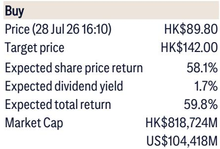
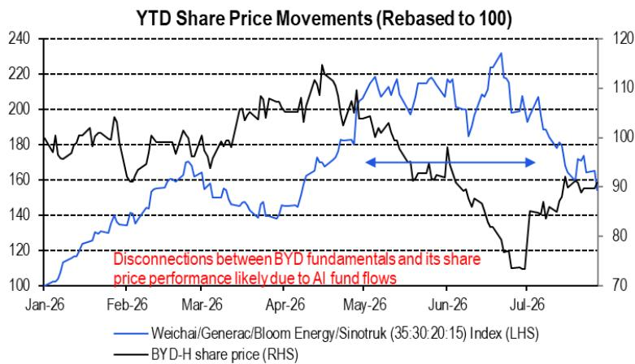

# Citi：比亚迪基本面与资金流向及机器人业务更新

7月28日，Citi发布比亚迪（1211.HK）基本面与资金流向追踪报告。报告最核心的判断是：经历近一个月的资金流调整后，比亚迪7月订单与批发数据已出现企稳迹象，而8月二季度业绩将成为验证国内电动车市场盈利能力和份额恢复的关键节点。与此同时，报告首次将比亚迪人形机器人业务纳入长期盈利框架，认为其潜在回报空间值得关注。

这份报告的独特之处在于，它将高频行业数据（周度订单、批发、库存）与资金流向指标结合，构建了一个可追踪的“加权基本面指数”。截至7月，该指数处于0的稳态水平，较6月的19.4%明显回落，但并未进一步出现变化。报告认为，这一稳态状态本身就是一个信号：比亚迪的基本面正在消化6月高基数的影响。

## 1. 7月订单与批发数据呈现企稳迹象

Citi追踪的数据显示，比亚迪7月订单环比下降5%，但剔除6月高基数因素后已基本稳定；周度批发数据从7月中旬的环比下降13%收窄至月末的下降1%。7月中国新能源车零售同比下滑6.8%，与6月的9.9%相比有所收窄。

这些数据合在一起指向一个结论：比亚迪在国内市场的销售动能正在筑底，而非继续下滑。报告特别强调，7月库存环比下降6.0%，为年内最大月度降幅，这意味着渠道去库存正在加速，为下半年销售旺季腾出了空间。

> **KC评论：** 库存下降6%与订单企稳同时出现，说明经销商正在消化库存而非压库。这个组合通常意味着后续批发数据有修复空间，但需要8月数据确认。

## 2. 二季度业绩成为验证国内盈利能力的试金石

报告将8月发布的二季度业绩视为关键验证点，预计净利润在90亿至100亿元人民币区间。这个数字之所以重要，是因为它需要回答三个问题：比亚迪在国内市场是否盈利、国内份额能否恢复、以及若国内市场无亏损，270万辆的2027年出口目标对应50亿元以上的净利润增量。

Citi认为，出口是比亚迪二季度及下半年盈利重估的主要来源。报告同时指出，AI与商用车相关标的（潍柴、Generac、Bloom Energy、中国重汽指数）7月环比下跌26%，资金流出的趋势仍在延续，这可能对比亚迪的估值环境形成阶段性压制。

## 3. 国产芯片与智驾供应链强化出口竞争力

报告特别提到，长鑫存储（CXMT）的积极进展以及地平线机器人（Horizon Robotics）与大众汽车在L3/L4级智驾上的合作，正在为中国车企出口增添新的成本与研发优势。比亚迪、吉利、奇瑞、蔚来、小鹏、零跑等中国车企，有望通过引入国产半导体与智驾供应体系，在国际竞争中拉开与对手的成本差距。

这个判断的逻辑链条是：中国电动车企的竞争优势不再局限于电池与整车制造，而是扩展到了芯片、智驾算法等核心零部件领域。长鑫存储与地平线的进展，意味着中国车企可以在不依赖海外供应商的情况下，保持技术迭代节奏。

## 4. 人形机器人业务的长期盈利逻辑

报告对比亚迪8月可能发布的人形机器人产品进行了前瞻性分析，提出了三个关键数据点：宇树科技（Unitree）2025年全年资本开支不到比亚迪的0.5%；宇树2025年毛利率超过60%，而主流车企毛利率在10%-20%区间；汽车零部件与人形机器人零部件的生产开发重叠度可达60%-80%。

这意味着，车企进入人形机器人领域并非跨界冒险，而是现有制造能力的延伸。ADAS与Robotaxi算法、人形机器人算法也可以基于同一平台和相似的传感器融合方案构建。报告认为，车企没有理由不积极推进人形机器人的研发。

> **KC评论：** 60%-80%的零部件重叠度是这份报告最值得注意的数字。它把“车企做机器人”从概念炒作变成了产能复用逻辑，但毛利率能否从10%-20%的车规水平跳到60%，仍需产品落地验证。

## 5. 观察框架：如何跟踪比亚迪的月度基本面

报告提供了一个可复用的月度跟踪框架，核心指标包括：比亚迪订单环比变化、周度批发数据隐含的全月批发环比、库存月度变动、出口环比、以及中国新能源车行业零售同比。这些指标加权后形成“加权基本面指数”，用于判断公司基本面处于改善、出现变化还是稳态。

7月的数据组合显示：订单环比下降5%、库存下降6%、出口环比增长5.5%、行业零售同比下降6.8%，加权指数为0。这个框架的价值在于，它把分散的高频数据整合成一个可比较的单一指标，读者可以用它来跟踪比亚迪基本面的边际变化，而不是依赖单一数据点做判断。

报告同时给出了行业层面的观察：Citi将奇瑞、吉利、敏实列为防御性长期观点偏积极标的，将零跑、小鹏列为高弹性标的，将赛力斯、长城列为观点偏谨慎标的，理想、三花、拓普为中性。这些分类反映的是不同公司在当前市场环境下的盈利可见度差异。

For informational purposes only. Portions may be generated,translated,summarized,or edited with AI assistance based on source materials and may contain omissions or errors. Please verify independently. This is not investment,legal,tax,accounting,or other professional advice.

For informational purposes only. Portions may be generated,translated,summarized,or edited with AI assistance based on source materials and may contain omissions or errors. Please verify independently. This is not investment,legal,tax,accounting,or other professional advice.

