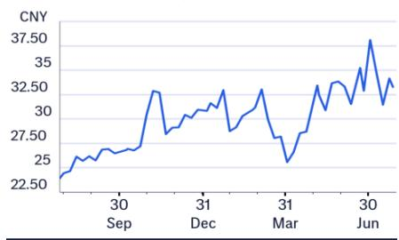
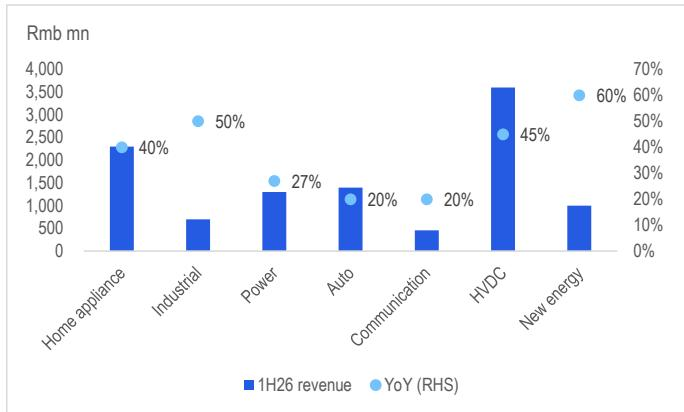
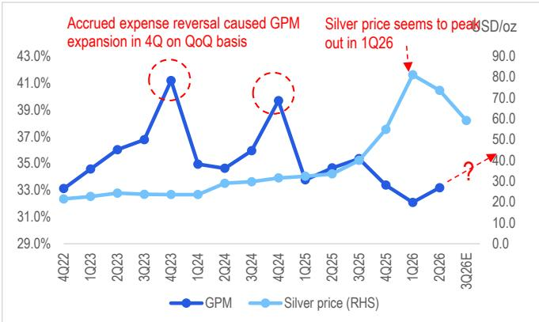
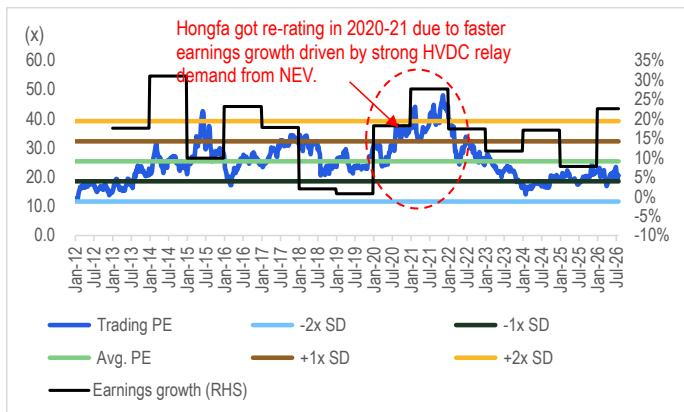
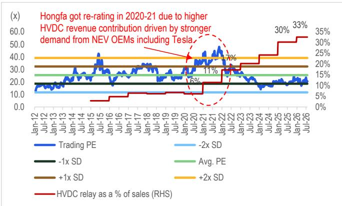
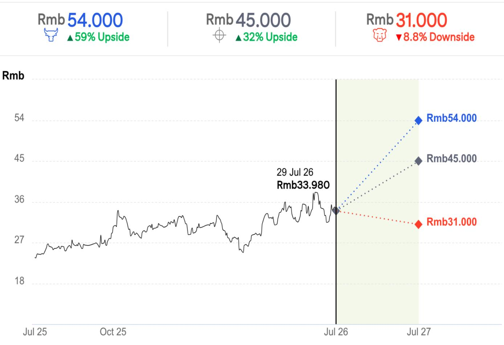

# 宏发科技（600885.SS）

# 2Q26业绩超预期，营收强劲增长与毛利率进一步改善推动目标价上调至45.0元

## 核心观点

全球领先的继电器制造商宏发科技公布了优于预期的2Q26业绩。2Q26净利润6.72亿元（同比增长21%），较市场一致预期高出2%；营收59亿元（同比增长36%）和毛利率33.2%（同比下降1.5个百分点）分别较一致预期高出4%和2.3个百分点，主要得益于强劲的需求和产品均价提升。管理层在业绩说明会上表示：1）需求强劲是全方位的，既来自行业需求增长，也来自公司市场份额的提升；2）更重要的是，考虑到持续的产品提价和银价回落，毛利率有望回升至3Q25水平（约35%）。因此，我们上调2026/27年盈利预测5%/11%，并将目标价上调约5%至45.0元，同时上调营收和毛利率预测。在当前市场环境下，基于强劲的盈利可见性和800V AIDC继电器的潜在增长空间，宏发科技仍是我们重点关注的公司之一。

1H26分产品营收——新能源车高压直流继电器1H26同比增长45%至36亿元，得益于市场份额提升；家电继电器同比增长40%至23亿元，其中产品提价贡献了20个百分点的营收增长；汽车继电器同比增长20%至14亿元，主要受2Q26起产品提价带动；电力继电器同比增长27%，受益于欧洲及国内电网需求回暖；新能源继电器同比增长60%至10亿元；工业与通信继电器分别同比增长50%和20%，受需求复苏驱动。新业务中，PDU/BDU表现最佳，1H26营收同比增长超过100%（图2）。

2H26展望——管理层基于3-6个月的订单可见度和创纪录的订单量，给出了强劲的需求展望。毛利率展望也较为积极，公司将继续对部分产品提价以应对供应偏紧的局面，同时银价自3Q26以来已回落约20%（图3）。关于AIDC业务，管理层表示市场机会可能大于此前预期，800V继电器产品最早有望于4Q26向台达电子（2308.TW）或光宝科技（2301.TW）等主要客户出货。

估值——我们新的目标价45.0元基于约32倍2026年预期市盈率，设定在+1.0倍标准差水平，以反映强劲需求和产品提价驱动下的较快盈利增长。

## 盈利摘要

<table><tr><td>截至12月31日</td><td>净利润（百万元）</td><td>摊薄每股收益（元）</td><td>每股收益增速（%）</td><td>市盈率（倍）</td><td>市净率（倍）</td><td>净资产回报表现（%）</td><td>股息率（%）</td></tr><tr><td>2024A</td><td>1,631</td><td>1.540</td><td>14.9</td><td>22.1</td><td>3.7</td><td>18.3</td><td>1.1</td></tr><tr><td>2025A</td><td>1,758</td><td>1.200</td><td>-22.1</td><td>28.3</td><td>4.2</td><td>15.9</td><td>1.0</td></tr><tr><td>2026E</td><td>2,155</td><td>1.392</td><td>16.0</td><td>24.4</td><td>3.5</td><td>15.6</td><td>1.3</td></tr><tr><td>2027E</td><td>2,856</td><td>1.846</td><td>32.6</td><td>18.4</td><td>3.1</td><td>17.8</td><td>1.7</td></tr><tr><td>2028E</td><td>3,522</td><td>2.275</td><td>23.3</td><td>14.9</td><td>2.7</td><td>19.0</td><td>2.0</td></tr></table>

来源：dataCentral

## 买入

短期观点：上行，有效期至2026年8月3日

价格（2026年7月29日15:00）33.98元

目标价 45.00元↑

预期股价回报率 32.4%

预期股息率 1.3%

预期总回报率 33.7%

市值 52,587百万元

## 股价表现

## （RIC: 600885.SS, BB: 600885 CH）

王洁 $^{AC}$ +852-2501-2772
jamie.ck.wang@citi.com

刘志强
+852-2501-2726
eric.h.lau@citi.com

价格：33.98元；目标价：45.00元；市值：52,587百万元；评级：买入

<table><tr><td>损益表（百万元）</td><td>2024</td><td>2025</td><td>2026E</td><td>2027E</td><td>2028E</td></tr><tr><td>营业收入</td><td>14,103</td><td>17,202</td><td>22,371</td><td>27,430</td><td>33,104</td></tr><tr><td>营业成本</td><td>-8,996</td><td>-11,299</td><td>-14,793</td><td>-18,023</td><td>-21,642</td></tr><tr><td>毛利润</td><td>5,106</td><td>5,904</td><td>7,579</td><td>9,407</td><td>11,461</td></tr><tr><td>毛利率（%）</td><td>36.2</td><td>34.3</td><td>33.9</td><td>34.3</td><td>34.6</td></tr><tr><td>EBITDA（调整后）</td><td>3,262</td><td>3,666</td><td>4,139</td><td>5,319</td><td>6,426</td></tr><tr><td>EBITDA利润率（调整后）（%）</td><td>23.1</td><td>21.3</td><td>18.5</td><td>19.4</td><td>19.4</td></tr><tr><td>折旧</td><td>-893</td><td>-979</td><td>-868</td><td>-976</td><td>-1,089</td></tr><tr><td>摊销</td><td>-125</td><td>-140</td><td>-138</td><td>-138</td><td>-139</td></tr><tr><td>EBIT（调整后）</td><td>2,243</td><td>2,547</td><td>3,133</td><td>4,205</td><td>5,219</td></tr><tr><td>EBIT利润率（调整后）（%）</td><td>15.9</td><td>14.8</td><td>14.0</td><td>15.3</td><td>15.8</td></tr><tr><td>净利息</td><td>-70</td><td>-84</td><td>-86</td><td>-84</td><td>-80</td></tr><tr><td>联营公司</td><td>2</td><td>1</td><td>2</td><td>2</td><td>2</td></tr><tr><td>非经营/特殊/其他调整</td><td>270</td><td>224</td><td>247</td><td>247</td><td>247</td></tr><tr><td>税前利润</td><td>2,445</td><td>2,689</td><td>3,296</td><td>4,369</td><td>5,387</td></tr><tr><td>税项</td><td>-282</td><td>-350</td><td>-429</td><td>-568</td><td>-701</td></tr><tr><td>特殊/少数股东权益/优先股股息</td><td>-532</td><td>-582</td><td>-713</td><td>-945</td><td>-1,165</td></tr><tr><td>报告净利润</td><td>1,631</td><td>1,758</td><td>2,155</td><td>2,856</td><td>3,522</td></tr><tr><td>净利率（%）</td><td>11.6</td><td>10.2</td><td>9.6</td><td>10.4</td><td>10.6</td></tr><tr><td>核心净利润</td><td>1,631</td><td>1,758</td><td>2,155</td><td>2,856</td><td>3,522</td></tr></table>

<table><tr><td>估值指标</td><td>2024</td><td>2025</td><td>2026E</td><td>2027E</td><td>2028E</td></tr><tr><td>市盈率（倍）</td><td>22.1</td><td>28.3</td><td>24.4</td><td>18.4</td><td>14.9</td></tr><tr><td>市净率（倍）</td><td>3.7</td><td>4.2</td><td>3.5</td><td>3.1</td><td>2.7</td></tr><tr><td>EV/EBITDA（倍）</td><td>16.8</td><td>14.9</td><td>13.1</td><td>10.2</td><td>8.4</td></tr><tr><td>自由现金流回报表现（%）</td><td>3.0</td><td>3.6</td><td>1.3</td><td>3.3</td><td>4.7</td></tr><tr><td>股息率（%）</td><td>1.1</td><td>1.0</td><td>1.3</td><td>1.7</td><td>2.0</td></tr><tr><td>派息率（%）</td><td>24</td><td>29</td><td>31</td><td>31</td><td>31</td></tr><tr><td>净资产回报表现（%）</td><td>18.3</td><td>15.9</td><td>15.6</td><td>17.8</td><td>19.0</td></tr></table>

<table><tr><td>现金流量表（百万元）</td><td>2024</td><td>2025</td><td>2026E</td><td>2027E</td><td>2028E</td></tr><tr><td>EBITDA</td><td>3,243</td><td>3,638</td><td>4,121</td><td>5,300</td><td>6,426</td></tr><tr><td>营运资金变动</td><td>-1,057</td><td>-652</td><td>-2,089</td><td>-1,860</td><td>-2,086</td></tr><tr><td>其他</td><td>48</td><td>-18</td><td>-44</td><td>-336</td><td>-465</td></tr><tr><td>经营活动现金流</td><td>2,235</td><td>2,969</td><td>1,988</td><td>3,104</td><td>3,875</td></tr><tr><td>资本支出</td><td>-1,158</td><td>-1,183</td><td>-1,310</td><td>-1,368</td><td>-1,428</td></tr><tr><td>净收购/处置</td><td>-1,004</td><td>565</td><td>18</td><td>19</td><td>366</td></tr><tr><td>其他</td><td>-49</td><td>8</td><td>17</td><td>21</td><td>27</td></tr><tr><td>投资活动现金流</td><td>-2,210</td><td>-610</td><td>-1,275</td><td>-1,327</td><td>-1,035</td></tr><tr><td>已付股息</td><td>-695</td><td>-867</td><td>-537</td><td>-658</td><td>-1,039</td></tr><tr><td>融资活动现金流</td><td>111</td><td>-1,951</td><td>-576</td><td>-697</td><td>-1,169</td></tr><tr><td>现金净变动</td><td>122</td><td>398</td><td>137</td><td>1,080</td><td>1,671</td></tr><tr><td>股东自由现金流</td><td>1,077</td><td>1,786</td><td>678</td><td>1,737</td><td>2,447</td></tr></table>

<table><tr><td>每股数据</td><td>2024</td><td>2025</td><td>2026E</td><td>2027E</td><td>2028E</td></tr><tr><td>报告每股收益（元）</td><td>1.540</td><td>1.200</td><td>1.392</td><td>1.846</td><td>2.275</td></tr><tr><td>核心每股收益（元）</td><td>1.540</td><td>1.200</td><td>1.392</td><td>1.846</td><td>2.275</td></tr><tr><td>每股股息（元）</td><td>0.368</td><td>0.347</td><td>0.425</td><td>0.564</td><td>0.695</td></tr><tr><td>每股经营现金流（元）</td><td>2.110</td><td>2.027</td><td>1.285</td><td>2.006</td><td>2.504</td></tr><tr><td>每股自由现金流（元）</td><td>1.017</td><td>1.219</td><td>0.438</td><td>1.122</td><td>1.581</td></tr><tr><td>每股净资产（元）</td><td>9.115</td><td>8.161</td><td>9.685</td><td>11.105</td><td>12.817</td></tr><tr><td>加权平均普通股数（百万股）</td><td>1,046</td><td>1,465</td><td>1,548</td><td>1,548</td><td>1,548</td></tr><tr><td>加权平均摊薄股数（百万股）</td><td>1,059</td><td>1,465</td><td>1,548</td><td>1,548</td><td>1,548</td></tr></table>

<table><tr><td>增长率</td><td>2024</td><td>2025</td><td>2026E</td><td>2027E</td><td>2028E</td></tr><tr><td>营业收入（%）</td><td>9.1</td><td>22.0</td><td>30.0</td><td>22.6</td><td>20.7</td></tr><tr><td>EBIT（调整后）（%）</td><td>6.3</td><td>13.5</td><td>23.0</td><td>34.2</td><td>24.1</td></tr><tr><td>核心净利润（%）</td><td>17.1</td><td>7.8</td><td>22.6</td><td>32.6</td><td>23.3</td></tr><tr><td>核心每股收益（%）</td><td>14.9</td><td>-22.1</td><td>16.0</td><td>32.6</td><td>23.3</td></tr></table>

<table><tr><td>资产负债表（百万元）</td><td>2024</td><td>2025</td><td>2026E</td><td>2027E</td><td>2028E</td></tr><tr><td>现金及现金等价物</td><td>4,250</td><td>4,164</td><td>5,028</td><td>6,108</td><td>7,478</td></tr><tr><td>应收账款</td><td>3,271</td><td>4,144</td><td>5,389</td><td>6,608</td><td>7,975</td></tr><tr><td>存货</td><td>3,487</td><td>4,278</td><td>5,601</td><td>6,824</td><td>8,195</td></tr><tr><td>固定资产及其他有形资产净额</td><td>6,919</td><td>7,566</td><td>7,901</td><td>8,171</td><td>8,357</td></tr><tr><td>商誉及无形资产</td><td>499</td><td>481</td><td>464</td><td>447</td><td>431</td></tr><tr><td>金融及其他资产</td><td>2,239</td><td>2,731</td><td>2,907</td><td>3,083</td><td>3,259</td></tr><tr><td>总资产</td><td>20,664</td><td>23,364</td><td>27,290</td><td>31,242</td><td>35,695</td></tr><tr><td>应付账款</td><td>1,693</td><td>2,261</td><td>2,960</td><td>3,606</td><td>4,330</td></tr><tr><td>短期债务</td><td>1,840</td><td>2,437</td><td>2,529</td><td>2,625</td><td>2,726</td></tr><tr><td>长期债务</td><td>2,565</td><td>169</td><td>169</td><td>169</td><td>169</td></tr><tr><td>拨备及其他负债</td><td>2,025</td><td>2,487</td><td>2,551</td><td>2,617</td><td>2,431</td></tr><tr><td>总负债</td><td>8,122</td><td>7,354</td><td>8,208</td><td>9,017</td><td>9,656</td></tr><tr><td>股东权益</td><td>9,504</td><td>12,631</td><td>14,989</td><td>17,187</td><td>19,836</td></tr><tr><td>少数股东权益</td><td>3,038</td><td>3,380</td><td>4,093</td><td>5,038</td><td>6,203</td></tr><tr><td>总权益</td><td>12,542</td><td>16,010</td><td>19,082</td><td>22,225</td><td>26,038</td></tr><tr><td>净债务（调整后）</td><td>155</td><td>-1,558</td><td>-2,331</td><td>-3,314</td><td>-4,583</td></tr><tr><td>净债务/权益（调整后）（%）</td><td>1.2</td><td>-9.7</td><td>-12.2</td><td>-14.9</td><td>-17.6</td></tr></table>

表中各项定义请点击此处。

© 2026 Citi Inc. 未经Citi书面许可不得转载。
来源：Citi、公司报告、WIND

图1. 宏发科技：2Q26/1H26业绩概览

<table><tr><td>百万元</td><td>2Q25</td><td>1Q26</td><td>2Q26A</td><td>同比</td><td>环比</td><td>一致预期</td><td>差异</td><td>1H25</td><td>1H26A</td><td>同比</td></tr><tr><td colspan="11">损益</td></tr><tr><td>净销售额</td><td>4,364</td><td>5,108</td><td>5,914</td><td>36%</td><td>16%</td><td>5,674</td><td>4%</td><td>8,347</td><td>11,022</td><td>32%</td></tr><tr><td>毛利润</td><td>1,513</td><td>1,639</td><td>1,963</td><td>30%</td><td>20%</td><td>1,754</td><td>12%</td><td>2,858</td><td>3,602</td><td>26%</td></tr><tr><td>营业利润</td><td>843</td><td>737</td><td>980</td><td>16%</td><td>33%</td><td>954</td><td>3%</td><td>1,476</td><td>1,717</td><td>16%</td></tr><tr><td>净利润</td><td>553</td><td>484</td><td>672</td><td>21%</td><td>39%</td><td>661</td><td>2%</td><td>964</td><td>1,156</td><td>20%</td></tr><tr><td>每股收益</td><td>0.38</td><td>0.31</td><td>0.43</td><td>15%</td><td>39%</td><td>0.43</td><td>2%</td><td>0.661</td><td>0.747</td><td>13%</td></tr><tr><td colspan="11">利润率</td></tr><tr><td>毛利率</td><td>34.7%</td><td>32.1%</td><td>33.2%</td><td>-1.5个百分点</td><td>1.1个百分点</td><td>30.9%</td><td>2.3个百分点</td><td>34.2%</td><td>32.7%</td><td>-1.6个百分点</td></tr><tr><td>营业利润率</td><td>19.3%</td><td>14.4%</td><td>16.6%</td><td>-2.7个百分点</td><td>2.1个百分点</td><td>16.8%</td><td>-0.2个百分点</td><td>17.7%</td><td>15.6%</td><td>-2.1个百分点</td></tr><tr><td>净利率</td><td>12.7%</td><td>9.5%</td><td>11.4%</td><td>-1.3个百分点</td><td>1.9个百分点</td><td>11.7%</td><td>-0.3个百分点</td><td>11.6%</td><td>10.5%</td><td>-1.1个百分点</td></tr><tr><td>经营现金流</td><td>1,338</td><td>(861)</td><td>975</td><td>-27%</td><td>213%</td><td></td><td></td><td>835</td><td>114</td><td>-86%</td></tr></table>

© 2026 Citi Inc. 未经Citi书面许可不得转载。
来源：Citi、公司报告、Bloomberg

图2. 宏发科技：1H26分产品营收及同比增速

© 2026 Citi Inc. 未经Citi书面许可不得转载。
来源：Citi、公司报告

图3. 宏发科技：季度毛利率与银价走势

图4. 宏发科技：盈利预测调整

<table><tr><td>百万元</td><td colspan="3">原预测</td><td colspan="3">新预测</td><td colspan="3">变动幅度</td></tr><tr><td>除特别注明外</td><td>2026E</td><td>2027E</td><td>2028E</td><td>2026E</td><td>2027E</td><td>2028E</td><td>2026E</td><td>2027E</td><td>2028E</td></tr><tr><td>损益</td><td></td><td></td><td></td><td></td><td></td><td></td><td></td><td></td><td></td></tr><tr><td>营业收入</td><td>21,273</td><td>25,740</td><td>30,716</td><td>22,371</td><td>27,430</td><td>33,104</td><td>5%</td><td>7%</td><td>8%</td></tr><tr><td>毛利润</td><td>7,083</td><td>8,680</td><td>10,459</td><td>7,579</td><td>9,407</td><td>11,461</td><td>7%</td><td>8%</td><td>10%</td></tr><tr><td>营业利润</td><td>3,156</td><td>3,950</td><td>4,821</td><td>3,302</td><td>4,375</td><td>5,393</td><td>5%</td><td>11%</td><td>12%</td></tr><tr><td>净利润</td><td>2,059</td><td>2,578</td><td>3,147</td><td>2,155</td><td>2,856</td><td>3,522</td><td>5%</td><td>11%</td><td>12%</td></tr><tr><td>每股收益（元）</td><td>1.33</td><td>1.67</td><td>2.03</td><td>1.39</td><td>1.85</td><td>2.28</td><td>5%</td><td>11%</td><td>12%</td></tr><tr><td>利润率</td><td></td><td></td><td></td><td></td><td></td><td></td><td></td><td></td><td></td></tr><tr><td>毛利率</td><td>33.3%</td><td>33.7%</td><td>34.1%</td><td>33.9%</td><td>34.3%</td><td>34.6%</td><td>0.6个百分点</td><td>0.6个百分点</td><td>0.6个百分点</td></tr><tr><td>营业利润率</td><td>14.8%</td><td>15.3%</td><td>15.7%</td><td>14.8%</td><td>16.0%</td><td>16.3%</td><td>-0.1个百分点</td><td>0.6个百分点</td><td>0.6个百分点</td></tr><tr><td>净利率</td><td>9.7%</td><td>10.0%</td><td>10.2%</td><td>9.6%</td><td>10.4%</td><td>10.6%</td><td>0.0个百分点</td><td>0.4个百分点</td><td>0.4个百分点</td></tr></table>

<table><tr><td>百万元</td><td colspan="3">一致预期</td><td colspan="3">Citi预测</td><td colspan="3">Citi预测 vs. 一致预期</td></tr><tr><td></td><td>26E</td><td>27E</td><td>27E</td><td>26E</td><td>27E</td><td>27E</td><td>26E</td><td>27E</td><td>27E</td></tr><tr><td colspan="10">损益</td></tr><tr><td>营业收入</td><td>20,866</td><td>27,950</td><td>29,645</td><td>22,371</td><td>27,430</td><td>33,104</td><td>7%</td><td>-2%</td><td>12%</td></tr><tr><td>毛利润</td><td>7,016</td><td>9,605</td><td>10,249</td><td>7,579</td><td>9,407</td><td>11,461</td><td>8%</td><td>-2%</td><td>12%</td></tr><tr><td>营业利润</td><td>3,157</td><td>3,851</td><td>4,502</td><td>3,302</td><td>4,375</td><td>5,393</td><td>5%</td><td>14%</td><td>20%</td></tr><tr><td>净利润</td><td>2,101</td><td>2,588</td><td>3,056</td><td>2,155</td><td>2,856</td><td>3,522</td><td>3%</td><td>10%</td><td>15%</td></tr><tr><td>每股收益（元）</td><td>1.35</td><td>1.68</td><td>2.00</td><td>1.39</td><td>1.85</td><td>2.28</td><td>3%</td><td>10%</td><td>14%</td></tr><tr><td colspan="10">利润率</td></tr><tr><td>毛利率</td><td>33.6%</td><td>34.4%</td><td>34.6%</td><td>33.9%</td><td>34.3%</td><td>34.6%</td><td>0.3个百分点</td><td>-0.1个百分点</td><td>0.1个百分点</td></tr><tr><td>营业利润率</td><td>15.1%</td><td>13.8%</td><td>15.2%</td><td>14.8%</td><td>16.0%</td><td>16.3%</td><td>-0.4个百分点</td><td>2.2个百分点</td><td>1.1个百分点</td></tr><tr><td>净利率</td><td>10.1%</td><td>9.3%</td><td>10.3%</td><td>9.6%</td><td>10.4%</td><td>10.6%</td><td>-0.4个百分点</td><td>1.2个百分点</td><td>0.3个百分点</td></tr></table>

© 2026 Citi Inc. 未经Citi书面许可不得转载。
来源：公司报告和Citi预测、Bloomberg

图5. 宏发科技：前瞻市盈率趋势与盈利增长

© 2026 Citi Inc. 未经Citi书面许可不得转载。
来源：公司报告和Citi预测

图6. 宏发科技：前瞻市盈率趋势与高压直流继电器占营收比重

© 2026 Citi Inc. 未经Citi书面许可不得转载。
来源：公司报告和Citi预测

## 看多/看空：宏发科技（600885.SS）

价差68个百分点
当前价格及预期回报（上行/下行）截至2026年7月29日

## 看多假设

- 在需求增长改善的背景下，估值重估至约39倍FY26E市盈率

## 基准假设

- 估值基于约32倍FY26E每股收益

![](images/9f7932c268
