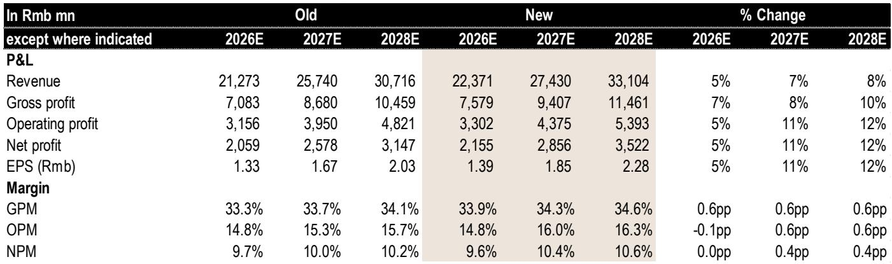
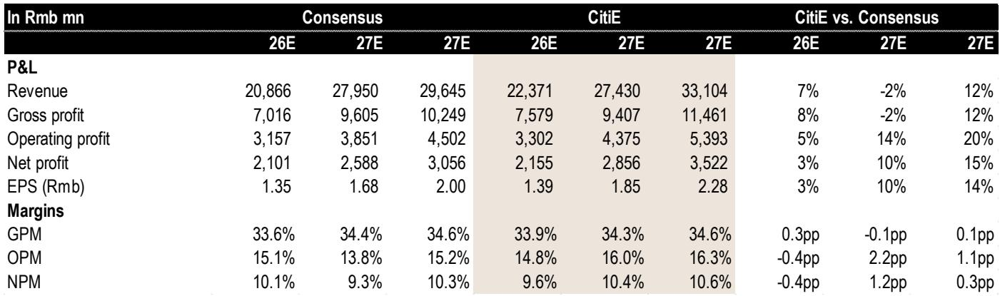
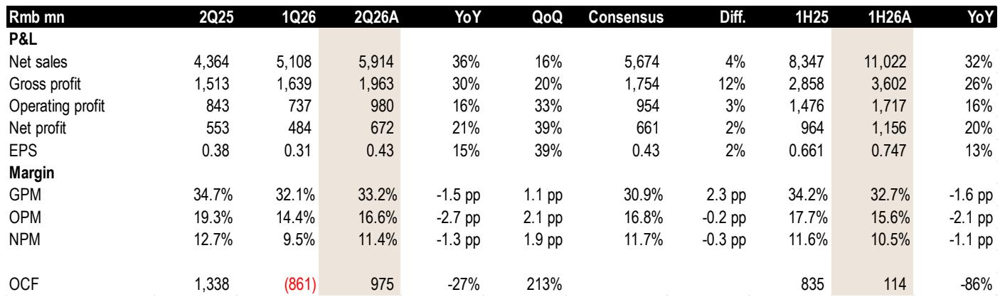

# Citi：宏发股份业务与季度数据观察

，核心依据不是单季利润，而是收入增速与毛利率走向的组合信号。二季度收入59亿元，同比增长36%，高出市场预期4个百分点；毛利率33.2%，虽同比回落1.5个百分点，却比市场预期高出2.3个百分点。这份报告最值得关注的判断是：公司毛利率有望在三季度回到约35%的水平，驱动来自持续的提价与银价回落，而非单一的需求故事。

报告将2026至2028年净利润预测分别上调5%、11%和12%，理由是收入与毛利率两个变量同时改善。在继电器行业需求普遍增长的背景下，宏发的收入弹性明显高于同业，管理层在业绩会上将其归因于市场份额提升与全品类需求共振，而非某一细分市场的单点爆发。

## 1. 上半年各产品线收入增长呈现全品类特征

1H26收入按产品拆分后，增长并非依赖单一引擎。新能源车高压直流继电器收入36亿元，同比增长45%，主要来自份额提升；家电继电器收入23亿元，同比增长40%，其中提价贡献了约20个百分点的收入增量；汽车继电器收入14亿元，同比增长20%，提价从二季度开始体现；电力继电器收入同比增长27%，受益于欧洲与中国国家电网需求回暖；新能源继电器收入10亿元，同比增长60%；工业与通信继电器分别增长50%和20%。

新业务中，PDU/BDU表现最突出，上半年收入同比增速超过100%。这份产品矩阵说明，宏发的增长不是某一客户或某一车型驱动，而是工业、能源、家电、汽车多个下游同时处在需求上行或提价周期中。

> **KC评论：** 家电继电器提价贡献20个百分点的收入增量，这个数字容易被忽略。它说明宏发在成熟品类上也有定价能力，不只是新能源车高压直流继电器在讲故事。

## 2. 毛利率回升路径由提价与银价两个变量共同决定

二季度毛利率33.2%，环比已回升1.1个百分点。管理层给出更明确的指引：随着部分产品继续提价，叠加三季度以来银价下跌约20%，毛利率有望回到2025年三季度的水平，即约35%。Citi在图表中将季度毛利率与银价走势并列呈现，两者负相关关系清晰。

这一判断的弹性在于：提价是公司主动行为，银价是外部变量，两者若同时兑现，毛利率上行幅度可能超过当前预测。Citi在2026至2028年的毛利率预测中仅上调了0.6个百分点，相对保守。

## 3. 订单能见度与AIDC继电器构成下半年观察框架

管理层给出3至6个月的订单能见度，并称在手订单处于历史高位。需求端的可见性较强，这是收入预测上调的基础。另一个增量来自AIDC相关业务，管理层表示机会大于此前预期，800V继电器最早可能在四季度末向台达电子或光宝科技等主要客户出货。

观察宏发下半年表现，可以沿三条线展开：一是毛利率能否如指引回到35%，验证提价与银价逻辑；二是PDU/BDU等高增长新业务能否维持弹性较高增速；三是800V AIDC继电器能否在四季度形成实际出货，打开新的估值参照系。

> **KC评论：** 800V继电器出货时间点比市场预期更早，四季度末是第一个验证窗口。如果兑现，市场对宏发的定价逻辑会从继电器周期股切换到AIDC电力部件供应商，估值框架完全不同。

，较历史均值高一个标准差，理由是收入增长与毛利率回升带来的盈利增速加快。报告同时给出乐观与保守两种情形：乐观情形下估值可到39倍，保守情形下回落到22倍，差异取决于需求增长的持续性。这份报告的增量信息不在于利润超预期多少，而在于它把毛利率回升的路径和AIDC业务的落地时间点讲清楚了，这两点决定了未来几个季度的验证节奏。

For informational purposes only. Portions may be generated,translated,summarized,or edited with AI assistance based on source materials and may contain omissions or errors. Please verify independently. This is not investment,legal,tax,accounting,or other professional advice.

For informational purposes only. Portions may be generated,translated,summarized,or edited with AI assistance based on source materials and may contain omissions or errors. Please verify independently. This is not investment,legal,tax,accounting,or other professional advice.

