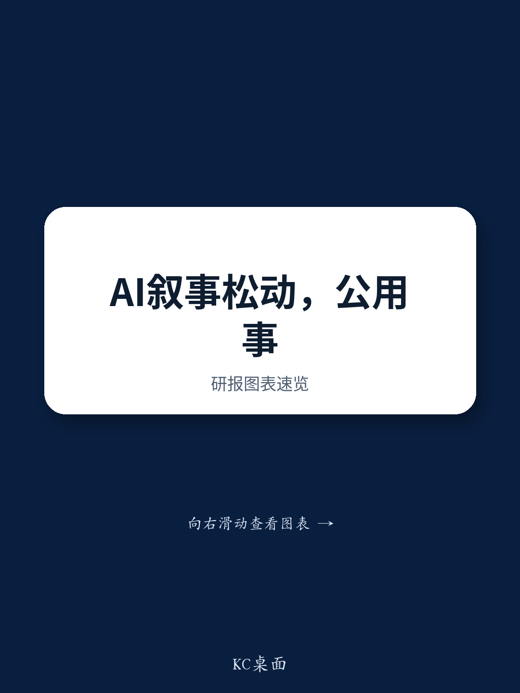

# Citi：大中华多元化公用事业——公用事业避险方向——可再生能源与电力设备

7月底的市场定价出现一个值得注意的变化：对AI及数据中心相关研究主题的谨慎情绪，叠加10年期美债回报表现从2月底的3.96%升至4.61%，资金正在向低beta板块轮动。Citi在最新一期大中华多元化公用事业报告中，直接回应了一个问题——在这个时间窗口，公用事业、可再生能源和电力设备板块里，哪些标的最能承接避险需求。

报告给出的答案很具体：未来30天内，高股息标的可能跑赢。ENN Energy的2026年预期股息率6.7%，CR Gas和北京企业均为5.9%，粤海研究5.7%，中国光大环境5.7%，新奥天然气5.3%。这些公司的共同特征是：1H26盈利大概率平稳，节奏变化空间有限，且自由现金流为正，能够支撑股息派发。

## 1. 过去三个月板块跌幅集中在电力设备与风电制造商

报告列出了一组过去三个月的跌幅数据：HD现代电气跌54%，晓星重工跌50%，东方电气跌47%，大金重工跌43%，金风科技跌42%，LS电气跌41%。Citi将这些跌幅归因于对AI相关支出的谨慎看法、美债回报表现上升，以及部分公司特定原因——大金重工没有新增海上风电设备订单，金风科技因叶片单位成本上升导致风机销售利润率承压。

这些跌幅并非均匀分布。电网设备类公司跌幅最大，而燃气分销商和部分水务公司相对抗跌。这说明市场正在重新定价AI电力需求的确定性，而非简单回避整个电力产业链。

> **KC评论：** 跌幅最大的公司集中在电网设备和风电整机，而不是发电运营。这提示读者，AI电力需求叙事最先被修正的是设备端预期，运营端的盈利兑现还没被充分检验。

## 2. 城市燃气分销商以稳定股息应对盈利增速节奏变化

Citi对多数中国城市燃气分销商更新公司观点，核心逻辑是1H26净利润可能同比持平或下降个位数百分比。原因有两层：零售气量没有增长——国内零售气价上调后，天然气相对其他能源的价格竞争力受到影响；房地产节奏变化导致新增居民接驳减少。

但报告同时指出，这些公司有动力维持每股股息。ENN Energy已承诺2026年每股股息不低于3.0港元。资本开支调整、自由现金流转正、派息率有提升空间，这三项条件让燃气分销商在盈利小幅下滑时仍能守住股息。

## 3. 粤海研究的股息率在相关市场公用事业中最高

粤海研究是这份报告里一个值得单独看的案例。Citi预测其1H26经常性净利润同比增长超过5%，来自财务成本下降。报告假设其与香港的供水特许经营权将续期30年至2060年，作价500亿港元，但Citi也明确表示，最终敲定时间取决于香港与广东省政府之间的谈判，存在不确定性。

关键在支付能力。报告测算，粤海研究在2026-30年间每年可产生约40亿港元的自由现金流（扣除股息后），且目前处于净现金状态，有能力进一步举债。公司还承诺到2030年不削减股息。5.7%的2026年预期股息率，是相关市场公用事业中的最高水平。

> **KC评论：** 粤海研究的股息承诺和续期假设是绑在一起的。如果供水续期谈判时间拉长或条件变化，市场对股息可持续性的定价可能需要修正。

## 4. 独立发电商的股息可见度低于燃气分销商

Citi对中国独立发电商持谨慎态度。中国电力国际（6.9%）、华润电力（5.1%）、华电国际（5.1%）和华能国际（5.0%）的2026年预期股息率看起来不低，但报告认为这些公司的盈利可见度较低——电价和利用小时数都在下降，EPS节奏变化时，固定派息率意味着DPS也会同步下调。

报告特别指出，中国独立发电商中最防御性的是长江电力，但其股息率只有3.6%。这构成了一个选择：要么接受低股息换取盈利稳定性，要么追逐高股息但承担盈利和股息双降的可能。

## 5. 观察框架：用自由现金流和派息承诺筛选防御标的

这份报告提供了一个可复用的筛选思路。在市场情绪转向时，高股息本身不是充分条件，需要叠加三个维度：自由现金流是否为正且能覆盖股息、公司是否有明确的派息承诺或政策、盈利下滑时派息率是否有提升空间。燃气分销商满足这三项，独立发电商则因固定派息率而缺乏缓冲。

另一个维度是资本开支节奏。报告反复提到，资本开支调整是燃气公司维持股息的前提。在电力设备端，跌幅最大的公司往往也是资本开支和订单预期最集中的环节。这个框架同样适用于观察其他基础设施类资产。

Citi在报告中对电力设备公司仍更新公司观点，反映的是12个月维度上的估值修复空间，而非短期资金流向的判断。市场情绪和基本面兑现之间的时间差，正是这份报告试图帮助读者理解的部分。

For informational purposes only. Portions may be generated,translated,summarized,or edited with AI assistance based on source materials and may contain omissions or errors. Please verify independently. This is not investment,legal,tax,accounting,or other professional advice.

For informational purposes only. Portions may be generated,translated,summarized,or edited with AI assistance based on source materials and may contain omissions or errors. Please verify independently. This is not investment,legal,tax,accounting,or other professional advice.

