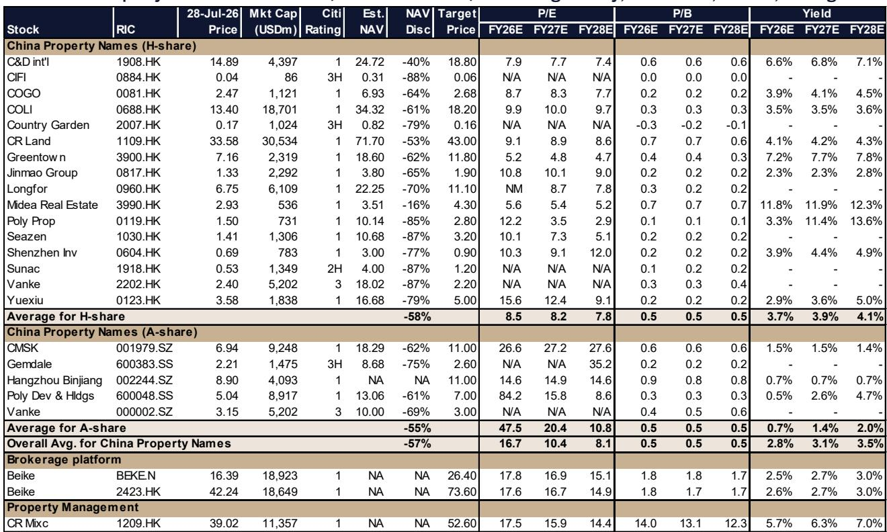
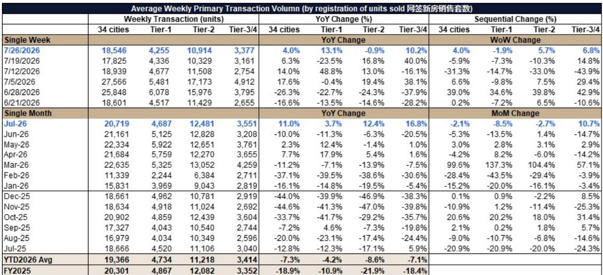
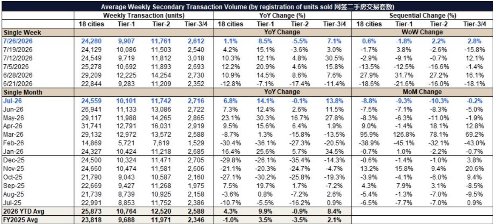

# Citi：城市与住房数据变化观察

7月最后一周，Citi跟踪的34城新房网签套数录得18,546套，同比转正至4.0%，其中一线城市同比13.1%。这份覆盖7月全月数据的中国房地产行业报告，给出了一个相对清晰的判断：核心城市实物成交量已经企稳，而8月至10月行业销售能否延续回升，关键看推盘放量的节奏和低基数效应能否兑现。

报告对行业的中性偏积极看法建立在三个支撑上：7至9月核心城市成交量在低基数下有望保持稳定；9月起新盘供应管道明显增强；7月重要会议可能释放支持性表态。Citi认为，上半年业绩的调整程度好于市场悲观预期，销售和利润率指引也可能提供支撑，行业在8至10月具备一轮阶段性表现的条件。

## 1. 7月新房与二手房成交量同步转正，一线城市领跑

7月34城新房成交同比11.0%，18城二手房成交同比6.8%。分城市能级看，一线城市二手房同比14.1%，明显快于二线城市的-0.1%。周度数据同样显示，7月最后一周二手房成交量24,280套，同比1.1%，处于2025年均值上方3%的水平——这在传统淡季中并不常见。

Citi特别指出，部分二线城市表现突出：佛山、宁波、上海、苏州二手房同比增速超过20%，成都、深圳、北京、东莞在10%至20%区间。合肥则受益于科技企业新上市带来的住房需求。二手房价格在6个核心城市延续环比企稳趋势，这为后续新房定价提供了参照。

> **KC评论：** 二手房成交量连续数周高于年度均值，说明需求并非脉冲式释放。真正值得跟踪的是价格端能否在成交量支撑下稳住，这决定了后续新房项目的去化预期。

## 2. 上半年土地购置调整，优质地块溢价率抬升

土地市场呈现明显的供给调整特征。1H26，300城土地成交建面同比-22%，处于20年低位；百强房企土地购置金额同比-25%。供给约束推高了优质地块的溢价率，6月平均土地溢价率升至13.7%，环比上升8个百分点，深圳、杭州、上海等城市表现突出。

分企业看，上半年土地购置金额居前的是华润置地（深圳布局较强）、保利发展和建发国际。中海、金茂、绿城则计划在2026年下半年土地供应放量时择机补充，以获取更具性价比的地块。建发国际自6月起在深圳、上海、杭州、无锡、苏州、福州等城市加快了拿地节奏，Citi在6月后对其看法转趋积极。

## 3. 政策端以稳预期为主，城市更新资金规模扩大

报告梳理了近期政策信号：6月18日《求是》杂志文章提出加快修复居民资产负债表、稳定房地产市场以防止对信心的谨慎冲击；2026年城市更新研究中，中央预算内资金970亿元，同比增加170亿元（+21%），另有1,600亿元超长期特别国债支持，同比增加250亿元（+18.5%）。

Citi预计7月重要会议将保持支持性基调。报告同时指出，若地方在公积金、以旧换新等方面出台进一步宽松措施，将超出市场当前"无具体政策出台"的预期。这一判断意味着，政策端的不确定性更多在于节奏而非方向。

## 4. 头部房企销售分化，五家已实现正增长

上半年已有五家房企实现销售正增长：中海+12%、金茂+8%、招商蛇口+8%、华润置地+6%、中国金茂+15%。Citi认为，随着低基数效应显现，8至9月更多上市房企可能转为正增长，头部企业的销售增速也将加快。

这一判断隐含了一个观察框架：在总量企稳但结构分化的市场中，销售增速转正的时间点、土地补充的节奏、以及产品升级的兑现度，是区分房企相对表现的三条主线。建发国际的案例说明，产品升级与加速纳储的组合，可能改变市场对一家公司的中期预期。

> **KC评论：** 上半年土地购置金额同比-43%，但优质地块溢价率却在抬升。这说明土地市场的逻辑已从"量"转向"质"——谁能在供给调整期拿到核心地块并快速转化为可售货值，谁就更可能在下半年销售竞争中占得先机。

报告对行业整体持积极看法，但这一判断建立在推盘放量、政策表态和低基数三个条件同时成立的基础上。对于关注房地产市场的读者，7月成交数据的结构——一线强于二线、二手房强于新房、头部房企率先转正——比总量数字更有参考价值。8月推盘数据将是验证这一判断的第一个时间节点。

For informational purposes only. Portions may be generated,translated,summarized,or edited with AI assistance based on source materials and may contain omissions or errors. Please verify independently. This is not investment,legal,tax,accounting,or other professional advice.

For informational purposes only. Portions may be generated,translated,summarized,or edited with AI assistance based on source materials and may contain omissions or errors. Please verify independently. This is not investment,legal,tax,accounting,or other professional advice.

