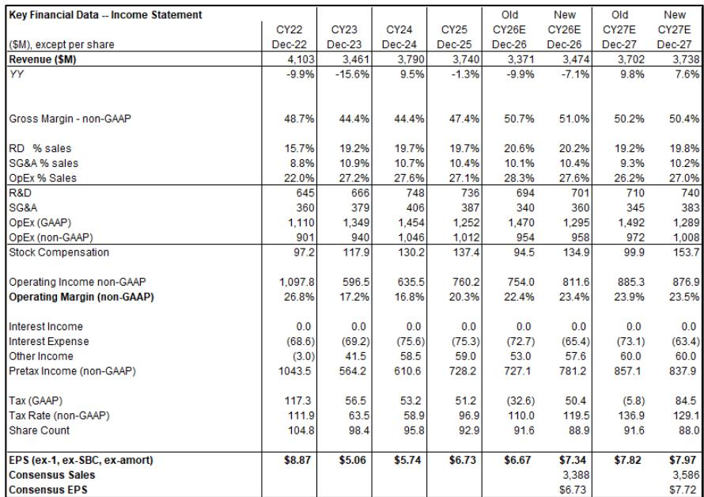
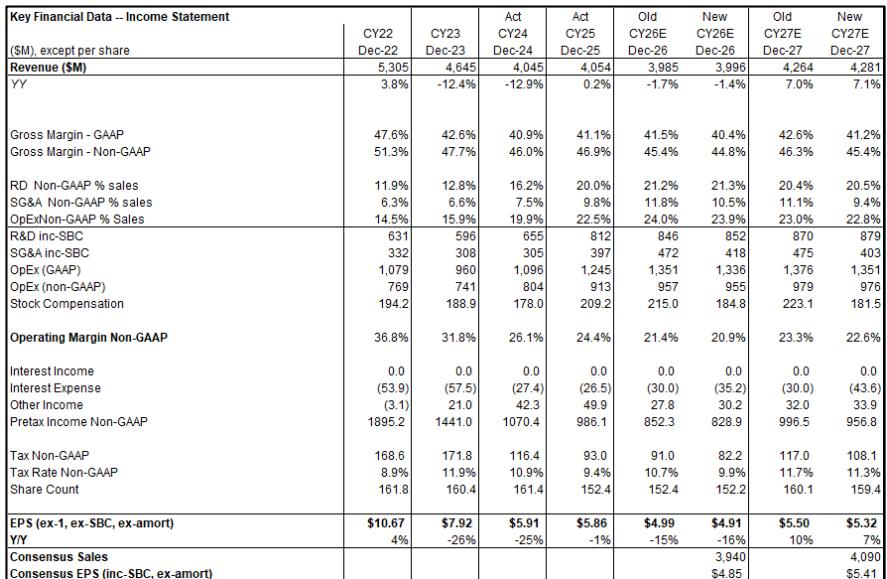
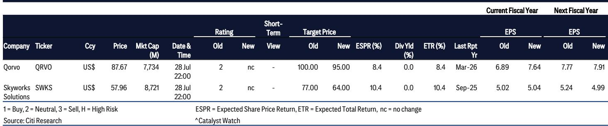

# Citi：美国半导体公司Skyworks与Qorvo

Citi在最新研究报告中更新了Skyworks与Qorvo的盈利模型，核心判断是：两家公司近六个季度业绩均超市场预期，但估值倍数被下调，反映出射频半导体行业在智能手机需求平淡背景下的重新定价。报告同时指出，两家公司已宣布的合并交易若顺利完成，将改变行业竞争结构。

这份报告最值得关注的信号，并非单季业绩本身，而是Citi对两家公司2026至2027财年盈利预测的分化调整。Qorvo的每股盈利预测被上调10%，Skyworks则被下调2%至3%。同一行业、同一笔交易的两家主角，盈利路径正在走向不同方向。

## 1. 合并交易时间表提前，融资成本影响Skyworks短期盈利

Skyworks在近六个季度业绩中给出的指引显示，下一季度营收将比市场共识高1%，但每股盈利低2%，差异主要来自与Qorvo交易相关的融资利息支出。Citi据此将Skyworks 2026和2027自然年的每股盈利预测分别下调2%和3%。

合并交易的时间表比此前预期更紧凑。Skyworks现在预计交易将在2026自然年内完成，最早可能在下一季度末就绪。这意味着，融资成本对利润表的侵蚀是短期可见的，而协同效应要等到交易真正交割后才能逐步体现。

> **KC评论：** 合并交易的时间表提前，市场需要关注的不是“能不能成”，而是“交割前这段时间两家公司的利润表各自要承受什么”。Skyworks的利息支出上升是明牌，Qorvo的盈利改善则建立在交易顺利推进的假设上。

## 2. Qorvo毛利率站上50%，盈利预测上调幅度明显

Qorvo近六个季度业绩同样高于市场预期，公司给出的2027财年指引更为积极：毛利率将超过50%，每股盈利高于7美元。Citi将Qorvo 2026自然年每股盈利预测上调10%，2027自然年上调2%。

从模型变化看，Qorvo的毛利率从2025自然年的47.4%提升至2026年的51.0%，这一改善幅度在射频半导体行业并不常见。Citi在报告中提到，Qorvo的盈利改善与合并交易可能带来的竞争格局优化有关，而非单纯的需求回暖。

## 3. 估值倍数统一降至12倍，市场对智能手机需求保持谨慎

两家公司的估值倍数均被调整至12倍，低于此前Skyworks的14倍和Qorvo的13倍。这一调整直接反映了市场对智能手机需求平淡的定价。目标报价方面，Qorvo从100美元下调至95美元。

两家公司的估值逻辑趋于一致，但背后的业务叙事并不相同。Skyworks的盈利预测被下调，估值倍数也被压缩；Qorvo的盈利预测被上调，但估值倍数同样被压缩。这说明，在Citi的框架里，行业层面的估值调整压过了公司层面的盈利改善。

> **KC评论：** 12倍估值是当前市场愿意为射频半导体公司支付的价格，无论盈利上修还是下修。读者真正需要跟踪的变量是智能手机出货量数据，以及两家公司合并后能否在主要客户那里守住份额。

## 4. 观察框架：合并交易、毛利率与客户集中度三条线索

对于跟踪这两家公司的读者，Citi报告提供了一个可复用的分析框架。第一条线索是合并交易的监管审批进度，这是两家公司共同的变量，也是竞争格局变化的最大不确定性。第二条线索是毛利率走势，Qorvo能否维持50%以上的毛利率，Skyworks的毛利率能否止住下滑，将直接决定盈利预测的修正方向。第三条线索是客户集中度，两家公司对最大客户的依赖程度不同，这决定了它们在需求波动中的敏感度差异。

Citi在报告中维持对两家公司的公司观点，理由是射频半导体并非AI需求的主要受益者，而合并交易虽然有助于缓解竞争不确定性，但智能手机市场的整体增长空间仍然有限。这一判断的隐含意思是，行业整合带来的定价权改善，可能比需求复苏更值得期待。

For informational purposes only. Portions may be generated,translated,summarized,or edited with AI assistance based on source materials and may contain omissions or errors. Please verify independently. This is not investment,legal,tax,accounting,or other professional advice.

