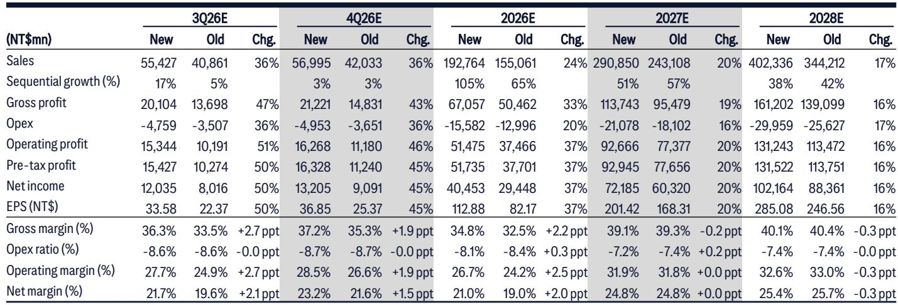
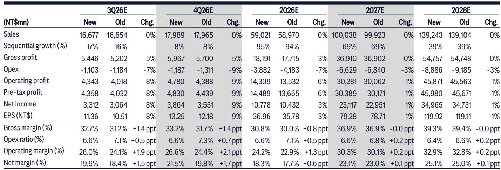
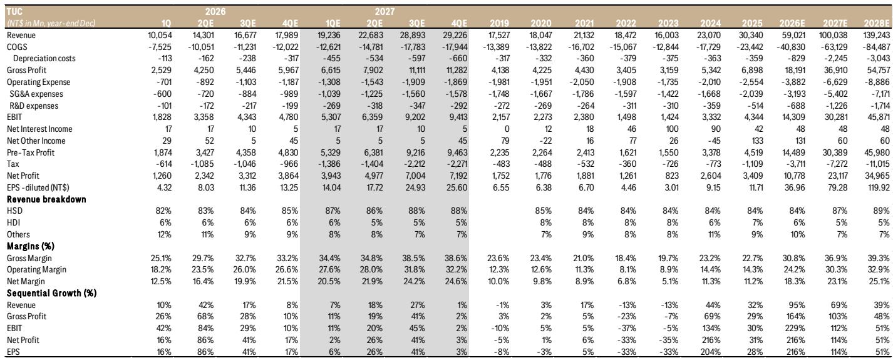

# Citi：PCB、CCL技术与行业应用观察

AI服务器需求把铜箔基板（CCL）推到了近两年少见的紧平衡位置。Citi在7月底的台湾PCB与CCL行业报告中给出一个明确判断：CCL供应紧张将从2026年第三季度开始显现，并可能延续到2027年。报告覆盖的两家台厂——台光电子（EMC）和联茂电子（TUC）——二季度业绩均超预期，且管理层没有排除三季度继续调价的可能性。

这份报告最有信息量的地方不在于单季数字本身，而在于供需节奏的错位。EMC在2Q26的毛利率达到33.9%，环比提升4.4个百分点，高于Citi和市场的预测；公司给出的3Q26营收环比增长指引约为15%，且这一数字尚未计入潜在的调价贡献。换句话说，即便不考虑提价，量的增长已经很强，而调价一旦落地，弹性会更大。

## 1. 高端产品占比上升推动毛利率结构变化

EMC二季度毛利率跳升的直接支撑来自产品结构。管理层披露，M7以上等级产品在2Q26的销售占比达到60-65%，并预期下半年高端占比继续走高。3Q26毛利率指引为35%加减1.5个百分点，环比仍有提升空间。这不是一次性的价格红利，而是高端AI材料在营收组合中权重上升带来的结构性变化。

TUC的情况类似，但节奏略有不同。2Q26毛利率29.7%，环比提升4.6个百分点，主要受调价驱动。M7+M8产品占比从1Q26的38%微升至39%，高端化斜率比EMC平缓。两家公司的差异在于：EMC的高端占比已经过半，TUC还在爬坡阶段。

> **KC评论：** 毛利率提升的可持续性，关键看M7以上产品占比能否继续上行。EMC的60-65%占比意味着高端化已进入收获期，而TUC的39%说明其故事更多还在兑现途中。

## 2. 供应紧张从3Q26开始，调价可能形成行业共振

Citi认为，按照2026-27年的产能扩张计划，CCL供应紧张将从3Q26开始并延续到2027年。EMC目前没有排除在3Q26再次调价的可能性；如果EMC调价，TUC大概率跟进。两家公司在调价行为上的同步性，反映出行业性的供需约束，而非单一公司的定价策略。

高端铜箔和低Dk材料的供给是当前最紧的环节。EMC管理层明确表示，高端材料供应偏紧。AWS Trainium 3的放量是下半年的关键催化——Citi预计该平台从3Q26开始显著爬坡，直接拉动两家公司的出货动能。TUC的泰国产能从7月开始爬坡，用于支持AWS需求，这为下半年增长提供了额外的地理弹性。

## 3. 盈利预测上修集中在EMC，TUC的弹性更多来自量

Citi将EMC 2026/27/28年盈利预测分别上调37%/20%/16%，幅度显著，主要反映调价和产品结构改善。EMC的2026年EPS预测从82.17元上调至112.88元，2027年从168.31元上调至201.42元。营收预测的调整同样激进：2026年营收从1550亿上调至1928亿新台币，环比增长105%。

TUC的盈利预测调整幅度要温和得多——2026/27/28年仅上调3%/1%/1%。这背后的含义值得注意：Citi认为TUC的弹性更多来自Trainium 3的量增，而非毛利率的进一步扩张。TUC在2Q26确认了1.9个百分点的存货跌价损失，原因是Trainium 3爬坡晚于预期，这一因素在后续季度可能不再重复，但也说明其高端产品放量的时间点比EMC更靠后。

> **KC评论：** 两家公司盈利预测调整幅度的差异，实际上在说两件事：EMC的调价弹性已经反映在毛利率假设里，而TUC的增量主要靠AWS平台的出货量。如果Trainium 3爬坡顺利，TUC的盈利上修空间可能比当前预测更大；反之，EMC的防御性更强。

## 4. 观察CCL行业供需的四个指标

报告提供了一套跟踪CCL行业紧张程度的框架，可以归纳为四个维度。第一是高端材料交期，EMC提到高端铜箔和低Dk材料供应紧，这是最前置的领先指标。第二是调价行为，EMC和TUC的定价动作具有行业风向标意义，如果EMC在3Q26再次调价且TUC跟进，基本可以确认供需缺口在扩大。第三是M7以上产品占比的季度变化，这直接决定毛利率的可持续性。第四是ABF CCL的认证进度，EMC目标在3Q26或最迟4Q26通过认证，这关系到2027年的增长空间。

EMC在长约问题上保持被动姿态，除非客户态度强硬，否则不愿签署长期协议。这一细节在现货紧张的背景下值得玩味：在调价周期中，长约锁定价格反而可能限制上行弹性，EMC的选择是在为后续提价保留空间。

，基于30倍2027年预期EPS；TUC维持1950元新台币，基于25倍2027年预期EPS。两家公司的估值倍数差异，反映了市场对高端占比和盈利可见度的定价差异。报告没有完全展开的是，如果Trainium 3的爬坡速度低于预期，或者ABF CCL认证时间延后，当前盈利预测仍有下修空间——这些是后续季报需要验证的变量。

For informational purposes only. Portions may be generated,translated,summarized,or edited with AI assistance based on source materials and may contain omissions or errors. Please verify independently. This is not investment,legal,tax,accounting,or other professional advice.

For informational purposes only. Portions may be generated,translated,summarized,or edited with AI assistance based on source materials and may contain omissions or errors. Please verify independently. This is not investment,legal,tax,accounting,or other professional advice.

