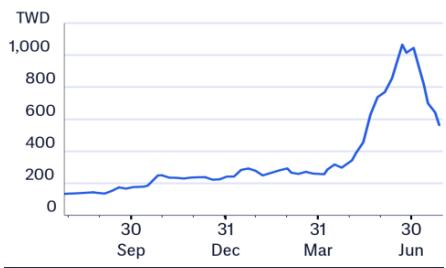
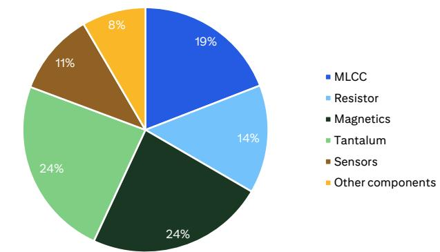
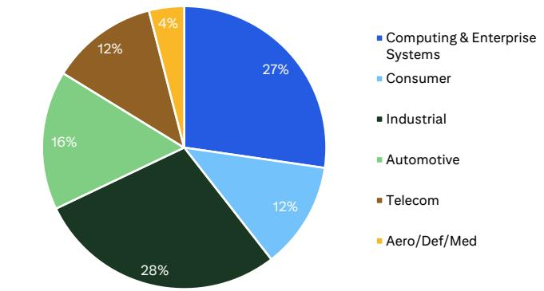
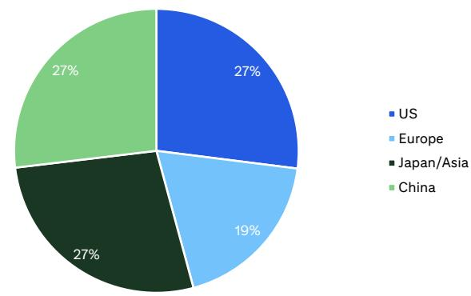
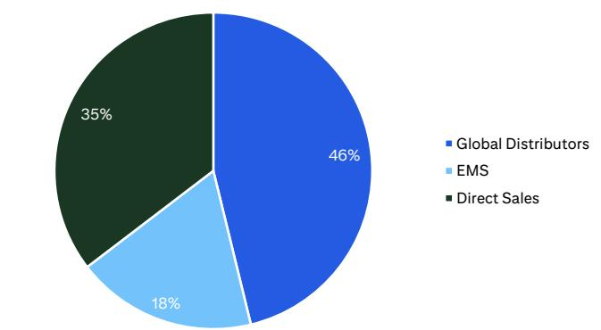
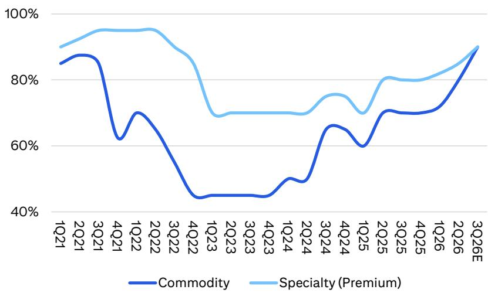

29 Jul 2026 12:38:28 ET | 16 pages

# 国巨 (2327.TW)

2Q26业绩全面超预期；行业估值中枢调整，结构性逻辑不变

## 核心观点

国巨2Q26业绩在规模和利润率方面均超出预期，AI相关收入占比提升至16%，订单出货比升至2.2，显示下游需求动能增强。管理层对3Q26给出营收温和增长、利润率继续改善的指引，同时大宗品与特殊品产能利用率预计升至90%以上，供需格局趋于紧平衡。客户对AI、计算、存储等领域多年期长约的兴趣上升，需求可见度延长。我们上调2026-28年每股盈利预测11%-13%，并上调平均售价增长的年复合增速假设。同时，基于行业估值倍数因去杠杆因素持续调整，我们将目标价从NT$1,500下调至NT$1,450（对应2027-28年平均每股盈利35倍，此前为40倍），维持积极观点。

2Q26业绩在规模和利润率上均超预期——国巨2Q26净利润为新台币94亿元（环比+18%/同比+88%），超出我们及市场预期18%/3%，主要得益于规模效应、利润率扩张和费用控制。毛利率为38.5%（环比+0.4个百分点/同比+2.9个百分点），略低于市场预期，因大宗品出货占比提升稀释了产品组合；但我们开始看到早期价格传导逐步反映在利润率中。AI相关收入占比升至16%（1Q26约为14-15%），订单出货比在6月底环比升至2.2（此前股东大会时为1.3），显示需求可见度较强。

领先指标全面向好——管理层指引3Q26营收温和增长，毛利率/营业利润率小幅改善，大宗品与特殊品产能利用率将从2Q26的80%/85%升至90%/90%以上，且若原材料成本继续上行，管理层不排除进一步调价。管理层还提到客户在AI、计算、存储等终端市场签署长约的兴趣上升，意味着潜在需求强于此前预期。我们相应将2025-28年MLCC/电阻/钽电容产品线的平均售价增长年复合增速假设从20%/16%/25%上调至22%/23%/27%。

影响——我们将2026-28年盈利预测上调11%-13%，以反映更强的业绩和指引。我们将目标价调整至NT$1,450，对应2027-28年平均每股盈利35倍（此前为NT$1,500，对应40倍），这一温和下调反映行业去杠杆驱动的估值倍数压缩，而非国巨盈利轨迹的变化。我们预计盈利能力和增长可见度将在周期中持续改善。维持积极评级。

## 盈利摘要

<table><tr><td>截至12月31日</td><td>净利润（新台币百万元）</td><td>稀释每股盈利（新台币）</td><td>每股盈利增速（%）</td><td>市盈率（倍）</td><td>市净率（倍）</td><td>净资产回报表现（%）</td><td>股息率（%）</td></tr><tr><td>2024A</td><td>19,356</td><td>9.56</td><td>10.0</td><td>53.0</td><td>6.5</td><td>13.1</td><td>0.8</td></tr><tr><td>2025A</td><td>23,634</td><td>11.51</td><td>20.4</td><td>44.0</td><td>6.1</td><td>14.3</td><td>1.0</td></tr><tr><td>2026E</td><td>40,811</td><td>19.87</td><td>72.7</td><td>25.5</td><td>5.2</td><td>22.0</td><td>1.2</td></tr><tr><td>2027E</td><td>72,611</td><td>35.36</td><td>77.9</td><td>14.3</td><td>3.8</td><td>30.8</td><td>2.0</td></tr><tr><td>2028E</td><td>98,682</td><td>48.05</td><td>35.9</td><td>10.6</td><td>2.8</td><td>30.7</td><td>3.6</td></tr></table>

来源：dataCentral

## 评级：积极

价格（26年7月29日 13:30）NT$507.00

目标价 NT$1,450.00↓
（此前 NT$1,500.00）

预期股价回报率 186.0%

预期股息率 2.0%

预期总回报率 188.0%

市值 NT$1,050,233百万元

## 股价表现（RIC: 2327.TW, BB: 2327 TT）

Michael Hung $^{AC}$ +886-2-8726-9092
michael.hung@citi.com

Laura (Chia Yi) Chen +886-2-8726-9090 laura.cy.chen@citi.com

<table><tr><td>损益表（新台币百万元）</td><td>2024</td><td>2025</td><td>2026E</td><td>2027E</td><td>2028E</td></tr><tr><td>营业收入</td><td>121,667</td><td>132,930</td><td>184,630</td><td>262,437</td><td>330,955</td></tr><tr><td>营业成本</td><td>-79,864</td><td>-84,800</td><td>-111,651</td><td>-141,651</td><td>-169,900</td></tr><tr><td>毛利</td><td>41,803</td><td>48,130</td><td>72,979</td><td>120,785</td><td>161,054</td></tr><tr><td>毛利率（%）</td><td>34.4</td><td>36.2</td><td>39.5</td><td>46.0</td><td>48.7</td></tr><tr><td>EBITDA（调整后）</td><td>33,014</td><td>39,635</td><td>59,652</td><td>99,714</td><td>132,845</td></tr><tr><td>EBITDA利润率（调整后）（%）</td><td>27.1</td><td>29.8</td><td>32.3</td><td>38.0</td><td>40.1</td></tr><tr><td>折旧</td><td>-9,629</td><td>-9,834</td><td>-8,700</td><td>-7,250</td><td>-6,708</td></tr><tr><td>摊销</td><td>0</td><td>0</td><td>0</td><td>0</td><td>0</td></tr><tr><td>EBIT（调整后）</td><td>23,386</td><td>29,801</td><td>50,951</td><td>92,464</td><td>126,137</td></tr><tr><td>EBIT利润率（调整后）（%）</td><td>19.2</td><td>22.4</td><td>27.6</td><td>35.2</td><td>38.1</td></tr><tr><td>净利息收入</td><td>2,190</td><td>1,571</td><td>1,340</td><td>1,340</td><td>1,340</td></tr><tr><td>联营公司</td><td>846</td><td>830</td><td>467</td><td>0</td><td>0</td></tr><tr><td>非经营/特殊/其他调整</td><td>441</td><td>-1,082</td><td>-27</td><td>0</td><td>0</td></tr><tr><td>税前利润</td><td>26,863</td><td>31,120</td><td>52,731</td><td>93,804</td><td>127,478</td></tr><tr><td>税项</td><td>-7,377</td><td>-7,343</td><td>-11,751</td><td>-20,899</td><td>-28,397</td></tr><tr><td>特殊/少数股东权益/优先股股息</td><td>-130</td><td>-143</td><td>-169</td><td>-293</td><td>-399</td></tr><tr><td>报告净利润</td><td>19,356</td><td>23,634</td><td>40,811</td><td>72,611</td><td>98,682</td></tr><tr><td>净利率（%）</td><td>15.9</td><td>17.8</td><td>22.1</td><td>27.7</td><td>29.8</td></tr><tr><td>核心净利润</td><td>19,356</td><td>23,634</td><td>40,811</td><td>72,611</td><td>98,682</td></tr></table>

价格：NT$507.00；目标价：NT$1,450.00；市值：NT$1,050,233百万元；评级：积极

<table><tr><td>估值指标</td><td>2024</td><td>2025</td><td>2026E</td><td>2027E</td><td>2028E</td></tr><tr><td>市盈率（倍）</td><td>53.0</td><td>44.0</td><td>25.5</td><td>14.3</td><td>10.6</td></tr><tr><td>市净率（倍）</td><td>6.5</td><td>6.1</td><td>5.2</td><td>3.8</td><td>2.8</td></tr><tr><td>EV/EBITDA（倍）</td><td>31.8</td><td>25.8</td><td>16.5</td><td>9.3</td><td>6.3</td></tr><tr><td>自由现金流回报表现（%）</td><td>2.4</td><td>2.4</td><td>5.5</td><td>6.6</td><td>10.2</td></tr><tr><td>股息率（%）</td><td>0.8</td><td>1.0</td><td>1.2</td><td>2.0</td><td>3.6</td></tr><tr><td>派息率（%）</td><td>42</td><td>43</td><td>30</td><td>29</td><td>38</td></tr><tr><td>净资产回报表现（%）</td><td>13.1</td><td>14.3</td><td>22.0</td><td>30.8</td><td>30.7</td></tr></table>

<table><tr><td>现金流量表（新台币百万元）</td><td>2024</td><td>2025</td><td>2026E</td><td>2027E</td><td>2028E</td></tr><tr><td>EBITDA</td><td>33,014</td><td>39,635</td><td>59,652</td><td>99,714</td><td>132,845</td></tr><tr><td>营运资金变动</td><td>10,346</td><td>-37,431</td><td>1,044</td><td>0</td><td>0</td></tr><tr><td>其他</td><td>-12,198</td><td>28,660</td><td>2,268</td><td>-24,787</td><td>-21,128</td></tr><tr><td>经营活动现金流</td><td>31,162</td><td>30,863</td><td>62,965</td><td>74,926</td><td>111,717</td></tr><tr><td>资本支出</td><td>-6,646</td><td>-6,056</td><td>-6,034</td><td>-6,034</td><td>-6,034</td></tr><tr><td>净收购/处置</td><td>-6,218</td><td>-5,902</td><td>-2,487</td><td>0</td><td>0</td></tr><tr><td>其他</td><td>-16,896</td><td>8,233</td><td>0</td><td>0</td><td>0</td></tr><tr><td>投资活动现金流</td><td>-29,760</td><td>-3,725</td><td>-8,522</td><td>-6,034</td><td>-6,034</td></tr><tr><td>已付股息</td><td>-8,369</td><td>-10,265</td><td>-12,438</td><td>-21,477</td><td>-38,213</td></tr><tr><td>融资活动现金流</td><td>2,780</td><td>-3,135</td><td>-7,312</td><td>1,315</td><td>-2,164</td></tr><tr><td>现金净变动</td><td>8,166</td><td>20,356</td><td>47,131</td><td>70,207</td><td>103,518</td></tr><tr><td>股东自由现金流</td><td>24,516</td><td>24,807</td><td>56,930</td><td>68,892</td><td>105,682</td></tr></table>

<table><tr><td>每股数据</td><td>2024</td><td>2025</td><td>2026E</td><td>2027E</td><td>2028E</td></tr><tr><td>报告每股盈利（新台币）</td><td>9.56</td><td>11.51</td><td>19.87</td><td>35.36</td><td>48.05</td></tr><tr><td>核心每股盈利（新台币）</td><td>9.56</td><td>11.51</td><td>19.87</td><td>35.36</td><td>48.05</td></tr><tr><td>每股股息（新台币）</td><td>4.03</td><td>4.95</td><td>6.00</td><td>10.36</td><td>18.43</td></tr><tr><td>每股经营现金流（新台币）</td><td>15.39</td><td>15.03</td><td>30.66</td><td>36.49</td><td>54.40</td></tr><tr><td>每股自由现金流（新台币）</td><td>12.11</td><td>12.08</td><td>27.72</td><td>33.55</td><td>51.46</td></tr><tr><td>每股净资产（新台币）</td><td>78.10</td><td>83.14</td><td>97.15</td><td>132.48</td><td>180.49</td></tr><tr><td>加权平均普通股数（百万股）</td><td>2,025</td><td>2,053</td><td>2,054</td><td>2,054</td><td>2,054</td></tr><tr><td>加权平均稀释股数（百万股）</td><td>2,025</td><td>2,053</td><td>2,054</td><td>2,054</td><td>2,054</td></tr></table>

<table><tr><td>增长率</td><td>2024</td><td>2025</td><td>2026E</td><td>2027E</td><td>2028E</td></tr><tr><td>营业收入（%）</td><td>13.1</td><td>9.3</td><td>38.9</td><td>42.1</td><td>26.1</td></tr><tr><td>EBIT（调整后）（%）</td><td>14.5</td><td>27.4</td><td>71.0</td><td>81.5</td><td>36.4</td></tr><tr><td>核心净利润（%）</td><td>11.1</td><td>22.1</td><td>72.7</td><td>77.9</td><td>35.9</td></tr><tr><td>核心每股盈利（%）</td><td>10.0</td><td>20.4</td><td>72.7</td><td>77.9</td><td>35.9</td></tr></table>

<table><tr><td>资产负债表（新台币百万元）</td><td>2024</td><td>2025</td><td>2026E</td><td>2027E</td><td>2028E</td></tr><tr><td>现金及现金等价物</td><td>61,118</td><td>81,473</td><td>128,605</td><td>198,812</td><td>302,330</td></tr><tr><td>应收账款</td><td>21,969</td><td>27,792</td><td>42,993</td><td>56,852</td><td>66,964</td></tr><tr><td>存货</td><td>27,823</td><td>31,636</td><td>46,528</td><td>53,882</td><td>62,785</td></tr><tr><td>固定资产及其他有形资产净额</td><td>74,072</td><td>73,541</td><td>68,726</td><td>66,675</td><td>65,229</td></tr><tr><td>商誉及无形资产</td><td>94,926</td><td>106,700</td><td>107,489</td><td>107,489</td><td>107,489</td></tr><tr><td>金融及其他资产</td><td>86,768</td><td>69,648</td><td>85,345</td><td>97,469</td><td>106,315</td></tr><tr><td>总资产</td><td>366,676</td><td>390,789</td><td>479,685</td><td>581,179</td><td>711,113</td></tr><tr><td>应付账款</td><td>15,003</td><td>18,031</td><td>26,639</td><td>30,890</td><td>36,036</td></tr><tr><td>短期债务</td><td>17,702</td><td>18,417</td><td>27,213</td><td>27,213</td><td>27,213</td></tr><tr><td>长期债务</td><td>70,578</td><td>62,088</td><td>58,413</td><td>59,728</td><td>57,564</td></tr><tr><td>拨备及其他负债</td><td>100,839</td><td>118,256</td><td>165,378</td><td>188,401</td><td>216,271</td></tr><tr><td>总负债</td><td>204,123</td><td>216,793</td><td>277,643</td><td>306,232</td><td>337,085</td></tr><tr><td>股东权益</td><td>160,461</td><td>170,878</td><td>199,682</td><td>272,293</td><td>370,976</td></tr><tr><td>少数股东权益</td><td>2,092</td><td>3,119</td><td>2,361</td><td>2,654</td><td>3,053</td></tr><tr><td>总权益</td><td>162,553</td><td>173,997</td><td>202,042</td><td>274,947</td><td>374,028</td></tr><tr><td>净债务（调整后）</td><td>27,162</td><td>-969</td><td>-42,979</td><td>-111,871</td><td>-217,553</td></tr><tr><td>净债务/权益（调整后）（%）</td><td>16.7</td><td>-0.6</td><td>-21.3</td><td>-40.7</td><td>-58.2</td></tr></table>

有关此表中项目的定义，请点击此处。

图1. 国巨 - 2Q26业绩回顾

<table><tr><td>（新台币百万元）</td><td>2Q26实际</td><td>1Q26实际</td><td>环比</td><td>2Q25实际</td><td>同比</td><td>2Q26Citi预测</td><td>差异</td><td>2Q26市场一致预期</td><td>差异</td></tr><tr><td>营业收入</td><td>44,456</td><td>38,166</td><td>16%</td><td>32,771</td><td>36%</td><td>40,487</td><td>10%</td><td>42,712</td><td>4%</td></tr><tr><td>毛利</td><td>17,116</td><td>14,542</td><td>18%</td><td>11,652</td><td>47%</td><td>15,599</td><td>10%</td><td>16,620</td><td>3%</td></tr><tr><td>毛利率</td><td>38.5%</td><td>38.1%</td><td>+0.4个百分点</td><td>35.6%</td><td>+2.9个百分点</td><td>38.5%</td><td>-0.0个百分点</td><td>38.9%</td><td>-0.4个百分点</td></tr><tr><td>营业利润</td><td>11,749</td><td>9,613</td><td>22%</td><td>7,044</td><td>67%</td><td>10,332</td><td>14%</td><td>11,413</td><td>3%</td></tr><tr><td>营业利润率</td><td>26.4%</td><td>25.2%</td><td>+1.2个百分点</td><td>21.5%</td><td>+4.9个百分点</td><td>25.5%</td><td>+0.9个百分点</td><td>26.7%</td><td>-0.3个百分点</td></tr><tr><td>净利润</td><td>9,418</td><td>8,001</td><td>18%</td><td>4,998</td><td>88%</td><td>8,184</td><td>15%</td><td>9,156</td><td>3%</td></tr><tr><td>每股盈利（新台币）</td><td>4.59</td><td>3.90</td><td>18%</td><td>2.43</td><td>88%</td><td>3.99</td><td>15%</td><td>4.45</td><td>3%</td></tr></table>

© 2026 Citi Inc. 未经Citi书面许可，不得再分发。
来源：公司报告、Citi预测、彭博一致预期

图2. 国巨 - 2Q26分产品收入结构

© 2026 Citi Inc. 未经Citi书面许可，不得再分发。
来源：公司报告、Citi

图3. 国巨 - 2Q26分应用收入结构

© 2026 Citi Inc. 未经Citi书面许可，不得再分发。
来源：公司报告、Citi

图4. 国巨 - 2Q26分地区收入结构

来源：公司报告、Citi
© 2026 Citi Inc. 未经Citi书面许可，不得再分发。

图5. 国巨 - 2Q26分渠道收入结构

来源：公司报告、Citi
© 2026 Citi Inc. 未经Citi书面许可，不得再分发。

来源：Citi预测

图6. 国巨 - 产能利用率趋势

© 2026 Citi Inc. 未经Citi书面许可，不得再分发。来源：公司报告、Citi预测

图7. 国巨 - 盈利预测调整

<table><tr><td rowspan="2">（新台币百万元）</td><td colspan="3">2026E</td><td colspan="3">2027E</td><td colspan="3">2028E</td></tr><tr><td>新</td><td>旧</td><td>变动</td><td>新</td><td>旧</td><td>变动</td><td>新</td><td>旧</td><td>变动</td></tr><tr><td>营业收入</td><td>184,630</td><td>171,414</td><td>8%</td><td>262,437</td><td>239,989</td><td>9%</td><td>330,955</td><td>305,472</td><td>8%</td></tr><tr><td>环比增速</td><td>39%</td><td>29%</td><td></td><td>42%</td><td>40%</td><td></td><td>26%</td><td>27%</td><td></td></tr><tr><td>毛利</td><td>72,979</td><td>67,501</td><td>8%</td><td>120,785</td><td>110,685</td><td>9%</td><td>161,054</td><td>149,150</td><td>8%</td></tr><tr><td>营业费用</td><td>22,028</td><td>21,739</td><td>1%</td><td>28,322</td><td>28,149</td><td>1%</td><td>34,917</td><td>35,095</td><td>-1%</td></tr><tr><td>营业利润</td><td>50,951</td><td>45,763</td><td>11%</td><td>92,464</td><td>82,536</td><td>12%</td><td>126,137</td><td>114,055</td><td>11%</td></tr><tr><td>税前利润</td><td>52,731</td><td>47,512</td><td>11%</td><td>93,804</td><td>83,876</td><td>12%</td><td>127,478</td><td>115,395</td><td>10%</td></tr><tr><td>净利润</td><td>40,811</td><td>36,564</td><td>12%</td><td>72,611</td><td>64,531</td><td>13%</td><td>98,682</td><td>88,789</td><td>11%</td></tr><tr><td>每股盈利（新台币）</td><td>19.87</td><td>17.81</td><td>12%</td><td>35.36</td><td>31.42</td><td>13%</td><td>48.05</td><td>43.24</td><td>11%</td></tr><tr><td>毛利率</td><td>39.5%</td><td>39.4%</td><td>+0.1个百分点</td><td>46.0%</td><td>46.1%</td><td>-0.1个百分点</td><td>48.7%</td><td>48.8%</td><td>-0.2个百分点</td></tr><tr><td>营业费用率</td><td>11.9%</td><td>12.7%</td><td>-0.8个百分点</td><td>10.8%</td><td>11.7%</td><td>-0.9个百分点</td><td>10.6%</td><td>11.5%</td><td>-0.9个百分点</td></tr><tr><td>营业利润率</td><td>27.6%</td><td>26.7%</td><td>+0.9个百分点</td><td>35.2%</td><td>34.4%</td><td>+0.8个百分点</td><td>38.1%</td><td>37.3%</td><td>+0.8个百分点</td></tr><tr><td>净利率</td><td>22.1%</td><td>21.3%</td><td>+0.8个百分点</td><td>27.7%</td><td>26.9%</td><td>+0.8个百分点</td><td>29.8%</td><td>29.1%</td><td>+0.8个百分点</td></tr></table>

© 2026 Citi Inc. 未经Citi书面许可，不得再分发。

图8. 被动元件同业估值比较

<table><tr><td>公司</td><td>代码</td><td>评级</td><td>当地货币</td><td>目标价</td><td>现价</td><td>市值</td><td colspan="2">市盈率（倍）</td><td colspan="2">每股盈利增速（%）</td><td colspan="2">市净率（倍）</td><td colspan="2">净资产回报表现（%）</td><td colspan="2">股息率（%）</td></tr><tr><td></td><td></td><td></td><td></td><td>2026/7/29</td><td>2026/7/29</td><td>（百万美元）</td><td>2026</td><td>2027</td><td>2026</td><td>2027</td><td>2026</td><td>2027</td><td>2026</td><td>2027</td><td>2026</td><td>2027</td></tr><tr><td colspan="17">台湾</td></tr><tr><td>国巨</td><td>2327.TW</td><td>1</td><td>新台币</td><td>1,450.0</td><td>507.0</td><td>32,441</td><td>25.5</td><td>14.3</td><td>72.6%</td><td>78.0%</td><td>5.3</td><td>3.9</td><td>22.0%</td><td>30.8%</td><td>1.2%</td><td>2.0%</td></tr><tr><td>立隆电子</td><td>2472.TW</td><td>NR</td><td>新台币</td><td>不适用</td><td>220.0</td><td>1,119</td><td>19.6</td><td>14.3</td><td>不适用</td><td>37.0%</td><td>2.4</td><td>2.6</td><td>12.7%</td><td>19.0%</td><td>1.9%</td><td>2.4%</td></tr><tr><td>禾伸堂</td><td>3026.TW</td><td>NR</td><td>新台币</td><td>不适用</td><td>474.5</td><td>2,431</td><td>35.1</td><td>12.5</td><td>不适用</td><td>181.5%</td><td>7.5</td><td>5.3</td><td>16.8%</td><td>33.9%</td><td>2.3%</td><td>4.2%</td></tr><tr><td>日电贸</td><td>3090.TW</td><td>NR</td><td>新台币</td><td>不适用</td><td>126.5</td><td>1,124</td><td>14.2</td><td>10.6</td><td>不适用</td><td>34.9%</td><td>1.8</td><td>2.1</td><td>12.7%</td><td
