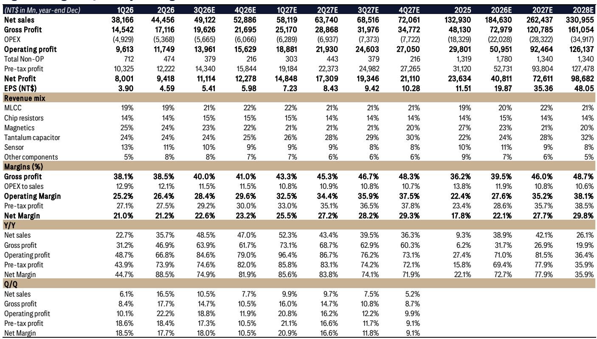
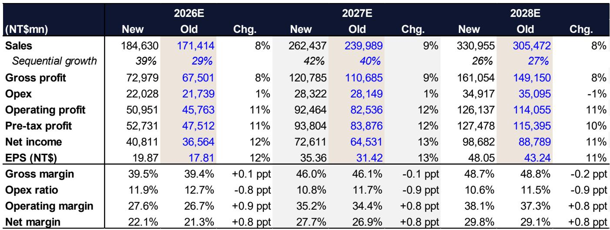
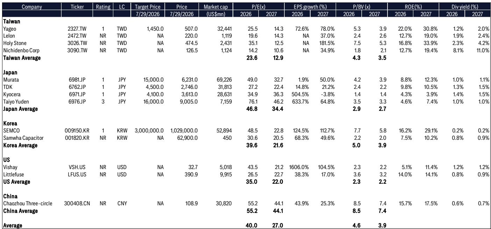

# 国巨业绩超预期背后的结构性变化：估值倍数压缩，但盈利能力加速提升

国巨公布2026年第二季度净利润为新台币94亿元，环比增长18%，同比增长88%，分别超出分析师预期和一致预期15%和3%。表面数字强劲，但更具深远意义的变化隐藏在数据之下：截至6月底，订单出货比从5月的1.3跃升至2.2，管理层预计第三季度大宗商品和特殊品产能利用率将达到90%或更高。这些并非渐进式改善，而是标志着被动元件市场已从需求复苏阶段跨入供给受限的上行周期，定价权正在回归制造商。

当前股价的张力源于两股相反力量的博弈。盈利方面，分析师将2026至2028年每股收益预测上调11%至13%，提高了MLCC、电阻和钽电容产品线的平均售价增长年复合增长率假设，并预计净利润将从2025年的236亿新台币增长至2028年的987亿新台币。估值方面，目标倍数有所下调——不是因为基本面恶化，而是因为行业整体去杠杆化导致市盈率倍数压缩。市场为每一美元盈利支付的价格在下降，即便这些盈利正以加速的节奏被向上修正。

这种分化——预期上修与倍数下修并存——定义了当前的观察窗口。股价为新台币507元，对应2026年市盈率25.5倍和2027年市盈率14.3倍。如果分析师对2027年每股收益35.36新台币的预测大致准确，那么市场正在定价一次与国巨基本面关系不大的剧烈估值下修。报告的核心观点是：盈利轨迹完好且持续改善；倍数压缩是行业层面的现象，由资产负债表动态驱动，而非对国巨竞争地位的判断。

## 订单出货比是本报告最重要的数据点，指向超出预期的需求环境

订单出货比达到2.2，意味着本季度每出货100新台币，国巨就收到220新台币的新订单。这不是一个正常读数。5月股东大会时该比率还仅为1.3，说明加速发生在短短一个季度之内。管理层对第三季度营收温和增长和利润率进一步改善的指引，相对于这一订单动能所暗示的前景而言是保守的。

该比率之所以重要，有两个原因。第一，它是一个领先指标，能在需求体现为营收之前捕捉到需求变化。第二，它解释了为何分析师将平均售价增长年复合增长率假设上调至MLCC 22%、电阻23%、钽电容27%，而此前分别为20%、16%和25%。当订单量超过出货量两倍以上时，定价权随之而来。报告指出，管理层不排除在原材料成本持续攀升的情况下进一步提价，这表明当前的价格环境并非一次性调整，而是被动元件全行业的持续重新定价。

第二季度毛利率38.5%实际上略低于一致预期，报告将其归因于大宗商品出货量增加稀释了产品组合。这一点值得仔细解读。毛利率未达预期是组合效应，而非定价失败。大宗商品元件的利润率低于特殊品，因此当出货量激增时，毛利率百分比可能下降，即便相对毛利润环比增长18%。更具说服力的数据点是，分析师预计毛利率到2027年将达到46.0%，到2028年达到48.7%，这意味着当前的产品组合稀释是暂时的，价格传导正以滞后的方式流入利润率。

## 产能利用率超过90%：经营杠杆从理论变为现实

管理层预计第三季度大宗商品产能利用率为90%，特殊品产能利用率为90%以上，高于第二季度的80%和85%。这是盈利预测修正变得可信的机制。在这些利用率水平下，增量营收以极高的边际比率转化为营业利润，因为固定成本已被覆盖。

分析师模型中的营业利润率轨迹清晰地说明了这一点。营业利润率2025年为22.4%，2026年预计为27.6%，2027年为35.2%，2028年为38.1%。每年增加约七到八个百分点，这不是线性改善，而是盈利能力的台阶式跃升。EBITDA利润率也呈现类似路径，从2025年的29.8%升至2028年的40.1%。这些不是渐进式增长，而是业务盈利能力的根本性转变。

报告还指出，分析师将2026至2028年的营业利润预测上调了11%至12%，而营收预测仅上调了8%至9%。营收修正与营业利润修正之间的差距就是经营杠杆。国巨的营收增速超过了其成本基础，产能利用率指引证实这不是预测假设，而是已陈述的经营现实。当管理层表示利用率将达到90%时，他们描述的是一座几乎满载的工厂，而一座几乎满载的工厂所产生的利润率在结构上高于运行在80%的工厂。

## AI收入占比达16%：国巨不再是周期性标的，而是算力建设的结构性受益者

AI收入占比从第一季度的约14%至15%上升至第二季度的16%。这仍是少数收入，但变化的方向和速度比相对水平更重要。报告强调，客户对AI、计算和存储终端市场多年期长期协议的兴趣正在上升，这是一个比任何单季度占比数字都更有分量的定性信号。

长期协议改变了业务的性质。一家在现货市场销售的公司是周期性的；一家签署了承诺数量和定价的多年期合同的公司，是带有增长属性的年金。报告的措辞很谨慎——管理层"注意到客户对LTA的兴趣上升"，而非已签署合同——但方向是明确的。正在建设AI基础设施的客户需要被动元件的供应确定性，他们愿意通过多年期协议来获得这种确定性。对国巨而言，这意味着超出典型订单周期的需求可见性，这支撑了分析师上调2027和2028年预测的信心，尽管这些年份还很遥远。

AI收入占比也解释了为何分析师将钽电容平均售价增长假设上调至27%。钽电容用于电源管理和高可靠性应用，这正是AI服务器和数据中心基础设施需求最旺盛的领域。向AI的占比转移不仅关乎数量，更关乎每个售出元件的价值，而钽电容处于被动元件谱系中高价值的一端。

## 行业去杠杆化如何重新定价整个被动元件板块

这是一次估值倍数重置，而非基本面下调，报告明确将其描述为"行业持续去杠杆驱动的倍数压缩"。

理解这里的机制很重要。随着被动元件公司产生创纪录的现金流，它们正在偿还债务并建立净现金头寸。这对公司来说无疑是好事，但对估值倍数产生了反直觉的影响。当公司的资产负债表变得堡垒般稳固时，股权具有了更多债券的特征，市场会对盈利流应用较低的倍数。2028年预测显示净负债权益比为负58.2%，意味着国巨的现金将显著超过债务。股权变得更安全，但倍数压缩了，因为增长溢价被降低了。

报告自身的估值表显示了这种重新定价的程度。2028年预测市盈率为10.6倍，净资产回报表现为30.7%。一家每股收益增长35.9%、净资产回报表现30.7%的公司以10.6倍市盈率交易，按任何历史标准衡量，都是深度折价的成长股。2028年3.6%的股息回报表现又增加了一层支撑。市场正在将国巨定价为一家成熟的低增长公司，而恰在此时其盈利正以接近80%的年增速复利增长。

这是本报告的核心观察张力所在。盈利修正的幅度足以抵消行业倍数压缩的影响，但上修幅度之大表明盈利修正正在压倒倍数逆风。当盈利预期上升速度快于倍数重置时，结果就是股价的重估——不是因为倍数扩张，而是因为盈利增长本身。

## 读者的决策框架：区分盈利轨迹与倍数叙事，为市场尚未定价的收敛做准备

读者面临的实际问题不是国巨是否是一家好公司——报告提出了令人信服的论据——而是如何思考盈利能力与估值倍数之间的差距。以下框架将报告的分析转化为决策结构。

第一，确立盈利下限。分析师2026年每股收益19.87新台币的预测基于2.2的订单出货比、90%以上的产能利用率和16%的AI收入占比。这些都是已报告或已指引的数据点，而非推测性预测。即使周期比预期更早见顶，第二季度业绩和第三季度指引也为2026年盈利提供了高置信度的下限。当前价格对应的2026年市盈率25.5倍，对于一家每股收益增长72.7%的公司来说并不算高。

第二，评估盈利修正的潜力。分析师已上调预测11%至13%，但2.2的订单出货比表明需求跑在了即使修正后的预测之前。如果管理层对第三季度温和增长的指引被证明是保守的——订单动能暗示可能如此——那么进一步向上修正的可能性很大。报告指出管理层不排除进一步提价，这是一个尚未完全反映在平均售价假设中的潜在上行催化剂。

第三，评估倍数压缩风险。从40倍降至35倍的平均2027-28年预期每股收益倍数，意味着目标倍数下调12.5%。如果去杠杆主题持续且市场应用更低的倍数，倍数压缩可能继续。但报告中的估值表显示，倍数压缩已反映在2027年14.3倍和2028年10.6倍的市盈率中。在某个时点，倍数会趋于稳定，因为盈利增长压过了估值下修。

第四，监测领先指标。订单出货比、产能利用率和LTA讨论是决定盈利轨迹能否持续的三个指标。订单出货比连续多个季度保持在1.5以上，确认结构性上行周期。产能利用率达到90%或更高，确认经营杠杆故事。签署的LTA将把需求可见性从定性转变为合同性。

第五，为收敛布局。当前新台币507元的价格意味着市场要么对盈利预测持怀疑态度，要么应用了一个假设周期急剧下行的倍数。报告给出的目标价对应2027-28年平均预期每股收益约41.40新台币的35倍，对于一家年增长35%至78%的公司来说，这并不是一个激进的倍数。当市场接受盈利是真实且可持续的，收敛就会发生，届时倍数将向增长率重新定价。

该框架的风险在于需求冲击打破订单动能。报告未识别出具体风险，但被动元件行业的历史模式是周期性的，当前上行周期由AI基础设施支出驱动。如果AI资本支出减速，订单出货比将正常化，产能利用率将下降，盈利预测将需要向下修正。当前价格的安
