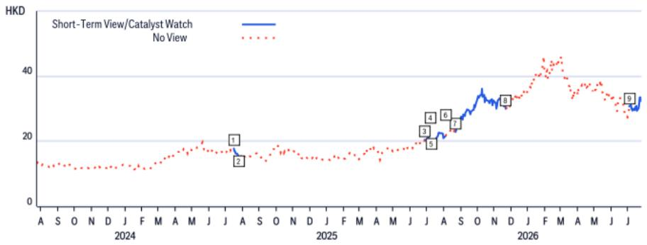

# 紫金矿业（2899.HK）

## 终止收购Allied Gold；拟通过定向增发认购9.2%股权

### 研究观点

7月29日，紫金矿业宣布终止收购Allied Gold 100%股权的计划（详见此前报告），原因是在最终期限或此后合理时间内，交易完成的所有条件获得满足或豁免的可能性不大，且双方均无需支付终止费用。与此同时，紫金金国际与Allied Gold达成协议，以每股CAD32.55的价格认购1,280万股（此前100%收购方案中的价格为每股CAD44），总对价约CAD4.166亿（约合US$2.95亿）。定向增发完成后，紫金金国际将持有Allied Gold 9.2%的股权。我们认为，此次股权投资为双方未来潜在合作奠定了基础，若马里地区的地缘政治风险有所缓解，紫金矿业仍有可能重新启动收购计划。维持首选股评级。

<table><tr><td colspan="2">买入</td></tr><tr><td colspan="2">催化剂观察：上行，有效期至2026年8月5日</td></tr><tr><td>价格（2026年7月29日16:10）</td><td>HK$32.70</td></tr><tr><td>目标价</td><td>HK$51.80</td></tr><tr><td>预期股价回报</td><td>58.4%</td></tr><tr><td>预期股息率</td><td>2.0%</td></tr><tr><td>预期总回报</td><td>60.5%</td></tr><tr><td>市值</td><td>HK$869,516M / US$110,896M</td></tr></table>

Jack Shang, CFA $^{AC}$ +852-2501-2441
jack.shang@citi.com

Anna Wang
+852-2501-2739
anna.d.wang@citi.com

Jimmy Feng
jimmy.feng@citi.com

Cynthia Wu
cynthia.d.wu@citi.com

## 紫金矿业（2899.HK）催化剂观察

方向：上行

期限：30天内（2026年8月5日到期）

添加日期：2026年7月5日

催化剂：业绩

我们预计，作为行业内的优质领先企业，当市场重新审视紫金在价值板块中的定位时，紫金将成为读者关注的重点，尤其是在其股价较前期高点经历明显调整之后。我们预计紫金2026年上半年业绩将实现强劲增长，同比增幅有望超过70%。公司预计将于7月公布初步业绩。其年产12万吨碳酸锂（LCE）的计划也有望为下半年业绩提供支撑。考虑到当前估值水平以及读者与管理层沟通中反馈的相关建议，我们认为未来公司可能推出更多股东回报举措（如回购等）。

## 紫金矿业

## 估值

我们给予紫金H股HK$51.80/股的目标价。在DCF模型中，我们假设终端增长率为2.5%，WACC为8.2%（无风险利率3.5%，Beta系数1.05，市场风险溢价7%），得出估值为HK$48.2/股。同时，我们估计Kamoa的NPV为HK$3.6/股。综合计算，紫金H股的NPV为HK$51.80/股。

## 风险

可能阻碍股价达到目标价的主要下行风险包括：1）黄金和铜价低于预期；2）在建项目资本开支超支；3）成本上升侵蚀盈利能力；4）黄金和铜产量低于预期。

如果您有视力障碍，希望就本文件中的图表细节与Citi代表沟通，请致电美国1-888-500-5008（TTY：711），美国以外地区请拨打+1-210-677-3788。

## 附录A-1

## 分析师认证

主要负责本研究报告编制和内容的研究分析师在作者栏中以“AC”标注，或以粗体列于相关内容旁边。若作者栏中指定了多位AC分析师，则每位分析师仅就其负责的研究报告部分进行认证，但不包括（a）其他AC认证分析师以粗体标注的内容，以及（b）仅针对特定发行人的观点，该观点归属于价格图表或评级历史表中标识的其他AC认证分析师。每位分析师就其负责的报告部分认证：（1）其中表达的观点准确反映了其个人对相关发行人和证券的看法，并以独立方式编制，包括对Citi Global Markets Inc.及其关联方的独立性；（2）研究分析师的薪酬中没有任何部分直接或间接与本研究报告中该分析师表达的具体建议或观点相关。

## 重要披露

<table><tr><td></td><td>日期</td><td>评级</td><td>目标价</td><td>收盘价</td></tr><tr><td>1</td><td>2023年12月12日 10:00:35</td><td>1</td><td>*16.50</td><td>11.62</td></tr><tr><td>2</td><td>2024年3月24日 23:36:24</td><td>1</td><td>*20.50</td><td>15.22</td></tr><tr><td>3</td><td>2024年4月23日 12:29:12</td><td>1</td><td>*21.90</td><td>16.34</td></tr></table>

\*表示变动

<table><tr><td></td><td>日期</td><td>评级</td><td>目标价</td><td>收盘价</td></tr><tr><td>4</td><td>2025年3月23日 16:45:22</td><td>1</td><td>*24.40</td><td>17.28</td></tr><tr><td>5</td><td>2025年8月24日 16:31:50</td><td>1</td><td>*26.30</td><td>22.88</td></tr><tr><td>6</td><td>2025年10月19日 18:34:18</td><td>1</td><td>*39.00</td><td>32.60</td></tr></table>

以上评级/目标价变动反映美国东部时间

<table><tr><td></td><td>日期</td><td>操作</td><td>预期方向</td><td>期限</td><td>收盘价</td></tr><tr><td>1</td><td>2024年7月16日 14:50:56</td><td>添加CW</td><td>上行</td><td>30天</td><td>17.78</td></tr><tr><td>2</td><td>2024年7月26日 04:23:00</td><td>移除CW</td><td>上行</td><td>30天</td><td>15.24</td></tr><tr><td>3</td><td>2025年6月29日 20:00:42</td><td>添加STV</td><td>下行</td><td>30天</td><td>20.50</td></tr></table>

CW - 催化剂观察，STV - 短期观点

<table><tr><td></td><td>日期</td><td>操作</td><td>预期方向</td><td>期限</td><td>收盘价</td></tr><tr><td>4</td><td>2025年7月8日 23:26:52</td><td>移除STV</td><td>下行</td><td>30天</td><td>20.70</td></tr><tr><td>5</td><td>2025年7月8日 23:26:52</td><td>添加CW</td><td>下行</td><td>30天</td><td>20.70</td></tr><tr><td>6</td><td>2025年8月4日 06:53:54</td><td>移除CW</td><td>下行</td><td>30天</td><td>21.66</td></tr></table>

<table><tr><td></td><td>日期</td><td>操作</td><td>预期方向</td><td>期限</td><td>收盘价</td></tr><tr><td>7</td><td>2025年8月24日 12:31:50</td><td>添加CW</td><td>上行</td><td>90天</td><td>22.88</td></tr><tr><td>8</td><td>2025年11月21日 12:14:48</td><td>移除CW</td><td>上行</td><td>90天</td><td>30.00</td></tr><tr><td>9</td><td>2026年7月5日 07:21:02</td><td>添加CW</td><td>上行</td><td>30天</td><td>30.72</td></tr></table>

以上评级/目标价变动反映美国东部时间

本公司自2025年1月1日起至少一次在紫金矿业集团股份有限公司的公开交易股票中担任做市商。

Citi Global Markets Inc.或其关联方在过去12个月内因向紫金矿业提供投资银行服务以外的产品和服务而获得报酬。

Citi Global Markets Inc.或其关联方目前拥有或在过去12个月内拥有以下客户，且提供的服务为非投资银行、非证券相关服务：紫金矿业。

分析师薪酬由Citi管理层和Citi高级管理层确定，基于旨在惠及Citi Global Markets Inc.及其关联方（“本公司”）读者客户的活动和服务。薪酬不与具体交易或建议挂钩。与所有本公司员工一样，分析师的薪酬受到公司整体盈利能力的影响，其中包括投资银行、销售和交易以及自营交易收入。股票研究分析师薪酬的一个因素是安排机构客户与所覆盖公司管理层之间的企业访问活动。通常情况下，当分析师对公司持积极看法时，公司管理层更有可能参与此类活动。

对于本产品中推荐的本公司未担任做市商的金融工具，本公司是该等金融工具（及其任何基础工具）的流动性提供者，并可能在与该等工具的交易中担任主事人。本公司是定期发行与产品中可能推荐的证券挂钩的可交易金融工具的发行人。本公司定期交易本产品中讨论的发行人证券。本公司可能以与本产品不一致的方式进行证券交易，并且就本产品所涵盖的证券，将以主事人身份向客户买入或卖出。

本公司是紫金矿业公开交易股票的市场做市商。

除非另有说明，研究分析师或其团队成员在过去12个月内均未实地考察过本产品中提供投资观点的公司的重大运营情况。

有关本Citi产品（“本产品”）所涉公司的重要披露（包括历史披露副本），请联系Citi，地址：388 Greenwich Street, 6th Floor, New York, NY, 10013，收件人：Legal/Compliance [E6WYB6412478]。此外，除估值和风险评估及历史披露外，相同的重要披露载于本公司披露网站：https://www.citivelocity.com/cvr/eppublic/citi\_research\_disclosures。估值和风险评估可在有关标的公司的最新研究笔记/报告正文中找到。根据《市场滥用条例》，Citi在过去12个月内发布的所有建议的历史记录可通过Citi Velocity（https://www.citivelocity.com/cv2）或您的标准分发门户访问。历史披露（最长过去三年）可根据要求提供。

Citi股票评级分布

<table><tr><td></td><td colspan="3">12个月评级</td><td colspan="3">催化剂观察</td></tr><tr><td>数据截至2026年7月1日</td><td>买入</td><td>持有</td><td>卖出</td><td>买入</td><td>持有</td><td>卖出</td></tr><tr><td>Citi全球基本面覆盖（中性=持有）</td><td>61%</td><td>32%</td><td>7%</td><td>36%</td><td>48%</td><td>16%</td></tr><tr><td>各评级类别中投资银行客户占比</td><td>38%</td><td>42%</td><td>27%</td><td>42%</td><td>37%</td><td>36%</td></tr></table>

Citi基本面研究投资评级指南：

Citi股票建议包括投资评级和可选的风险评级以标示高风险股票。风险评级同时考虑价格波动性和基本面标准。股票将没有风险评级或被赋予高风险评级。

投资评级：Citi投资评级为买入、中性及卖出。我们的评级是分析师对预期总回报（“ETR”）和风险的预期函数。ETR是未来12个月内预测股价升值（或贬值）加股息回报表现的总和。目标价基于12个月的时间跨度。投资评级定义：买入（1）ETR为15%或以上，或高风险股票为25%或以上；卖出（3）为负ETR。任何未被评为买入或卖出的被覆盖股票均为中性（2）。对于评级为中性的股票（2），如果分析师认为缺乏足够的估值驱动因素和/或投资催化剂来形成正面或负面的投资观点，经Citi管理层批准，可以选择不设定目标价，从而不推导ETR。Citi可能因监管和/或内部政策原因暂停其评级和目标价，并指定“评级暂停”状态。Citi也可能因其他特殊情况（例如缺乏对分析师论点至关重要的信息、交易暂停）影响公司和/或公司证券交易而暂停其评级和目标价，并指定“审查中”状态。在这两种情况下，评级和目标价将在评级历史价格图表中分别显示为“—”和“-”。在2022年4月11日之前，Citi将两种情况均指定为“审查中”状态，在2020年11月11日之前仅在特殊情况下指定。在实际可行的情况下，分析师将发布重新建立评级和投资论点的说明。投资评级在首次覆盖、投资和/或风险评级变更或目标价变更时由上述范围确定（受有限的管理裁量权约束）。有时，由于市场价格变动和/或其他短期波动或交易模式，预期总回报可能超出这些范围。此类临时偏差将被允许，但将接受研究管理部门的审查。您买卖证券的决定应基于您个人的投资目标，并且只有在评估股票的预期表现和风险后才能做出。

催化剂观察/短期观点（“STV”）评级披露：

催化剂观察和STV上行/下行判断：Citi还可能包括催化剂观察或STV上行或下行判断，以表明分析师预期股价在指定30天或90天期间内因一个或多个影响公司或市场的具体近期催化剂或事件而相对上涨（下跌）。当分析师对股价将受到影响有较高信心时，将发布催化剂观察；当信心水平中等时，将发布STV。催化剂观察或STV上行/下行判断将在指定30/90天期限结束时自动到期。如果股价表现（按市场收盘计算）超过判断方向的15%，催化剂观察也将自动移除（除非分析师另行否决）。分析师也可能在指定期限结束前在研究笔记中移除催化剂观察或STV判断。催化剂观察/STV上行或下行判断可能与股票的基本面股票评级不同，且不影响该评级，基本面评级反映的是较长期的总相对回报预期。就FINRA评级分布披露规则而言，催化剂观察/STV上行判断对应买入建议，催化剂观察/STV下行判断对应卖出建议。任何未被指定为催化剂观察上行、催化剂观察下行、STV上行或STV下行判断的股票均被视为催化剂观察/STV无观点。就FINRA评级分布披露规则而言，我们在催化剂观察/STV上行/下行评级系统的评级分布表中将催化剂观察/STV无观点对应为持有。然而，我们重申我们不认为无观点是建议。对于所有催化剂观察/STV上行/下行判断，存在催化剂和相关股价变动不会如预期实现的风险。

## 研究分析师关联/非美国研究分析师披露

本报告作者的雇佣法律实体列于下方（其监管机构亦在本文中列出）。编制本报告的非美国研究分析师（即下方列出的所有非Citi Global Markets Inc.雇佣的研究分析师）未在FINRA注册/取得研究分析师资格。该等研究分析师可能不是成员组织的关联人员（但受雇于成员组织的关联方），因此可能不受FINRA规则2241关于与标的公司沟通、公开露面以及交易研究分析师账户持有证券的限制。

<table><tr><td>Citi Global Markets Asia Limited</td><td>Anna Wang; Jimmy Feng, CFA; Jack Shang, CFA; Cynthia Wu</td></tr><tr><td colspan="2">其他披露</td></tr><tr><td colspan="2">建议中提及的工具的任何价格均为该工具主要市场前一交易日的收盘价，除非另有说明。</td></tr><tr><td colspan="2">本研究报告中任何建议的完成和首次传播时间为产品顶部显示的美国东部日期时间。如果产品引用了其他分析师的看法，请参阅价格图表或评级历史表以了解该看法的完成和首次传播日期/时间。</td></tr><tr><td colspan="2">各司法管辖区的法规要求，如果建议与作者在过去12个月内发布的关于同一金融工具或发行人的任何先前建议不同，须指明变更及先前建议的日期。对于基本面覆盖，请参阅本披露附录中的价格图表或评级变更历史，或发行人披露摘要：https://www.citivelocity.com/cvr/eppublic/citi_research_disclosures。</td></tr><tr><td colspan="2">Citi已实施识别、考虑和管理因发布或分发投资研究而产生的潜在利益冲突的政策。这些政策的说明可在https://www.citivelocity.com/cvr/eppublic/citi_research_disclosures找到。</td></tr><tr><td colspan="2">过去12个月每个季度末Citi所有研究建议中相当于“买入”、“持有”、“卖出”的比例（括号内为其中在过去12个月内接受过Citi投资公司服务的百分比）如下：2026年第一季度买入33%（63%），持有44%（52%），卖出23%（46%），相对价值0.5%（89%）；2025年第四季度买入33%（63%），持有44%（50%），卖出23%（46%），相对价值0.4%（91%）；2025年第三季度买入33%（61%），持有44%（52%），卖出23%（50%），相对价值0.4%（80%）；2025年第二季度买入33%（63%），持有44%（51%），卖出23%（49%），相对价值0.4%（86%）。为披露除股票以外的建议（其定义可在相应披露部分找到），“买入”指正向方向性交易观点；“卖出”指负向方向性交易观点；“相对价值”指任何没有明确投资策略方向的交易观点。</td></tr><tr><td colspan="2">欧洲法规要求在引用证券过往表现时提供5年价格历史。CitiVelocity的图表工具（https://www.citivelocity.com/cv2/#go/CHARTING_3_Equities）提供创建可定制价格图表的功能，包括五年选项。该工具可在CitiVelocity（https://www.citivelocity.com/）中任何资产类别菜单下的数据与分析部分找到。如需更多信息，请联系CitiVelocity支持（https://www.citivelocity.com/cv2/go/CLIENT_SUPPORT）。除非另有说明，所有引用价格的来源为DataCentral，该数据库从LSEG Data & Analytics获取价格信息。过往表现不保证或可靠地预示未来结果。预测不保证或可靠地预示未来表现。</td></tr><tr><td colspan="2">读者在投资前应始终仔细考虑ETF的投资目标、风险、费用和开支。适用的招股说明书和关键读者信息文件（如适用）应包含该ETF的此等信息和其他信息。在投资前仔细阅读任何此类招股说明书非常重要。客户可从适用的分销商或授权参与者、ETF上市的交易所和/或适用的ETF发行人网站获取ETF的招股说明书和关键读者信息文件。研究价值及任何应计收入可能下跌或上涨。任何过往表现、预测或预估均不预示未来或可能的表现。本文包含的有关ETF的任何信息严格仅供说明之用，不应被视为出售要约或购买任何ETF单位的要约邀请，无论是明示还是暗示。所表达的观点为作者的观点，不一定反映ETF发行人、其任何代理人或其关联方的观点。</td></tr><tr><td colspan="2">Citi Global Markets India Private Limited和/或其关联方可能不时实际或实益拥有标的发行人1%或以上的债务证券。</td></tr></table>

请注意，根据经修订的第13959号行政命令（“该命令”），美国人被禁止投资于美国政府确定为该命令标的的任何公司的证券。本研究不旨在以任何可能导致违反该命令的方式使用或依赖。鼓励读者依靠自己的法律顾问就遵守该命令以及美国财政部外国资产控制办公室管理和执行的其他经济制裁计划提供建议。

本通讯面向以色列《研究交流、投资营销和投资组合管理法》（1995年）（“咨询法”）中定义的“合格客户”。在以色列境内，本通讯不面向零售客户，Citi不会向零售客户或非合格客户提供此类产品或交易。演讲者未获得以色列证券管理局（“ISA”）的投资顾问或投资营销许可，本通讯不构成投资或营销建议。本文包含的信息可能涉及不受ISA监管的事项。本通讯涉及的任何证券不得向任何以色列人士发行或出售，除非根据《以色列证券法》（1968年）规定的证券发行豁免及其规定的公开发行规则。

Citi广泛并同时通过本公司专有电子分发平台（如Citi Velocity和各种全球财富平台）向其机构和零售客户分发其研究内容。为方便起见，部分（但非全部）研究内容可能通过第三方聚合器分发。客户可能通过电子邮件收到已发布的研究报告，该等分发基于酌情决定，且仅在研究内容已广泛分发之后。某些研究仅向机构读者提供以满足监管要求。Citi分析师向客户提供的服务水平和类型可能因各种因素而异，例如客户对接收分析师通讯频率和方式的个人偏好、客户的风险状况和投资重点及视角（如全市场、特定行业、长期、短期等）、与公司的整体客户关系的规模和范围以及法律和监管限制。

根据Comissão de Valores Mobiliários Resolução 20和ASIC Regulatory Guide 264，Citi须披露Citi关联公司或业务是否与标的公司存在商业关系。考虑到Citi在全球100多个国家经营多项业务，Citi很可能与标的公司存在商业关系。

本公司推荐、要约或出售的证券：（i）不受联邦存款保险公司保险；（ii）不是任何受保险存款机构（包括Citibank）的存款或其他义务；及（iii）受投资风险影响，包括可能损失本金金额。本产品仅供参考，不构成购买或出售证券的要约或邀请。购买本产品中提及证券的任何决定必须考虑该证券的现有公开信息或任何注册招股说明书。尽管信息来自并基于本公司认为可靠的来源，但我们不保证其准确性，且信息可能不完整和经过压缩。但请注意，本公司已采取一切合理步骤确定本产品重要披露部分中披露的准确性和完整性。本公司研究部门已获得本产品中提及的标的公司的协助，包括但不限于与标的公司管理层的讨论。公司政策禁止研究分析师将研究草稿发送给标的公司。然而，应假定本产品作者在发布前已与标的公司进行讨论以确保事实准确性。有关ESG（环境、社会、治理）因素的陈述和观点通常基于受影响公司的公开声明或其他公开新闻，作者可能未独立核实。ESG因素是读者在做出投资决策时可能考虑的一个因素。所有观点、预测和估计构成作者截至产品日期的判断，这些以及产品中包含的任何其他信息如有变更，恕不另行通知。金融工具的价格和可用性也可能随时变更。尽管本公司其他部门向本产品中讨论的公司提供建议，但在此类角色中获得的信息不用于编制本产品。尽管Citi未设定预定的发布频率，但如果本产品是基本面股票或信用研究报告，Citi有意提供对覆盖发行人的研究覆盖，包括响应影响发行人的新闻。对于非基本面研究报告，Citi可能不会定期更新报告中包含的观点、建议和事实。尽管Citi维持对发行人的覆盖、提出建议或讨论发行人，Citi可能因法律或政策原因定期被限制引用某些发行人。如果已发布的交易观点的组成部分受到限制，该交易观点将从产品中包含的开放交易观点列表中移除。限制解除后，如果分析师继续支持该交易观点，将重新列入开放交易观点列表，否则将正式关闭。Citi可能向不同类别的客户提供不同的研究产品和服务（例如，基于长期或短期投资期限），这可能导致不同的结论或建议，可能影响证券价格，与替代研究产品中的建议相反，前提是每种产品均符合各自产品的评级体系。

投资非美国证券（包括ADR）可能涉及某些风险。非美国发行人的证券可能未在美国证券交易委员会注册，也不受其报告要求的约束。关于外国证券的可用信息可能有限。外国公司通常不受与美国统一的审计和报告标准、实践和要求的约束。某些外国公司的证券可能流动性较低，其价格可能比可比美国公司的证券更具波动性。此外，汇率变动可能对外国股票研究价值及其对美国读者的相应股息支付产生不利影响。ADR读者的净股息按预扣税率惯例估算，视为准确，但鼓励读者咨询其税务顾问以获取精确的股息计算。从本公司收到产品的读者在某些州或其他司法管辖区可能被禁止从本公司购买产品中提及的证券。请咨询您的财务顾问以获取更多详情。Citi Global Markets Inc.对美国的产品负责。美国读者因产品中包含的信息而产生的任何订单只能通过Citi Global Markets Inc.下达。

负责产品生产的Citi法律实体为第一署名作者所雇佣的法律实体。

本产品在澳大利亚通过Citi Global Markets Australia Pty Limited（ABN 64 003 114 832，AFSL No. 240992）提供，该公司为ASX集团参与者，受澳大利亚证券和投资委员会监管。地址：Citi Centre, 2 Park Street, Sydney, NSW 2000。Citi Global Markets Australia Pty Limited不是《1959年银行法》下的授权存款机构，也不受澳大利亚审慎监管局监管。

本产品在巴西由Citi Global Markets Brasil - CCTVM SA提供，该公司受CVM - Comissão de Valores Mobiliários（“CVM”）、BACEN -巴西中央银行、APIMEC - Associação dos Analistas e Profissionais de Investimento do Mercado de Capitais和ANBIMA – Associação Brasileira das Entidades dos Mercados Financeiro e de Capitais监管。地址：Av. Paulista, 1111 - 14º andar(parte) - CEP: 01311920 - São Paulo - SP。

本产品在智利通过Banchile Corredores de Bolsa S.A.提供，该公司为Citi公司的间接子公司，受Comisión Para El Mercado Financiero监管。地址：Enrique Foster Sur, 20, piso 6, Las Condes, Santiago, Chile。

哥伦比亚共和国读者披露：本通讯或信息不构成2010年第2555号法令第2.40.1.1.2条或修改、替代或补充该条款的法规意义上的专业研究交流。编制和分发本条所述的研究报告和一般通讯不需要成为哥伦比亚金融监管局监管的实体。

本产品在德国由Citi Global Markets Europe AG（“CGME”）提供，该公司受欧洲中央银行和德国联邦金融服务监管局（Bundesanstalt für Finanzdienstleistungsaufsicht BaFin）监管。地址：Börsenplatz 9, 60313 Frankfurt am Main, Germany。

除非另有说明，如果编制本报告的分析师位于香港且报告涉及“证券”（定义见香港法例第571章《证券及期货条例》），则该报告由Citi Global Markets Asia Limited在香港发布。Citi Global Markets Asia Limited受香港证券及期货事务监察委员会监管。如果报告由非香港分析师编制，请注意该分析师（及其雇佣或认证的法律实体）未在香港获得许可/注册，且不声称具有该等资格。有关分析师雇佣实体的详细信息，请参阅“研究分析师关联/非美国研究分析师披露”部分。

本产品在印度由Citi Global Markets India Private Limited（CGM）提供，该公司作为研究分析师受印度证券交易委员会（SEBI）监管（SEBI注册号INH000000438）。CGM还积极参与印度的商人银行业务（SEBI注册号INM000010718）和股票经纪业务（SEBI注册号INZ000263033），并已就此在SEBI注册。SEBI授予的注册、在孟买证券交易所（BSE）的上市以及国家证券市场研究所（NISM）的认证不以任何方式保证中介机构的业绩或向读者提供回报保证。CGM注册办公地址：1202, 12th Floor, First International Financial Centre (FIFC), G Block, Bandra Kurla Complex, Bandra East, Mumbai – 400098，注册电话：+91 22 61759999。Citi维持健全的政策、程序、控制和培训，以确保持续遵守所有适用规则和法规。本文包含的所有建议均由合格的研究分析师做出。CGM的公司识别号为U99999MH2000PTC126657，其合规官[Vishal Bohra]联系方式：电话：+91-022-61759994，传真：+91-022-61759851，电子邮件：cgmcompliance@citi.com。有关研究分析师的读者章程、合规审计报告和投诉信息可在https://www.citivelocity.com/cvr/eppublic/citi\_research\_disclosures找到。申诉官[Niraj Mody]联系方式：电话：+91-22-42775002，电子邮件：EMEA.CR.Complaints@citi.com。证券市场投资受市场风险影响。投资前请仔细阅读所有相关文件。SEBI规定的客户条款和条件可在https://www.citivelocity.com/rendition/authfilelinksvcs/eppublic/V1/file?paramData=ZmlsZU5hbWU9L1MzL0dETVMvcHViRGlzY2xvc3VyZUhObWxzL2dkbV9kaXNfc2ViaV9UZXJtc29mVXNlLmhObWw找到。

本产品在印度尼西亚通过PT Citi Sekuritas Indonesia提供。地址：Citibank Tower 10/F, Pacific Century Place, SCBD lot 10, Jl. Jend Sudirman Kav 52-53, Jakarta 12190, Indonesia。本产品及其任何副本不得在印度尼西亚分发，或向任何无论居住何处的印度尼西亚公民或印度尼西亚居民分发，除非符合适用的资本市场法律法规。本产品不构成在印度尼西亚的证券要约。本产品中提及的证券未根据相关资本市场法律法规在资本市场和金融服务管理局（OJK）注册，不得在印度尼西亚共和国境内或向印度尼西亚公民通过公开发售或在构成印度尼西亚资本市场法律法规意义上的要约的情况下要约或出售。

本产品在日本由Citi Global Markets Japan Inc.（“CGMJ”）提供，该公司受金融服务局、证券交易监督委员会、日本证券业协会、东京证券交易所和大阪证券交易所监管。地址：Otemachi Park Building, 1-1-1 Otemachi, Chiyoda-ku, Tokyo 100-8132 Japan。如果在CGMJ研究报告中发现错误，修订版将发布在本公司的Citi Velocity网站上。如果您对Citi Velocity有疑问，请致电(81 3) 6270-3019寻求帮助。

本产品在沙特阿拉伯王国根据沙特法律通过Citi Saudi Arabia提供，该公司受资本市场管理局（CMA）根据CMA许可证（17184-31）监管。地址：2239 Al Urubah Rd – Al Olaya Dist. Unit No. 18, Riyadh 12214 – 9597, Kingdom Of Saudi Arabia。

本产品在韩国由Citi Global Markets Korea Securities Ltd.（CGMK）提供，该公司受金融服务委员会、金融监督院和韩国金融投资协会（KOFIA）监管。CGMK地址：Citibank Center, 50 Saemunan-ro, Jongno-gu, Seoul 03184, Korea。KOFIA在其网站上提供研究分析师的注册信息。如果您希望查找CGMK研究分析师的KOFIA注册信息，请访问以下网站：http://dis.kofia.or.kr/websquare/index.jsp?w2xPath=/wq/fundMgr/DISFundMgrAnalystList.xml&divisionId=MDISO3002002000000&serviceId=SDISO3002002000。本产品在韩国由Citibank Korea Inc.提供，该公司受金融服务委员会和金融监督院监管。地址：Citibank Center, 50 Saemunan-ro, Jongno-gu, Seoul 03184, Korea。本研究报告仅面向韩国《金融投资服务和资本市场法》及其施行令中定义的专业读者。

本产品在马来西亚由Citi Global Markets Malaysia Sdn Bhd（注册号199801004692（460819-D））（“CGMM”）向其客户提供，CGMM对其内容负责，仅限于CGMM的客户。CGMM受马来西亚证券委员会监管。如有与本产品相关的任何事宜，请联系CGMM，地址：Level 43 Menara Citibank, 165 Jalan Ampang, 50450 Kuala Lumpur, Malaysia。

本产品在新加坡通过Citi Global Markets Singapore Pte. Ltd.（“CGMSPL”）提供，该公司持有资本市场服务牌照和豁免财务顾问牌照，受新加坡金融管理局监管。如有与本文件分析相关的任何事宜，请联系CGMSPL，地址：8 Marina View, 21st Floor Asia Square Tower 1, Singapore 018960。本产品面向《证券及期货法》（2001年）中定义的认可、专家和机构读者。对于Citi私人银行，本产品在新加坡由Citibank, N.A., Singapore Branch通过Citi私人银行提供。Citibank N.A., Singapore Branch是新加坡的持牌银行，受新加坡金融管理局监管。如果您对本文件有任何疑问或相关事宜，请联系您的Citibank N.A., Singapore Branch私人银行家。本产品面向《证券及期货法》中定义的认可、专家和机构读者。对于Citibank Singapore Limited（“CSL”），本产品在新加坡由CSL向选定的Citigold/Citigold Private Clients分发。CSL不提供对产品内容或编制的独立研究或分析。如果您对本文件有任何疑问或相关事宜，请联系您的CSL Citigold/Citigold Private Client关系经理。本产品面向《证券及期货法》（第289章）中定义的认可读者。

本产品在中华民国（台湾）通过Citi Global Markets Taiwan Securities Company Ltd.（“CGMTS”）提供，地址：14F, 15F and 16F, No. 1, Songzhi Road, Taipei 110, Taiwan，受中华民国（台湾）金融监督管理委员会证券期货局监管，并受中华民国（台湾）适用法律法规的许可范围和约束。未经CGMTS书面授权，新闻界或任何第三方不得在中华民国（台湾）复制或引用本产品的任何部分。根据适用法律法规，本产品接收者不得利用本产品参与可能产生利益冲突的任何事宜。如果本产品涵盖不允许在中华民国（台湾）要约或交易的证券，则本产品及其包含的任何信息均不得被视为在中华民国（台湾）宣传该证券或提出该证券的建议。本产品仅供参考，不构成购买或出售证券或金融产品的要约或邀请。购买本产品中提及的证券或金融产品的任何决定必须考虑该证券或金融产品的现有公开信息或任何注册招股说明书。

本产品在泰国通过Citicorp Securities (Thailand) Ltd.提供，该公司受泰国证券交易委员会监管。地址：399 Interchange 21 Building, 18th Floor, Sukhumvit Road, Klongtoey Nua, Wattana, Bangkok 10110, Thailand。

土耳其共和国读者披露：本产品在土耳其通过Citibank AS提供，该公司受资本市场委员会监管。地址：Tekfen Tower, Eski Buyukdere Caddesi # 209 Kat 2B, 23294 Levent, Istanbul, Turkey。根据土耳其资本市场法（第6362号法律），本文中的投资信息、评论和建议不属于投资咨询活动范围。本文中的评论和建议基于提供这些评论和建议的个人的个人意见。这些意见可能不适合您的财务状况、风险和回报偏好。因此，仅依赖本文信息做出投资决定可能不会产生符合您期望的结果。此外，Citi是Citi Global Markets Inc.（“本公司”）的一个部门，本公司确实并寻求与本研究报告中涵盖的公司开展业务和/或交易其证券。因此，读者应注意本公司可能存在可能影响本报告客观性的利益冲突，但读者也应注意到本公司已建立组织和管理安排以管理此类潜在利益冲突。

在阿联酋，这些材料（“材料”）由Citi Global Markets Limited, DIFC branch（“CGML”）传达，该公司在迪拜国际金融中心（“DIFC”）注册，并获得迪拜金融服务管理局（“DFSA”，许可证#CL0221）的许可和监管，仅面向DFSA法规中定义的专业客户和市场对手方，不应
