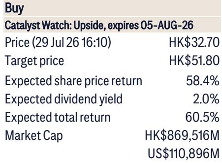
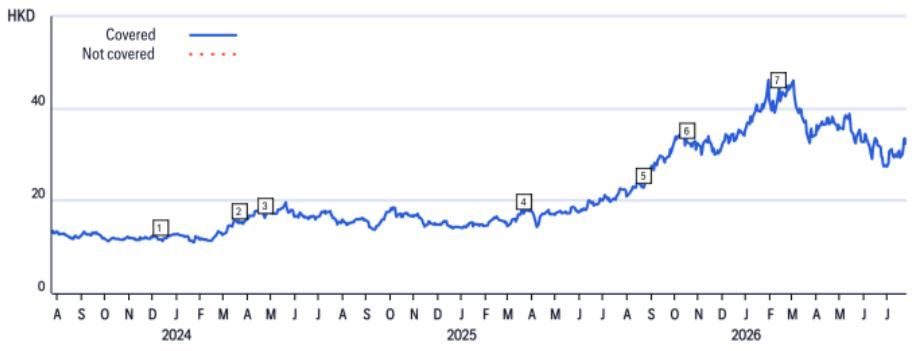

# Citi：紫金矿业调整收购方案，转为认购9.2%股权

7月29日，紫金矿业宣布终止对Allied Gold 100%股权的收购计划，原因是收购完成所需条件在约定日期前无法满足或豁免，双方均无需支付终止费。同日，紫金矿业旗下紫金黄金国际与Allied Gold签订协议，以每股32.55加元认购1280万股，总对价约4.17亿加元（约2.95亿美元），交易完成后将持有Allied Gold 9.2%股权。这一动作与此前每股44加元的全资收购方案形成明显差异。

Citi在最新报告中维持紫金矿业为首选股，认为股权研究可能为未来合作留下空间，若马里地缘政治不确定性下降，紫金矿业仍可能重启收购。报告同时指出，紫金矿业报价自前期高点已回调超过30%，在价值板块重新受到关注时，公司有望成为读者优先考虑的对象。

## 1. 收购终止与股权研究并行的交易结构变化

原收购方案中，紫金矿业计划以每股44加元收购Allied Gold全部股权，而新的私募配售价格为每股32.55加元，较原方案折让约26%。这一价格差异反映了交易结构的根本变化——从控股收购转为少数股权研究，不确定性敞口显著收窄。

Citi认为，9.2%的股权比例既保留了紫金矿业对Allied Gold未来发展的参与权，又避免了在马里地缘政治环境不确定时期承担全额收购的不确定性。报告特别提到，如果马里相关不确定性缓解，紫金矿业仍有可能重新启动全面收购。这种"先入股、后观察"的策略，在矿业跨国并购中并不常见，显示出紫金矿业在扩张节奏上的审慎。

> **KC评论：** 从全资收购转向9.2%少数股权，本质上是把"一次性决策"拆成"分步决策"。32.55加元的认购价低于原方案，说明紫金矿业在保留合作可能的同时，也在为不确定性定价。

## 2. 上半年业绩预期与锂业务进展构成近期观察点

Citi预计紫金矿业2026年上半年盈利同比增长超过70%，公司应在7月公布初步业绩。报告同时提及，公司年产12万吨碳酸锂当量的计划有望提振下半年盈利表现。这两个因素叠加，构成了报告设置30天催化剂观察窗口的基础。

在估值层面，Citi采用DCF模型，假设终端增长率2.5%、WACC为8.2%，得出每股48.2港元的价值；加上Kamoa项目NPV每股3.6港元。这一估值框架中，Kamoa铜矿项目的贡献约占整体估值的7%，显示铜业务在紫金矿业价值构成中的权重。

## 3. 股东回报动作的可能性与估值位置的关系

报告提到，考虑到当前估值水平具有吸引力，以及读者反馈中提及的股东回报诉求，紫金矿业未来可能采取更多股东回报措施，包括回购等。这一判断与公司报价自高点回调超过30%的背景直接相关。

Citi将紫金矿业定位为"高质量行业领导者"，认为在市场重新审视价值板块时，公司会处于读者关注列表的前列。报告同时列出主要节奏变化不确定性：黄金和铜价低于预期、在建项目资本开支超支、成本通胀侵蚀盈利能力，以及黄金和铜产量低于预期。

> **KC评论：** 报告把股东回报与估值位置放在一起讨论，隐含的逻辑是：报价回调后，回购的性价比在提升。对于持有者而言，需要跟踪的是公司实际回购节奏，而非仅看业绩增速。

## 4. 观察框架：矿业公司跨国并购的三种信号

从紫金矿业这笔交易可以提炼一个观察矿业公司海外扩张的框架。第一是交易结构信号——全资收购转向少数股权，说明标的所在国政策不确定性已进入定价；第二是价格信号——认购价较原方案折让26%，反映卖方在交易结构变化后接受了更低估值；第三是后续动作信号——保留未来重启收购的可能性，意味着公司并未放弃该资产，只是在等待条件成熟。

这三个信号合在一起，比单一关注收购是否完成更能反映矿业公司海外扩张的真实节奏。紫金矿业这笔交易的价值，不在于9.2%股权本身，而在于它展示了公司在面对地缘政治不确定性时的决策弹性。

For informational purposes only. Portions may be generated,translated,summarized,or edited with AI assistance based on source materials and may contain omissions or errors. Please verify independently. This is not investment,legal,tax,accounting,or other professional advice.

For informational purposes only. Portions may be generated,translated,summarized,or edited with AI assistance based on source materials and may contain omissions or errors. Please verify independently. This is not investment,legal,tax,accounting,or other professional advice.

