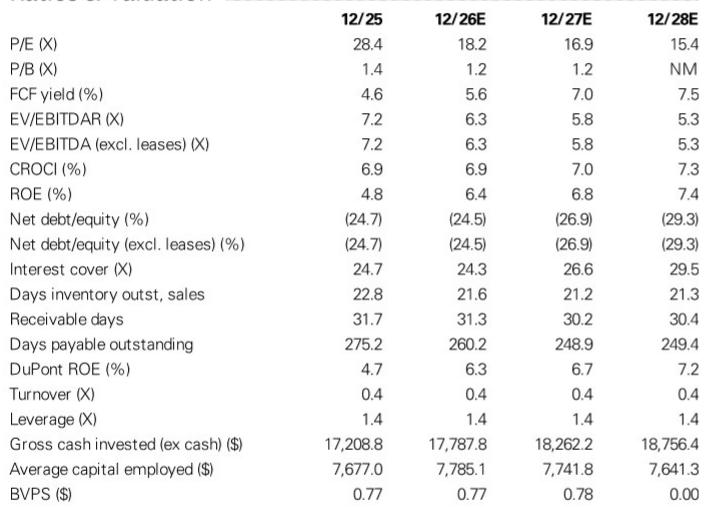
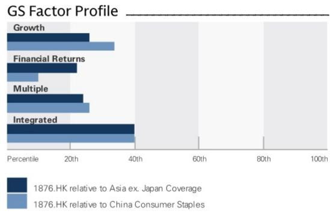
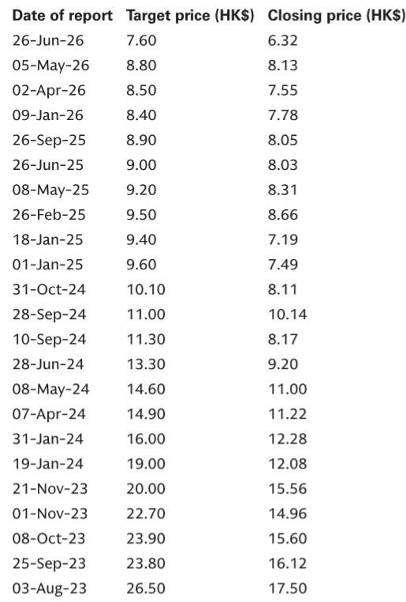

# 百威亚太的中国策略：时机与执行的双重考验

7月30日，百威亚太公布2026年第二季度业绩。从表面数字看，结果好于预期：集团销售额和EBITDA均超出预期，报告净利润在有利的平均售价、有效税率和折旧节省的共同作用下也高于市场一致预期。但更具信号意义的细节，隐藏在业绩构成之中。集团销量同比下降4.1%，而平均售价上升2%。高端化引擎仍在运转，但运转的气缸数量有所减少。作为公司最大市场的中国，仍然是拖累项——7月行业销量依然偏软，管理层也明确提示复苏需要时间。战略问题已不再是百威亚太能否执行其高端化策略，而是：在成本逆风和渠道结构变化侵蚀利润率缓冲之前，公司选择在低谷期持续投入的决策，能否获得应有的回报——这一利润率缓冲，历来是支撑其估值溢价的基础。

市场的反应相对克制。公司当前估值约为2026年19倍、2027年17倍市盈率，对应EV/EBITDA分别为6.2倍和5.6倍，而全球同业平均为9倍和8倍。这一折价反映的是市场对中国销量复苏的怀疑，而非对公司经营质量的否定。管理层在业绩电话会议上的表态进一步印证了这一张力：他们承认宏观环境具有挑战性，将稳定中国销量列为最优先事项，同时提示渠道库存在下半年仍需进一步优化。公司并未假装问题已经解决，而是在押注：对品牌资产、O2O渠道和高端化的持续投入，将为其在数据尚未显现的复苏中占据有利位置。

这是一个典型的战略拐点。公司面临三个杠杆：中国市场的销量恢复、原材料通胀背景下的利润率防御、以及韩国和印度市场的增长加速。次生问题在于：这些杠杆是相互增强，还是追求其一反而损害其他？本季度的证据表明，公司正试图同时推进三者，并承受不同程度的短期阵痛。

## 中国的问题不仅是需求，更是渠道与定价——需要时间消化

本季度最重要的洞察在于：中国的疲弱并非单一的需求崩塌，而是堂食消费偏软、渠道库存持续去化、以及消费者在某些场景下消费降级的综合结果。管理层指出，7月行业销量依然偏软，二季度堂食啤酒消费改善有限，这都表明复苏尚未真正启动。公司自身在中国的销量降幅大于集团平均水平，三季度指引为销量同比下降8%，平均售价增长2.8%仅能部分抵消这一拖累。

渠道库存问题是读者需要关注的关键变量。管理层表示，一、二线城市库存水平仍有优化空间，下半年可能还需要进一步调整。这不是一个季度就能解决的问题。公司有意选择让销量吸收库存修正，而非将产品压入渠道、冒日后更大幅度价格重置的风险。这一策略在战略上合理，但在运营上代价不菲。这意味着，即使终端消费需求企稳，短期销量数据仍将偏弱，因为渠道仍在消化此前的出货。

让这一故事超越单纯库存层面的，是定价维度。尽管销量下滑，中国市场的平均售价在本季度仍为正增长，公司预计全年平均售价增长1.5%。这表明即使在需求偏弱的环境下，高端化仍在延续。风险在于：向O2O渠道的结构性转移——该渠道二季度实现了强劲的两位数增长——伴随着更高的促销强度，因而每百升的净利贡献较低。管理层承认这一张力：O2O渠道的产品结构更优，但需要持续的渠道投入和促销支持。该渠道的规模化尚未带来产品结构所暗示的盈利水平。这是一个时间错配，而非结构性缺陷。

原材料成本上升构成第二层压力。公司的一年对冲周期意味着，大麦成本节省目前可以兑现，但铝材成本正在快速上升。成本追踪数据显示，2026年上半年铝价同比上涨19%，7月较2025年均价上涨23%。这不是一个边缘投入项。铝材是啤酒重要的包装成本，而对冲周期意味着全部影响将在2026年下半年及2027年显现。结果是双线承压：收入增长受销量偏软制约，利润率同时受渠道结构和投入成本挤压。公司选择在这一时期持续投入品牌资产和渠道拓展，是刻意以短期盈利换取市场地位的决策。

## 韩国与印度：宏观环境配合时，高端化模式依然有效

中国与公司其他主要市场之间的对比十分鲜明。在韩国，公司对自身竞争优势充满信心，驱动力来自创新和SKU拓展。在印度，势头更为强劲，高端化和渗透率提升持续推动两位数增长。这些市场不仅在对冲中国的下滑，更在验证一个核心战略论点：亚洲高端啤酒消费尚未充分渗透，而公司的品牌组合和分销能力能够捕捉这一增长。

印度尤其具有启示意义。其约占AP West销量的10%，但增长速度表明，假以时日，它将成为更重要的利润贡献者。公司预计强劲势头将持续，收入和EBITDA利润率均有充足提升空间。这不是一个以牺牲盈利为代价换取增长的成熟市场。印度仍处于高端化的早期阶段，人均消费远低于发达市场，不断壮大的中产阶级正在消费升级。公司在管理中国下行周期的同时，仍能在印度实现有效执行，这证明其运营模式是健全的——问题纯粹在于中国复苏的时机。

韩国提供了另一层面的经验。市场更为成熟，但公司仍通过创新和SKU拓展找到增长空间。2026年AP East的EBITDA增长预期为3.5%，平均售价基本持平，这表明韩国是一个稳健、可靠的贡献者，而非高增长故事。在组合语境中，这很有价值——它在中国复苏、印度扩张期间提供了盈利稳定性。集团层面三季度销售额下降1.9%的预期——由销量下降4.1%和平均售价上升2.3%共同驱动——掩盖了组合内部的分化轨迹。市场正在定价一个尚未开始的中国复苏，但同时也在忽视印度的复合增长和韩国的稳定性。

战略含义在于：百威亚太正在运营一个双速组合。慢速部分——中国——占据了管理层大部分注意力和投入。快速部分——印度和韩国——正在产生最终将推动估值重估的增长。风险在于，市场只关注慢速部分，在中国出现拐点之前，未能给予快速部分应有的认可。这是一个反向的经典价值陷阱：股票按当前指标看似便宜，但折价只有在最大市场停止失血时才会收窄。

## 下半年利润率承压并不意外——这是中国策略的代价

公司自身的指引意味着下半年盈利将显著下滑。三季度预期为集团层面有机EBITDA下降8.9%，其中中国下降13%，原因是持续投入和原材料逆风。四季度预期有所改善——中国销量仅下降1%，平均售价上升5%，EBITDA增长8%——但这部分归因于低基数效应，而非真正的拐点。

市场不应对这一轨迹感到意外。管理层已明确表示，中国销量复苏需要时间，公司将继续在低谷期投入。下半年的挤压正是这一策略的机械性结果。原材料成本逆风是对冲周期的函数，而非竞争格局的变化。渠道投入是O2O规模化策略的函数，而非定价纪律的丧失。销量下滑是库存优化的函数，而非品牌资产的流失。下半年压力的每一个组成部分都是可解释的，更重要的是，都在以明确目标进行管理。

问题在于，市场是否愿意以短期痛苦换取更有利的长期地位。当前估值表明市场已在定价复苏，但复苏的时机尚不确定。管理层对三季度的谨慎表态——以及渠道库存持续调整的预期——表明拐点更可能出现在四季度或2027年初。对读者而言，这是一段漫长的等待，尤其如果原材料成本逆风延续至2027年并推迟利润率恢复。

O2O渠道策略还存在一个微妙风险。强劲的两位数增长令人印象深刻，但高水平的渠道投入和促销意味着，该渠道对盈利的贡献率尚不及传统堂食或非堂食渠道。公司预计随着渠道规模化，盈利能力将逐步改善——但这是一个假设，而非确定性。如果O2O在组合中占比扩大而净利率未能同步改善，即使销量恢复，整体利润率结构仍可能承压。

## 决策框架：判断中国策略是否奏效的四个观察指标

当前局面需要结构化的监测方法，而非对股票的二元押注。以下四个指标，综合来看，将决定百威亚太的中国策略是否在发挥作用。

第一，观察渠道库存轨迹。管理层表示一、二线城市库存仍需优化。关键在于追踪公司在此方面的进展。如果库存水平在三季度末恢复正常，四季度销量降幅应极为有限，公司可从干净的基础开始重建销量。如果库存到四季度仍处高位，复苏时间线将进一步拉长。

第二，监测O2O渠道盈利能力。公司正大力投入该渠道，二季度实现强劲两位数增长。问题在于：随着规模化，该渠道是否变得更有利可图？如果公司能在保持增长的同时展示O2O净利率的改善，该渠道将成为战略资产而非利润率拖累。如果不能，公司将面临增长与盈利之间的取舍——而目前由于该渠道占总组合比例仍小，这一取舍尚不必做出。

第三，追踪原材料成本轨迹。铝价上涨是已知逆风，但影响程度取决于当前高位价格能否持续。公司的对冲周期意味着影响将在2026年下半年及2027年显现。如果铝价回落，利润率压力将低于当前预期。如果继续上涨，公司将需要寻找对冲性节省，或接受更长的利润率恢复期。

第四，关注印度的利润率轨迹。公司预计印度势头持续，EBITDA利润率有提升空间。如果印度能同时实现销量增长和利润率改善，将为集团层面提供对冲中国压力的平衡力量。如果印度的增长以牺牲利润率为代价，集团层面的盈利恢复将慢于预期。

这四个指标并非相互独立。渠道库存影响销量，销量影响堂食与O2O之间的结构，结构影响盈利能力。原材料成本影响利润率，利润率影响公司投资品牌资产和渠道拓展的能力。印度的利润率轨迹影响集团层面盈利，集团层面盈利影响估值。这一框架的价值在于，它迫使读者将中国策略视为一个系统，而非单一数字。

## 估值折价反映中国拖累，但组合实力强于表面印象

百威亚太与全球同业之间的估值差距，并不能由经营质量来证明其合理性。公司在中国高端啤酒领域占据主导地位，在印度拥有不断增长的业务，在韩国拥有稳定的业务。折价完全是中国销量疲弱和复苏时间不确定性的函数。市场实际上在说：它不相信中国复苏会快到足以支撑当前估值，因此相应给予折价。

这一折价为愿意采取更长视角的读者创造了机会。公司资产负债表强劲，净现金25.5亿美元，净债务与EBITDA之比为-1.6倍。2026年股息率为4.6%，即使复苏延迟，也为股价提供了底部支撑。2026年自由现金流回报表现为5.6%，预计到2027年升至7.0%。公司有充足的财务能力在低谷期持续投入，同时不损害资产负债表或对股东回报的承诺。

管理层承认股息支付可见度较低，现金流优先用于恢复销量增长的投资——这表明他们着眼长远。这不是一家为下个季度而管理的公司，而是为下一个周期而管理。风险在于市场短期内会惩罚这种做法，但回报是当中国复苏时，公司将拥有更强的竞争地位。

与全球同业的比较具有启示意义。按2026年EV/EBITDA 6.2倍计算，百威亚太较全球同业平均9倍存在显著折价。这一折价意味着市场预期中国在可预见的未来仍将是拖累。如果公司能在2026年底前展现中国销量的哪怕温和改善，重估潜力都是可观的。四季度销量仅下降1%的预期——尽管基于低基数——将是库存修正完成、销量基础企稳的首个信号。

中国投资的战略逻辑是合理的。公司正利用资产负债表实力和品牌资产，在市场疲弱时保护其高端定位。它正在投入以两位数增长的O2O渠道，即使这些渠道尚未完全盈利。它维持着定价纪律——销量下滑背景下平均售价仍正增长即为明证。它正在优化渠道库存，以确保复苏来临时建立在干净的基础之上。这些是一个理解周期性下行与结构性衰退之间区别的管理团队应有的行为。

风险在于，周期性下行持续的时间超过预期，原材料成本逆风延长利润率恢复时间线。铝价上涨是真实关切，对冲周期意味着影响将持续数个季度。如果中国销量复苏推迟至2027年且原材料成本维持高位，利润率恢复可能进一步延后，股票可能长期处于低估状态。

但另一种策略——削减投入以保护短期利润率——将是战略失误。那将在中国高端市场让出份额，削弱公司数十年积累的品牌资产，并在复苏到来时使公司处于不利位置。管理团队正在做出正确的长期选择，尽管短期代价不菲。

## 组合即对冲：中国复苏期间，印度和韩国提供盈利支撑

百威亚太故事中最被低估的方面是组合效应。在中国拖累集团层面业绩的同时，印度和韩国正在提供真实的盈利支撑。印度以两位数速度增长并具利润率扩张潜力，韩国通过创新和SKU拓展实现稳健EBITDA增长。这些市场不仅在对冲中国的下滑，更在为未来增长奠定基础——随着中国企稳，这一基础将更加可见。

集团层面数字掩盖了这一分化。三季度销售额下降1.9%的预期完全由中国驱动。剔除中国，公司正在增长。四季度中国销量增长、平均售价增长和EBITDA增长的预期表明，公司正开始走出拐角。市场对短期数字的关注，掩盖了公司正在构建一个更加多元、更具韧性的组合这一事实。

印度的机会尤其重要。印度约占AP West销量的10%，相对于中国仍然较小，但其增长速度意味着几年内将成为有意义的贡献者。公司对持续强劲势头和利润率扩张空间的预期表明，印度不仅是销量故事，更是盈利故事。随着印度规模化，它将为中国周期性提供天然对冲，降低公司对单一市场的依赖。

韩国业务不那么令人兴奋，但同样重要。这是一个稳定、成熟的市场，公司通过创新和SKU拓展找到增长。2026年AP East EBITDA增长3.5%、平均售价持平的预期表明，韩国是可靠的现金生成器，支撑着公司的投资能力。这是组合中安静运转的引擎，提供着允许公司在中国和印度承担风险的稳定性。

战略含义在于：读者不应仅凭中国数据来评估百威亚太。公司正在构建一个多元化的亚洲啤酒业务，而中国的疲弱是周期的暂时特征，而非业务的永久属性。相对于全球同业的折价，为能够穿透短期噪音、聚焦组合长期轨迹的读者提供了机会。

最后需要考虑的是管理团队的公信力。他们对挑战坦诚，对时间线明确，对方法有纪律。他们没有粉饰中国的情况，也没有做出无法兑现的承诺。他们在低谷期投入，维持定价纪律，优化渠道库存，为复苏而建设。这是一个理解业务、愿意为股东长期利益做出艰难选择的管理团队应有的行为。市场短期内可能不会认可这种做法，但证据表明策略是合理的，执行正在改善。

*仅供参考。部分内容可能基于原始材料由AI辅助生成、翻译、总结或编辑，可能包含遗漏或错误。请独立核实。本文不构成投资、法律、税务、会计或其他专业建议。*

仅供参考。部分内容可能基于原始材料由AI辅助生成、翻译、总结或编辑，可能包含遗漏或错误。请独立核实。本文不构成投资、法律、税务、会计或其他专业建议。

