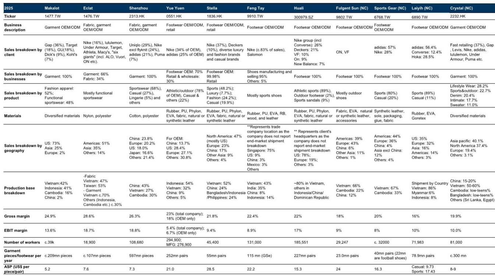
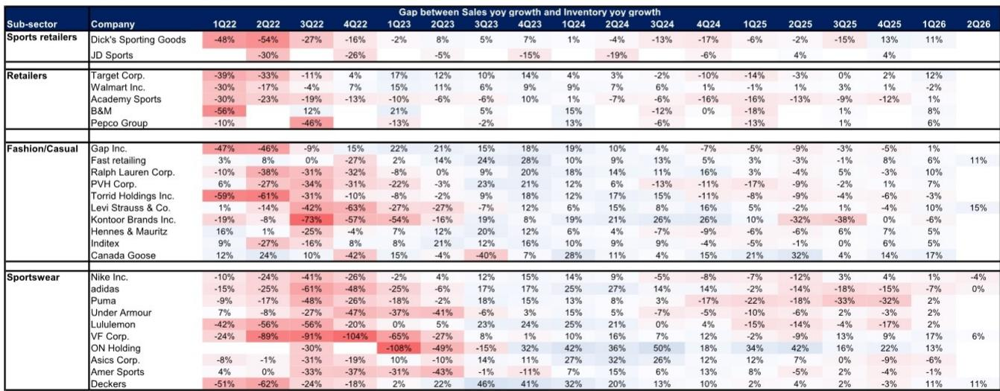
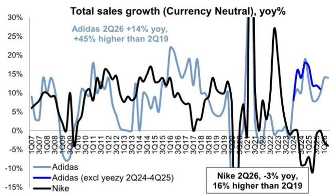

# 亚太纺织服装产业链对adidas 2Q26业绩的联动观察

adidas 公布 2Q26 业绩后，相关研究团队发布了一份覆盖代工厂、分销商和本土品牌的联动观察。核心信号并不复杂：adidas 全球 cFX 销售增长 14%，大中华区增长 15%，但增长结构出现明显分化——服装品类加速至 35%，鞋履仅增长 1%。这份成绩单对供应链上下游的含义并不均匀。

报告覆盖了申洲国际、华利集团、裕元集团等代工厂，以及滔搏、宝胜等分销商，还有安踏、李宁、特步等本土品牌。整体判断为 mixed-to-positive：对服装代工相对正面，对分销商中性偏正面，对本土品牌则偏谨慎。这个分层判断值得细看。

## 1. 服装与鞋履增速差扩大至 34 个百分点

2Q26 最突出的结构变化发生在品类层面。adidas 服装销售 cFX 同比增长 35%，较 1Q26 的 31% 继续加速，Football 和 Originals 系列均录得双位数增长，Running、Training、Motorsport 和 US Sports 同样表现强劲。鞋履则从 1Q26 的 4% 节奏变化至 1%，主要受生活方式鞋类竞争和折扣不确定性影响。

管理层预计鞋履增长将在 4Q26/1Q27 改善，理由是批发订单簿好转和渠道库存正常化。但报告同时指出，生活方式鞋类的行业性折扣不确定性并未消失。服装与鞋履之间 34 个百分点的增速差，直接对应到代工厂的订单结构差异。

> **观察：** 这份报告最有用的拆解是品类维度。服装 35% 对鞋履 1% 的增速差，意味着申洲国际这类以服装为主的代工厂拿到的订单动能，明显强于以鞋履为主的代工厂。看供应链公司时，先看品牌客户的产品结构，再看订单分配。

## 2. 大中华区增长 15% 但渠道传导存在折损

adidas 大中华区 2Q26 cFX 销售增长 15%，较 1Q26 的 17% 略有节奏变化，但仍显著跑赢同行：Nike 中国 5 月季度下滑 17%，宝胜 2Q26 下滑 3%，安踏主品牌、FILA、李宁、特步的 2Q26 零售流水增速分别为低单位数、低单位数、负低单位数、负中单位数。

报告对分销商持相对正面态度，理由包括本地化策略执行到位、中国本地采购比例提升有助于减少库存回收。但报告也提示了一个关键折损：adidas 的强劲报表数字未必完全转化为零售商增长，因为零售商更偏向线下渠道，而 adidas 的增长部分来自 DTC 和线上。大中华区 2Q 毛利率提升 1.9 个百分点至 56.0%，EBIT 利润率 23.0%，但这是品牌层面的利润率，不等于分销商的利润率。

## 3. 本土品牌面临产品力与渠道能力的双重对标

报告对本土品牌的判断偏谨慎，逻辑链条清晰：adidas 在宏观需求平淡的背景下仍能维持 15% 的大中华区增长，说明其产品创新、品牌资产、渠道管理和本地化能力形成了系统性的竞争壁垒。这对安踏、李宁、特步等本土品牌意味着竞争强度上升。

报告也提到了一个反向机会：Nike 的持续调整和品牌重置速度较慢，为本土品牌留出了份额获取空间。但需要密切跟踪 Nike 在线上渠道的库存管理策略，如果 Nike 加大线上促销力度，整个行业的折扣环境可能进一步承压。报告此前已将运动服饰品牌从首选板块中移除，理由是 2Q26 需求波动和定价趋势弱于预期。

## 4. 库存增速低于销售增速，成本端不确定性可控

2Q26 库存同比增长 12%（cFX），低于 14% 的销售增速，整体库存结构中仅 9% 来自往季产品。管理层提到中东销售低于预期导致季末库存环比略升，但整体结构健康。油价方面，管理层表示油价已过峰值，原材料和运费成本已锁定，成本影响可控。

这个库存信号对代工厂有直接含义：adidas 库存增速低于销售增速，意味着渠道库存去化在推进，批发订单的能见度在改善。报告认为 adidas 订单仍将是 2026-27 年代工厂的核心增长驱动，华利集团今年在 adidas 供应链中的份额获取依然稳固，裕元则聚焦高端订单。

> **观察：** 库存增速连续低于销售增速，是判断品牌客户后续补单意愿的一个先行指标。adidas 目前库存结构中往季产品仅占 9%，说明渠道里积压的旧货不多，新订单的确定性相对更高。这个指标对代工厂的订单能见度比单季销售增速更有参考价值。

## 5. 观察框架：从品牌增速拆解供应链受益顺序

这份报告提供了一个可复用的分析框架：当品牌客户财报发布后，不要只看整体增速，按品类、区域、渠道三个维度拆解，再映射到供应链上下游的受益顺序。

品类维度上，服装加速而鞋履节奏变化，直接对应服装代工与鞋履代工的订单分化。区域维度上，大中华区 15% 的增长和本地化采购比例提升，意味着中国供应链的响应速度和本地化能力成为拿单变量。渠道维度上，DTC 增长快于批发，意味着分销商的报表增长会滞后于品牌报表，这是评估滔搏、宝胜时需要计入的折损因素。

报告对安踏的多品牌策略评价相对正面，认为其不同品牌覆盖不同需求场景，2Q26 表现符合预期，1H26 运行节奏略超预期。在整体需求平淡的环境下，多品牌矩阵提供了一定的需求对冲能力。

这份报告的阅读价值不在于 adidas 单季业绩本身，而在于它展示了品牌端的一个增长结构变化如何沿供应链传导，并在不同环节产生方向各异的效应。对于跟踪亚太纺织服装产业链的读者，品类增速差、库存增速与销售增速的对比、以及区域增长质量，是三个值得持续跟踪的指标。

For informational purposes only. Portions may be generated,translated,summarized,or edited with AI assistance based on source materials and may contain omissions or errors. Please verify independently. This is not investment,legal,tax,accounting,or other professional advice.

For informational purposes only. Portions may be generated,translated,summarized,or edited with AI assistance based on source materials and may contain omissions or errors. Please verify independently. This is not investment,legal,tax,accounting,or other professional advice.

