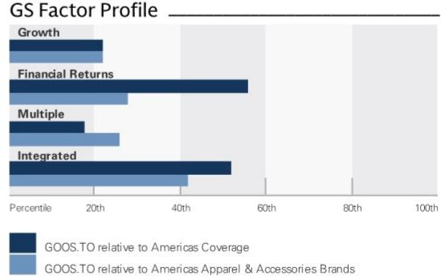
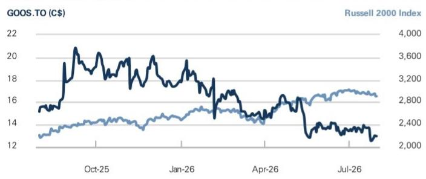
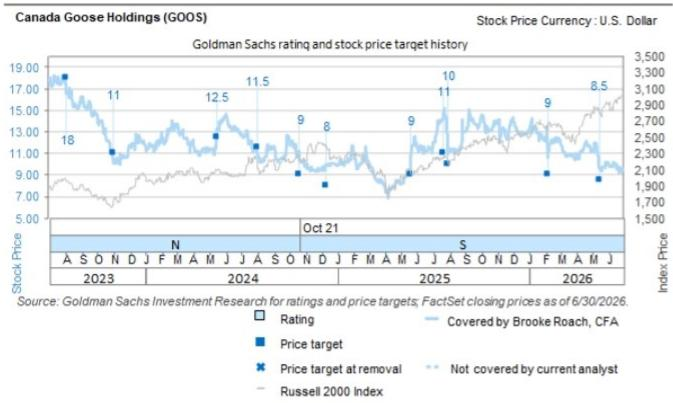
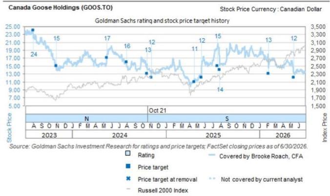

# Canada Goose Holdings (GOOS.TO)

## F1Q27 业绩回顾：季节性小季度中的渐进式改善信号；DTC门店同店表现受关注

| GOOS.TO | 12个月目标价：C$11.50 | 现价：C$12.97 | 潜在空间：-11.3% |
|---------|----------------------|--------------|-----------------|
| GOOS    | 12个月目标价：$8.25   | 现价：$9.26   | 潜在空间：-10.9% |

GOOS公布的F1Q27业绩超出预期。收入同比增长10.3%，显著高于市场一致预期（-1.9%/+0.6%），调整后每股收益为-C$0.89，同样好于预期（-C$0.95/-C$0.99）。本季度有多个亮点，包括电商势头增强、批发订单簿及客户追加订单表现强劲，以及亚洲（尤其中国市场）的稳健动能。然而，直营门店（DTC）同店销售增速出现明显环比放缓，主要受门店客流（尤其EMEA地区）影响，同时2Q增长预期温和、利润率指引偏软，叠加新增关税风险（若已公布的关税措施落地，未对冲部分对FY27利润率的影响最高可达200个基点）。

管理层重申全年低个位数收入增长及11%-12%调整后EBIT利润率指引，该指引继续包含2026年成本压力回补及年初定价措施的正面贡献。不过，宏观环境仍存在不确定性，随着进入秋冬重要销售季节，客流趋势仍是关注重点。

我们维持此前的整体判断。批发和电商业务的改善轨迹令人鼓舞，转化率提升表明相关举措正在见效。但DTC同店增速放缓值得关注（同比-3.2%，对比F4Q的+10.0%），美国客流趋势仍然偏弱，EMEA需求表现滞后。此外，本季度部分超预期表现源于批发收入确认时点的调整。我们将继续观察在杠杆化SG&A费用（除一次性成本回补外）的同时实现可持续盈利增长的证据。

## 评级：SELL

Brooke Roach, CFA
+1(212)357-2421 | brooke.roach@gs.com
GS & Co. LLC

Mentesnot Adamu
+1(801)744-0630 | mentesnot.adamu@gs.com
GS & Co. LLC

Carly Chasen
+1(212)902-2327 | carly.chasen@gs.com
GS & Co. LLC

## 关键数据

市值：C$13亿 / $8.989亿
企业价值：C$12亿 / $8.485亿
3个月日均成交量：C$190万 / $140万
加拿大
美洲服装及配饰品牌
并购排名：3

GS预测

| | 3/26 | 3/27E | 3/28E | 3/29E |
|---|---|---|---|---|
| 收入（百万加元）新 | 1,528.2 | 1,566.6 | 1,641.2 | 1,720.3 |
| 收入（百万加元）旧 | 1,528.2 | 1,553.8 | 1,627.8 | 1,706.3 |
| EBITDA（百万加元） | 279.5 | 316.6 | 335.4 | 355.7 |
| EBIT（百万加元） | 148.0 | 173.4 | 182.5 | 192.1 |
| 每股收益（加元）新 | 0.79 | 1.07 | 1.13 | 1.19 |
| 每股收益（加元）旧 | 0.79 | 1.03 | 1.12 | 1.18 |
| 市盈率（倍） | 21.2 | 12.1 | 11.5 | 10.9 |
| 股息率（%） | 0.0 | 0.0 | 0.0 | 0.0 |
| 净债务/EBITDA（倍） | 0.0 | (0.3) | (0.7) | (1.1) |

| | 6/26 | 9/26E | 12/26E | 3/27E |
|---|---|---|---|---|
| 每股收益（加元） | (0.89) | (0.25) | 1.71 | 0.49 |

GS因子画像

来源：公司数据，GS预测。详情请参阅披露部分。

## Canada Goose Holdings (GOOS.TO) 评级自2024年10月20日起

比率与估值

| | 3/26 | 3/27E | 3/28E | 3/29E |
|---|---|---|---|---|
| 市盈率（倍） | 21.2 | 12.1 | 11.5 | 10.9 |
| EV/EBITDA（倍） | 7.6 | 4.8 | 3.9 | 3.1 |
| EV/销售额（倍） | 1.1 | 0.8 | 0.6 | 0.5 |
| 自由现金流回报表现（%） | 4.0 | 6.9 | 10.3 | 10.6 |
| EV/DACF（倍） | 7.0 | 5.5 | 4.5 | 3.9 |
| CROCI（%） | 22.6 | 21.9 | 23.2 | 23.5 |
| ROE（%） | 13.0 | 15.1 | 13.3 | 11.9 |
| 净债务/EBITDA（倍） | 0.0 | (0.3) | (0.7) | (1.1) |
| 净债务/权益（%） | 0.4 | (9.4) | (22.2) | (31.4) |
| 利息覆盖倍数（倍） | 6.7 | 8.0 | 9.0 | 10.0 |
| 库存天数 | 303.8 | 300.7 | 288.1 | 280.8 |
| 应收账款天数 | 22.8 | 25.6 | 25.3 | 25.3 |
| 应付账款天数 | 152.1 | 168.6 | 165.6 | 165.5 |

增长与利润率（%）

| | 3/26 | 3/27E | 3/28E | 3/29E |
|---|---|---|---|---|
| 总收入增长 | 13.3 | 2.5 | 4.8 | 4.8 |
| EBITDA增长 | (7.5) | 13.3 | 5.9 | 6.0 |
| 每股收益增长 | (29.8) | 36.5 | 5.2 | 5.9 |
| 每股股息增长 | NM | NM | NM | NM |
| 毛利率 | 69.7 | 70.4 | 70.6 | 70.8 |
| EBIT利润率 | 9.7 | 11.1 | 11.1 | 11.2 |

价格表现

| | 3个月 | 6个月 | 12个月 |
|---|---|---|---|
| 相对表现 | (16.2)% | (21.5)% | (26.6)% |
| 相对罗素2000指数 | (19.2)% | (29.4)% | (43.7)% |

来源：FactSet。价格为2026年7月30日收盘价。

资产负债表（百万加元）

| | 3/26 | 3/27E | 3/28E | 3/29E |
|---|---|---|---|---|
| 现金及现金等价物 | 408.2 | 457.5 | 587.6 | 722.0 |
| 应收账款 | 108.4 | 111.1 | 116.4 | 122.0 |
| 库存 | 386.3 | 378.0 | 383.4 | 388.9 |
| 其他流动资产 | 65.5 | 54.8 | 54.8 | 54.8 |
| 流动资产合计 | 968.4 | 1,001.4 | 1,142.2 | 1,287.7 |
| 净固定资产 | 493.6 | 549.9 | 596.1 | 656.8 |
| 净无形资产 | 199.0 | 198.4 | 198.4 | 198.4 |
| 总投资 | 0.0 | 0.0 | 0.0 | 0.0 |
| 其他长期资产 | 92.2 | 139.4 | 139.4 | 139.4 |
| 总资产 | 1,753.2 | 1,889.1 | 2,076.1 | 2,282.3 |
| 应付账款 | 214.0 | 214.6 | 223.1 | 232.1 |
| 短期债务 | 4.2 | 17.1 | 17.1 | 17.1 |
| 流动租赁负债 | 92.8 | 94.3 | 94.3 | 94.3 |
| 其他流动负债 | 57.5 | 43.3 | 43.3 | 43.3 |
| 流动负债合计 | 368.5 | 369.3 | 377.8 | 386.8 |
| 长期债务 | 406.4 | 369.2 | 369.2 | 369.2 |
| 非流动租赁负债 | 281.8 | 324.4 | 355.4 | 388.8 |
| 其他长期负债 | 68.7 | 67.3 | 67.3 | 67.3 |
| 长期负债合计 | 756.9 | 760.9 | 791.9 | 825.3 |
| 总负债 | 1,125.4 | 1,130.2 | 1,169.6 | 1,212.2 |
| 优先股 | - | - | - | - |
| 普通股权益合计 | 627.8 | 758.9 | 906.4 | 1,070.2 |
| 少数股东权益 | - | - | - | - |
| 负债及权益合计 | 1,753.2 | 1,889.1 | 2,076.1 | 2,282.3 |
| 每股账面价值（加元） | 6.47 | 7.78 | 9.28 | 10.96 |

现金流量表（百万加元）

| | 3/26 | 3/27E | 3/28E | 3/29E |
|---|---|---|---|---|
| 净利润 | 27.8 | 98.3 | 110.9 | 117.9 |
| 折旧摊销加回 | 131.5 | 143.2 | 153.0 | 163.5 |
| 少数股东权益加回 | - | - | - | - |
| 营运资本变动净额 | (63.3) | (28.5) | (2.1) | (2.1) |
| 其他 | 98.4 | 20.5 | 36.7 | 45.9 |
| 经营活动现金流 | 194.4 | 233.5 | 298.4 | 325.2 |
| 资本支出 | (42.6) | (50.1) | (55.1) | (60.7) |
| 收购 | - | - | - | - |
| 剥离 | - | - | - | - |
| 其他 | (7.9) | - | - | - |
| 投资活动现金流 | (50.5) | (50.1) | (55.1) | (60.7) |
| 已支付股息 | - | - | - | - |
| 股份发行/（回购） | 0.0 | 0.0 | - | - |
| 债务增加/（减少） | 10.0 | (39.5) | - | - |
| 其他 | 7.1 | 1.7 | - | - |
| 融资活动现金流 | (70.1) | (134.1) | (113.2) | (130.1) |
| 总现金流 | 73.8 | 49.3 | 130.1 | 134.4 |
| 自由现金流 | 64.6 | 87.1 | 130.1 | 134.4 |
| 每股自由现金流（基本）（加元） | 0.67 | 0.89 | 1.33 | 1.38 |

利润表（百万加元）

| | 3/26 | 3/27E | 3/28E | 3/29E |
|---|---|---|---|---|
| 总收入 | 1,528.2 | 1,566.6 | 1,641.2 | 1,720.3 |
| 销售成本 | (462.7) | (463.9) | (482.3) | (501.9) |
| 销售、一般及管理费用 | (917.5) | (929.3) | (976.4) | (1,026.2) |
| 研发费用 | - | - | - | - |
| 其他营业收入/（支出） | - | - | - | - |
| EBITDA | 279.5 | 316.6 | 335.4 | 355.7 |
| 折旧与摊销 | (131.5) | (143.2) | (153.0) | (163.5) |
| EBIT | 148.0 | 173.4 | 182.5 | 192.1 |
| 净利息收入/（支出） | (37.8) | (41.7) | (42.1) | (42.9) |
| 联营公司损益 | - | - | - | - |
| 税前利润 | 110.2 | 131.7 | 140.3 | 149.2 |
| 所得税准备 | (33.1) | (26.8) | (29.5) | (31.3) |
| 少数股东权益 | - | - | - | - |
| 优先股股息 | - | - | - | - |
| 净利润（扣除特殊项目前） | 77.1 | 104.8 | 110.9 | 117.9 |
| 净利润（扣除特殊项目后） | 39.8 | 98.3 | 110.9 | 117.9 |
| 每股收益（基本，扣除特殊项目前）（加元） | 0.79 | 1.07 | 1.14 | 1.21 |
| 每股收益（摊薄，扣除特殊项目前）（加元） | 0.79 | 1.07 | 1.13 | 1.19 |
| 每股收益（扣除ESO费用，摊薄）（加元） | 0.79 | 1.07 | 1.13 | 1.19 |
| 每股股息（加元） | - | - | - | - |
| 股息支付率（%） | 0.0 | 0.0 | 0.0 | 0.0 |
| 加权平均股本（基本）（百万股） | 97.1 | 97.6 | 97.7 | 97.7 |
| 加权平均股本（摊薄）（百万股） | 98.1 | 97.7 | 98.3 | 98.7 |

来源：公司数据，GS预测。

## 业绩详情

F1Q业绩：合并销售额同比增长10.3%（剔除汇率影响增长8.6%）至1.189亿加元，高于GS/一致预期（1.058亿/1.084亿加元），超预期主要来自批发业务加速及中国/亚太地区的强劲表现。批发收入同比增长66.5%（剔除汇率影响增长65.4%）至2,980万加元，高于GS/一致预期（1,770万/1,680万加元）。DTC销售额同比增长8.6%（剔除汇率影响增长6.7%）至8,480万加元，高于GS/一致预期（7,980万/7,930万加元），同店销售同比-3.2%。其他收入同比下降63.6%（剔除汇率影响下降64.4%）至430万加元，对比GS/一致预期为830万/850万加元。毛利率为62.4%，同比扩张100个基点，高于GS/一致预期（62.1%/60.6%），主要受渠道和区域组合有利因素驱动。调整后EBIT利润率为-87.3%，高于GS/一致预期（-104.1%/-109.7%）。库存同比增长11.5%，对比GS预期为+10.0%。

- 展望：管理层重申指引。GOOS继续预期全年收入低个位数同比增长，对比GS/一致预期为1.7%/2.4%。公司同时重申调整后EBIT利润率在11%-12%区间的预期，对比GS/一致预期为10.9%/10.7%。管理层展望所依据的假设保持不变，但公司表示，2026年7月20日宣布的关于加美贸易的新增关税预计不会对其产生实质性影响——该关税目前预计将适用于一系列加拿大商品，包括公司的部分产品。

## 预测、估值与主要风险

我们将FY27/FY28/FY29每股收益预测从此前的C$1.03/C$1.12/C$1.18更新至C$1.07/C$1.13/C$1.19，以反映F1Q业绩、更强的批发趋势、2Q营销投入导致的近期利润率表现偏弱，以及对利润率预测的其他小幅调整。我们将12个月目标价从此前的C$12.00/US$8.50小幅下调至C$11.50/US$8.25，因我们将估值框架滚动至Q5-Q8 EV/EBITDA。我们将目标倍数从4.00倍下调至3.75倍，以反映DTC同店趋势偏弱及GOOS多个核心区域宏观环境波动带来的更高不确定性。

主要上行风险包括：（1）品牌势能重新加速；（2）利润率改善；（3）全球/奢侈品消费支出改善速度快于预期。

| | 评级分布 | | | 投行关系 | | |
|---|---|---|---|---|---|---|
| | 买入 | 持有 | 卖出 | 买入 | 持有 | 卖出 |
| 全球 | 50% | 34% | 16% | 65% | 59% | 43% |

## 披露附录

## Reg AC

我们，Brooke Roach, CFA、Mentesnot Adamu和Carly Chasen，特此证明本报告中表达的所有观点准确反映了我们个人对相关公司及其证券的看法。我们还证明，我们的薪酬中没有任何部分直接或间接与本次报告中表达的具体建议或观点相关。

除非另有说明，本报告封面所列人员均为GS全球投资研究部门的分析师。

撰稿人：Brooke Roach, CFA GS & Co. LLC、Mentesnot Adamu GS & Co. LLC、Carly Chasen GS & Co. LLC。

除非另有说明，本报告撰稿人披露中列出的个人均为GS全球投资研究部门的分析师。

## GS因子画像

GS因子画像通过将股票的关键属性与市场（即我们的评级股票池）及其行业同行进行比较，为个股提供投资背景信息。所描绘的四个关键属性为：增长、财务回报、倍数（即估值）和综合（增长、财务回报和倍数的复合指标）。增长、财务回报和倍数通过使用每只股票特定指标的标准化排名计算得出。各指标的标准化排名随后取平均值并转换为相应属性的百分位。每个指标的具体计算可能因财年、行业和地区而异，但标准方法如下：

增长基于股票的前瞻性销售增长、EBITDA增长和每股收益增长（对于金融类股票，仅使用每股收益和销售增长），百分位越高表示增长性越强。财务回报基于股票的前瞻性ROE、ROCE和CROCI（对于金融类股票，仅使用ROE），百分位越高表示财务回报越高。倍数基于股票的前瞻性市盈率、市净率、价格/股息（P/D）、EV/EBITDA、EV/FCF和EV/债务调整后现金流（DACF）（对于金融类股票，仅使用市盈率、市净率和P/D），百分位越高表示交易倍数越高。综合百分位计算为增长百分位、财务回报百分位和（100% - 倍数百分位）的平均值。

财务回报和倍数使用GS分析师对至少三个季度后的财年末所做的预测。增长使用至少七个季度后的财年与至少三个季度后的财年相比的输入数据（所有指标均基于每股）。

有关我们如何计算GS因子画像的更详细说明，请联系您的GS代表。

## 并购排名

在我们的全球覆盖范围内，我们使用并购分析框架审视股票，综合考虑定性因素和定量因素（可能因行业和地区而异），以评估某些公司被收购的可能性。然后我们分配一个并购排名，以对我们评级覆盖下的公司进行1至3分的评分，其中1代表公司成为收购目标的可能性较高（30%-50%），2代表中等可能性（15%-30%），3代表较低可能性（0%-15%）。对于排名为1或2的公司，按照我们的标准部门指引，我们将并购因素纳入目标价。并购排名为3被视为不重要，因此不计入我们的目标价，并可能在研究报告中讨论或不讨论。

## Quantum

Quantum是GS的专有数据库，提供详细的财务报表历史、预测和比率。它可用于对单一公司进行深入分析，或在不同行业和市场的公司之间进行比较。

## 披露

Canada Goose Holdings的评级是相对于其覆盖范围内的其他公司而言的：Amer Sports Inc.、Burlington Stores Inc.、Canada Goose Holdings、Capri Holdings、Crocs Inc.、Deckers Outdoor Corp.、FIGS Inc.、Gap Inc.、Kohl's Corp.、Kontoor Brands Inc.、Levi Strauss & Co.、Lululemon Athletica Inc.、Macy's Inc.、Nike Inc.、PVH Corp.、Ralph Lauren Corp.、Ross Stores Inc.、Savers Value Village Inc.、SharkNinja, Inc.、TJX Cos.、Tapestry Inc.、Torrid Holdings Inc.、Under Armour Inc.、Urban Outfitters Inc.、VF Corp.、Victoria's Secret & Co.、Warby Parker Inc.、YETI Holdings

## 公司特定监管披露

以下披露涉及GS集团（及其关联公司，"GS"）与GS全球投资研究覆盖的公司及本研究中提及的公司之间的关系。

截至本报告前一个月末，GS实益持有普通股1%或以上（不包括根据美国证券法无需汇总的关联公司和业务部门管理的头寸）：Canada Goose Holdings（$9.26）和Canada Goose Holdings（C$12.97）

GS在过去12个月内因投资银行服务获得报酬：Canada Goose Holdings（$9.26）和Canada Goose Holdings（C$12.97）

GS预计在未来3个月内将获得或寻求获得投资银行服务报酬：Canada Goose Holdings（$9.26）和Canada Goose Holdings（C$12.97）

GS在过去12个月内与以下公司存在投资银行服务客户关系：Canada Goose Holdings（$9.26）和Canada Goose Holdings（C$12.97）

GS在上述证券或衍生品中做市：Canada Goose Holdings（$9.26）和Canada Goose Holdings（C$12.97）

## 评级/投行关系分布

GS投资研究全球股票覆盖范围

截至2026年7月1日，GS全球投资研究对3,104只股票进行了投资评级。GS将股票指定为各区域投资清单中的买入和卖出；未如此指定的股票被视为中性。这些指定等同于FINRA规则要求的上述披露中的买入、持有和卖出。参见下文"评级、覆盖范围及相关定义"。投行关系图表反映了每个评级类别中GS在过去十二个月内提供过投资银行服务的标的公司的百分比。

## 目标价与评级历史图表

所示目标价应结合GS此前所有已发布报告（可能包含或不包含目标价）以及公司、行业和金融市场的发展情况来考虑。

所示目标价应结合GS此前所有已发布报告（可能包含或不包含目标价）以及公司、行业和金融市场的发展情况来考虑。

## 目标价历史表

## Canada Goose Holdings (GOOS.TO)

## Canada Goose Holdings (GOOS)

| 报告日期 | 目标价（加元） | 收盘价（加元） | 报告日期 | 目标价（美元） | 收盘价（美元） |
|---|---|---|---|---|---|
| 2026年5月15日 | 12.00 | 13.20 | 2026年5月15日 | 8.50 | 9.57 |
| 2026年2月6日 | 13.00 | 15.39 | 2026年2月6日 | 9.00 | 11.24 |
| 2025年7月31日 | 14.00 | 15.15 | 2025年7月31日 | 10.00 | 10.95 |
| 2025年7月21日 | 15.00 | 19.41 | 2025年7月21日 | 11.00 | 14.16 |
| 2025年5月22日 | 12.00 | 15.84 | 2025年5月22日 | 9.00 | 11.41 |
| 2025年4月22日 | 11.00 | 11.53 | 2024年12月10日 | 8.00 | 10.00 |
| 2024年11月8日 | 12.00 | 13.55 | 2024年10月21日 | 9.00 | 10.45 |
| 2024年10月21日 | 13.00 | 14.47 | 2024年8月1日 | 11.50 | 10.90 |
| 2024年8月1日 | 16.00 | 15.11 | 2024年5月16日 | 12.50 | 13.19 |
| 2024年5月16日 | 17.00 | 17.93 | 2023年11月2日 | 11.00 | 10.27 |
| 2023年11月2日 | 15.00 | 14.13 | 2023年8月4日 | 18.00 | 16.71 |
| 2023年8月4日 | 24.00 | 22.40 | | | |

表中所示目标价未针对公司行为进行调整。

## 监管披露

## 美国法律法规要求的披露

参见上文公司特定监管披露，了解本报告提及公司所需的以下任何披露：待处理交易中的主承销商或联合主承销商；1%或其他所有权；特定服务报酬；客户关系类型；以往期间的承销/联合承销公开发行；董事职位；对于股票证券，做市和/或专家角色。GS以本金身份交易或可能交易本报告讨论的发行人债务证券（或相关衍生品）。

以下为额外要求的披露：所有权和重大利益冲突：GS政策禁止其分析师、向分析师汇报的专业人员及其家庭成员持有分析师覆盖范围内的任何公司的证券。分析师薪酬：分析师的薪酬部分基于GS的盈利能力，其中包括投资银行收入。分析师作为高管或董事：GS政策通常禁止其分析师、向分析师汇报的人员或其家庭成员在分析师覆盖范围内的任何公司担任高管、董事或顾问。非美国分析师：非美国分析师可能不是GS & Co. LLC的关联人员，因此可能不受FINRA规则2241或FINRA规则2242关于与标的公司沟通、公开露面及交易所覆盖证券的限制。

## 美国以外司法管辖区法律和法规要求的额外披露

以下披露为指定司法管辖区要求的披露，但已根据美国法律法规在上文作出的披露除外。澳大利亚：GS Australia Pty Ltd及其关联公司不是澳大利亚的授权存款机构（该术语定义见澳大利亚《1959年银行法》），不提供银行服务，也不在澳大利亚从事银行业务。本研究及其任何访问权限仅面向澳大利亚《公司法》定义的"批发客户"，除非GS另有约定。在撰写研究报告时，GS Australia全球投资研究部门的成员可能参加由其研究报告标的公司和其他实体主办或主持的实地考察和会议。在某些情况下，如果GS Australia认为在实地考察或会议的具体情况下适当且合理，此类实地考察或会议的部分或全部费用可能由相关发行人承担。如果本文件内容包含任何金融产品建议，则仅为一般性建议，由GS在未考虑客户的目标、财务状况或需求的情况下编制。客户在根据任何此类建议采取行动前，应考虑该建议是否适合其自身的目标、财务状况和需求。某些GS Australia和New Zealand利益披露副本以及GS澳大利亚卖方研究独立性政策声明副本可在以下网址获取：https://www.goldmansachs.com/disclosures/australia-new-zealand/index.html。巴西：有关CVM第20号决议的披露信息可在https://www.gs.com/worldwide/brazil/area/gir/index.html获取。在适用情况下，根据CVM第20号决议第20条定义，本研究报告内容的主要负责巴西注册分析师为本报告开头列出的第一作者，除非文末另有说明。加拿大：本信息仅供您参考，在任何情况下均不应被解释为GS & Co. LLC为在加拿大购买证券的客户提供的广告、要约或招揽。GS & Co. LLC未在加拿大任何司法管辖区注册为交易商，通常不被允许交易加拿大证券，并可能被禁止在加拿大的某些司法管辖区销售某些证券和产品。如果您希望在加拿大交易任何加拿大证券或其他产品，请联系GS Canada Inc.（GS集团关联公司）或其他注册加拿大交易商。香港：可应要求从GS (Asia) L.L.C.获取本研究中提及的所覆盖公司证券的进一步信息。印度：可从GS (India) Securities Private Limited获取本研究中提及的标的公司的进一步信息，研究分析师 - SEBI注册号INH000001493，地址：10th Floor, Ascent-Worli, Sudam Kalu Ahire Marg, Worli, Mumbai-400 025, India，公司识别号U74140MH2006FTC160634，电话+91 22 6616 9000，传真+91 22 6616 9001。GS可能实益持有本研究报告中提及的标的公司1%或以上的证券（该术语定义见印度《1956年证券合约（监管）法》第2(h)条）。SEBI颁发的注册和NISM的认证不以任何方式保证中介机构的业绩或向读者提供任何回报保证。GS (India) Securities Private Limited的合规官和读者投诉联系方式、年度合规审计报告副本以及其他相关信息和披露可在以下链接找到：https://www.goldmansachs.com/worldwide/india/research-analyst。日本：见下文。韩国：本研究及其任何访问权限仅面向《金融服务和资本市场法》定义的"专业读者"，除非GS另有约定。可从GS (Asia) L.L.C.首尔分行获取本研究中提及的标的公司的进一步信息。新西兰：GS New Zealand Limited及其关联公司不是新西兰的"注册银行"或"存款接受机构"（定义见新西兰《1989年新西兰储备银行法》）。本研究及其任何访问权限面向《2008年金融顾问法》定义的"批发客户"，除非GS另有约定。某些GS Australia和New Zealand利益披露副本可在以下网址获取：https://www.goldmansachs.com/disclosures/australia-new-zealand/index.html。俄罗斯：在俄罗斯联邦分发的研究报告不是俄罗斯立法定义的广告，而是信息和分析，不以产品推广为主要目的，不提供俄罗斯评估活动立法意义上的评估。研究报告不构成俄罗斯法律法规定义的个人化研究交流，不针对特定客户，且未分析客户财务状况、投资概况或风险概况。GS对客户或任何其他人基于本研究报告可能做出的任何投资决策不承担任何责任。新加坡：GS (Singapore) Pte.（公司编号：198602165W），受新加坡金融管理局监管，对本研究承担法律责任，如有任何与本研究报告相关的事宜，应与其联系。台湾：本材料仅供参考，未经许可不得转载。读者应仔细考虑自身的投资风险。投资结果由个人读者自行负责。英国：在英国被归类为零售客户的人员（定义见英国金融行为监管局规则）应结合GS此前关于本报告所覆盖公司的报告阅读本研究，并应参阅GS International已发送给他们的风险警告。这些风险警告的副本以及本报告中使用的某些金融术语词汇表可向GS International索取。

欧盟和英国：有关欧盟委员会授权条例（EU）（2016/958）第6(2)条（包括该授权条例在英国退出欧盟和欧洲经济区后转化为英国国内法律和法规的情况）的披露信息，涉及研究交流或其他建议或暗示投资策略的信息的客观呈现技术安排以及特定利益或利益冲突迹象的披露，可在https://www.gs.com/disclosures/europeanpolicy.html获取，该页面陈述了欧洲投资研究利益冲突管理政策。

日本：GS Japan Co., Ltd.是在关东财务局注册的金融工具交易商，注册号Kinsho 69，是日本证券业协会、日本金融期货协会、日本第二类金融工具交易商协会和日本投资管理协会的会员。股票买卖受预先与客户确定的佣金加消费税的约束。参见公司特定披露，了解日本证券交易所、日本证券业协会或日本证券金融公司要求的任何适用披露。

## 评级、覆盖范围及相关定义

买入（B）、中性（N）、卖出（S）
分析师建议将股票作为买入或卖出纳入各区域投资清单。被指定为投资清单上的买入或卖出取决于股票相对于其覆盖范围的总回报潜力。任何未被指定为投资清单上的买入或卖出且具有有效评级（即未被暂停评级、未评级、早期生物技术、暂停覆盖或未覆盖）的股票均被视为中性。每个区域管理区域信念清单，该清单从各区域投资清单中的报告评级股票中选出，代表侧重于总回报潜力大小和/或在其各自覆盖范围内实现回报可能性的研究交流。此类信念清单中股票的添加或移除由各区域的投资审查委员会或其他指定委员会管理，不代表分析师对此类股票投资评级的变更。

总回报潜力代表当前股价与目标价之间的上行或下行差异，包括在目标价相关时间范围内预期支付或预期收到的所有股息。所有覆盖股票均需设定目标价。总回报潜力、目标价和相关时间范围在每份添加或重申投资清单成员资格的报告中有说明。

覆盖范围：每个覆盖范围中所有股票的列表可按主要分析师、股票和覆盖范围在https://www.gs.com/research/hedge.html获取。

未评级（NR）。当GS在涉及该公司的合并或战略交易中担任顾问角色时，当存在法律、监管或政策限制时，以及在某些其他情况下，投资评级、目标价和盈利预测（如适用）将根据GS政策移除。早期生物技术（ES）。根据GS政策，当该公司既没有通过II期临床试验的药物、治疗或医疗设备，也没有分销II期后药物、治疗或医疗设备的许可时，不分配投资评级和目标价。评级暂停（RS）。GS已暂停此股票的投资评级和目标价，因为没有足够的基本面基础来确定投资评级或目标价。此股票之前的投资评级和目标价（如有）不再有效，不应依赖。覆盖暂停（CS）。GS已暂停对该公司的覆盖。未覆盖（NC）。GS不覆盖该公司。

## 全球产品；分发实体

GS全球投资研究在全球范围内为GS客户制作和分发研究产品。GS全球各办事处的分析师对各行业和公司以及宏观经济、货币、大宗商品和投资组合策略进行研究。本研究由以下机构在相应地区分发：澳大利亚由GS Australia Pty Ltd（ABN 21 006 797 897）；巴西由GS do Brasil Corretora de Títulos e Valores Mobiliários S.A.；GS巴西公共沟通渠道：0800 727 5764和/或contatogoldmanbrasil@gs.com。工作日（节假日除外），上午9点至下午6点。Canal de Comunicação com o Público GS Brasil: 0800 727 5764 e/ou contatogoldmanbrasil@gs.com. Horário de funcionamento: segunda-feira à sexta-feira (exceto feriados), das 9h às 18h；加拿大由GS & Co. LLC；香港由GS (Asia) L.L.C.；印度由GS (India) Securities Private Ltd.；日本由GS Japan Co., Ltd.；韩国由GS (Asia
