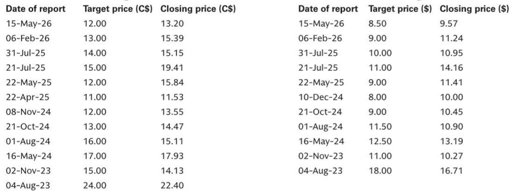

# GS：研究主题与行业变化观察

Canada Goose 最新一季财报给出了一个并不常见的组合：营收增速明显高于市场预期，但直营门店同店销售却出现连续节奏变化。GS在 F1Q27 业绩点评中把这一矛盾摆在最前面——收入超预期主要来自批发业务的时间性回补和亚太区域的拉动，而真正需要持续跟踪的，是 DTC 门店客流在进入秋冬旺季前的走向。

这份报告覆盖的是截至 6 月底的季度，属于 Canada Goose 的销售淡季，单季收入 1.189 亿加元，同比增长 10.3%，高于GS和 FactSet 共识预期的 1.058 亿和 1.084 亿加元。调整后每股亏损 0.89 加元，也好于预期的亏损 0.95 加元。超预期本身并不复杂，关键在于超预期的来源是否可持续。

## 1. 批发收入增长 66.5%，部分来自订单时间前移

本季批发收入 2980 万加元，同比增长 66.5%，远高于GS预期的 1770 万加元。报告明确指出，其中一部分增长来自批发订单的时间性前移，并非纯粹的需求改善。客户补单和亚洲区域的订单动能是真实存在的积极信号，但GS在点评中提醒，不能把这一季的批发增速直接外推到全年。

DTC 收入同比增长 8.6% 至 8480 万加元，同样高于预期，但同店销售为同比下滑 3.2%，与上一季度的正增长 10.0% 相比出现明显回落。GS认为，客流变化是主因，尤其在欧洲、中东和非洲区域，美国市场的客流趋势也仍然偏弱。

> **KC评论：** 批发超预期和 DTC 同店下滑放在一起看，说明本季的收入质量需要打折。订单时间前移贡献的增速会在后续季度回落，而门店客流才是观察品牌终端需求更干净的指标。

## 2. 毛利率扩张与 2Q 营销投入形成对冲

本季毛利率 62.4%，同比扩张 100 个基点，高于GS和共识预期，主要来自渠道和区域结构的改善。但调整后 EBIT 利润率仍为 -87.3%，虽然好于预期的 -104.1%，季节性亏损的相对值依然很大。

管理层重申全年指引：低个位数收入增长，调整后 EBIT 利润率 11%-12%。GS指出，这一指引隐含了对 2026 年成本不确定性回补和年初定价行动的依赖。进入第二季度，公司计划加大营销投入，这意味着近期利润率表现可能承压，全年利润率能否兑现，取决于下半年收入在旺季的表现。

## 3. 关税影响暂估有限，但未缓解不确定性未完全量化

报告提到，公司认为 7 月 20 日宣布的美国对加拿大商品关税不会对业绩产生实质性影响。GS对此持保留态度，测算若已宣布的关税全部落地且无缓解措施，对 FY27 利润率的影响可能达到 200 个基点。这一差距值得留意：管理层与卖方对关税影响的评估存在明显分歧，而秋冬旺季的定价和成本结构将直接受到考验。

，并将估值倍数从 4.0 倍降至 3.75 倍，理由是 DTC 同店趋势走弱和宏观环境不确定性上升。FY27 至 FY29 的每股盈利预测小幅上调至 1.07、1.13、1.19 加元，主要反映批发趋势好于预期，但部分被 2Q 营销投入带来的利润率不确定性所抵消。

## 4. 观察框架：区分一次性回补与可持续增长

这份报告提供了一个可复用的分析框架：当一家公司出现收入超预期时，先拆解超预期的来源——是订单时间前移、渠道结构变化，还是终端需求的真实改善。Canada Goose 本季的批发增速和电商转化率提升是积极证据，但 DTC 同店增速从正 10% 转为负 3.2%，说明门店层面的需求动能尚未稳固。

另一个容易被忽略的指标是 SG&A 杠杆。GS在点评中表示，希望看到公司在一次性成本回补之外，实现可持续的 SG&A 杠杆改善。这意味着，单纯依靠 2026 年成本基数回补带来的利润率修复，不足以改变对公司的整体判断。

> **KC评论：** 对跟踪这家公司的读者来说，未来两个季度的关键数据点很清晰：一是秋冬旺季的 DTC 同店能否止跌，二是批发订单前移效应消退后，收入增速是否还能维持在低个位数以上。关税影响的实际落地幅度，则是利润率判断的最大变量。

报告对全年指引的维持，建立在成本回补和定价行动的假设之上。这些假设在淡季数据中尚未被证伪，但也未得到充分验证。进入 9 月后的秋冬销售季节，门店客流和转化率的变化将比单季收入是否超预期更有说服力。

For informational purposes only. Portions may be generated,translated,summarized,or edited with AI assistance based on source materials and may contain omissions or errors. Please verify independently. This is not investment,legal,tax,accounting,or other professional advice.

For informational purposes only. Portions may be generated,translated,summarized,or edited with AI assistance based on source materials and may contain omissions or errors. Please verify independently. This is not investment,legal,tax,accounting,or other professional advice.

