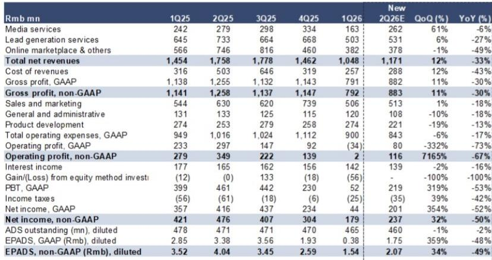
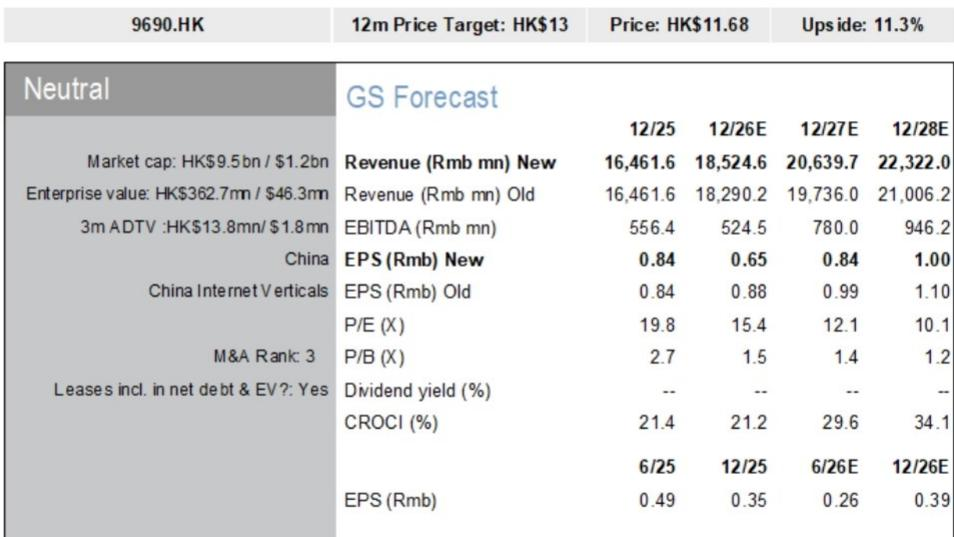
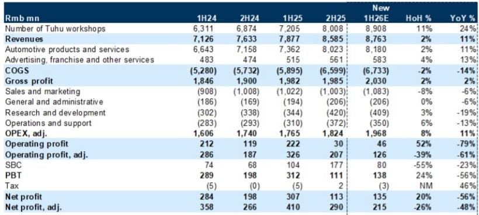

# 中国汽车分类信息平台的扩张代价：市场为何保持审慎

中国互联网汽车分类信息领域的核心张力，已不再局限于线上与线下模式之争，而在于未来规模愿景与当前回报现实之间的平衡。随着8月下旬中期业绩披露期临近，读者面临一个独特局面：该领域两家最具代表性的平台——途虎养车与汽车之家——正同时加速投入并扩大股东回报，而其核心市场均面临结构性变化。由此形成的预测格局是：一家营收预期上调，另一家下调，但两家公司的盈利预测均遭削减。市场对这两家公司的审慎立场并非缺乏信心，而是对战略雄心与近期财务现实之间日益扩大的差距所做出的理性回应。

该领域面临的挑战并非周期性噪音。国内油价年初至今上涨8%，直接对高度依赖传统内燃机市场的平台营收增长构成压力。与此同时，新能源汽车渗透率从2025年下半年的58%回落至2026年上半年的54%——这一变化在中国电动车普及进程中看似有违直觉——实则标志着市场正处于转型期而非停滞期。汽车技术变革更为深远：增程式动力系统，如小米“天穹”加入理想汽车阵营后推出的方案，首次保养后仅需每三年或3万公里进行一次维护，将保养周期延长1.5至3倍。对于依赖服务频次的平台而言，这并非利润率挤压，而是需求曲线左移。

正是在此背景下，管理层选择加大投入。战略逻辑有其合理性——现在建设基础设施，以捕捉未来汽车销售的复苏和长期售后市场机遇。但市场的职责在于评估这些投入能否产生高于资本成本的回报。就当前证据而言，这一概率尚未在数据中体现，对途虎和汽车之家的审慎评估反映出一种纪律性的判断：规模与盈利之间的权衡在改善之前正在恶化。

## 途虎的门店扩张：利润表尚无法支撑的规模故事

途虎养车的扩张战略清晰明确：公司正加速增设门店，仅2026年上半年预计净增约900家，而2025年上半年约为330家、下半年为800家。这一轨迹意味着门店数量同比增长24%，到2026年年中总数将推升至约8,900家，到2027年将超过10,000家。6月商家应用日活跃用户同比增长12%，高于5月的11%，表明扩张正在转化为平台活跃度，而非仅仅是物理覆盖。

营收影响确实存在，但相对于投入而言并不突出。途虎2026年上半年营收预计为87.6亿元人民币，同比增长11%——这是一个可观的数据，但也揭示了新增门店的边际回报递减。毛利率情况更值得关注：2026年上半年为23.2%，同比下降2.0个百分点，完全由汽车产品与服务板块驱动，该板块毛利率从22.8%降至20.2%。广告、加盟及其他服务板块维持90.6%的毛利率，但规模过小——约占营收的7%——不足以抵消核心业务的压力。

利润端则清晰展现了战略的成本。2026年上半年调整后营业利润预计为1.26亿元人民币，同比下降61%，调整后营业利润率从4.1%压缩至1.4%。销售与营销费用正在吸收扩张成本：2026年上半年为10.8亿元人民币，同比增长6%，途虎正投入线上流量获取以支撑其不断扩张的线下网络。公司自身的预测修正也说明了问题：2026-28年营收预测分别上调1%、5%和6%，但调整后净利润预测平均下调17%。这是以利润换增长，市场被要求相信投入阶段是有限的。

使这一战略成为押注而非价值毁灭行为的关键在于资产负债表。截至2025年，途虎持有70亿元人民币净现金，相当于其市值的80%以上。公司于6月29日宣布，至2028年7月将回购并注销不少于5,000万股股份——约占总股本的6%。这是一个可信的信号，表明管理层认为当前股价低估了平台的长期潜力，并在战略落地期间为股价提供了支撑。但这也引发了一个问题：如果在门店扩张的同时将现金用于回购，扩张本身是否产生了足以证明资本配置合理性的回报？2026年上半年预测调整后净利润率为2.5%，低于一年前的5.2%，表明答案尚不明朗。

## 汽车之家的营收下滑是结构性的，其新零售尝试偏离核心问题

汽车之家的处境更为严峻，也更清晰地反映了该领域的深层变化。公司2026年第二季度营收预计为11.7亿元人民币，同比下降33%——这一下滑并非暂时波动，而是整个媒体与销售线索模式的重新定价。媒体服务营收2.62亿元人民币，同比下降6%，但损失集中在销售线索业务，下降27%至5.31亿元人民币，在线市场及其他板块则明显回落49%至3.78亿元人民币。2026年第一季度数据更为触目，总营收从去年同期的14.5亿元人民币降至10.5亿元人民币，降幅28%，反映出传统汽车经销商广告预算的加速萎缩。

根本原因并非周期性而是结构性的。传统内燃机汽车销售疲软，经销商——汽车之家的核心客户群——正相应收紧预算。新能源转型不仅改变动力系统，更在改变整个销售与营销模式。新能源品牌，尤其是新进入者，对第三方销售线索平台的依赖较低，更多转向直营渠道、展厅体验和自有数字生态。汽车之家的销售线索业务如同一条越来越少车辆通行的道路上的收费站。

管理层的应对之策是多元化，但新举措各有风险。6月推出的“家家好车”线下新零售品牌，计划今年通过加盟模式在低线市场开设600家门店。这是一个重大的战略转向：从高利润率、轻资产的媒体平台转向涉及实体门店、库存管理和加盟商管理复杂性的零售运营。二手车出口业务计划从2026年下半年起放量，瞄准的是真实的市场机遇——据中国汽车流通协会数据，2026年上半年中国二手车出口量仅为新车出口量的5%——但这是一条未经验证的收入来源，面临监管、物流和品控等多重挑战。

这些转型的财务影响已经显现。汽车之家2026年第二季度调整后营业利润率预计为9.9%，低于一年前的19.9%，调整后净利润率从27.1%降至20.3%。公司2026-28年营收预测平均下调8%，调整后每股收益下调10%。这不是一家掌控自身命运的公司，而是一家在应对超出其战略选择范围的力量的公司。

部分抵消经营恶化的是资本回报。汽车之家承诺今年实现22%的股东回报率，结合15亿元人民币的年度现金分红与股份回购。公司于3月至7月间完成了2亿美元的回购，并于2026年7月宣布了一项新的4亿美元计划，将在未来12个月内执行。这是一项实质性的承诺，基于13.5倍目标市盈率——12个月前瞻区间的上四分位——以增强的股东回报为理由，部分抵消了盈利下调的影响。但市场将其定价为回报故事而非增长故事，当前价格15%的下行空间反映了市场对回购能否抵消营收下滑趋势的怀疑。

## 资本回报的抵消作用真实存在，但无法掩盖经营现实

两家公司的共同主线是试图以资本回报作为连接不尽如人意的当下与不确定未来的桥梁。途虎的回购和汽车之家的分红加回购结构，旨在给股东一个保持耐心的理由，同时管理层执行长期举措。这一逻辑在孤立看待时是合理的：途虎净现金超过市值的80%，意味着回购并未加杠杆资产负债表；汽车之家22%的回报率对收益导向型读者具有强大吸引力。

然而，市场的审慎立场表明这座桥梁尚不可信。问题不在于资本回报本身，而在于时机。两家公司都在投入回报不确定且遥远的项目，而核心业务面临的挑战正在加剧而非缓解。途虎的门店扩张假设售后市场将随汽车保有量增长而扩大，但新动力系统延长保养周期削弱了这一假设。汽车之家的线下零售和二手车出口押注假设公司能在旧业务崩塌前建立新收入来源，但2026年第二季度33%的营收下滑表明旧业务流失速度快于新业务的建设速度。

该领域的整体环境可能在9月前后有所改善，国内乘用车行业同比降幅有望收窄，并在年底前转正。但这只是结构性挑战市场中的周期性改善。2026年上半年新能源渗透率回落至54%是暂时现象，电气化和增程式动力系统的长期趋势将继续对传统汽车媒体和售后市场服务总量构成压力。能够生存下来的平台将是那些在传统业务变得无关紧要之前成功转型收入模式的公司。

## 读者的决策框架：区分投入与费用

对于评估这些平台的读者而言，关键区别在于创造未来盈利能力的投入与仅维持当前运营的费用。财务报表本身并不做此区分；管理层的表述才有，且往往带有自利倾向。以下框架旨在穿透叙事，聚焦证据。

首先，评估扩张的单位经济性。对途虎而言，关键问题是每家新门店能否在合理时间内实现盈利，以及毛利率下滑是获客的暂时成本还是竞争加剧的永久特征。汽车产品与服务毛利率同比下降2.6个百分点暗示后者，但24%的门店增长最终可能带来规模效应，抵消利润率压力。值得关注的证据是商家应用日活跃用户增长，它反映新门店是在创造真实需求还是在蚕食现有门店。

其次，评估新收入来源的规模化路径。对汽车之家而言，问题是“家家好车”能否在不产生重大亏损的情况下达到600家门店，以及二手车出口业务能否在销售线索业务跌破盈亏平衡线之前产生可观收入。2026年第二季度在线市场及其他收入下降49%，表明新举措尚未抵消核心业务下滑，75.5%的毛利率——低于2025年第一季度的78.5%——表明新业务利润率低于传统模式。

第三，考虑资本回报的可持续性。途虎的回购由现有现金支持，因此可持续，但减少了可用于门店扩张的财务灵活性。汽车之家22%的回购加分红回报率较为激进，且由一个营收同比下降33%的业务支撑。回购计划可能完成，但如果营收下滑持续，每年15亿元人民币的分红承诺将越来越难以维持。市场正通过当前价格15%的下行空间隐含地定价这一风险。

第四，关注行业整体环境的拐点。如果如报告所示乘用车市场在年底前转正，可能为两家公司提供暂时的顺风。但更持久的机遇在于结构性转变：途虎在售后市场的地位可能受益于不断增长的汽车保有量，即使保养周期延长；汽车之家向线下零售的转型可能在线上线下差距最大的低线市场捕获价值。风险在于，两家公司都在为一个在其投入假设的时间框架内可能不会实现的市场结构进行投入。

## 战略结论：这是一个转型中的行业，而非衰退中的行业——但转型有代价

中国的汽车分类信息行业并未消亡，而是在被超出任何单一平台控制的力量重塑。内燃机向新能源的转型、保养周期的延长以及经销商营销预算的转移，都是将重新定义这些公司业务内容和盈利方式的结构性趋势。途虎和汽车之家正在做出战略押注以应对这一转型，并利用资本回报来争取股东的耐心和时间。

市场的审慎立场并非否定这些战略，而是认识到结果确实存在不确定性。途虎的门店扩张可能打造一个具有规模优势、足以抵消利润率压力的主导性售后市场平台；汽车之家的新零售和出口业务可能使其收入多元化，摆脱衰退中的媒体模式。但这些结果需要执行力，而执行力尚未在财务数据中体现，投入成本则已通过盈利下调和利润率压缩清晰可见。

对读者而言，问题不在于这些公司是否是优质企业——它们确实是，拥有强劲的资产负债表、成熟的品牌和真实的市场地位。问题在于当前价格是否充分补偿了战略中蕴含的执行风险。耐心的读者可能在战略押注最终明朗时找到机会，但当前可获得的证据尚不足以支持更为积极的看法。

下一个业绩期将是关键考验。途虎的2026年上半年业绩将显示门店扩张是否产生了足以证明利润率代价合理的营收增长；汽车之家的2026年第二季度业绩将揭示新举措能否减缓营收下滑。市场关注的不仅是表面数字，更是潜在趋势：毛利率走向、新门店效率、销售线索稳定性以及线下零售推进进度。这些指标将决定战略押注究竟是投入还是费用——以及审慎评估应上调还是下调。

*仅供参考。部分内容可能基于原始材料由AI辅助生成、翻译、摘要或编辑，可能包含遗漏或错误。请独立核实。本文不构成投资、法律、税务、会计或其他专业建议。*

仅供参考。部分内容可能基于原始材料由AI辅助生成、翻译、摘要或编辑，可能包含遗漏或错误。请独立核实。本文不构成投资、法律、税务、会计或其他专业建议。

