# 中国市场智能手机6月出货量观察：存储成本上升影响需求

6月中国市场智能手机出货量同比下降17%至1700万部，环比下降36%。此前5月出货量环比增长7%，6月出现环比回落。二季度中国市场智能手机出货量为6900万部，环比持平，同比持平，高于此前预期的5900万部。考虑到存储成本上升对需求的影响，预计2026年全年出货量将同比下降10%（报告链接）。摄像头方面，单机摄像头数量在2022年达到峰值的3.8颗，2025年和2026年至今分别降至3.1颗和2.9颗；但2000万像素以上摄像头的渗透率在2025年和2026年至今分别提升至57%和66%（2024年和2023年分别为52%和39%），这与中国市场智能手机摄像头规格升级的判断一致（报告链接）。更多内容请参阅：智能手机市场总量研究。

## 6月中国市场智能手机关键数据

## 6月中国5G手机市场

■ 据工信部数据，6月中国5G手机出货量为1600万部，环比下降38%，同比下降12%，渗透率为85%。

据工信部数据，6月中国新上市5G智能手机机型数量同比增长63%至13款，5月为同比下降15%至11款。

## 6月中国智能手机市场

据工信部数据，6月中国智能手机出货量同比下降17%至1700万部，5月为同比增长19%。

据工信部数据，6月中国新上市智能手机机型数量同比增长90%至19款，5月为同比下降44%至15款。

## 2026年至今中国主要智能手机品牌摄像头像素观察

我们梳理了2026年至今荣耀、小米、OPPO、vivo和传音发布的187款机型，共计551颗摄像头。

单机平均摄像头数量在2026年至今为2.9颗，2025年至2019年分别为3.1、3.3、3.5、3.8、4.1、4.9和4.0颗。在551颗摄像头中，200万/500万/800万像素摄像头占比为24%，2025年至2019年分别为31%、36%、45%、51%、50%、57%和46%。

■ 2026年至今荣耀发布27款机型，共77颗摄像头，单机平均2.9颗；华为为3.0颗，OPPO为3.1颗，小米为2.8颗，vivo为3.0颗，传音为2.7颗。

在2026年至今OPPO发布的62款机型共192颗摄像头中，200万/500万/800万像素占比为23%；华为为18%，荣耀为23%，小米为25%，vivo为23%，传音为31%。

## 中国智能手机出货量与规格

图表1：中国5G智能手机出货量：6月1600万部
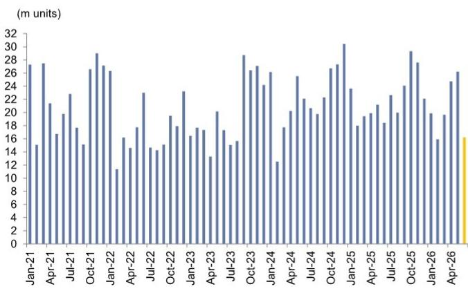
资料来源：工信部

图表2：中国新上市5G智能手机机型数量（月度）
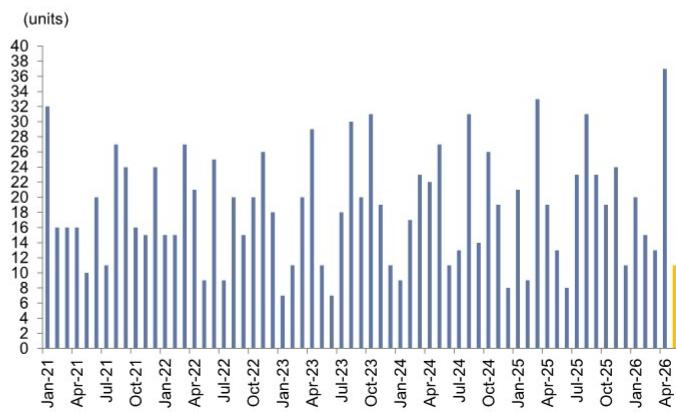

图表3：2014-15年4G手机出货量及渗透率
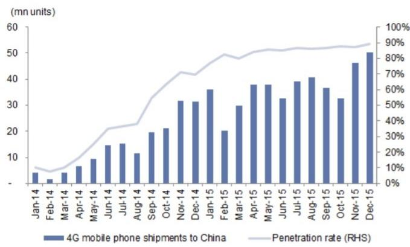
资料来源：工信部
资料来源：工信部

图表4：中国新上市4G手机机型数量（月度）
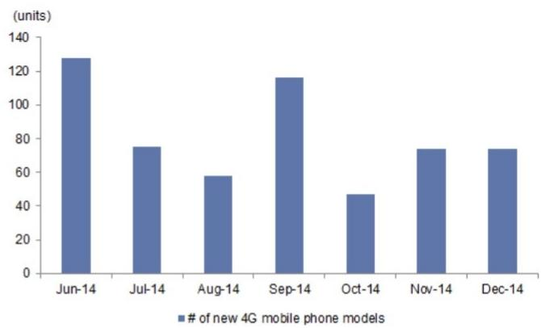
资料来源：工信部

（部）
图表5：中国智能手机出货量
（百万部）
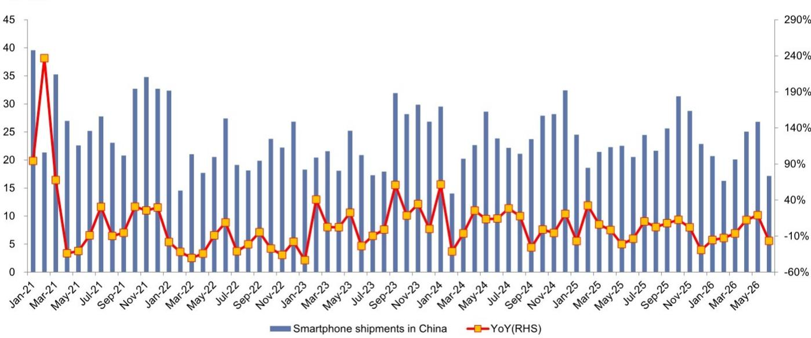
资料来源：工信部

图表6：中国新上市智能手机机型数量

资料来源：工信部

图表7：中国手机出货量

<table><tr><td>单位：部</td><td>2025年6月</td><td>2025年7月</td><td>2025年8月</td><td>2025年9月</td><td>2025年10月</td><td>2025年11月</td><td>2025年12月</td><td>2026年1月</td><td>2026年2月</td><td>2026年3月</td><td>2026年4月</td><td>2026年5月</td><td>2026年6月</td></tr><tr><td>手机</td><td>23</td><td>28</td><td>23</td><td>28</td><td>32</td><td>30</td><td>24</td><td>23</td><td>17</td><td>21</td><td>26</td><td>28</td><td>19</td></tr><tr><td>同比</td><td>-9%</td><td>16%</td><td>-6%</td><td>10%</td><td>9%</td><td>2%</td><td>-29%</td><td>-16%</td><td>-15%</td><td>-7%</td><td>3%</td><td>17%</td><td>-15%</td></tr><tr><td>环比</td><td>-5%</td><td>24%</td><td>-20%</td><td>24%</td><td>16%</td><td>-7%</td><td>-19%</td><td>-7%</td><td>-27%</td><td>26%</td><td>22%</td><td>7%</td><td>-31%</td></tr><tr><td>5G</td><td>18.4</td><td>22.6</td><td>20.0</td><td>24.1</td><td>29.3</td><td>27.6</td><td>22.1</td><td>19.9</td><td>15.9</td><td>19.7</td><td>24.7</td><td>26.2</td><td>16.2</td></tr><tr><td>5G占手机比重</td><td>82%</td><td>81%</td><td>88%</td><td>86%</td><td>91%</td><td>92%</td><td>90%</td><td>87%</td><td>95%</td><td>93%</td><td>96%</td><td>95%</td><td>85%</td></tr><tr><td>国产品牌</td><td>21</td><td>25</td><td>21</td><td>24</td><td>25</td><td>23</td><td>21</td><td>20</td><td>14</td><td>18</td><td>22</td><td>24</td><td>16</td></tr><tr><td>国产品牌占手机比重</td><td>91%</td><td>90%</td><td>94%</td><td>85%</td><td>78%</td><td>77%</td><td>87%</td><td>88%</td><td>86%</td><td>84%</td><td>86%</td><td>87%</td><td>83%</td></tr><tr><td>智能手机</td><td>21</td><td>24</td><td>22</td><td>26</td><td>31</td><td>29</td><td>23</td><td>21</td><td>16</td><td>20</td><td>25</td><td>27</td><td>17</td></tr><tr><td>同比</td><td>-14%</td><td>10%</td><td>3%</td><td>8%</td><td>12%</td><td>2%</td><td>-29%</td><td>-16%</td><td>-13%</td><td>-6%</td><td>12%</td><td>19%</td><td>-17%</td></tr><tr><td>环比</td><td>-9%</td><td>19%</td><td>-11%</td><td>18%</td><td>22%</td><td>-8%</td><td>-20%</td><td>-9%</td><td>-21%</td><td>24%</td><td>25%</td><td>7%</td><td>-36%</td></tr><tr><td>智能手机占手机比重</td><td>91%</td><td>87%</td><td>96%</td><td>92%</td><td>97%</td><td>95%</td><td>93%</td><td>91%</td><td>97%</td><td>95%</td><td>97%</td><td>97%</td><td>90%</td></tr><tr><td>新上市智能手机机型数量（款）</td><td>10</td><td>28</td><td>49</td><td>29</td><td>26</td><td>24</td><td>21</td><td>32</td><td>18</td><td>15</td><td>50</td><td>15</td><td>19</td></tr><tr><td>同比</td><td>-47%</td><td>56%</td><td>40%</td><td>53%</td><td>-21%</td><td>-8%</td><td>17%</td><td>28%</td><td>64%</td><td>-69%</td><td>56%</td><td>-44%</td><td>90%</td></tr><tr><td>环比</td><td>-63%</td><td>180%</td><td>75%</td><td>-41%</td><td>-10%</td><td>-8%</td><td>-13%</td><td>52%</td><td>-44%</td><td>-17%</td><td>233%</td><td>-70%</td><td>27%</td></tr><tr><td>新上市手机机型数量（款）</td><td>36</td><td>48</td><td>65</td><td>47</td><td>45</td><td>31</td><td>41</td><td>37</td><td>23</td><td>19</td><td>59</td><td>19</td><td>28</td></tr><tr><td>5G</td><td>8</td><td>23</td><td>31</td><td>23</td><td>19</td><td>24</td><td>11</td><td>20</td><td>15</td><td>13</td><td>37</td><td>11</td><td>13</td></tr><tr><td>5G占新上市手机机型比重</td><td>22%</td><td>48%</td><td>48%</td><td>49%</td><td>42%</td><td>77%</td><td>27%</td><td>54%</td><td>65%</td><td>68%</td><td>63%</td><td>58%</td><td>46%</td></tr></table>

资料来源：工信部

图表8：各折叠屏手机品牌机型定价
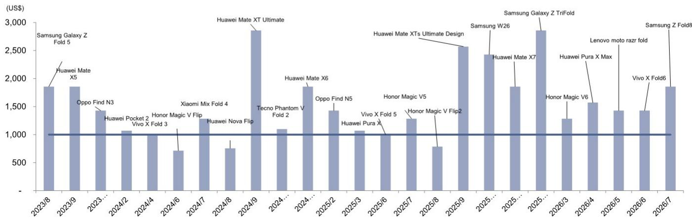
资料来源：公司数据，GS全球投资研究整理

资料来源：公司数据，GS全球投资研究整理

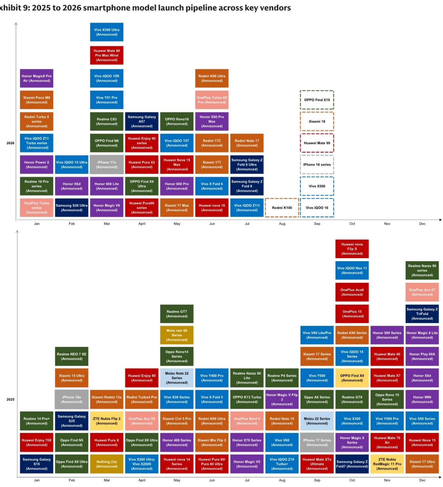
白底单元格为预计机型及发布时间

图表10：单机摄像头数量趋于平稳 华为、荣耀、小米、OPPO、vivo、传音自2020年12月以来发布的智能手机机型

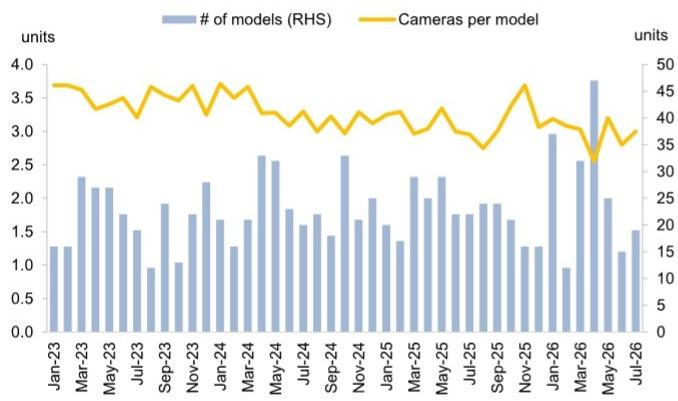
数据截至2026年7月30日
资料来源：公司数据，GS全球投资研究整理

图表12：华为/荣耀/小米/OPPO/vivo/传音：2000万像素以上成为主要构成

华为、荣耀、小米、OPPO、vivo、传音自2018年以来发布的智能手机摄像头：按像素划分的占比

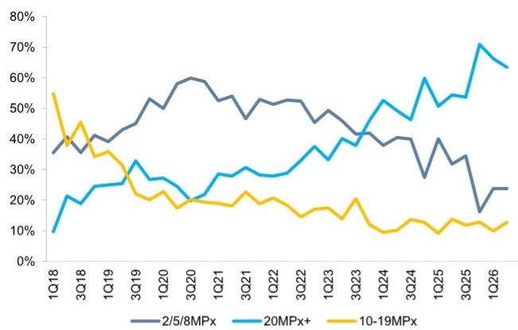
资料来源：公司数据，GS全球投资研究整理

图表11：2000万像素以上成为主要构成 华为、荣耀、小米、OPPO、vivo、传音自2020年12月以来发布的智能手机摄像头，按像素划分的占比

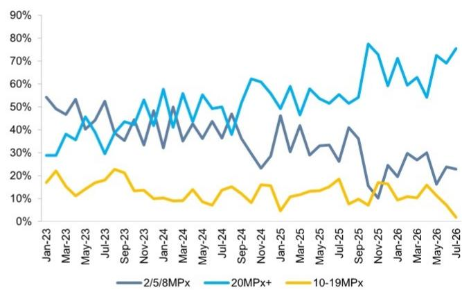
数据截至2026年7月30日
资料来源：公司数据，GS全球投资研究整理
图表13：2026年至今200万/500万/800万像素占比24%
2026年至今华为、荣耀、小米、OPPO、vivo、传音发布的187款机型共551颗摄像头，按像素数量划分

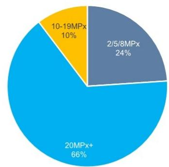
数据截至2026年7月30日
资料来源：公司数据，GS全球投资研究整理

图表16：小米：2000万像素以上占比有所变化

图表14：荣耀：2000万像素以上仍为主要构成 荣耀自2018年以来发布的智能手机摄像头：按像素划分的占比
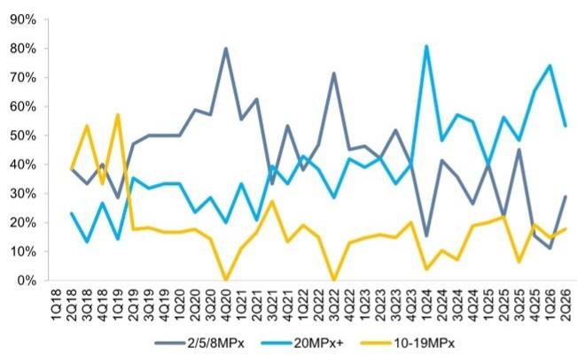
数据截至2026年6月26日
图表15：荣耀：200万/500万/800万像素占比23%
2026年至今荣耀发布的27款机型共77颗摄像头，按像素数量划分

资料来源：公司数据，GS全球投资研究整理

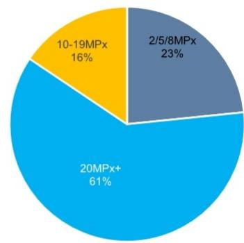
数据截至2026年7月30日
资料来源：公司数据，GS全球投资研究整理
小米自2018年以来发布的智能手机摄像头：按像素划分的占比

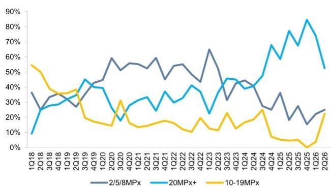
数据截至2026年7月30日
资料来源：公司数据，GS全球投资研究整理
图表17：小米：200万/500万/800万像素占比25%
2026年至今小米发布的27款机型共75颗摄像头，按像素数量划分

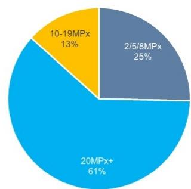

数据截至2026年7月30日

资料来源：公司数据，GS全球投资研究整理

图表18：OPPO：2000万像素以上仍为主要构成 OPPO自2018年以来发布的智能手机摄像头：按像素划分的占比

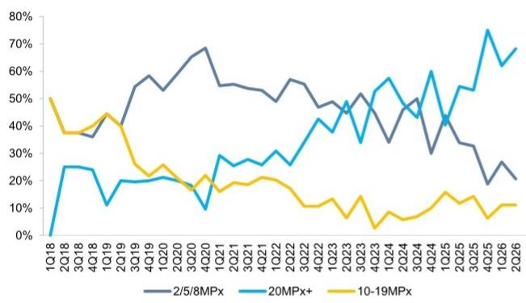
数据截至2026年7月30日
资料来源：公司数据，GS全球投资研究整理
图表19：OPPO：200万/500万/800万像素占比23%
2026年至今OPPO发布的62款机型共192颗摄像头，按像素数量划分

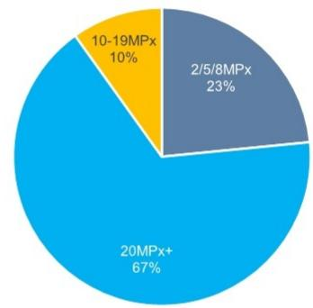
数据截至2026年7月30日
资料来源：公司数据，GS全球投资研究整理
图表20：vivo：2000万像素以上成为主要构成
vivo自2018年以来发布的智能手机摄像头：按像素划分的占比

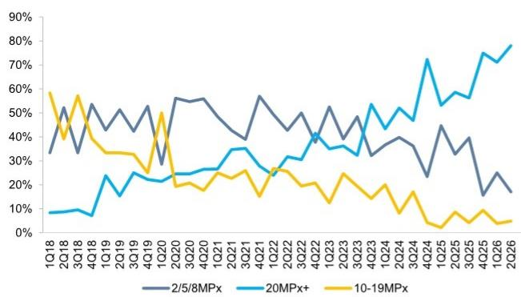
数据截至2026年7月30日
图表21：vivo：200万/500万/800万像素占比23%
2026年至今vivo发布的38款机型共114颗摄像头，按像素数量划分

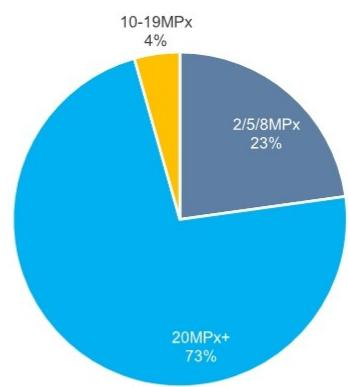

数据截至2026年7月30日

资料来源：公司数据，GS全球投资研究整理

图表22：传音：2000万像素以上仍为主要构成

传音自2021年以来发布的智能手机摄像头：按像素划分的占比

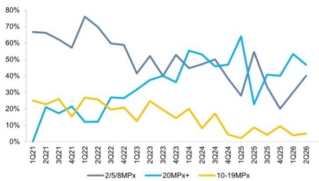
数据截至2026年7月30日
资料来源：公司数据，GS全球投资研究整理
图表23：传音：200万/500万/800万像素占比31%
2026年至今传音发布的20款机型共54颗摄像头，按像素划分

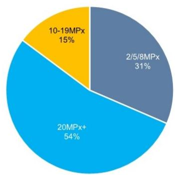
数据截至2026年7月30日
资料来源：公司数据，GS全球投资研究整理
