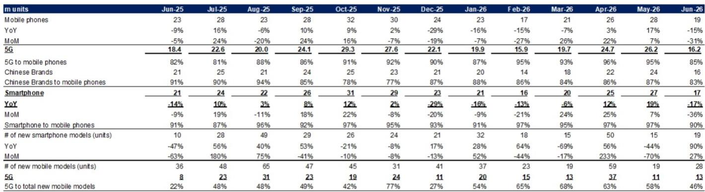
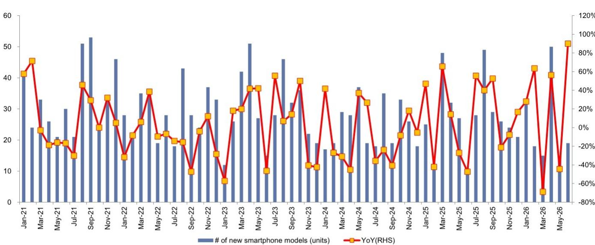

# GS：存储行业数据与主题变化观察

中国智能手机市场在6月出现明显回落。工信部数据显示，当月智能手机出货量1700万部，同比下降17%，环比下降36%，与5月同比19%的增速形成鲜明反差。GS在最新研究报告中认为，存储成本上升正在压制终端需求，并据此将2026年全年出货量预期调整为同比下降10%。

二季度整体出货量6900万部，环比持平、同比持平，但高于GS此前5900万部的预测。这意味着需求并未出现趋势性变化，但月度波动明显加大。报告同时指出，5G手机出货量1600万部，渗透率85%，较前几个月95%左右的水平有所回落。

## 1. 新机型发布数量回升，5G机型占比回落

6月中国智能手机新机型发布19款，同比增长90%，环比增长27%；其中5G机型13款，同比增长63%。这一数据与5月形成对比——5月新机型15款，同比下降44%。新机型数量回升，但5G机型占全部新机型比例从5月的58%降至46%。

GS认为，新机型发布节奏的波动更多反映厂商排期，而非需求趋势。真正需要关注的是，在存储成本上升的背景下，厂商如何在配置升级与定价之间取得平衡。

## 2. 单机摄像头数量见顶回落，像素升级仍在继续

GS统计了荣耀、小米、OPPO、vivo、传音2026年至今发布的187款机型、共551颗摄像头。单机平均摄像头数量为2.9颗，低于2025年的3.1颗和2022年峰值的3.8颗。但20MPx以上摄像头的渗透率从2024年的52%升至2025年的57%，2026年至今已达66%。

这一数据组合说明，手机摄像头配置正在从“数量堆叠”转向“像素升级”。2MPx/5MPx/8MPx低像素摄像头占比从2024年的36%降至2026年至今的24%，高像素主摄成为厂商差异化竞争的主要手段。

> **KC评论：** 单机摄像头数量下降但高像素占比上升，意味着供应链的价值正在向高规格镜头和图像传感器集中。低像素副摄的出货量调整，对相关模组厂商的产品结构会形成持续影响。

## 3. 各品牌像素策略分化，传音低像素占比最高

分品牌看，2026年至今OPPO发布62款机型、192颗摄像头，其中23%为2MPx/5MPx/8MPx低像素摄像头；华为低像素占比18%，为六家中最低；传音低像素占比31%，为六家中最高。单机摄像头数量方面，OPPO为3.1颗，华为、vivo为3.0颗，荣耀2.9颗，小米2.8颗，传音2.7颗。

GS指出，这一分化与各品牌定位直接相关。传音主攻新兴市场，成本敏感度更高，低像素副摄占比自然偏高；华为、OPPO在高端机型上更倾向于高像素配置。这种差异为产业链提供了观察品牌策略的窗口。

## 4. 存储成本成为2026年出货量的关键变量

报告将2026年出货量预期调整为同比下降10%，核心原因是存储成本上升。GS认为，存储价格上涨会推高整机成本，厂商要么转嫁定价、要么压缩配置，两种路径都会影响终端需求。这一判断与6月出货量环比明显回落相互印证。

从产业链角度看，存储成本对手机需求的压制并非均匀分布。低端机型对成本更敏感，受影响可能更大；高端机型因价格弹性较低，需求相对稳定。这或加速中低端市场的整合，同时推动厂商在摄像头、屏幕等非存储环节寻求差异化。

> **KC评论：** 存储成本上升对手机出货量的影响，需要结合厂商的库存策略和定价能力来看。报告给出的是行业层面的判断，具体到单一品牌，还要看其成本转嫁能力和产品结构。

GS在报告末尾列出了公司观点的产业链公司，包括鸿海、AAC、领益、大立光、舜宇、Fositek和台积电，覆盖组装、声学、结构件、镜头和代工环节。这一名单与摄像头升级、高像素渗透率提升的判断方向一致。

For informational purposes only. Portions may be generated,translated,summarized,or edited with AI assistance based on source materials and may contain omissions or errors. Please verify independently. This is not investment,legal,tax,accounting,or other professional advice.

