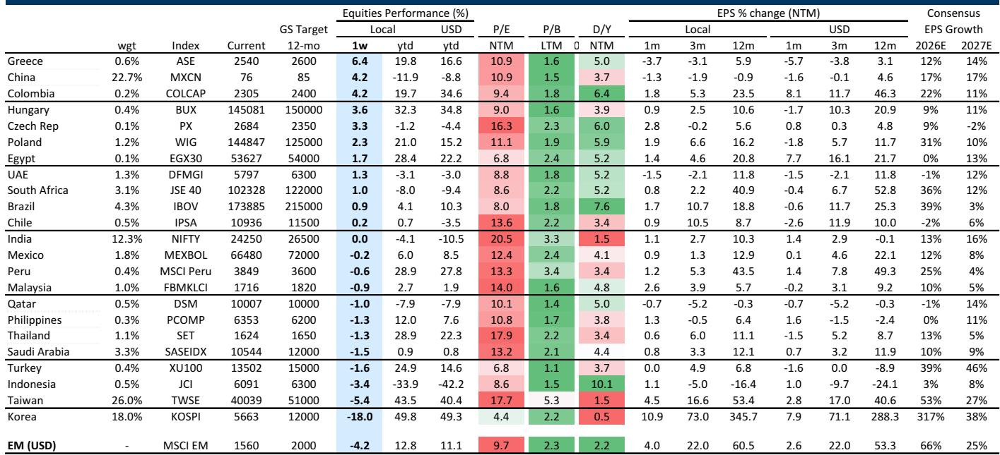
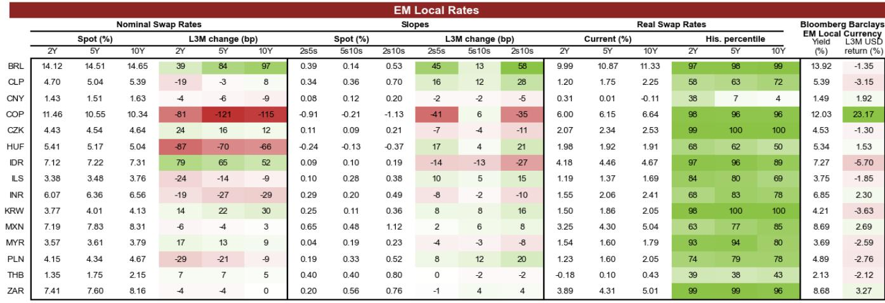
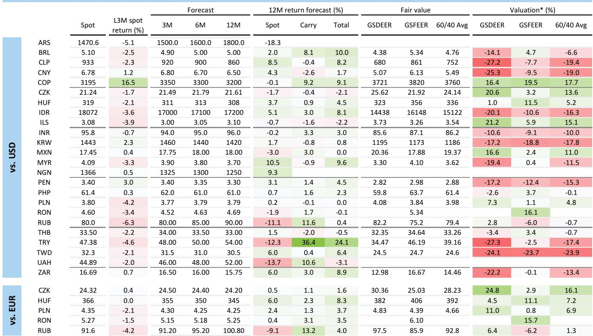

# GS：曲线、芯片、原油与利差交易——7月油价见顶后新兴市场货币表现

7月6日伊朗冲突再度升级至7月23日油价见顶，新兴市场货币对美元普遍贬值，能源进口国表现落后、出口国相对领先。GS在最新一期新兴市场交易员报告中指出，这一轮汇率反应的相对格局与3月冲突初期大体一致，但幅度明显更小。报告给出的解释有三层：整体不确定性偏好没有同步出现变化，高贝塔货币如巴西雷亚尔和哥伦比亚比索因此表现更好；多数能源进口国货币在7月初已接近年内最弱水平，前期跌幅尚未收复；贸易条件冲击的幅度也小于3月，铜价坚挺使智利比索和秘鲁索尔的变化程度显著收窄。

一个值得注意的细节是，GS用油价、铜价、标普500和美国10年期实际回报表现构建的简单模型显示，本轮多数新兴市场货币的实际表现略好于模型预测，与3月时普遍跑输形成对比。韩元和哥伦比亚比索是最大的正向偏离者，韩元受益于政策收紧、杠杆抑制措施和资本流入；哥伦比亚比索则受到选举后乐观情绪和进一步加息预期的支撑。反向偏离最明显的是南非兰特、智利比索和墨西哥比索，其中南非央行维持利率不变的逆共识决定是兰特跑输的主因。

> **KC评论：** 这里真正有用的不是“谁涨谁跌”，而是GS提供了一个可复用的判断框架——把汇率表现拆解为油价、铜价、不确定性偏好和实际利率四个输入，再看实际走势与模型预测的偏离。偏离大的货币往往有本地因素在起作用，这比单纯看涨跌名单更能帮助理解市场定价。

## 1. 利差交易仍在运行，但需在多头与融资货币间精细选择

GS认为，美联储激进加息的尾部不确定性暂时被遏制，但长端利率持续抛售和能源价格高企仍构成利率不确定性。化解这些不确定性最直接的路径是能源价格持续回落，在那之前，新兴市场货币的利差交易需要在收益和波动之间反复权衡。巴西雷亚尔和哥伦比亚比索在利差和利差波动比两个维度上都遥遥领先，且受益于能源价格上涨，但两者对美债长端回报表现的高贝塔是主要弱点。两者之间，GS更倾向于哥伦比亚比索而非巴西雷亚尔，原因是巴西即将进入选举噪音期且处于降息周期，而哥伦比亚央行本周可能再次加息。

在利差约为3%的第二梯队货币中——印度卢比、印尼盾、墨西哥比索和南非兰特——GS明确排序为墨西哥比索优先，其后是印度卢比和南非兰特，对印尼盾保持更谨慎态度。墨西哥比索的利差波动比持续上升，尤其对欧元交叉盘，且对油价波动的韧性较强、对美国周期更敏感。印度卢比的利差波动比也在上升，得益于央行缓解贬值不确定性的措施，但这也意味着即期升值空间有限。南非兰特利差波动比明显低于同类，高波动意味着在能源价格回落情景下可能跑赢，但在不确定环境中不是最理想的利差多头。

## 2. 匈牙利福林从利差交易转向即期交易

匈牙利福林的利差和利差波动比自选举以来大幅下降，因为利率已经走低。GS预计这种向欧元区回报表现收敛的过程将持续，这意味着福林多头越来越像即期交易而非利差交易。报告对福林中期前景保持建设性看法，预测欧元兑福林6个月内将走向350，但认为近期动态更具挑战性。在融资货币选择上，G10货币中GS偏好瑞士法郎、欧元、日元和加元，新兴市场中泰铢、以色列谢克尔和波兰兹罗提在利差和即期不对称性上都有吸引力。智利比索因低利差、高不确定性贝塔和能源价格敏感性，适合作为对冲整体不确定性敞口的融资货币。

## 3. 本地利率市场分化明显，亚洲低回报表现货币定价偏紧

GS对新兴市场本地利率的判断是“战术性和选择性”。报告偏好那些利率已经回升且央行偏鸽的市场，如波兰兹罗提、匈牙利福林和以色列谢克尔。相反，韩国和菲律宾这类亚洲低回报表现货币，前端定价可能过于激进，但极宽松的实际政策利率意味着加息不确定性仍然存在。拉丁美洲方面，墨西哥比索因利差较低和美国前端敏感度高，仍易受美联储加息影响；巴西雷亚尔虽然央行有宽松倾向且前端利率有吸引力，但10月选举前的高实现波动率让GS选择观望。中期来看，新兴市场长端利差与美国的差距较窄，加上核心久期可能维持高位，限制了长端回报表现压缩的空间，只有印度、南非等财政路径改善的高回报表现国家例外。

## 4. 新兴市场公司从科技板块向非科技板块扩散

MSCI新兴市场指数从6月底峰值回撤12%，抹去了上半年强劲涨幅的一半左右，原因是拥挤的科技和AI基础设施公司持续平仓，以及美伊冲突再度升级。但非科技新兴市场公司对油价上涨的反应温和，MSCI新兴市场除科技指数7月仍上涨2%。GS认为，这种韧性来自较低的起始估值和价格水平，以及早期二季度财报的中位数盈利惊喜为正、超预期数量多于不及预期。报告对AI基础设施公司的盈利增长保持建设性看法，但承认杠杆头寸虽从高位回落、尚未完全出清，近期波动率可能维持高位。只要油价和利率相关的宏观波动可控，新兴市场公司向非科技板块的扩散有望继续，支撑来自盈利累积和非科技市场的区域多元化吸引力。

## 5. 主权美元债发行上半年强劲，全年净供给将推高利差

新兴市场主权美元债总发行今年上半年保持强劲，尽管市场担心AI相关债务供给可能挤出其他部门。GS数据显示，新兴市场研究级和高收益债上半年的发行量均处于十年来的第二高位，主要推动力是海湾合作委员会研究级主权债在伊朗冲突后对安全和能源基础设施的前瞻性支出。报告更新后的2026年全年发行预测约为2090亿美元，其中研究级占66%、高收益占34%。GS认为，这一预测反映的是强劲的技术面背景和海湾主权债的大规模特殊发行，而非乐观的不确定性偏好情景。但全年净供给将因此上升，预计在未来12个月内推动利差温和走阔。

> **KC评论：** 主权债发行这一节容易被忽略，但它把“能源价格高企”和“利差走阔预期”连在了一起——海湾国家因能源收入增加而扩大发债，而净供给上升反过来压制利差表现。这个链条对判断新兴市场信用债的相对价值比单看某个国家的财政数据更有用。

GS这份报告覆盖汇率、利率、公司和信用债四个市场，核心线索只有一条：能源价格和利率不确定性没有消失，但市场已经从3月的恐慌式抛售转向更精细的定价。汇率层面，利差交易仍然可行，但需要在多头和融资货币之间反复权衡；利率层面，需要区分央行立场和定价是否匹配；公司层面，科技平仓与非科技韧性并存；信用债层面，净供给上升将逐步反映在利差中。对读者而言，与其押注单一方向，不如关注报告反复强调的利差波动比和模型偏离度这两个指标，它们比简单的涨跌判断更能捕捉市场结构的变化。

For informational purposes only. Portions may be generated,translated,summarized,or edited with AI assistance based on source materials and may contain omissions or errors. Please verify independently. This is not investment,legal,tax,accounting,or other professional advice.

For informational purposes only. Portions may be generated,translated,summarized,or edited with AI assistance based on source materials and may contain omissions or errors. Please verify independently. This is not investment,legal,tax,accounting,or other professional advice.

